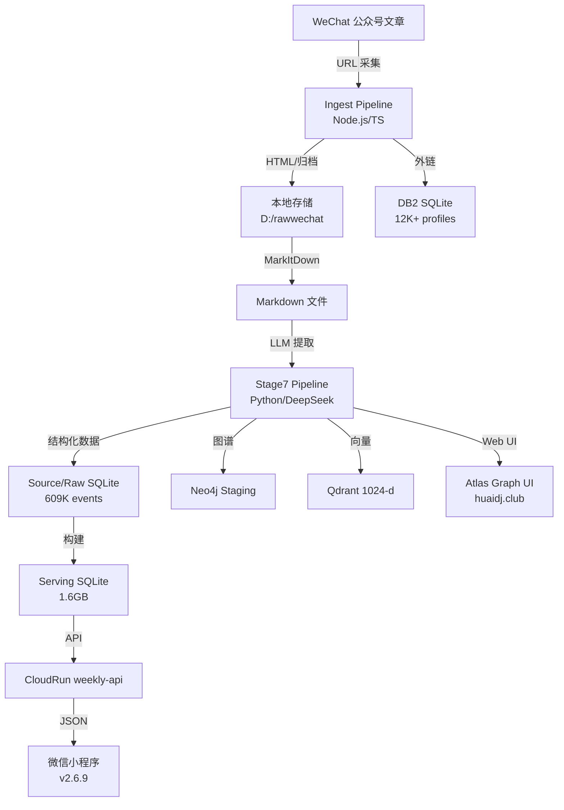
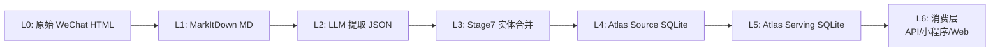

# 架构文档 — 03_ARCHITECTURE.md

项目: wechat-ingest (中国地下电子音乐图鉴)
生成: 2026-06-10

## 1. 系统上下文图



## 2. 数据管道层级



## 3. 核心模块

| 模块 | 技术 | 路径 | 职责 |
|---|---|---|---|
| ingest-core | Node.js/TS | src/ | 文章采集、归档、Markdown 导出 |
| history-cli | Node.js/TS | src/historyCli.ts | WeChat 历史 URL 抓取 |
| desktop-pcui | Electron | desktop/ | 桌面操作工作台 |
| stage7-rewrite | Python 3.11 | tools/stage7_rewrite/ | 实体提取、合并、图谱构建 |
| weekly-miniprogram | 微信小程序 | apps/weekly_activity_miniprogram/ | 活动浏览前端 |
| weekly-cloudrun | Node.js | services/weekly_activity_cloudrun/ | API 服务 |
| atlas-graph-ui | React | huaidj.club | Web 图鉴前端 |
| db2-outlink | Python | tools/stage7_rewrite/scripts/run_atlas_db2_*.py | 外链采集 |

## 4. 数据存储

| 存储 | 类型 | 大小 | 路径 |
|---|---|---|---|
| 源数据库 | SQLite | 3.8GB | /tmp/atlas_merged.sqlite (WSL) |
| 服务数据库 | SQLite | 1.6GB | reports/*/atlas_serving.sqlite |
| 外链数据库 | SQLite | ~500MB | /tmp/atlas_db2.sqlite (WSL) |
| 图谱 | Neo4j | - | 本地 Docker |
| 向量 | Qdrant | - | 本地 Docker |
| 原始文章 | 文件系统 | TB级 | D:/rawwechat, D:/DDownload |

## 5. 关键设计决策

| 决策 | 原因 | 状态 |
|---|---|---|
| SQLite 作为主存储 | 单机分析友好，无需运维数据库服务 | 已采用 |
| Stage7 gate/packet 流程 | 每次数据变更需先 dry-run，再执行，再验证 | 已采用 |
| 向量维度 1024 | 当前模型约束 (BGE-M3) | 已采用 |
| DeepSeek 仅文本 | 图片/GIF 需先 OCR 再 LLM | 已采用 |
| serving DB 只读 | 消费端只读 serving DB，不直接操作 source DB | 已采用 |
| attach-only 社交覆盖 | 社交数据不写入 source/serving，作为附加读模型 | 已采用 |

## 6. 部署拓扑

```
[微信小程序] ──→ [CloudRun weekly-api] ──→ [Serving SQLite]
                                              (只读挂载)
[Web 图鉴] ──→ [VPS: atlas.huaidj.club]
                 ├── /atlas/graph (受保护)
                 └── Turnstile + Session Gate

[数据管道] ──→ [本地 Windows + WSL]
                 ├── Node.js ingest
                 ├── Python Stage7
                 ├── Neo4j (Docker)
                 └── Qdrant (Docker)

[外链舰队] ──→ [WSL hive_controller.py]
                 └── 7 workers (marathon, linktree, etc.)
```

## 7. 架构风险

| 风险 | 影响 | 缓解 |
|---|---|---|
| SQLite 单文件过大 (1.6GB+) | 读性能下降 | 索引优化, WAL 模式 |
| 向量维度固定 1024 | 模型升级需全量重建 | 版本化 alias |
| D: 盘机械硬盘 | 随机读性能差 | WSL /tmp 使用 SSD |
| DeepSeek API 依赖 | 成本、限流 | 本地缓存, batch 控制 |
| 管道无自动恢复 | 长跑中断需人工介入 | checkpoint + handoff 机制 |

## 8. 相关已有架构文档

- `docs/ATLAS_CORE_ARCHITECTURE.drawio` — 核心架构图
- `docs/HUAIDJ_ARCHITECTURE.drawio` — HUAIDJ 架构图
- `docs/ATLAS_FULL_GRAPH_HIGH_PERFORMANCE_ARCHITECTURE_20260521.md` — 高负载架构
- `docs/ATLAS_GRAPH_DB_SEARCH_TAXONOMY_ARCHITECTURE_20260521.md` — 搜索分类
- `docs/ELECTRONIC_MUSIC_GRAPH_PIPELINE_STAGE_MAP_20260518.md` — 管道阶段图
