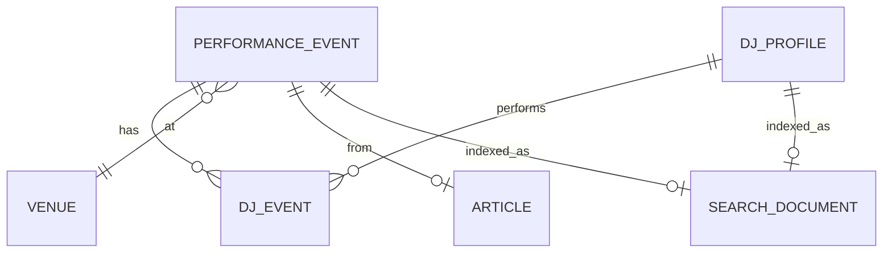

# 数据库结构文档 — 07_DATABASE_SCHEMA.md

项目: Atlas (中国地下电子音乐图鉴)
更新: 2026-06-10

## 1. 数据库概览

项目使用 **SQLite** 作为主存储引擎。三层数据库架构：

| 层 | 数据库 | 大小(约) | 路径 | 访问模式 |
|---|---|---|---|---|
| Source/Raw | atlas_merged.sqlite | 3.8GB | /tmp/ (WSL) | 读写 (gate 控制) |
| Selected Serving | atlas_serving.sqlite | 1.6GB | reports/*/ | 只读 |
| External Link | atlas_db2.sqlite | ~500MB | /tmp/ (WSL) | 读写 (hive 控制) |
| Sidecar (社交) | atlas_t6_sidecar_social_overlay.sqlite | ~50MB | tools/stage7_rewrite/reports/ | 只读 |

另外：Neo4j (图谱 staging) 和 Qdrant (向量搜索)。

## 2. Atlas Serving 核心表

### performance_event (508,049 行)

| 字段 | 类型 | 说明 |
|---|---|---|
| id | TEXT PK | 事件唯一 ID |
| title | TEXT | 活动标题 |
| description | TEXT | LLM 提取的描述 |
| starts_at | TEXT ISO8601 | 开始时间 (85.7% 覆盖率) |
| city | TEXT | 城市名 (75.7% 覆盖率) |
| venue_id | TEXT FK | 关联场地 |
| poster_url | TEXT | 海报图片 URL |
| source_url | TEXT | WeChat 原文 URL |
| source_account | TEXT | 公众号名称 |
| article_id | TEXT FK | 关联原文 |

### dj_profile (53,555 行)

| 字段 | 类型 | 说明 |
|---|---|---|
| id | TEXT PK | DJ 唯一 ID |
| name | TEXT | DJ 名称 |
| bio | TEXT | LLM 提取的简介 |
| genres | TEXT | 风格标签 (逗号分隔) |
| avatar_url | TEXT | 头像 URL |
| soundcloud_url | TEXT | SoundCloud 链接 |
| instagram_url | TEXT | Instagram 链接 |

### venue (15,000+ 行)

| 字段 | 类型 | 说明 |
|---|---|---|
| id | TEXT PK | 场地唯一 ID |
| name | TEXT | 场地名称 |
| city | TEXT | 所在城市 |
| address | TEXT | 地址 |
| lat | REAL | 纬度 |
| lng | REAL | 经度 |

### dj_event (1,285,827 行)

| 字段 | 类型 | 说明 |
|---|---|---|
| dj_id | TEXT FK | DJ ID |
| event_id | TEXT FK | 事件 ID |
| role | TEXT | 角色 (headline/support) |

### search_document (590,927 行)

FTS5 全文搜索索引表。

| 字段 | 类型 | 说明 |
|---|---|---|
| id | TEXT PK | 关联实体 ID |
| type | TEXT | event/dj/venue |
| title | TEXT | 标题 |
| text | TEXT | 搜索文本 |
| city_text | TEXT | 城市搜索文本 |

### graph_window (53,555 行)

图谱窗口数据，每个 DJ 的关联网络。

## 3. 关键索引

- `performance_event(starts_at)` — 时间排序
- `performance_event(city)` — 城市筛选
- `dj_event(dj_id)` — DJ 演出查询
- `dj_event(event_id)` — 事件阵容查询
- `search_document` FTS5 — 全文搜索

## 4. 外键与级联

SQLite 默认不强制外键。关系在应用层维护：
- `dj_event` 通过 `dj_id` 和 `event_id` 关联
- 删除 DJ 不会级联删除 dj_event 行
- 字段缺失用 NULL 表示

## 5. 数据覆盖缺口

| 字段 | 缺失 | 占比 |
|---|---|---|
| starts_at | 87,258 | 14.3% |
| city | 148,083 | 24.3% |
| description | 部分 | - |
| venue_id | ~66,616 | 13.1% |

## 6. ER 图 (核心)

## 7. 迁移

项目不使用 Django migrations。数据库变更通过 Python 脚本直接操作：
- 新建表: `CREATE TABLE IF NOT EXISTS`
- 修改表: `ALTER TABLE ADD COLUMN`
- 无自动迁移工具

## 8. 本地开发最小数据集

建议从以下来源获取：
- 脱敏样例: `data/samples/` (待创建)
- 导出 schema: `python tools/stage7_rewrite/scripts/export_schema.py`
- 导入命令: `python manage.py import_sample`
