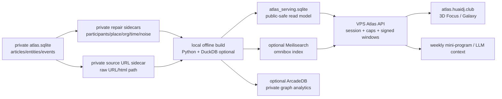

# Atlas High-Performance Database Architecture - 2026-05-22

Status: current database-performance architecture proposal / next implementation gate

Project: `C:\code\githubstar\wechathtmldownload`

Scope: DJ-first Atlas, China underground electronic music relationship network, fast search, DJ history profile, graph window exploration, weekly mini-program context bridge, and dark-database anti-scrape.

This document is a design and execution record only. It does not authorize production SQLite mutation, Neo4j/Qdrant writes, CloudRun deploys, mini-program upload/review, paid model calls, secret reads, or server mutation.

## Executive Decision

Use a layered read-model architecture, not one giant live graph database.

Recommended path:

1. Keep the full `atlas.sqlite` and recovered source URLs private as the immutable source layer.
2. Use local/offline builders on the RTX 4090 / 64GB PC to create deterministic DJ-first rollups.
3. Use DuckDB only for offline analytical joins/export when Python/SQLite becomes slow; do not put DuckDB in the public request path.
4. Deploy an immutable `atlas_serving.sqlite` on the Singapore VPS for profile/graph APIs. It should contain only public-safe, capped, materialized read models.
5. Add Meilisearch as an optional cheap search sidecar if SQLite FTS5 cannot keep omnibox p95 below budget.
6. Benchmark ArcadeDB privately for graph algorithms and full graph analysis. Do not expose ArcadeDB directly to the public web.
7. Treat Kuzu as experiment-only because the upstream GitHub repo is archived as of 2025-10-10.

The main performance fix is not "replace SQLite"; it is to stop doing profile and graph expansion from raw `entities/events/articles` at request time.

## Current Evidence

Local full Atlas source:

- `articles`: `138,102`
- `entities`: `1,510,787`
- `events`: `608,678`
- source DB size: about `3.98 GB`

Private low-cost repair sidecars already built:

- recovered/constructed source URLs: `138,102 / 138,102`
- participants candidates: `165,145` (`83,847` auto)
- venue candidates: `99,461`
- organizer candidates: `244,450`
- normalized sortable dates: `321,832`
- product/menu/drink quarantine: `7,658`
- ready-for-DJ-rollup overlay: `405,342`

Current public profile endpoint proof:

- graph seed self-test: p95 `51 ms`
- profile p95: `1,037 ms`
- slowest sample: `OIL`, `14,187` related events, profile `1,037 ms`

Conclusion: search seed is already acceptable; profile/relationship expansion needs precomputed DJ-first tables.

## Source-Backed Research

| Technology | What the official docs imply for Atlas | Decision |
| --- | --- | --- |
| SQLite FTS5 | FTS5 supports full-text search, prefix indexes, trigram tokenizer for substring matching, external/contentless tables, and rank/BM25-style relevance functions. This fits a compact immutable serving artifact. | Keep for serving baseline. Use external/contentless FTS tables to reduce public DB size. |
| PostgreSQL FTS / `pg_trgm` | PostgreSQL recommends GIN for full-text `tsvector`, and `pg_trgm` provides GiST/GIN operators for fast similarity / LIKE / ILIKE / regex searches. | Use only if multi-worker write/admin concurrency or hosted ops becomes necessary. Not required for the first cheap VPS build. |
| DuckDB | DuckDB can attach/query SQLite directly and has zonemaps plus ART indexes for highly selective queries, but ART indexes affect memory/load and are not a universal join accelerator. | Use offline for bulk rollup, Parquet export, QA, and benchmark jobs. Not public API path. |
| Meilisearch | Search API supports prefix search and typo tolerance; filterable/sortable attributes build optimized internal structures for fast facets/filters. | Benchmark as optional omnibox sidecar if SQLite FTS5 ranking or typo tolerance is not enough. |
| ArcadeDB | Official docs describe graph/document/key-value/time-series/vector/geospatial in one Apache 2.0 engine, SQL/Cypher/Gremlin/HTTP/Postgres/Bolt protocols, and graph OLAP using read-optimized CSR/columnar views. | Benchmark privately for full graph algorithms and graph QA. Do not expose as public raw graph. |
| Kuzu | Kuzu had the right embedded graph shape, but the GitHub repo is archived and read-only. | Reject as production dependency; experiment-only. |

Primary source URLs:

- PostgreSQL full-text index docs: `https://www.postgresql.org/docs/current/textsearch-indexes.html`
- PostgreSQL `pg_trgm`: `https://www.postgresql.org/docs/17/pgtrgm.html`
- SQLite FTS5: `https://www.sqlite.org/fts5.html`
- DuckDB indexing: `https://duckdb.org/docs/current/guides/performance/indexing`
- DuckDB SQLite extension: `https://duckdb.org/docs/current/core_extensions/sqlite`
- Meilisearch search API: `https://www.meilisearch.com/docs/reference/api/search/search-with-post`
- Meilisearch filtering/faceting: `https://www.meilisearch.com/docs/capabilities/filtering_sorting_faceting/overview`
- ArcadeDB get started: `https://docs.arcadedb.com/arcadedb/get-started`
- ArcadeDB Graph OLAP: `https://docs.arcadedb.com/arcadedb/how-to/data-modeling/graph-olap`
- Kuzu GitHub archive notice: `https://github.com/kuzudb/kuzu`

## Target Architecture



Rules:

- Public API never reads raw source URLs directly.
- Public API never enumerates all IDs.
- Public graph never returns all nodes or all edges.
- Search returns ranked public cards, not raw rows.
- Full graph algorithms run offline or private-only, then export capped windows.

## Data Artifacts

### 1. `atlas_source.sqlite`

Existing source DB. Private only.

It can remain large and messy because it is not the public serving contract.

### 2. `atlas_repair_overlay.sqlite`

Merge of the existing private sidecars:

- `article_source_url`
- `event_participant_candidates`
- `event_venue_candidates`
- `event_organizer_candidates`
- `event_time_normalized`
- `entity_domain_quarantine`

Rules:

- `auto_candidate` can feed default rollups.
- `review_candidate` stays hidden until accepted by local workbench.
- raw `source_url` is private; public evidence uses hashed refs and source labels.

### 3. `atlas_build.duckdb` or Parquet folder

Optional local analytics build artifact.

Use it when the next full rollup needs fast group-by/join/export over millions of rows. Keep it off the public server unless there is a specific benchmark win.

Recommended sort order for Parquet/DuckDB exports:

- `dj_event`: `(dj_id, starts_at, event_id)`
- `event_participant`: `(event_id, dj_id)`
- `dj_dj_relation`: `(src_dj_id, relation_score desc)`
- `dj_venue_rollup`: `(dj_id, event_count desc)`
- `venue_dj_rollup`: `(venue_id, event_count desc)`

### 4. `atlas_serving.sqlite`

Public-safe immutable serving DB.

Open mode on server:

```text
file:atlas_serving.sqlite?mode=ro&immutable=1
```

Recommended SQLite pragmas for the API process:

```sql
PRAGMA query_only = ON;
PRAGMA temp_store = MEMORY;
PRAGMA mmap_size = 1073741824;
PRAGMA cache_size = -262144;
```

Build-time finalization:

```sql
ANALYZE;
PRAGMA optimize;
VACUUM;
```

Do not run public requests against the raw `3.98 GB` source DB once this artifact exists.

### 5. Optional `atlas_search` Meilisearch index

One document per canonical public subject:

- DJ
- venue
- label/crew
- media/radio
- event
- work

Keep source article rows out of default search unless the operator opens an evidence mode.

### 6. Optional private `atlas_graph.arcadedb`

Used for:

- community detection
- PageRank / centrality
- k-core
- full graph QA
- graph algorithm benchmark

Not used for:

- public raw graph endpoint
- bulk export
- direct browser connection

## Serving Schema

### Canonical Subjects

```sql
CREATE TABLE canonical_subject (
  subject_id TEXT PRIMARY KEY,
  subject_type TEXT NOT NULL,
  display_name TEXT NOT NULL,
  normalized_name TEXT NOT NULL,
  taxon_path TEXT NOT NULL,
  aliases_json TEXT NOT NULL DEFAULT '[]',
  city_primary TEXT NOT NULL DEFAULT '',
  confidence REAL NOT NULL DEFAULT 0,
  source_count INTEGER NOT NULL DEFAULT 0,
  event_count INTEGER NOT NULL DEFAULT 0,
  relation_count INTEGER NOT NULL DEFAULT 0,
  first_seen_at TEXT NOT NULL DEFAULT '',
  last_seen_at TEXT NOT NULL DEFAULT '',
  public_state TEXT NOT NULL DEFAULT 'public'
);

CREATE INDEX idx_subject_norm ON canonical_subject(normalized_name);
CREATE INDEX idx_subject_type_score ON canonical_subject(subject_type, event_count DESC, source_count DESC);
CREATE INDEX idx_subject_last_seen ON canonical_subject(last_seen_at DESC);
```

### DJ Profile

```sql
CREATE TABLE dj_profile (
  dj_id TEXT PRIMARY KEY,
  display_name TEXT NOT NULL,
  normalized_name TEXT NOT NULL,
  aliases_json TEXT NOT NULL DEFAULT '[]',
  city_primary TEXT NOT NULL DEFAULT '',
  avatar_asset_id TEXT NOT NULL DEFAULT '',
  source_article_count INTEGER NOT NULL DEFAULT 0,
  event_count INTEGER NOT NULL DEFAULT 0,
  venue_count INTEGER NOT NULL DEFAULT 0,
  collaborator_count INTEGER NOT NULL DEFAULT 0,
  organization_count INTEGER NOT NULL DEFAULT 0,
  media_count INTEGER NOT NULL DEFAULT 0,
  first_seen_at TEXT NOT NULL DEFAULT '',
  last_seen_at TEXT NOT NULL DEFAULT '',
  confidence REAL NOT NULL DEFAULT 0
);

CREATE INDEX idx_dj_profile_name ON dj_profile(normalized_name);
CREATE INDEX idx_dj_profile_activity ON dj_profile(event_count DESC, last_seen_at DESC);
```

### DJ Events

```sql
CREATE TABLE dj_event (
  dj_id TEXT NOT NULL,
  event_id TEXT NOT NULL,
  starts_at TEXT NOT NULL DEFAULT '',
  time_text TEXT NOT NULL DEFAULT '',
  event_title TEXT NOT NULL,
  venue_id TEXT NOT NULL DEFAULT '',
  venue_name TEXT NOT NULL DEFAULT '',
  city TEXT NOT NULL DEFAULT '',
  source_ref_id TEXT NOT NULL,
  confidence REAL NOT NULL DEFAULT 0,
  PRIMARY KEY (dj_id, event_id, source_ref_id)
);

CREATE INDEX idx_dj_event_timeline ON dj_event(dj_id, starts_at DESC, event_id);
CREATE INDEX idx_dj_event_venue ON dj_event(dj_id, venue_id, starts_at DESC);
CREATE INDEX idx_event_dj ON dj_event(event_id, dj_id);
```

### DJ Relations

```sql
CREATE TABLE dj_relation_rollup (
  src_dj_id TEXT NOT NULL,
  dst_dj_id TEXT NOT NULL,
  same_event_count INTEGER NOT NULL DEFAULT 0,
  same_label_count INTEGER NOT NULL DEFAULT 0,
  same_venue_count INTEGER NOT NULL DEFAULT 0,
  same_source_context_count INTEGER NOT NULL DEFAULT 0,
  source_diversity INTEGER NOT NULL DEFAULT 0,
  first_seen_at TEXT NOT NULL DEFAULT '',
  last_seen_at TEXT NOT NULL DEFAULT '',
  relation_score REAL NOT NULL DEFAULT 0,
  relation_label_zh TEXT NOT NULL DEFAULT '',
  sample_evidence_json TEXT NOT NULL DEFAULT '[]',
  public_state TEXT NOT NULL DEFAULT 'public',
  PRIMARY KEY (src_dj_id, dst_dj_id)
);

CREATE INDEX idx_dj_relation_top ON dj_relation_rollup(src_dj_id, relation_score DESC, same_event_count DESC);
CREATE INDEX idx_dj_relation_reverse ON dj_relation_rollup(dst_dj_id, relation_score DESC);
```

### Venue / Organization Rollups

```sql
CREATE TABLE dj_venue_rollup (
  dj_id TEXT NOT NULL,
  venue_id TEXT NOT NULL,
  venue_name TEXT NOT NULL,
  city TEXT NOT NULL DEFAULT '',
  event_count INTEGER NOT NULL DEFAULT 0,
  first_seen_at TEXT NOT NULL DEFAULT '',
  last_seen_at TEXT NOT NULL DEFAULT '',
  score REAL NOT NULL DEFAULT 0,
  PRIMARY KEY (dj_id, venue_id)
);

CREATE INDEX idx_dj_venue_top ON dj_venue_rollup(dj_id, event_count DESC, score DESC);
CREATE INDEX idx_venue_dj_top ON dj_venue_rollup(venue_id, event_count DESC, score DESC);

CREATE TABLE dj_org_rollup (
  dj_id TEXT NOT NULL,
  org_id TEXT NOT NULL,
  org_name TEXT NOT NULL,
  org_type TEXT NOT NULL DEFAULT '',
  evidence_count INTEGER NOT NULL DEFAULT 0,
  score REAL NOT NULL DEFAULT 0,
  sample_evidence_json TEXT NOT NULL DEFAULT '[]',
  PRIMARY KEY (dj_id, org_id)
);

CREATE INDEX idx_dj_org_top ON dj_org_rollup(dj_id, score DESC, evidence_count DESC);
```

### Public Search

SQLite baseline:

```sql
CREATE TABLE search_document (
  doc_rowid INTEGER PRIMARY KEY,
  subject_id TEXT NOT NULL,
  subject_type TEXT NOT NULL,
  display_name TEXT NOT NULL,
  normalized_name TEXT NOT NULL,
  aliases_text TEXT NOT NULL DEFAULT '',
  city_text TEXT NOT NULL DEFAULT '',
  taxon_path TEXT NOT NULL DEFAULT '',
  rank_score REAL NOT NULL DEFAULT 0,
  last_seen_at TEXT NOT NULL DEFAULT '',
  public_state TEXT NOT NULL DEFAULT 'public',
  search_text TEXT NOT NULL
);

CREATE INDEX idx_search_subject ON search_document(subject_id);
CREATE INDEX idx_search_type_rank ON search_document(subject_type, rank_score DESC);

CREATE VIRTUAL TABLE search_document_fts
USING fts5(
  display_name,
  aliases_text,
  city_text,
  taxon_path,
  search_text,
  content='search_document',
  content_rowid='doc_rowid',
  tokenize='trigram',
  prefix='2 3 4'
);
```

Ranking order:

1. exact normalized name
2. alias/handle exact match
3. trigram FTS match
4. DJ/person priority
5. event count / relation score
6. recency
7. source diversity
8. confidence

No visible entity-type selector is required. Type inference happens after ranking.

### Evidence References

```sql
CREATE TABLE evidence_ref (
  source_ref_id TEXT PRIMARY KEY,
  source_hash TEXT NOT NULL,
  source_account TEXT NOT NULL DEFAULT '',
  source_title TEXT NOT NULL DEFAULT '',
  post_date TEXT NOT NULL DEFAULT '',
  public_snippet TEXT NOT NULL DEFAULT '',
  source_kind TEXT NOT NULL DEFAULT 'wechat_article',
  public_url_allowed INTEGER NOT NULL DEFAULT 0
);

CREATE INDEX idx_evidence_post_date ON evidence_ref(post_date DESC);
CREATE INDEX idx_evidence_account ON evidence_ref(source_account);
```

Important: raw `source_url` stays in private sidecar. Public DB stores only `source_hash`, title, account, date, and bounded snippet unless a single-row detail page explicitly needs a signed evidence link.

### Graph Windows

```sql
CREATE TABLE graph_window_cache (
  window_key TEXT PRIMARY KEY,
  seed_subject_id TEXT NOT NULL,
  lens TEXT NOT NULL,
  depth INTEGER NOT NULL,
  node_count INTEGER NOT NULL,
  edge_count INTEGER NOT NULL,
  nodes_json TEXT NOT NULL,
  edges_json TEXT NOT NULL,
  generated_at TEXT NOT NULL
);

CREATE INDEX idx_graph_window_seed ON graph_window_cache(seed_subject_id, lens, depth);
```

This is the fastest public path. The API should read one row and return capped JSON, instead of computing two-hop relationships live.

## Request Paths

### Omnibox Search

```text
normalize query
  -> exact canonical_subject lookup
  -> search_document_fts or Meilisearch top-K
  -> score fusion
  -> public-state/noise gate
  -> top 8/20 cards
```

Budget:

- p95 server time `< 80 ms`
- p99 server time `< 200 ms`

### DJ Profile

```text
dj_id
  -> dj_profile by PK
  -> dj_event timeline index
  -> dj_relation_rollup top collaborators
  -> dj_venue_rollup top venues
  -> dj_org_rollup top labels/crews
  -> evidence_ref samples
```

Budget:

- p95 `< 120 ms`
- p99 `< 250 ms`

This replaces the current raw source-window scan that can hit `1,037 ms` on large entities such as `OIL`.

### Venue Profile

```text
venue_id
  -> venue_profile
  -> venue_event timeline
  -> venue_dj_rollup
  -> label/org rollup
  -> graph window cache
```

Budget:

- p95 `< 150 ms`

### Graph Explore

```text
seed subject + lens + depth
  -> graph_window_cache exact hit
  -> if miss, bounded server build from rollups
  -> signed cursor/window token
  -> capped nodes/edges
```

Budgets:

- focus view: `300` to `1,200` nodes
- desktop galaxy: precomputed LOD, not raw graph dump
- mobile: `<= 300` nodes / `<= 800` edges

## Why Not Put Everything Into One Graph DB

Atlas has different workloads:

- exact search
- typo/prefix search
- DJ timeline
- same-event relation rollup
- venue history
- source evidence
- graph algorithms
- public 3D visualization

One live graph DB can run some of these, but it is a bad public API boundary:

- expensive to operate on a cheap VPS
- hard to anti-scrape if public queries traverse arbitrary graph
- slower than materialized tables for fixed DJ profile views
- unnecessary for top-K search and profile cards

Graph DB should be a private analytics engine, not the public data contract.

## VPS Deployment Shape

Minimum cheap deployment:

```text
Nginx
  -> Node Atlas API
      -> atlas_serving.sqlite mode=ro immutable=1
      -> optional Meilisearch localhost only
  -> static assets
Cloudflare
  -> Turnstile/session/WAF/rate limits
```

Server file layout:

```text
/opt/atlas/current/
  atlas-api/
  data/atlas_serving.sqlite
  data/atlas_serving.manifest.json
  assets/
  logs/
```

Atomic release:

1. upload new artifact to `/opt/atlas/releases/<stamp>/`
2. run local smoke against `127.0.0.1`
3. switch `current` symlink
4. restart API
5. verify `/api/v1/stage7/graph/search`, profile, and graph-window self-test

## Anti-Scrape Database Rules

- Never serve `atlas_source.sqlite`, `atlas_repair_overlay.sqlite`, raw Parquet, DuckDB, ArcadeDB, or Meilisearch admin endpoints.
- Search `limit` max `20` public, `100` operator-only.
- Graph node cap hard-coded server-side, not user-controlled.
- Opaque `subject_id`; no sequential raw row IDs.
- `source_article_uid`, `eid`, `evid`, raw source URLs, raw HTML paths, and raw JSON stay private.
- Evidence links are signed per session and per row if enabled.
- Honey endpoints and abnormal pagination are logged.
- Public window tokens include `seed`, `lens`, `depth`, `nodeCap`, `expiresAt`, and HMAC.

## Benchmark Plan

Build script targets:

1. `build_atlas_serving_read_model.py`
   - input: source SQLite + repair sidecars
   - output: `atlas_serving.sqlite`
   - mode: report-only until accepted

2. `benchmark_atlas_serving_db.py`
   - queries: `MaFoL`, `OIL`, `DADA昆明`, `NO ORDER`, `Illsee`, `BO LIVE`, `SHCR`, `BYYB`
   - tests: search, DJ profile, venue profile, graph window
   - budgets: search p95 `< 80 ms`, profile p95 `< 120 ms`, graph window p95 `< 200 ms`

3. `benchmark_atlas_meilisearch.py`
   - compare SQLite FTS5 vs Meilisearch over same `search_document`
   - only adopt Meilisearch if it improves typo/prefix ranking or p95 meaningfully

4. `benchmark_atlas_arcadedb_private.py`
   - import canonical graph
   - test 1-hop/2-hop, PageRank/community, disk size, memory
   - private/offline only

Pass gate:

- No paid API.
- No source DB mutation.
- No raw URL in public artifact.
- Search exact top-3 pass `>= 95%` on curated seeds.
- DJ profile has history events, venues, collaborators, organizations for known high-value DJs.
- Product/menu/drink noise not returned as default search seeds.

## Immediate Implementation Order

1. Create `atlas_serving.sqlite` from existing sidecars.
2. Materialize `dj_profile`, `dj_event`, `dj_relation_rollup`, `dj_venue_rollup`, `dj_org_rollup`, `evidence_ref`, `search_document`, and `graph_window_cache`.
3. Wire `/atlas/graph` APIs to `atlas_serving.sqlite` first; keep raw source DB as fallback behind operator flag only.
4. Run the self-test and compare against the current profile p95 `1,037 ms`.
5. Only if search quality/latency is insufficient, add Meilisearch as a local-only sidecar.
6. Only after the serving path is fast, benchmark ArcadeDB for private full graph analytics.

## Rejected Defaults

- No public raw graph DB.
- No browser full-load of all nodes/edges.
- No paid LLM for deterministic DB repair.
- No Kuzu production dependency while upstream is archived.
- No PostgreSQL migration as a first move unless SQLite read model fails measured concurrency.
- No Neo4j/ArcadeDB public arbitrary Cypher endpoint.
- No direct source URL bulk export.
