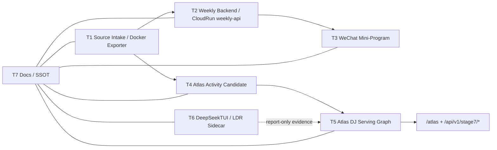

# Atlas 与微信小程序当前进度、代码架构、代码实际情况

Status: `CURRENT_AUTHORITY`

Updated: 2026-05-25 14:09 CST

Scope: `C:\code\githubstar\wechathtmldownload`

This document is a source-backed checkpoint for the combined Atlas / weekly mini-program line. It is based on the current thread router, `docs/current-runtime.md`, live working-tree inspection, a focused `Lum1104/Understand-Anything` graph pass, and a focused `CodeGraph` symbol/call graph pass over the same Atlas + mini-program source surface.

## Evidence Pack

| Evidence | Path | Result |
| --- | --- | --- |
| Focused Understand-Anything graph | `.understand-anything/knowledge-graph.json` | `744` files, `5569` nodes, `4825` edges, `4` layers; schema validation `success=true`, issue count `0` |
| Focused graph summary | `.understand-anything/focused-atlas-miniapp-summary.json` | Scope counts: mini-program `232`, weekly CloudRun backend `21`, Atlas scripts `217`, Atlas tests `165`, docs/reports `87`, bridge `9` |
| Graph builder script | `.understand-anything/tmp/build-focused-atlas-miniapp-graph.mjs` | Deterministic local graph build over Atlas + weekly mini-program code/docs only |
| Focused CodeGraph workspace | `.understand-anything/codegraph-atlas-miniapp-workspace` | Generated from the Understand-Anything file set, but restricted to CodeGraph-supported JS/Python source files |
| Focused CodeGraph status | `.understand-anything/codegraph-atlas-miniapp-status.json` | `431` files, `10465` nodes, `24031` edges, backend `node-sqlite`, journal `wal`, pending changes `0` |
| Focused CodeGraph context | `.understand-anything/codegraph-atlas-miniapp-context.md` | Task context for Atlas Stage7 + weekly mini-program API flow, generated by `codegraph context` |
| Git safety backup | `C:\code\.git-workspace-backups\wechathtmldownload\20260525-134801` | Dirty tree backed up before writing docs/artifacts |
| Git safety backup for CodeGraph pass | `C:\code\.git-workspace-backups\wechathtmldownload\20260525-135857` | Dirty tree backed up before generated CodeGraph workspace/docs update |
| Current runtime ledger | `docs/current-runtime.md` | Latest top entry is `2026-05-25 13:47 Q6 Cod.Act Source-Context Recovery Blocked` |
| Thread router | `docs/threads/THREADS_INDEX_20260522.md` | Current T1-T7 routing authority; Last T7 sync `2026-05-25 13:08 CST` |

## Understand-Anything + CodeGraph Pairing

Use both tools, but do not ask them the same question.

Understand-Anything is the project-knowledge layer:

- Use it first to establish scope, lanes, router/SSOT boundaries, docs, config, WXML/WXSS, JSON manifests, and cross-domain architecture.
- Use `.understand-anything/knowledge-graph.json` as the broad map and `.understand-anything/focused-atlas-miniapp-summary.json` for scope counts and structural hotspots.
- It is the better source for "what is this project/lane/state", "which docs are current", and "which files belong to Atlas versus weekly versus mini-program".

CodeGraph is the source-symbol layer:

- Use it after the Understand-Anything scope is fixed, to query functions/classes/methods/imports, callers/callees, and impact radius.
- For this repo, do not run CodeGraph over the full dirty checkout by default. The working tree has six-figure untracked files, so the safe pattern is a focused generated workspace under `.understand-anything/codegraph-atlas-miniapp-workspace`.
- It indexes JS/Python well, but does not replace Understand-Anything for Markdown docs, JSON config, WXML/WXSS page structure, or current-state routers.

Practical sequence:

1. Read `docs/threads/THREADS_INDEX_20260522.md` and `docs/current-runtime.md`.
2. Use Understand-Anything to select the current Atlas + weekly mini-program file universe.
3. Build or refresh the focused CodeGraph workspace from that file universe.
4. Use CodeGraph for `query`, `context`, `callers`, `callees`, and `impact` before editing JS/Python.
5. Return to docs/SSOT to keep `local changed`, `uploaded`, `remote-effective`, `WeChat review`, and `formal user visible` separate.

Current CodeGraph evidence:

- `codegraph status` on the focused workspace reports `431` indexed files, `10465` nodes, `24031` edges, `72` classes, `4838` functions, `415` methods, `2483` imports, and `2049` variables.
- `codegraph query createServer` resolves the CloudRun entry to `services/weekly_activity_cloudrun/src/server.mjs:448`.
- `codegraph callees createServer` shows direct runtime dependencies including `createStage7Store`, `createAtlasSecurity`, `createDeepSeekClient`, `sendJson`, `readJsonBody`, weekly store methods, and Atlas page rendering helpers.
- `codegraph query getAtlasEvent` resolves the weekly Atlas event enrichment boundary to `services/weekly_activity_cloudrun/src/dataStore.mjs:854`.
- `codegraph callers getAtlasEvent` reports `createServer` as its direct caller; `codegraph callees getAtlasEvent` reports `readJson`, matching the current read-only enrichment boundary.
- `codegraph query callContainer` returns no symbol hit. That is expected because `wx.cloud.callContainer` is a platform API property call in mini-program code, not a declared local symbol. For this exact literal boundary, use source grep or Understand-Anything file evidence, then use CodeGraph around local wrapper functions such as `requestApi`.

## Current Progress

### Atlas

Atlas is advanced locally, but not public-effective.

Current verified facts:

- Local Neo4j production marker `stage7_all_full_llm_138102_prod_q6_social_20260524` is verified with `138102` articles / `913082` entities / `158490` events.
- Q5/Q6 product-truth staging metadata was written only to `3` existing local Neo4j `Stage7Staging` `HAS_PROFILE` edges for Gekko, FullHouse, and 4Tael; target mutation id count `3`, non-target product-truth `0`, public gate violations `0`.
- `YYYY` advanced to a verified local Neo4j staging-only `HAS_PROFILE` canary, but its Q5/Q6 product-truth mutation packet is blocked by `atlas_dj_id_missing`.
- `Cod.Act` remains blocked: public SoundCloud metadata exists, but selected local Atlas serving SQLite has `0` exact source-context/profile/subject hits.
- Public target `https://atlas.huaidj.club` is still blocked at the Stage7 API readiness surface; the public pointer / serving state is not remote-effective.

Closed gates:

- No public pointer update.
- No CloudRun/VPS deploy for Atlas public serving.
- No Qdrant or SQLite production write.
- No identity-proof promotion.
- No avatar/public-serving-field exposure.
- No mini-program upload/review side effect from Atlas work.

### Weekly Backend

Weekly backend is the most stable public-effective piece of the mini-program path.

Current verified facts:

- CloudRun `weekly-api-066` is now remote-effective after the Q3 backend-only cache-key deploy recorded in `reports/WEEKLY_Q3_CACHE_KEY_BACKEND_DEPLOY_20260525.md`.
- Post-write production smoke passed with decision `cloudrun_weekly_production_smoke_ready` and blockers `[]`.
- Bounded pressure probe: `2101` requests / `0` failures.
- Public counts at the post-write checkpoint: current feed total `39`, manifest item count `196`, materialized enrichment count `196`.
- Validation before deploy: CloudRun service tests `62` passed; weekly smoke/schema pytest `12` passed; direct API dry-run returned `cloudrun_direct_api_dry_run_ready`.

Closed gates:

- CloudRun backend deploy did happen later in the Q3 cache-key deploy slice, producing `weekly-api-066`.
- No weekly resource package switch happened in that slice.
- No Atlas pointer or graph/vector/SQLite production state changed.

### WeChat Mini-Program

The mini-program has a developer version uploaded, but not reviewed by WeChat through Codex.

Current verified facts:

- Mini-program app id in local project config: `wx0bc0a1d9d892af2d`.
- Current app name/title: `坏DJclub`.
- Pages are `index`, `detail`, `source`, `artist`, `venue`, `city`, `saved`, `about`.
- It consumes `weekly-api` through `wx.cloud.callContainer` with `X-WX-SERVICE: weekly-api`, and has public/static/mock fallback paths.
- Developer version `2026.05.23.1` is uploaded according to the thread router; Codex did not submit WeChat review.

Closed gates:

- WeChat review is not submitted by Codex.
- Formal user visibility is not proven by this checkpoint.
- Frontend changes in the current working tree are local/uncommitted or untracked unless separately committed/uploaded.

## Architecture

### Backend Runtime Shape

The CloudRun service is a Node HTTP server in `services/weekly_activity_cloudrun/src/server.mjs`.

Main surfaces:

- Health: `/healthz`.
- Weekly API: `/api/v1/weekly/manifest`, `/api/v1/weekly/current`, `/api/v1/weekly/cities`, `/api/v1/weekly/dates`, `/api/v1/weekly/items/batch`, `/api/v1/weekly/atlas-events/:id`.
- Weekly LLM helpers: `/api/v1/weekly/llm/status`, materialized summary/enrichment endpoints, and enrichment endpoints.
- Atlas pages: `/atlas`, `/atlas/graph`, `/atlas/identity`, `/atlas/local`, `/atlas/{articles|entities|events}/:id`.
- Atlas API: `/api/v1/stage7/manifest`, `/api/v1/stage7/search`, `/api/v1/stage7/overview`, `/api/v1/stage7/identity-review`, `/api/v1/stage7/recommendations`, `/api/v1/stage7/vector-router/status`, `/api/v1/stage7/graph-rag/answers`, graph seed/profile/subgraph/random-walk endpoints.
- Local review APIs: `/api/v1/stage7/local/status`, `/api/v1/stage7/local/map`, `/api/v1/stage7/local/geocode-review`, `/api/v1/stage7/local/adjudication-ledger`, `/api/v1/stage7/local/adjudication`.
- Safety controls: honey endpoints, Atlas session gate, Turnstile/session support, rate buckets, safe asset proxy, no public bulk export.

Key code:

- `services/weekly_activity_cloudrun/src/server.mjs:443` creates the HTTP server and wires all public routes.
- `services/weekly_activity_cloudrun/src/server.mjs:339` marks `/api/v1/stage7/*` as protected Atlas API space.
- `services/weekly_activity_cloudrun/src/server.mjs:593` starts Atlas page routes.
- `services/weekly_activity_cloudrun/src/server.mjs:630` starts weekly/Stage7 API routes.
- `services/weekly_activity_cloudrun/src/stage7AtlasSqliteStore.mjs:920` defines the SQLite read-model store.
- `services/weekly_activity_cloudrun/src/stage7AtlasSqliteStore.mjs:1163` provides `getManifest`.
- `services/weekly_activity_cloudrun/src/stage7AtlasSqliteStore.mjs:1461` provides Stage7 search.
- `services/weekly_activity_cloudrun/src/dataStore.mjs:644` defines the weekly data store.
- `services/weekly_activity_cloudrun/src/dataStore.mjs:854` exposes read-only weekly Atlas event enrichment.

### Mini-Program Consumer Shape

The mini-program is a pure WeChat mini-program frontend under `apps/weekly_activity_miniprogram`.

Main surfaces:

- `app.json` declares eight pages and three tabs: 本周, 收藏, 关于.
- `app.js` configures CloudBase env `huaidjweekly-d8g1go7-d0a07863e3e`, service `weekly-api`, public fallback URL, and mock localhost URL.
- `utils/api.js` implements request de-duplication, Cloud container calls, public fallback, static fallback, mock fallback, local filtering, dedupe, and static route emulation.
- `utils/api.js` includes static fallback for `/api/v1/weekly/atlas-events/:eventId`; it exposes only verified/hidden-safe lineup rows and returns safety flags that graph/Qdrant/production writes are false.
- `pages/index/index.js` owns feed loading, filter state, poster/source interactions, and haptic behavior.
- `pages/detail/detail.js` owns detail display, map availability, source preview, and Atlas lineup hints.
- `pages/artist/artist.js` and `pages/venue/venue.js` own entity detail views.

Key code:

- `apps/weekly_activity_miniprogram/app.js:2` holds global cloud runtime config.
- `apps/weekly_activity_miniprogram/app.js:23` initializes `wx.cloud`.
- `apps/weekly_activity_miniprogram/utils/api.js:442` implements static `/api/v1/weekly/atlas-events/:id`.
- `apps/weekly_activity_miniprogram/utils/api.js:560` calls the CloudBase container with `X-WX-SERVICE`.
- `apps/weekly_activity_miniprogram/pages/index/index.js:165` defines the main page.
- `apps/weekly_activity_miniprogram/pages/detail/detail.js:98` defines the detail page.

### Atlas / Stage7 Production Shape

Atlas is not a single frontend. It is a multi-gate pipeline:

- Stage7 extraction and repair scripts build structured article/entity/event products.
- Atlas activity candidate and weekly bridge code add source-preserving, derived sidecars.
- Serving read models are built as local SQLite / compressed JSONL candidates.
- CloudRun exposes read-only pages/API through the weekly service when configured.
- Neo4j and Qdrant work is separately gated; local staging evidence does not imply public exposure.
- T6 DeepSeekTUI/LDR sidecars produce research packets only; production threads must independently validate before adopting them.

Key code:

- `tools/stage7_rewrite/scripts/build_atlas_serving_read_model.py` is the largest serving read-model builder in the focused graph.
- `tools/stage7_rewrite/scripts/build_atlas_social_*` scripts implement the Q6 source-context, identity, graph-write, and product-truth gates.
- `tools/stage7_rewrite/scripts/run_atlas_social_product_truth_mutation.py` is the confirm-token local Neo4j staging metadata runner for product-truth review metadata.
- `tools/stage7_rewrite/weekly_atlas_bridge/resolver.py` implements registry/alias/fuzzy/vector-candidate resolver tiers for weekly lineup strings.
- `tools/stage7_rewrite/weekly_atlas_bridge/indexes.py` implements registry, Atlas alias export, and optional Qdrant review indexes.

## Code Reality

### What The Working Tree Actually Looks Like

This is not a clean release snapshot.

- Branch: `feature/weekly-integrated-bridge`.
- Dirty count at backup time: `2948`.
- Tracked modified files sampled by Git include mini-program pages, `utils/format.js`, weekly docs, `services/weekly_activity_cloudrun/src/dataStore.mjs`, weekly CloudRun tests, Stage7 weekly repair scripts, and `weekly_atlas_bridge` tests.
- Untracked files include the mini-program app tree, many docs/reports, and the new `.understand-anything` graph artifacts.
- The focused Understand-Anything graph intentionally reads current working-tree files, including untracked files, because the user asked for actual current code state.

### High-Complexity Hotspots From Understand-Anything

| File | Lines | Structural symbols | Meaning |
| --- | ---: | ---: | --- |
| `tools/stage7_rewrite/scripts/archive_old/build_weekly_activity_miniprogram_api.py` | `2399` | `91` functions | Historical but still present weekly API pack builder; should not be treated as newest release path without router confirmation |
| `apps/weekly_activity_miniprogram/utils/format.js` | `1181` | `82` functions | Frontend formatting/dedupe/display logic hotspot |
| `services/weekly_activity_cloudrun/src/stage7AtlasSqliteStore.mjs` | `3549` | `56` functions + `1` class | Main Atlas SQLite serving read-model hotspot |
| `services/weekly_activity_cloudrun/src/dataStore.mjs` | `948` | `52` functions + `1` class | Main weekly data API store |
| `tools/stage7_rewrite/scripts/build_atlas_serving_read_model.py` | `2698` | `53` functions | Current Atlas serving read-model builder |
| `apps/weekly_activity_miniprogram/utils/api.js` | `674` | `47` functions | Mini-program API/fallback/dedupe boundary |

### Important Boundary Conclusions

- Weekly and Atlas share source intake, but they do not share completion gates.
- A passing weekly smoke does not make Atlas public serving effective.
- A local Neo4j staging canary does not promote identity proof, avatar display, public serving fields, production graph labels, Qdrant, SQLite, public pointer, CloudRun/VPS, mini-program state, or memory state.
- Mini-program developer upload does not equal WeChat review submission or formal user visibility.
- T6 research sidecars are not production controllers.
- The current codebase has many historical docs/scripts; use `docs/threads/THREADS_INDEX_20260522.md` and `docs/current-runtime.md` before resuming any dated file.

## Next Safe Gates

1. Keep `Cod.Act` blocked until exact Atlas source context or canonical DJ/entity id evidence exists.
2. Reopen `YYYY` product-truth mutation only after exact canonical target id evidence exists.
3. For weekly mini-program, treat `weekly-api-066` as backend remote-effective, but keep developer upload, WeChat review, and formal visibility separate.
4. For Atlas public serving, rerun public Stage7 smoke only after public target identity/session ambiguity can be resolved without secrets.
5. Before any production write/deploy/upload/review, create a separate gate packet with rollback/readback evidence.
