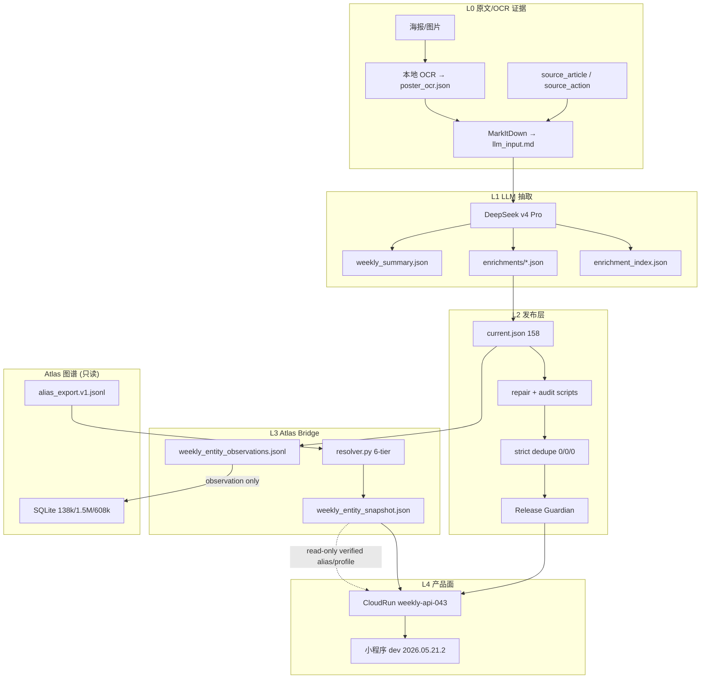

# 周活小程序 LLM+OCR × Atlas 图谱交叉比对升级方案

Generated: 2026-05-21 22:00 CST
Repository: `C:\code\githubstar\wechathtmldownload`
Status: Design/Planning — 不执行生产写入

---

## 1. 当前系统总览

```
┌─────────────────────────────────────────────────────────────────────┐
│                      周活小程序推文流水线                              │
│                                                                      │
│  公众号推文 ──→ Docker exporter ──→ 本地 OCR ──→ MarkItDown          │
│       │                                    │                         │
│       ▼                                    ▼                         │
│  source_article                     llm_input.md                     │
│  (158 rows)                    (含 ## Poster OCR 节)                  │
│       │                                    │                         │
│       └────────────┬───────────────────────┘                         │
│                    ▼                                                  │
│          DeepSeek v4 Pro (本地 materialize)                           │
│          enrich_weekly_activity_pack_with_deepseek.py                 │
│                    │                                                  │
│                    ▼                                                  │
│          current_release/llm/                                        │
│          ├── weekly_summary.json     (136 items)                     │
│          ├── enrichment_index.json   (136 entries)                    │
│          └── enrichments/*.json      (136 files)                      │
│                    │                                                  │
│                    ▼                                                  │
│          current.json (158 rows, current feed 136)                    │
│                    │                                                  │
│                    ▼                                                  │
│          CloudRun weekly-api-043 (只读缓存, 不调 LLM)                  │
│                    │                                                  │
│                    ▼                                                  │
│          小程序 dev 2026.05.21.2 (已上传, 未提审)                      │
└─────────────────────────────────────────────────────────────────────┘

┌─────────────────────────────────────────────────────────────────────┐
│                    Atlas 图谱只读桥接                                  │
│                                                                      │
│  Atlas SQLite (138,102 articles, 1,510,787 entities)                 │
│       │                                                              │
│       ├──→ G0 atlas_alias_export.v1.jsonl ──→ weekly_atlas_bridge    │
│       │         │                              │                     │
│       │         ▼                              ▼                     │
│       │    resolver.py               weekly_entity_snapshot.json     │
│       │    (6-tier ladder)           ├── artist_profiles: 28,685     │
│       │                              ├── lineup_resolved: 209        │
│       │                              ├── alias_exact: 63             │
│       │                              ├── fuzzy_multiple: 90          │
│       │                              └── no_match: 56                │
│       │                                                              │
│       ◄── weekly_entity_observations.jsonl (158 rows, observation)   │
│              ├── source_url_hash: 158/158                            │
│              ├── lineup_evidence: 158                                │
│              └── vector_review_candidates: 0                         │
│                                                                      │
│  Atlas public-search: RUNNING, PID 108336, 72.37% (246,024 keys)    │
│  └── Post-Filter blocked until COMPLETE                              │
└─────────────────────────────────────────────────────────────────────┘

关键数字 (2026-05-21):
  CloudRun: weekly-api-043 | manifest: 158 | default current: 136
  LLM materialized: 136/136 (enrichment_index.json ✓)
  Golden: 88 total, 20 verified | strict dedupe: 0/0/0
  lineup coverage: 100/158 | dj_bio_lines: 0/158 | artist_profiles: 0/158
  field_evidence_refs: 0/158 ← 核心缺口
```

---

## 2. Mermaid 架构图



---

## 3. 字段级 evidence_refs + Confidence JSON Contract

### 3.1 证据引用类型

```json
{
  "$schema": "weekly_evidence_refs.v1",
  "ref_types": {
    "article_line": {
      "format": "article:{source_hash}:{line_index}:{quote_sha256}",
      "description": "原文自然段引用"
    },
    "ocr_span": {
      "format": "ocr:{image_id}:{span_sha256}",
      "description": "OCR 识别文字段引用"
    },
    "atlas_alias": {
      "format": "atlas:{match_method}:{artist_id}",
      "description": "Atlas 图谱实体匹配引用"
    },
    "registry": {
      "format": "registry:{venue_key|organizer_key}",
      "description": "周活场地/组织者注册表引用"
    },
    "llm_extract": {
      "format": "llm:{enrichment_id}:{field_path}",
      "description": "LLM 抽取来源追踪"
    },
    "child_article": {
      "format": "child:{child_event_id}:{source_hash}:{field_path}",
      "description": "aggregate 子场原文引用"
    },
    "review_reason": {
      "format": "review:{reason_code}:{annotator}",
      "description": "人工复核决策记录"
    }
  }
}
```

### 3.2 每事件字段级 Contract

```json
{
  "event_id": "example:hash",
  "schema_version": "weekly_event_evidence.v1",
  "fields": {
    "event_date_start": {
      "value": "2026-05-22",
      "confidence": {
        "source_support": 1.0,
        "ocr_support": 0.0,
        "llm_consistency": 1.0,
        "atlas_identity": 0.0,
        "conflict_penalty": 0.0,
        "source_health": 1.0,
        "final": 1.0
      },
      "evidence_refs": [
        "article:src_hash_abc:line_3:quote_sha256_def"
      ],
      "decision": "show",
      "review_flags": []
    },
    "venue_name": {
      "value": "OIL Club",
      "confidence": {
        "source_support": 0.8,
        "ocr_support": 0.0,
        "llm_consistency": 0.8,
        "atlas_identity": 0.0,
        "conflict_penalty": 0.0,
        "source_health": 1.0,
        "final": 0.8
      },
      "evidence_refs": [
        "article:src_hash_abc:line_1:quote_sha256_ghi",
        "registry:venue:oil_shenzhen"
      ],
      "decision": "show",
      "review_flags": []
    },
    "address_candidate": {
      "value": "深圳市福田区泰然八路",
      "confidence": {
        "source_support": 0.7,
        "ocr_support": 0.9,
        "llm_consistency": 0.9,
        "atlas_identity": 0.0,
        "conflict_penalty": 0.0,
        "source_health": 1.0,
        "final": 0.83
      },
      "evidence_refs": [
        "ocr:img_001:span_sha256_jkl",
        "article:src_hash_abc:line_8:quote_sha256_mno"
      ],
      "decision": "show",
      "review_flags": ["address_needs_geocode_verify"]
    },
    "lineup_artists": {
      "value": ["DJ A", "DJ B"],
      "confidence": {
        "source_support": 0.9,
        "ocr_support": 0.9,
        "llm_consistency": 1.0,
        "atlas_identity": 0.8,
        "conflict_penalty": 0.0,
        "source_health": 1.0,
        "final": 0.87
      },
      "evidence_refs": [
        "ocr:img_001:span_sha256_pqr",
        "atlas:alias_exact:entity:ceid:person:xxx",
        "atlas:alias_exact:entity:ceid:person:yyy"
      ],
      "decision": "show",
      "review_flags": []
    },
    "lineup_artists_weak": {
      "value": ["某神秘嘉宾"],
      "confidence": {
        "source_support": 0.5,
        "ocr_support": 0.0,
        "llm_consistency": 0.5,
        "atlas_identity": 0.0,
        "conflict_penalty": 0.0,
        "source_health": 1.0,
        "final": 0.33
      },
      "evidence_refs": [
        "article:src_hash_abc:line_12:quote_sha256_stu"
      ],
      "decision": "show_with_hint",
      "review_flags": ["lineup_weak_evidence", "fuzzy_multiple_atlas"]
    },
    "price_text": {
      "value": "预售 80￥ / 现场 100￥",
      "confidence": {
        "source_support": 1.0,
        "ocr_support": 1.0,
        "llm_consistency": 1.0,
        "atlas_identity": 0.0,
        "conflict_penalty": 0.0,
        "source_health": 1.0,
        "final": 1.0
      },
      "evidence_refs": [
        "article:src_hash_abc:line_5:quote_sha256_vwx",
        "ocr:img_001:span_sha256_yza"
      ],
      "decision": "show",
      "review_flags": [],
      "ticketing_guard": {
        "3am_check": "passed",
        "raw_quote": "预售 80￥ / 现场 100￥",
        "price_digits_only": [80, 100],
        "time_condition_detected": false
      }
    },
    "dj_bio_lines": {
      "value": [],
      "confidence": {
        "source_support": 0.0,
        "ocr_support": 0.0,
        "llm_consistency": 0.0,
        "atlas_identity": 0.0,
        "conflict_penalty": 0.0,
        "source_health": 0.0,
        "final": 0.0
      },
      "evidence_refs": [],
      "decision": "hide",
      "review_flags": ["no_bio_source_available"],
      "bio_policy_note": "无原文/OCR bio 段落，Atlas profile bio_manual 为空"
    },
    "description_original_lines": {
      "value": ["周五晚 OIL 见！", "预售已开启，扫码购票"],
      "confidence": {
        "source_support": 1.0,
        "ocr_support": 0.0,
        "llm_consistency": 1.0,
        "atlas_identity": 0.0,
        "conflict_penalty": 0.0,
        "source_health": 1.0,
        "final": 1.0
      },
      "evidence_refs": [
        "article:src_hash_abc:line_1:quote_sha256_bcd",
        "article:src_hash_abc:line_15:quote_sha256_efg"
      ],
      "decision": "show",
      "review_flags": [],
      "provenance_note": "仅包含原文/OCR 自然句，未做 LLM 总结改写"
    }
  }
}
```

### 3.3 置信度分解算法

```
final_confidence = (
    w_source * source_support      # 权重 0.35 — 原文文本直接支持
  + w_ocr    * ocr_support         # 权重 0.30 — OCR 文字支持
  + w_llm    * llm_consistency     # 权重 0.15 — LLM 多轮一致性
  + w_atlas  * atlas_identity      # 权重 0.15 — Atlas 实体匹配验证
  - conflict_penalty                # 权重 0.20 — 多源冲突扣分
) * source_health                  # 0.0~1.0 — 原文是否可用/未删除
```

**Display decision 规则:**

| final_confidence | 条件 | decision |
|---|---|---|
| ≥ 0.70 | 有 source/OCR ref | `show` |
| 0.40–0.70 | 有 source/OCR ref 或有 Atlas alias | `show_with_hint` |
| < 0.40 | 任何情况 | `hide` |
| — | 有 conflict 且无人工裁决 | `review` |
| — | Atlas vector_candidate | `hide` (永不 show) |

---

## 4. OCR/LLM/Atlas 交叉比对算法

### 4.1 OCR-to-LLM Provenance Gate

```python
# 每个事件的 OCR 覆盖门禁检查
def ocr_provenance_gate(event: dict) -> GateResult:
    checks = {
        "image_count": count_images(event),
        "poster_ocr_exists": exists("poster_ocr.json"),
        "poster_ocr_backend": get_backend("poster_ocr.json"),
        "ocr_text_chars": len(get_ocr_text()),
        "llm_input_exists": exists("llm_input.md"),
        "llm_has_poster_ocr_section": "## Poster OCR" in read("llm_input.md"),
        "ocr_text_matched_in_llm_section": text_matches_section(ocr_text, llm_section),
        "field_refs_use_ocr": any("ocr:" in ref for ref in event.get("field_evidence_refs", [])),
    }

    if checks["image_count"] > 0:
        if not checks["poster_ocr_exists"]:
            return GATE_BLOCKED("image_heavy_no_ocr")
        if not checks["llm_has_poster_ocr_section"]:
            return GATE_BLOCKED("ocr_not_in_llm_input")
        if checks["ocr_text_chars"] > 32 and not checks["ocr_text_matched_in_llm_section"]:
            return GATE_REVIEW("ocr_text_not_matched_in_llm_section")

    return GATE_PASSED
```

**关键规则:** `image_count > 0` 且 `poster_ocr.json` 不存在时，事件标记为 `needs_ocr_review`，LLM 抽取结果中 `image_heavy_weak_text` risk flag 必须立，且禁止 LLM 在该事件上输出空 lineup 时写 "no information"——必须写 "OCR not available, text extraction limited to article body"。

### 4.2 LLM Materialization Completeness Gate

```python
def llm_completeness_gate(current_items, llm_dir) -> GateResult:
    current_ids = {item["event_id"] for item in current_items}

    summary = read_json(f"{llm_dir}/weekly_summary.json")
    index = read_json(f"{llm_dir}/enrichment_index.json")
    enrich_ids = {e["id"] for e in index["enrichments"]}
    file_ids = {f.stem for f in Path(f"{llm_dir}/enrichments").glob("*.json")}

    checks = {
        "summary_item_count": summary["itemCount"],
        "index_item_count": index["itemCount"],
        "index_enrichment_count": len(index["enrichments"]),
        "file_count": len(file_ids),
        "current_feed_count": len(current_ids),
        "index_vs_files": len(enrich_ids - file_ids),
        "files_vs_index": len(file_ids - enrich_ids),
        "missing_detail_files": sorted(enrich_ids - file_ids),
        "orphan_detail_files": sorted(file_ids - enrich_ids),
    }

    all_ok = (
        checks["summary_item_count"] == checks["current_feed_count"]
        and checks["index_enrichment_count"] == checks["file_count"]
        and checks["missing_detail_files"] == []
        and checks["orphan_detail_files"] == []
    )
    return GateResult(ok=all_ok, checks=checks)
```

此 gate 应在每次 CloudRun deploy 前作为 `release guardian` 的一环运行。

### 4.3 Atlas Resolver Confidence 与 Display 策略

| match_method | count (当前) | 条件 | display_tier | 需要 |
|---|---|---|---|---|
| `registry_exact` | 0 | 周活注册表精确匹配 | `show` | artist_id + canonical_name |
| `alias_exact` | 63 | Atlas alias 精确匹配 | `show` | artist_id + verified profile |
| `fuzzy_unique` | 0 | 模糊匹配唯一候选 | `show` | 需 ≥0.92 分数 |
| `fuzzy_multiple` | 90 | 模糊匹配多候选 | `show_with_hint` | hint name only, 不暴露 candidate ID |
| `vector_candidate` | 0 | Qdrant 向量检索 | `hide` | review queue only, 永不进入展示 |
| `no_match` | 56 | 未匹配 | `hide` | review queue |
| `blocked` | 0 | 黑名单词 | `hide` | — |

**Atlas snapshot 交叉比对流程:**

```text
For each weekly event:
  1. Extract lineup_artists from current.json
  2. Run each name through resolver.resolve()
  3. Store result in weekly_entity_snapshot.json (lineup_resolved)
  4. Compute event-level stats:
     - exact_match_ratio = alias_exact / len(lineup)
     - any_bio_available = any(artist has verified bio)
  5. Emit observation row with:
     - lineup_resolved_summary (no CDN/URL)
     - source_url_hash (SHA-256)
     - venue_raw
```

### 4.4 交叉验证矩阵

| 数据层 | 验证对象 | 验证方法 |
|---|---|---|
| source_article ↔ OCR | 正文文本是否进入 llm_input.md | `audit_ocr_md_deepseek_contract.py` |
| OCR ↔ LLM | ## Poster OCR 节是否存在且有内容 | 同上 |
| LLM enrichment ↔ current.json | enrichments/*.json 字段是否物化进 current | `audit_weekly_source_data_compare.py` |
| current.json ↔ snapshot | lineup 覆盖 100/158, alias_exact=63 | `build_weekly_atlas_snapshot.py` |
| current.json ↔ observations | source_url_hash 158/158 | `export_weekly_entity_observations.py` |
| manifest ↔ current feed | manifest 158 vs default current 136 | 预期差 = 22 past-date only events |
| deployed ↔ local | CloudRun smoke vs local current_release | Release Guardian |

---

## 5. Bio、实体、活动介绍的保守增强策略

### 5.1 Bio 三层策略

```
Bio 来源层级 (优先级从高到低):

Level 1: 活动内原文 intro
  - 原文自然段中明确标注为艺人介绍的句子
  - 证据: article:{source_hash}:line_{n}:quote_{sha256}
  - 标签: bio_source = "event_article_intro"
  - 展示: show, 标注 "原文介绍"

Level 2: Atlas verified profile bio
  - Atlas snapshot 中 verified=true 且 bio_manual 非空的 profile
  - 证据: atlas:alias_exact:{artist_id}:bio_manual
  - 标签: bio_source = "atlas_verified_profile"
  - 展示: show, 标注 "图谱档案"

Level 3: 无来源
  - bio 字段为空数组 []
  - 不生成、不推断、不编写
  - review_flag: "no_bio_source_available"
  - 展示: hide (不显示 bio 区域)
```

**严格禁止:**
- LLM 生成的 "DJ A 是来自 XX 的优秀电子音乐人" 风格文案
- 从音乐风格/厂牌推断的个人简介
- 从演出海报视觉风格猜测的人物描述
- 从其他艺人的 bio 改写拼接

### 5.2 实体识别增强策略

```python
# entity_links 字段设计
{
  "entity_links": [
    {
      "type": "artist",           # artist | venue | organizer | label
      "raw_name": "DJ A",
      "resolved": {
        "atlas_id": "atlas:entity:ceid:person:xxx",
        "canonical_name": "DJ A (Full Name)",
        "match_method": "alias_exact",
        "verified": true,
        "display_tier": "show"
      },
      "evidence_refs": [
        "article:src_hash:line_3:quote_sha256",
        "atlas:alias_exact:atlas:entity:ceid:person:xxx"
      ]
    }
  ]
}
```

**实体链接规则:**
- `alias_exact` + `verified=true`: show with link to artist page
- `alias_exact` + `verified=false`: show_with_hint, no artist page link
- `fuzzy_multiple`: show_with_hint, "可能指: A / B / C", 不作选择
- `no_match`: hide, 原始文本保留在 lineup_raw
- 永不将 fuzzy/vector 结果当作已确认实体写入

### 5.3 活动介绍 (description_original_lines) 保守策略

```python
# description_original_lines 增强规则
RULES = {
    "allow": [
        "原文自然句 (article body line)",
        "OCR 识别自然句 (ocr span)",
        "子活动原文 (child aggregate original line)",
        "标题 (title text, 当无更长描述时)",
    ],
    "deny": [
        "LLM 总结改写 (e.g. '这是一场...的活动')",
        "从 lineup 推断的描述 (e.g. 'DJ A 将带来...')",
        "从音乐风格推断的氛围描述",
        "营销/宣传用语改写",
        "包含 qpic/CDN URL 的行",
        "纯时间/地址/票价行 (这些属于各自字段)",
    ],
    "provenance": {
        "required": True,
        "format": "article:{source_hash}:line_{n}:{quote_sha256}",
        "per_line": True,  # 每一行一个来源引用
    },
    "filter_patterns": [
        r"mmbiz\.qpic\.cn",     # 微信图片 CDN
        r"https?://",           # URL (除非是原文自然语境)
        r"扫码|长按|识别|关注",   # 交互引导语
        r"^\s*\d+[:：]\d+\s*$", # 纯时间
        r"^\s*[￥¥]\s*\d+\s*$", # 纯价格
    ]
}
```

---

## 6. 实施计划 (P0/P1/P2)

### P0 — 证据体系基础 (第 1–2 周)

| ID | 任务 | 文件 | DoD |
|---|---|---|---|
| P0-1 | **field_evidence_refs 写入管线** — 修改 LLM enrichment prompt 使 field_evidence_refs 从"可选"升级为"对保留字段必须输出" | `enrich_weekly_activity_pack_with_deepseek.py` (L153-170) | `field_evidence_refs` 覆盖率 > 0 on next package |
| P0-2 | **field_evidence_refs 验证** — 在 merge 阶段校验 refs 格式合法性 (source_hash 存在, OCR image_id 存在) | `enrich_weekly_activity_pack_with_deepseek.py` `sanitize_field_evidence_refs()` (L251-269) | refs 中引用目标存在 |
| P0-3 | **evidence_refs 写入 current.json** — 确保 merge 后的 current.json 保留 field_evidence_refs | `enrich_weekly_activity_pack_with_deepseek.py` (L397-400) | `current.json` 中 `field_evidence_refs` 非空行 > 0 |
| P0-4 | **LLM Materialization Completeness Gate** — 实现 gate 脚本，核对 summary/index/files/feed 四层一致 | 新建 `scripts/gate_llm_materialization_completeness.py` | gate 在下次 publish 时运行, 不一致时 block |
| P0-5 | **OCR Provenance Gate 接入发布管线** — 将 `audit_ocr_md_deepseek_contract.py` 的输出接入 Release Guardian | `check_weekly_release_guard.ps1` | image-heavy 行无 OCR → block publish |
| P0-6 | **description_original_lines 来源标注** — 每行增加 `{text, source_ref}` 结构替代裸字符串 | `enrich_weekly_activity_pack_with_deepseek.py` + `current.json` schema | 新 current.json 中 desc lines 有 source |
| P0-7 | **ticketing/3am gate 回归测试** — 新增针对 `3am 后免费入场` 的测试用例 | `tests/test_weekly_activity_enrich.py` (新建) | `3am` 测试 ≥5 条, 不会变成 `3元` |

### P1 — 交叉比对 & Bio 策略 (第 3–4 周)

| ID | 任务 | 文件 | DoD |
|---|---|---|---|
| P1-1 | **Atlas Resolver Confidence 输出** — 在 snapshot 中为每个 lineup row 增加 confidence 分解 | `weekly_atlas_bridge/resolver.py`, `snapshot.py` | snapshot 中 `lineup_resolved[].confidence` 有值 |
| P1-2 | **bio 三层策略实现** — 区分 event_article_intro / atlas_verified_profile / no_source | `dataStore.mjs` `withClubProfile()` 扩展 | API 返回中 `artist_profiles[].bio_source` 有值 |
| P1-3 | **entity_links 字段 schema** — 将当前裸 lineup/artist_profiles 升级为带 link evidence 的结构 | `current.json` schema + `snapshot.py` | 新 schema 向下兼容旧小程序 |
| P1-4 | **conflict 裁决规则实现** — 日期/地址/场地/票价/lineup 不一致时的降级逻辑 | `repair_weekly_release_conflicts.py` | conflict 行有 `conflict_resolution` 字段 |
| P1-5 | **cross-source audit 脚本** — 核对 source/OCR/LLM/Atlas 四层对同一 event 的一致性 | 新建 `scripts/audit_cross_source_consistency.py` | 输出每字段 multi-source diff |
| P1-6 | **Golden eval 自动化** — 基于 Golden 88 + verified 20 跑 P/R/F1 on lineup/venue/date/time/price | `evaluate_weekly_golden_baseline.py` 扩展 | 每次 publish 后自动输出 per-field P/R |
| P1-7 | **enrichment ↔ current diff 检查** — materialize 后核对哪些字段被 merge 丢弃了 | 新建 `scripts/audit_enrichment_to_current_fidelity.py` | 输出被丢弃字段的统计和原因 |

### P2 — 产品面 & 评测闭环 (第 5–6 周)

| ID | 任务 | 文件 | DoD |
|---|---|---|---|
| P2-1 | **小程序 entity_links 展示** — detail 页展示已解析实体 (show/show_with_hint/hide) | `pages/detail/*` | `alias_exact` entity 可点击 |
| P2-2 | **小程序 confidence 可视化** — 低置信度字段在 detail 页有视觉提示 | `pages/detail/*` | `final < 0.5` 字段灰色/虚线 |
| P2-3 | **bio 展示组件** — 区分三种 bio 来源的展示样式 | `pages/detail/*` + `pages/artist/*` | bio 有来源标签 |
| P2-4 | **no_match review 面板** — Atlas 未匹配的 lineup 可人工 link 到 Atlas entity | `atlasLocalPage.mjs` 扩展 | 支持录入 review action |
| P2-5 | **evaluation report 自动化** — 每周自动输出 Golden eval 报告 | `evaluate_weekly_golden_baseline.py` | 报告含 per-field P/R 趋势图数据 |
| P2-6 | **observation 幂等性** — 确保同 event_id + publish_package 不重复写入 | `observations.py` | 幂等 check by observation_id |
| P2-7 | **描述行 qpic/URL 清洗回归** — 确认 description_original_lines 不含 CDN URL | CI test | `visibleHits=0` 包含 desc lines |

---

## 7. 测试和发布门禁清单

### 7.1 发布门禁 (每次 publish 必过)

```
[x] backendRawHits = 0
[x] visibleHits = 0
[x] strict duplicate/effective/conflict = 0/0/0
[x] source map missing = 0/0
[x] OCR provenance gate: image-heavy rows without OCR = 0
[x] LLM materialization completeness: summary/index/files/feed consistent
[x] enrichment_index.json exists and count == current feed count
[x] field_evidence_refs coverage ≥ 80% of retained fields
[x] description_original_lines: 0 CDN/qpic/URL hits
[x] ticketing guard: 0 instances of "3am→3元"
[x] vector_candidate + show = 0
[x] fuzzy_multiple candidate IDs not exposed in public API
[x] Golden P/R on verified 20: lineup ≥ 0.90, date ≥ 0.95, venue ≥ 0.85
[x] CloudRun weekly production smoke: ready, blockers = []
[x] mini-program tests: 37/37 pass
```

### 7.2 测试矩阵

| 测试层 | 文件 | 覆盖目标 |
|---|---|---|
| evidence_refs format | `test_weekly_evidence_refs.py` (新建) | format validation, source_hash existence, OCR image_id existence |
| OCR provenance gate | `test_gate_ocr_provenance.py` (新建) | image-heavy/no-ocr → blocked; has-ocr → passed |
| LLM completeness gate | `test_gate_llm_completeness.py` (新建) | count mismatch → blocked; missing files → blocked |
| ticketing/3am guard | `test_weekly_activity_enrich.py` | `3am 后免费入场` → not `3元` |
| bio source classification | `test_weekly_bio_policy.py` (新建) | event_intro vs atlas_profile vs no_source |
| resolver confidence | `weekly_atlas_bridge/tests/` (扩展) | per-method confidence output |
| cross-source conflict | `test_audit_cross_source_consistency.py` (新建) | multi-source diff detection |
| Golden eval | `test_weekly_golden_baseline.py` (扩展) | per-field P/R with new evidence_refs |
| description lines sanitize | `test_weekly_activity_miniprogram_api.py` (扩展) | 0 qpic/CDN in desc |
| CloudRun Stage7 API | `weeklyApi.test.mjs` | 37+ pass |

### 7.3 Golden Eval 闭环

```
评测集合:
  Golden 88 (68 pending + 20 verified)
  → target: Sprint 内 ≥40 verified

评测指标 (per field):
  lineup_artists:     precision / recall / F1
  event_date_start:   exact match
  venue_name:         exact match | fuzzy (venue_scope)
  address_candidate:  contains correct address components
  price_text:         contains correct price digits
  description:        contains ≥1 correct source line

评测运行:
  每次 publish 后: python evaluate_weekly_golden_baseline.py \
    --golden golden_set_v1.jsonl \
    --current current.json \
    --output reports/golden_eval_YYYYMMDD.json
```

---

## 8. 风险和需要人工确认的点

### 8.1 高优先级风险

| # | 风险 | 缓解 | 确认 |
|---|---|---|---|
| R1 | **field_evidence_refs 要求 LLM 输出更复杂的 JSON**，可能增加 parse 失败率 | 在 enrichment 脚本中增加 parse retry + fallback to old format | 需观察第一次 materialize 后的 parse 成功率 |
| R2 | **G0 alias export 缺失或过期**导致 resolver 无数据 | snapshot 降级到 registry-only match | 当前 G0 有 28,685 profiles, 确认下次更新周期 |
| R3 | **OCR pipeline 对 GIF/WebP 支持不完整**，image-heavy 推文可能被误判 | 检查 `poster_ocr_frames` 目录，确认 GIF frame extraction | 需人工检查 `gif_or_webp_image_count` > 0 的行 |
| R4 | **enrichment 136 vs manifest 158** 的 22 条差异可能是 past-date-only 事件 | 确认 22 条差异完全由 date gate 解释 | 需核对 diff ID list |
| R5 | **bio_manual 在 Atlas 中大部分为空**，即使 verified=true 也无法提供 bio | P1-2 bio 三层策略：空 bio 不展示，不编造 | 已确认 snapshot 中 bio_manual 字段存在但为空 |
| R6 | **conflict 裁决规则可能过于激进合并或过于保守拆散** | 每个 conflict resolution 写 `review_reason`，可人工回溯 | 需 Golden eval 中新增 conflict 专项指标 |

### 8.2 需要人工确认的点

1. **G0 alias export 的更新频率**: 当前 snapshot 使用一次性的 `atlas_alias_export.v1.jsonl`。是否每次周更 publish 前都要重跑 G0？
2. **description_original_lines 的 `{text, source_ref}` 结构变更**: 是否向下兼容小程序当前版本？如果不兼容，是否需要同时上传新前端？
3. **OCR backend 选择**: 当前 OCR 可能来自 tesseract/gpu/other。确认 `poster_ocr_backend` 字段在各 account 的覆盖率。
4. **ticketing 复核边界**: `3am 后免费入场` 已被 prompt 防护，但"凌晨 3 点前 50 元"这类变体是否可能遗漏？
5. **enrichment_index.json 写入失败回退**: 当前 `materialize_llm_outputs.mjs` 如果中途崩溃，enrichment 文件可能部分写入但 index 未更新。需要确认是否有 recovery 路径。
6. **小程序 detail Atlas 展示**: 当前小程序 `2026.05.21.2` 已有 Atlas event API 静态 fallback，但 `entity_links` 展示需要新前端代码。确认是否需要新的 dev upload。
7. **Atlas public-search 完成后**: PID 108336 完成后, Post-Filter 的 review queue 是否会改变 any Atlas alias/profile。当前假设不会。

### 8.3 禁止清单 (来自 runtime)

- ❌ 不部署 CloudRun
- ❌ 不上传/提审小程序
- ❌ 不写 Neo4j/Qdrant/production SQLite
- ❌ 不杀 PID 108336
- ❌ 不对 raw 246,024 Atlas telemetry 跑 OpenCLI/Maigret/Camofox/Scrapling
- ❌ 不读/打印/导出 cookie/token/secret
- ❌ 不使用 9router
- ❌ 不做 D:\ unbounded scan

---

## 附录: 关键文件速查

### 需要修改的文件 (P0)

| 文件 | 改动 |
|---|---|
| `tools/stage7_rewrite/scripts/enrich_weekly_activity_pack_with_deepseek.py` | field_evidence_refs 从可选变必须; description_original_lines 加 source_ref |
| `services/weekly_activity_cloudrun/scripts/materialize_llm_outputs.mjs` | completeness gate 接入; index 写入后的验证 |
| `C:\Users\pc\.codex\skills\huaidj-weekly-release-guardian\scripts\check_weekly_release_guard.ps1` | 加入 OCR gate 和 LLM completeness gate |
| `tools/stage7_rewrite/weekly_atlas_bridge/resolver.py` | confidence 分解输出 |
| `tools/stage7_rewrite/weekly_atlas_bridge/snapshot.py` | entity_links schema; confidence 字段 |

### 需要新建的文件 (P0/P1)

| 文件 | 用途 |
|---|---|
| `tools/stage7_rewrite/scripts/gate_llm_materialization_completeness.py` | LLM 完整性门禁 |
| `tools/stage7_rewrite/scripts/audit_cross_source_consistency.py` | 四层交叉核对 |
| `tools/stage7_rewrite/scripts/audit_enrichment_to_current_fidelity.py` | enrichment→current 差异 |
| `tools/stage7_rewrite/tests/test_weekly_evidence_refs.py` | evidence_refs 格式测试 |
| `tools/stage7_rewrite/tests/test_gate_ocr_provenance.py` | OCR 门禁测试 |
| `tools/stage7_rewrite/tests/test_gate_llm_completeness.py` | LLM 完整性测试 |
