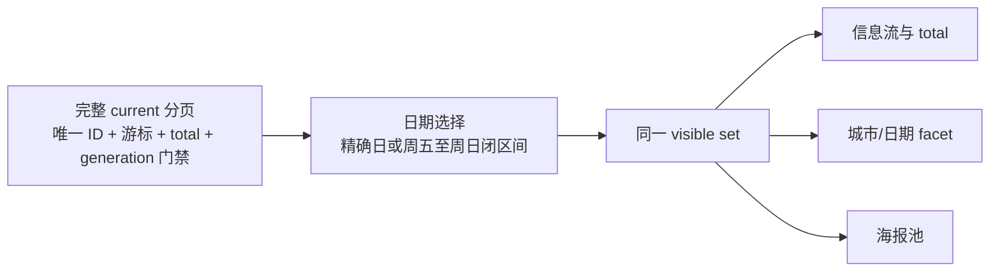

# HUAIDJ 小程序日期与城市计数加载故障根因（2026-07-19）

## 结论

线上版本 `2026.07.18.002` 出现的“本周末仍锁在周五”和“城市显示 131 条但列表只有 3 条”不是一个 UI 文案问题，而是旧前端状态、旧 API 查询能力和旧索引口径三处同时漂移：

1. 旧 staging 线把“本周末”实现为从日期列表中找到第一个周五，再写入单值 `selectedDate`。所以周五至周日范围在进入请求前已经退化为一个精确日期。
2. 旧 `/api/v1/weekly/cities` 返回整个 626 条 package 的历史城市索引，不接受当前窗口或日期窗口投影，也不返回可校验的 `filters`、`item_count` 或 generation 身份。
3. 旧 `/api/v1/weekly/current` 只识别精确 `date`，忽略 `dateStart/dateEnd`；旧缓存归一逻辑还曾把已缓存第一页的 `nextCursor` 清空，使大于一页的完整集合静默退化为少量首屏记录。

这三点叠加后，列表和城市数字来自完全不同的数据宇宙。单独修改显示数字、增加前端截断或只改“本周末”按钮都不能构成完整修复。

## 公网只读复现

核验时间：2026-07-19 CST。

公网基线：`https://weekly-api-255880-4-1371956557.sh.run.tcloudbase.com`。

| 查询 | 旧公网结果 |
|---|---:|
| manifest package item count | 626 |
| `current?scope=current` 唯一活动 | 64 |
| `current?scope=current&cityKey=shanghai` | 13 |
| `current?scope=current&cityKey=shanghai&date=2026-07-24` | 3 |
| `current?scope=current&cityKey=shanghai&dateStart=2026-07-24&dateEnd=2026-07-26` | 13 |
| `cities?scope=current&date=2026-07-24` 中上海 | 131 |
| `cities?scope=current&dateStart=2026-07-24&dateEnd=2026-07-26` 中上海 | 131 |

关键证据：

- 精确日期查询返回 3 条，与用户截图的信息流数量一致。
- 日期范围查询仍返回上海全部 13 条，证明旧 backend 忽略 `dateStart/dateEnd`。
- 两个 cities 日期查询都返回上海 131，且与无日期查询完全相同，证明它们读取的是 package-wide 静态索引。
- 旧 cities 响应没有 `filters`、`item_count`、`generation_id/sync_id/revision`，客户端无法证明它与列表同代、同窗口。

## 正确的统一投影

修复后的加载顺序是：

具体契约：

- `本周末` 在 Asia/Shanghai 业务日语义下保存 `dateMode=this_weekend`、`dateStart=Friday`、`dateEnd=Sunday`，`selectedDate` 必须为空。
- 07:00 前仍属于上一晚业务日；业务日、周末和 AI skill 使用同一份 date-key 算法，不依赖设备时区。
- 切换城市只改变 city key，不清空或折叠日期模式。
- 客户端先完整分页 current；重复 ID、游标不递增、游标循环、total 漂移、跨页 generation 漂移或达到页数上限都失败关闭。
- 城市 facet、日期 facet、列表、total 和海报池从同一 visible set 投影。
- 只有当 API facet 的 scope、item count、每个 bucket count 和 generation 全部与客户端 visible set 一致时才采信；旧响应或慢响应自动降级为本地同集合重算，不显示陈旧 131/85。
- CloudRun、CloudBase weeklyDataSync 和静态 fallback 共用同一日期相交实现；长日期区间用边界相交判断，不靠最多 64 天的枚举。
- 在线 generation 的完整分页缓存以事务方式写入；只有全部页校验完成后才切 current pointer。后台 live refresh 成功后也写同一可恢复缓存。

## 为什么不能把 2026.07.18.002 当作数据发布证据

小程序代码版本、CloudRun 活动数据、CloudBase 热 generation、微信开发版上传、提审和公开发布是独立状态。现有证据只能证明 7 月 18 日做过 backend 活动更新；没有证据把 `2026.07.18.002` 绑定到一份通过真实 DevTools 八场景测试的前端 commit。因此本轮必须重新形成：

1. 干净 Git commit 与不可变 release；
2. CloudRun/CloudBase 同代部署与公网读回；
3. 真实微信开发者工具八场景报告；
4. 独立的小程序开发版上传记录；
5. 若需要公开生效，再单独记录提审、审核和发布。

## 发布回归门

部署后用同一组查询复验：

- manifest/current/cities/dates 必须共享 generation；
- current 完整分页唯一数必须等于 total；
- 上海 07-24 的 city facet 必须等于上海 07-24 列表唯一数；
- 上海 07-24~26 的 city facet 必须等于该闭区间列表唯一数；
- 真实 DevTools 必须证明本周末不是精确日期、切换城市保留 Fri-Sun、facet count 等于渲染列表、缓存与在线刷新不跨代。

当前本文记录的是“已复现根因和候选修复契约”，不是 CloudRun 已部署、小程序已上传或微信公开版本已更新的声明。
