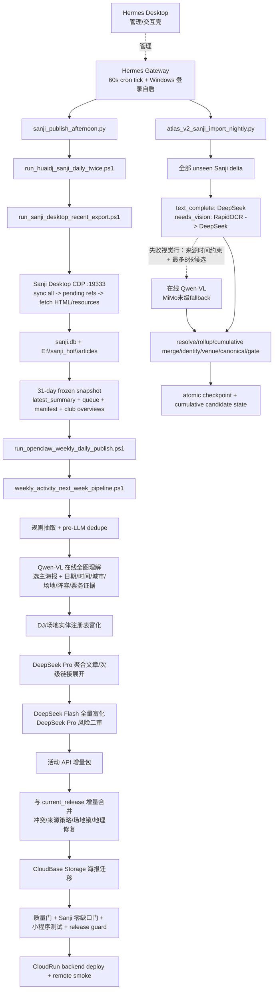

# HUAIDJ / Sanji / Qwen-VL / DeepSeek / AtlasV2 管线 SSOT

状态：当前权威理解；2026-07-17 水位保留为历史基线，2026-07-18 水位见第 13 节
核验时间：2026-07-18 CST
证据优先级：实际运行日志与产物 > 当前安装脚本 > 仓库入口脚本 > 历史文档与记忆

## 1. 结论

HUAIDJ 现在有两条共享 Sanji 数据源、但目的和模型路由不同的生产链：

1. **小程序活动包链**：Sanji Desktop 抓取公众号正文和原图，Qwen-VL 在线读取每篇推文的全部可用图片并选主海报、抽取活动证据，随后 DeepSeek Flash 全量富化、DeepSeek Pro 复核高风险条目，生成增量活动包，迁移海报到 CloudBase Storage，并可部署 CloudRun。
2. **AtlasV2 夜间导入链**：从 Sanji 导出相对 Atlas checkpoint 的全部未见文章；纯文本路由用 DeepSeek，视觉主路由用本地 RapidOCR 后把 OCR 文本交给 DeepSeek。只有仍失败的视觉行才把来源发布时间作为受约束上下文，并将 Stage1 高分候选海报扩到最多 8 张交给在线 Qwen-VL（MiMo 仅作末级 fallback）；随后再做实体解析、累计合并、身份/场地归一、事件 canonicalization 和门禁，并只在全链通过后原子推进 checkpoint/state。

因此：

- “Qwen-VL + DeepSeek”是**活动包与海报理解主线**。
- AtlasV2 最新夜间代码的 `needs_vision` 主路由是 `ocr_deepseek`，在线 Qwen-VL 是失败闭合的候选扩展路径；不能把它误写成活动包的全量 Qwen-VL 路由。
- Sanji 是 **Electron 桌面端**，HUAIDJ 通过本机 CDP/renderer IPC 控制同步与抓取；不是外部 RSS 爬虫，也不是截图/鼠标自动化。
- Hermes 的 Gateway 是单一 wall-clock 调度执行器：它每 60 秒 tick `jobs.json`；Hermes Desktop 是管理/交互壳，启动的 `hermes serve` 不能替代 Gateway。Hermes 的 `last_status=ok` 只证明 launcher 返回，不能代替子管线 summary、质量门和部署读回。

## 2. 当前机器上的权威路径

| 角色 | 路径 |
|---|---|
| 开发/发现仓库 | `F:\code\githubstar\wechathtmldownload`（可能 dirty，不是自动执行权威） |
| 不可变执行仓库 | 由 `HUAIDJ_REPO` 选择 `F:\DevData\HuaidjRuntime\releases\<commit>-pipeline-20260718`；当前精确 commit/path 以外部恢复 SSOT 和 `git rev-parse HEAD` 为准 |
| Hermes home | `F:\DevData\Hermes` |
| Hermes 现役 runtime | `F:\DevData\HermesRuntime\releases\c48d53413-official-recovery`（实际 HEAD `ba16a8246`） |
| Hermes Desktop 现役目标 | `F:\DevData\HermesRuntime\releases\c48d53413-official-recovery\apps\desktop\release\win-unpacked\Hermes.exe` |
| Hermes Desktop 灾后保全副本 | `F:\DevApps\HermesDesktop\win-unpacked`（只作来源/回滚证据，不冒充正式安装） |
| Hermes jobs | `F:\DevData\Hermes\cron\jobs.json` |
| Hermes HUAIDJ scripts | `F:\DevData\Hermes\scripts\huaidj` |
| Hermes Python | `F:\DevData\HermesRuntime\releases\c48d53413-official-recovery\venv\Scripts\python.exe` |
| Sanji Desktop | `F:\DevApps\Sanji\0.4.1\sanji.exe` |
| Sanji DB | `%APPDATA%\sanji\sanji.db` |
| Sanji 热文章正文/图片 | `E:\sanji_hot\articles` |
| Sanji 安全导出 marker | `E:\公众号\sanji-daily-export` |
| 活动包 longrun | `E:\weekly_activity_pipeline\longrun` |
| 计划任务报告/日志/锁 SSOT | `F:\DevData\HuaidjRuntime\state\reports`（可用 `HUAIDJ_REPORT_ROOT` 显式覆盖，但必须位于源码检出目录之外） |
| CloudRun current package | `F:\DevData\HuaidjRuntime\state\weekly_activity_cloudrun\data\current_release` |
| AtlasV2 run root | `E:\atlas_v2_import_runs` |
| AtlasV2 checkpoint | `E:\atlas_manifest_exports\sanji_pipeline_seen_tokens_latest.txt` |
| AtlasV2 cumulative state | `E:\atlas_v2_import_runs\latest_cumulative_candidate.json` |

禁止把旧用户、旧盘符当作运行时真相。历史日志中的 `C:\Users\pc` 和 `C:\code` 只说明当时环境；当前脚本必须从脚本位置或环境变量解析仓库、Hermes、Sanji 路径。

## 3. 全链路图

## 4. Sanji Desktop 上游

入口：`tools/stage7_rewrite/run_sanji_desktop_recent_export.ps1`

实际顺序：

1. 获取全局 mutex 和仓库 lock，禁止两个 export/sync/fetch 同时运行。
2. 确保 Sanji Desktop 已用 `--remote-debugging-port=19333` 启动；已有 Sanji 但没有 CDP 时硬失败，避免杀掉用户正在使用的实例。
3. 通过 `sanji_desktop_cdp_control.mjs` 对全部公众号执行 sync，默认 cutoff `96h`，最长 `30m`。
4. 若 renderer 报 `token_expired`，只自动执行一次 `resume-sync`。
5. 从 SQLite 构建最近未完成 fetch refs，默认最多 `300`；同时检查 DB 最新文章不超过 `36h`。
6. 对有缺口的 refs 先 `cancel-fetch`，再 `fetch --force`，等待文章正文和资源两个 phase 都结束。
7. 从稳定 SQLite snapshot 导出最近 `31d`：manifest、`latest_queue.jsonl`、`latest_summary.json`、`LATEST.txt`；正文截取上限 `8000` 字，但图片资产保留引用。
8. 导出 club overview JSON，并更新小程序 `data/club_overviews.js`。

这里的“全量追更”含义是：同步所有 131 个订阅账号、补齐最近时间窗内所有未抓正文/资源，并生成 31 天冻结快照。它不等于重抓 13.9 万历史文章。

2026-07-17 已核验的 Sanji 水位：

- 131 个账号；数据库文章总数 139,087。
- 此次同步新增 197 条。
- 7 月 13–17 日文章量分别为 60 / 51 / 48 / 49 / 42。
- 250 个 pending refs 中正文 247 成功；3 个验证码失败，另有 1 个隐私/不可用页面；资源 phase 247 完成，pending 归零。
- 31 天导出 `exported_rows=1662`，`raw_window_rows=1698`，`missing_html_file=0`，`unfetched=9`。

## 5. 活动包海报理解与 Qwen-VL

入口：`tools/stage7_rewrite/scripts/enrich_weekly_activity_pack_with_qwen_vl.py`

权威默认：

- `PosterExtractionMode=vl_direct_qwen`
- provider：`qwen3_vl`
- model：`qwen3.6-plus`
- fallback：`mimo` / `mimo-v2.5`
- `max_images=0`：读取每篇推文全部可用图片
- `limit=0`：处理窗口内全部候选
- concurrency：4
- 在线 DashScope OpenAI-compatible API；key 只从受保护的 Windows 运行时环境加载，不写入日志、文档或记忆。

图片选择规则：

- 来源是 Sanji 本地文章资产，格式 png/jpg/jpeg/webp，至少 15KB，按 HTML 出现顺序排序。
- 图片最长边缩到 1800 后以 data URL 发送。
- 必须检查每张图；选择一张“单一活动、信息完整、干净”的主海报。
- 拒绝二维码、菜单、地图、文章封面、人物照、月历和总览图冒充活动海报。
- 从全部图片与正文联合抽取：日期、时间、城市、场地、地址、阵容、风格、价格、票务、主海报索引、可见文字、证据和风险。
- 结果必须保留 `poster_selection_evidence`、visible line evidence 和来源证据，不能只留下模型结论。

增量/恢复规则：

- 已发布 source hash 只有在已发布包与当前候选都具备 lineup 和 poster evidence 时才可跳过；质量缺口必须重做。
- 每条 Qwen 结果写独立 evidence checkpoint，可显式 resume。
- Sanji source 默认禁止跨快照“隐式 resume”，避免旧 evidence 污染新的冻结快照。
- primary provider 必须成功，fallback 占比不得超过 20%，`failures>0` 即不通过。
- summary 必须记录调用数、tokens、人民币成本和 provider 分布。

2026-07-10～11 历史日志证据（当前成功水位见第 13 节）：

- 2026-07-10：355/355 成功，Qwen 调用 355，失败 0，无 fallback，约 958 万 tokens，¥21.311698。
- 2026-07-11：250/250 成功，162 条从 evidence 恢复，88 次新 API 调用，失败 0，¥4.726026。
- 截至 2026-07-11，当时最后一次完整 Qwen 后端成功发布是 `openclaw_weekly_daily_20260702_141534`；该历史结论已被 2026-07-18 的 `openclaw_weekly_daily_20260718_195817` 成功发布取代。
- `openclaw_weekly_daily_20260711_230659` 的 Qwen 阶段成功；最终被 1 条 `non_target_activity_hiphop` 质量门拦下，并非 Qwen 失败。

## 6. DeepSeek 富化

活动包有两个 DeepSeek 使用点：

1. 聚合/总览文章展开：`deepseek-v4-pro`，从父文章和次级链接抽取独立子活动；窗口内子活动进入发布候选，未来子活动可缓存。
2. 最终富化：每个候选都走 `deepseek-v4-flash`；聚合子活动、正文/图片冲突、日期/场地冲突、阵容证据弱或图片重文本弱的候选再走 `deepseek-v4-pro` 二审。

约束：

- non-thinking JSON 输出。
- 只允许改写有正文/图片/注册表证据支持的字段。
- 不允许凭空生成 DJ bio、活动建议或来源。
- 使用 content-keyed cache；并发执行但最终按输入顺序重写。
- 默认重试 2 次并指数退避。

日志证据：

- 2026-07-10：341 入 / 341 出，Flash 341、Pro 189、失败 0。
- 2026-07-11：284 入 / 284 出，Flash 284、Pro 130、失败 0；cache hit 413、miss 1。

## 7. 活动包完整阶段

入口：`tools/stage7_rewrite/weekly_activity_next_week_pipeline.ps1`

1. 使用冻结 Sanji queue。
2. 构建文章 source queue；文章缓存范围默认是活动窗口前后各 31 天。
3. 规则抽取初始 pack。
4. pre-LLM 去重。
5. Qwen-VL 全图海报/正文图像理解。
6. DJ dataset / artist registry 实体富化。
7. DeepSeek Pro 聚合文章展开。
8. 发布窗口过滤。
9. pre-DeepSeek 去重。
10. DeepSeek Flash/Pro 富化。
11. 构建小程序 API JSON。
12. 聚合子活动 source link 修复。
13. 重复/冲突修复、lineup/address/time 修复、confirmed venue lock、严格审计。
14. source-grounded materialization。
15. stage release。

当前代码风险：`build_weekly_activity_queue.py`、`build_weekly_activity_pack_from_exporter_queue.py` 等若 active 目录缺失会回退 `scripts/archive_old`。这只是兼容兜底，不应作为长期依赖；固化时应把实际使用版本恢复到 active 并纳入测试。

## 8. 增量包、海报存储与发布边界

外层入口：`tools/stage7_rewrite/run_openclaw_weekly_daily_publish.ps1`

1. 冻结 `latest_queue/latest_summary`，避免 Sanji marker 在运行中变化。
2. 构建当日 candidate API。
3. 与 `services/weekly_activity_cloudrun/data/current_release` 增量合并；base 不能低于历史基线，merge 不能无解释缩水。
4. 再次执行来源策略、冲突、字段、场地锁、地理编码和来源 URL 审计。
5. 把公网/微信图片迁入 CloudBase Storage，包内只保留合法 `cloud://` fileId；这不是 CloudBase DB 写入。
6. 质量门要求：内部海报完整、无公网微信海报、无 runtime 临时 URL、无主海报待复核、无缺 geo、无非目标活动、窗口正确、manifest/current 一致。
7. Sanji coverage gate 要求当前窗口所有 event-like source 行都有发布 item 或可审计 disposition，`max_missing=0`。
8. 运行活动范围的小程序测试和 release guard。
9. `-DeployBackend` 才 bake/deploy CloudRun，并执行远程 smoke 和分页总数对账。
10. `-UploadFrontend` 是独立权限；正常后端更新不上传小程序代码、不提交审核、不公开发布。

小程序活动加载边界（2026-07-18 核验）：

- 常态数据路径是线上 `/api/v1/weekly/*`；成功响应写入微信本地存储，普通缓存窗口为 6 小时。
- 线上全部失败时，优先读取对应请求最近一次成功的持久化响应；只有设备从未保存过成功响应时，才使用 `utils/offlineSnapshot.js` 静态灾备种子。
- 静态种子不是活动增量包、不是新鲜度真相，也不要求覆盖当前自然日。fallback 测试必须固定到种子自身日期窗口，不能随墙钟失效。
- 普通 `bake_and_deploy.py` 不得包含生成或刷新静态种子的入口。种子维护是独立前端变更，必须单独运行生成器并传入 `--confirm-disaster-seed-update`，随后再独立决定开发版上传、审核和公开发布。
- 详细策略：`docs/MINIPROGRAM_ACTIVITY_LOADING_POLICY_20260718.md`。

2026-07-11 Qwen 路线失败根因：最终 471 条包中有 1 条 `DJ CHOPKO` 嘻哈活动；海报 471 条全部已内部化，CloudBase Storage 已写，CloudRun 因质量门未部署。来源策略修复必须在 merge 后且质量门前保持可重复执行。

## 9. AtlasV2 夜间导入

入口：

- Hermes：`F:\DevData\Hermes\scripts\huaidj\atlas_v2_sanji_import_nightly.py`
- 仓库：`tools/atlas_rebuild/run_atlas_v2_sanji_import.py`

当前顺序：

1. 从 Sanji DB 和 `E:\sanji_hot\articles` 导出 checkpoint 之后全部 unseen token。
2. Stage0 ingest manifest。
3. Stage1 clean、文章类型分类和海报候选选择。
4. `text_complete` 用 DeepSeek。
5. `needs_vision` 用 RapidOCR 本地读海报，然后把 OCR 文本交给 DeepSeek；不把图片发给 DeepSeek。
6. Stage2 completion gate，任何未完成/失败路由都不得推进状态。
7. Stage3 resolve + Stage4 rollup。
8. merge 到上一份 cumulative candidate base。
9. DJ identity redirect、venue redirect、日期/场地修复候选。
10. canonical event candidates、确定性弱 key 裁决、DeepSeek LLM 弱 key 裁决、重建。
11. materialize canonical serving candidate 并严格 gate。
12. 仅在全部成功时原子替换 checkpoint，并更新 `latest_cumulative_candidate.json`。

它默认是 **candidate promotion**，不是生产数据库替换，也不重启服务。要宣称“AtlasV2 已导入”，至少必须看到：

- `run_summary.status=ok`
- `canonical_gate.pass=true`
- checkpoint 数量增加且 hash 与 state 一致
- `latest_cumulative_candidate.json` 指向本次 candidate DB
- candidate SQLite `PRAGMA quick_check=ok`，canonical/raw 映射和 dangling checks 全过

历史失败证据：2026-07-17 新 delta 导出曾看到 271 篇、5,230 个资产；由于运行时 RapidOCR 依赖缺失，第一次视觉路由未完成，checkpoint 保持 138,692，没有误推进。该恢复中间态已由第 12、13 节记录的后续干净重跑与成功 promotion 取代，不得再把它当成当前待执行状态。

## 10. Hermes Desktop、Gateway 与定时计划

2026-07-15 的统一暂停已在 2026-07-18 全量验收后解除。当前有九个 HUAIDJ canonical jobs active、两个旧 Friday HUAIDJ jobs paused，另有两个与本管线无关的天气任务 disabled；不得从历史暂停记录推断当前状态，也不得手工再造第二套 Windows/Codex 执行器。

Windows 运行边界：

- Desktop 正式构建必须位于受管源码树的 `apps\desktop\release\win-unpacked`，这样 `hermes update` 重建和原位 relaunch 才不会发生 GUI/backend 漂移。
- `F:\DevApps\HermesDesktop` 是 2026-07-15 灾后保全出来的可运行副本；直接给它建快捷方式会让后续 updater 在另一目录重建，属于双权威，禁止作为长期安装。
- Desktop 首启会拉起 `hermes serve` 供本地 UI 使用，但不会替代长期 Gateway。
- 调度常驻应执行 `hermes gateway install --start-now --start-on-login`。当前唯一 owner 是 `Hermes_Gateway` ONLOGON Scheduled Task，并以 `pythonw.exe` 无窗口启动；Scheduled Task 正常时 Startup folder fallback 必须移除或放入可恢复备份，避免双 Gateway。
- 恢复后必须同时验证：Desktop 可启动且解析到当前 `HERMES_HOME`、Gateway `status=running`、`cron status` 有活跃任务且 heartbeat 新鲜。

目标常态计划：

| Job | 计划 | 作用 |
|---|---|---|
| Sanji RSS Fast Watch | `*/30 8-23 * * *` | detect-only，不跑付费全量 |
| Sanji 主发布 | 周三 21:10 | Sanji + Qwen-VL + DeepSeek + 活动增量包 + 后端 |
| Coverage audit | 周三 22:40 | 发布后覆盖率审计 |
| Sanji 增量修正 | 周五 20:10 | 周末前增量修正 |
| Coverage audit | 周五 21:40 | 周五发布后审计 |
| Health check | 每 60 分钟 | API/数据/新鲜度/基础设施，健康静默 |
| Package/API monitor | 每 30 分钟 | 活动包与线上 API 状态，状态不变静默 |
| AtlasV2 import | 每日 23:40 | 全部 unseen delta -> gated cumulative candidate |
| Login reminder | 每 2880 分钟 | Sanji 登录/新鲜度提醒 |

旧 Fri 16:10/17:40 保持禁用。所有 active jobs 应满足：

- `no_agent=true`
- `wrap_response=false`
- workdir 指向当前 F 盘仓库（或脚本不依赖 workdir）
- launcher 写 bootstrap log，子进程写最终 status/summary
- 不能只依据 detached PID 或 Hermes `last_status` 判成功
- 所有计划任务的 report/log/status/lock 必须写入 `HUAIDJ_REPORT_ROOT`；不可变发布检出目录只读，Python 子进程固定 `PYTHONDONTWRITEBYTECODE=1`，禁止生成 `__pycache__`

## 11. 成功门与“完成”的定义

一次全量维护只有同时满足下列条件才完成：

1. Sanji DB 最新时间和近几日逐日数量合理；sync/fetch/resource phase 无 pending。
2. 31 天冻结导出 `ok=true`、manifest/queue/html 全存在。
3. Qwen-VL `processed=enriched`、failures 0、primary provider gate 通过、全图模式 `max_images=0`。
4. DeepSeek input/output 相等、failures 0；风险二审有可追溯统计。
5. candidate API、增量 merge、来源策略、质量门和 Sanji gap 全通过。
6. CloudBase 海报为内部 fileId；CloudRun deploy 和 remote smoke 成功；本地与线上 ID 集合/分页总数一致。
7. AtlasV2 run status/canonical gate/checkpoint/state/SQLite quick_check 全部一致。
8. Hermes contract audit 通过后才恢复 schedule，并用一次手工或 cron canary 验证 launcher 与子管线闭环。

## 12. 2026-07-17 恢复完成水位

活动包全量运行：

1. Sanji Desktop 完成 131 个账号的 96 小时全量刷新；数据库 139,089 篇，冻结导出 1,665 行，原始窗口 1,698 行，HTML 缺口 0。
2. Qwen-VL 对 309/309 条候选执行全图在线理解，失败 0、MiMo fallback 0；`qwen3.6-plus` 主路由门通过，累计 7,536,023 tokens，计费约 ¥16.93。
3. DeepSeek 候选 301、输出 301、失败 0；Flash 301，Pro 170。与既有包增量合并后最终 current package 为 604 条。
4. 147/147 张公共海报迁移到 CloudBase Storage；公开微信/Qpic URL、无效 ID、缺失 geo、窗口外记录均为 0。
5. Sanji 严格 gap 门为 candidate event-like 147、missing 0。政策过滤和跨源冲突通过不可变 disposition/repair history 记账，没有放宽门槛。
6. CloudRun 服务测试 138/138 通过，部署 `weekly-api-122`；远程 health/current/manifest/分页 ID 对账通过，线上 `item_count=604`。

AtlasV2 全量导入：

1. `run_20260717_174629` 导出 276 篇、5,290 个资源；272 条可处理记录全部提取成功。
2. 两条海报行先揭示选图缺陷：文章来源时间仅用于解释“今晚”等显式相对词，普通行不得把发布时间冒充活动日期；失败行再扩到最多 8 张高分候选交给 Qwen-VL。JETSKI 最终从 `#7` 海报取得 `2026-07-31 20:00`，置信度 0.95。
3. 弱键决策库兼容 19 列扩展 schema，写入改为显式列名；夜间子进程统一 UTF-8，Windows GBK 不再截断成功运行。
4. 最终 candidate 为 `canonical_serving_candidate.sqlite`，约 2.55 GB；`quick_check=ok`，canonical events 203,428，所有 canonical dangling 引用为 0。
5. Atlas checkpoint 从 138,692 原子推进到 138,968，SHA-256 为 `0352b45ac4ecf8624b19df34f350a38468beb82eb8eec5ee9c11cefc3cce8c82`；cumulative state 与本次 run 一致。

运行环境与调度：

1. Hermes Desktop 已恢复到受管路径并实际启动；Gateway 使用 Windows 登录项常驻，Telegram 与 cron ticker 可读。
2. 9 个 canonical jobs 已启用，workdir 全部指向当前 F 盘仓库；旧 Fri 16:10/17:40 继续禁用。
3. 契约审计结果 `ok=true, failures=0, warnings=0`。RSS 快监固定 `DetectOnly`，其仓库根目录从 `$PSScriptRoot` 解析并强制使用 PowerShell 7，避免旧 C 盘和 Unicode 回归。
4. 小程序后端增量包和 CloudRun 已更新；开发者代码上传、微信审核、公开发布未执行，仍是独立授权边界。

## 13. 2026-07-18 全量恢复水位

代码与运行：

1. 完整修复线已推送到 GitHub 分支 `codex/huaidj-pipeline-recovery-20260718`；数据与调度代码的已验证基线为 `818ba0c4283c9405f3d824c5db050795d0193335`，后续只允许文档/证据提交或重新通过同等级测试的代码提交成为新 runtime。该基线在前序 schema、Qwen/Atlas fail-closed、事务发布、DJ 门、club overviews、geo、source-mode readiness 和稳定事件身份修复上，增加了 Fast Watch 空默认值兼容、Hermes status launcher GBK/Unicode 安全输出，以及旧 launcher 自动升级契约。
2. Stage7 为 364 passed + 6 subtests；CloudRun 为 117/117；`better-sqlite3` 真实内存库 canary 通过。原 dirty worktree 未被覆盖，常态调度只指向不可变 release。

活动包全量运行 `openclaw_weekly_daily_20260718_195817`：

1. Sanji 31 天冻结导出 1,635 行、原始窗口 1,667 行；缺失 HTML 0。
2. 在线 Qwen-VL 全图处理 297/297：`qwen3.6-plus` 296、MiMo fallback 1、失败 0，共 7,232,153 tokens。
3. DeepSeek 250/250、失败 0：Flash 250、Pro 138；生产 DJ profile keys 2,711。
4. 最终包 626 条；CloudBase Storage 海报迁移 111/111、patched occurrences 516；missing internal poster、public poster URL、missing geo、non-target、source/duplicate/gap 均为 0。
5. 事务状态 `promoted`；CloudRun `weekly-api-123` 100% 流量。线上分页 626/626，ID digest `101296eee0840ce6563d7275fb0ebba38376dab0f253ba254b6c20cea848924b`；club overviews 11 clubs/13 overviews，digest `e27a304edc2a84bd9045c913afdcbae41b0bb76f81a6968e1eedbb8605948373`。
6. 小程序保持 online-first：在线 API -> 最近成功持久化缓存 -> 仅首次全断网时 static seed。本轮没有上传小程序代码、提交审核或公开发布版本；活动数据更新不等于产生新的小程序版本号。

AtlasV2：

1. `run_20260718_200513_post_weekly` status `ok`，34/34 视觉记录完成，canonical gate pass。
2. checkpoint 从 138,978 推进到 139,014，SHA-256 `3e5048132fcd60589f95a8613c22bf6af77738db0fec5b82e97550210ebaefe6`；pointer 与 live 文件精确一致。
3. candidate `canonical_serving_candidate.sqlite` 的 `PRAGMA quick_check=ok`，canonical events 258,924、profiles 54,312、members 512,461、DJ-event relations 751,469。这里只推进 cumulative candidate/checkpoint，没有替换另一个公开生产库或重启服务。

Hermes：

1. `Hermes_Gateway` task Running，`gateway status --deep --full` 6/6，Telegram connected，cron heartbeat 新鲜。
2. 九个 canonical jobs active、两个旧 Friday jobs paused；workdir 统一指向不可变 release，contract audit 208/208。Fast Watch、health、package monitor 直接 canary 均 exit 0。20:30 Fast Watch 曾由与最终代码相同的 `818ba0c` runtime 自动执行成功；`0cf5794` 安装器和契约审计完成后，Package/API Monitor 又于 20:45:47 由 Gateway 自动触发并写回 `last_status=ok`，这是最终 `0cf5794` runtime 的明确自动计划证明。Atlas job 仍显示 7 月 17 日的历史失败状态；本轮只证明同一 launcher 的手工全链 canary 成功，下一次自动成功需在 23:40 运行后另行读回。
3. 旧启动时约 110 秒的 PID/lock/state 假阴性来自慢初始化前未认领生命周期，不是持续 HOME 漂移。现役已稳定。GitHub main `7fd419e5` 已在独立目录与本地 supervisor 合并为候选 `6fa21c6a`；early identity claim、统一失败清理、外层 lifecycle 唯一 claim 所有权和 Windows/VBS 状态门禁经独立复审无 blocker，Python gate 为 163/163。但 Electron 依赖下载受 TLS 握手中断，JS/typecheck/pack 和独立 Desktop UAT 尚未完成。候选没有 push、stage 或切换，现役仍是 `c48d53413-official-recovery`；不得把“Python 候选通过”写成“最新版 Desktop 已安装”。

外部恢复证据与日常 runbook：

`C:\Users\win\Documents\Codex\2026-07-17\xian\outputs\HUAIDJ_PIPELINE_RECOVERY_20260718.md`

## 14. 维护规则

- 新结论必须带来源：代码路径、run id、summary/gate 路径或数据库读回。
- 历史 run 只能解释历史，不得覆盖当前用户确认的架构策略。
- 不读取或记录 API key、cookie、token、微信/Sanji 凭证表。
- 不用截图、视觉点击、模拟键鼠控制 Sanji。
- 不把活动包 CloudBase Storage 写入、CloudRun 部署、小程序代码上传、审核、公开发布、Atlas candidate promotion 混成一个状态。
- 任何 checkpoint/pointer 只在完整门禁通过后推进；失败 run 必须保持旧水位可重放。
- 生产代码、只读 fixture/历史证据和运行期状态必须分离：不要批量改写历史报告引用，但任何 active/default output 都不得落回 Git checkout。
