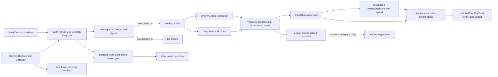

# HUAIDJ Weekly 全管线恢复与常态运行（2026-07-19）

## 状态、目标与安全边界

- 状态：`RECOVERY / OPERATIONS SSOT`，描述 2026-07-19 代码线的目标拓扑和恢复顺序。
- 目标：恢复 Sanji 桌面抓取、QwenVL 海报理解、DeepSeek 富化、活动包、CloudRun、CloudBase、小程序、AtlasV2 和 Hermes 定时计划，并让任何缺口都可见、可阻断、可续跑。
- 本文件不证明某次线上发布已经完成。运行状态必须由当次报告、公网读回、微信上传/审核记录和 Hermes 审计共同证明。
- 不从脏源树直接长期运行。先形成可复现提交，再以不可变发布目录作为 `HUAIDJ_REPO`。
- 不打印 API key、Cookie、微信凭证、GitHub 凭证或 Hermes 消息配置；凭证只由既有环境/注册表/受管配置读取。

配套可见性契约：`docs/MINIPROGRAM_ACTIVITY_VISIBILITY_CONTRACT_20260719.md`。

## 1. 目标拓扑



## 2. 运行时 SSOT

一个调度任务只能使用一组不可拆分的运行时身份：

| 字段 | 作用 |
| --- | --- |
| `HUAIDJ_REPO` | 不可变发布目录；脚本、测试和 launcher 的唯一代码权威。 |
| `HUAIDJ_PYTHON` | 该发布验证过的 Python 解释器。 |
| `HUAIDJ_REPORT_ROOT` | 发布目录之外的持久报告根，允许跨版本保留证据。 |
| `SANJI_EXPORT_OUT_ROOT` | Sanji 导出与 `latest_summary.json` 的持久状态根。 |
| CloudRun data/work root | 活动包候选和部署 staging；不得反向污染代码树。 |

恢复时先检查 Git 状态并保留用户未提交内容。推荐流程：

1. 从已验证基线建立干净集成工作树。
2. 运行全套测试和 secret 扫描。
3. 提交并推送恢复分支。
4. 从提交创建只读/不可变发布目录。
5. 仅从该目录运行一次全量和安装 Hermes jobs。

旧备份、旧任务中的绝对路径、运行进程继承的环境变量都只是发现证据，不能覆盖当前发布 SSOT。

当前灾后临时网络出口是本机 FlClash `http://127.0.0.1:7890`。Git、依赖下载和模型/API 网络步骤可按进程设置 `HTTP_PROXY`/`HTTPS_PROXY`，但不得因此改写旧网络 SSOT；待软路由恢复后再单独调整。微信上传脚本会主动清空代理变量，必须按脚本真实行为验证微信 CLI，而不能假设它继承 FlClash。

## 3. 恢复顺序

### 3.1 Sanji Desktop 先补齐 744 小时

入口：`tools/stage7_rewrite/run_sanji_desktop_recent_export.ps1`。

默认 `SanjiRefreshCutoffHours=744`，即 31 天。该步骤必须真实调用 Sanji 桌面渲染/抓取路径，然后从本地数据库快照导出；直接拉 RSS 或只读旧 SQLite 都不满足契约。

最低成功证据：

- `sanji_desktop_refresh_invoked=true`
- `sanji_db_snapshot_export=true`
- 快照数据库实际存在
- `latest_summary.json` 新鲜度在允许窗口内
- 刷新摘要覆盖至少约 744 小时
- post-fetch unresolved ledger 存在、格式受限、行数与摘要一致、SHA-256 一致
- `unresolved_missing_html=0`

全量恢复时先独立执行导出；随后主发布可用 `-SkipSanjiExport`，但该开关不会绕过验证，仍会检查刚生成摘要、窗口、ledger 和哈希。

### 3.2 missing HTML 必须 fail-closed

Sanji→Atlas 导出器 `tools/atlas_rebuild/export_sanji_appdata_manifest.py` 对所有未见条目扫描 missing HTML，不得因本轮 article limit 提前停止。它原子写入：

- `missing_html_dispositions.jsonl`
- `missing_html_digest.json`
- ledger SHA-256、总数、未解决数和 disposition 分布

仅两种 disposition 合法：需要重试的 `unresolved_retry_required`，以及在明确历史截止线前的 `ignored_historical_before_cutoff`。ledger 只含脱敏标识/处置字段，不得泄露正文、标题、URL、账号 ID 或路径。

`tools/atlas_rebuild/run_atlas_v2_sanji_import.py` 在任何 OCR、DeepSeek、QwenVL 或 Atlas 写入前校验 schema、路径、哈希、行数和计数：

- 未解决数大于零或契约无效：状态 `blocked_unseen_missing_html`，退出失败。
- `article_count=0` 且未解决数为零：才允许 `noop_no_new_articles`。
- “没有可导文章但仍有 missing HTML”不是 noop，必须阻断。

### 3.3 全量 QwenVL + DeepSeek 发布

主入口：`tools/stage7_rewrite/run_huaidj_sanji_daily_twice.ps1`，它调用维护中的 `run_openclaw_weekly_daily_publish.ps1`，再进入活动包管线。

当前默认模型/并发契约：

- `PosterExtractionMode=vl_direct_qwen`
- `PosterVlProvider=qwen3_vl`
- `PosterVlModel=qwen3.6-plus`
- `PosterVlFallback=mimo`
- `PosterVlMaxImages=0`、`PosterVlLimit=0` 表示不人为截断全量候选
- `PosterVlConcurrency=4`
- `DeepSeekConcurrency=4`

QwenVL负责海报直接理解及标题、日期、时间、场地、阵容等视觉证据；DeepSeek负责文本富化与结构化补全。模型输出不能绕过来源、日期、内部海报、最小条数和发布质量门。任何调用失败数、回退数和未解决数都必须进入 run summary。

示例恢复命令（凭证由环境提供，不写入命令行）：

```powershell
pwsh -NoProfile -ExecutionPolicy Bypass -File `
  tools\stage7_rewrite\run_sanji_desktop_recent_export.ps1 `
  -SanjiRefreshCutoffHours 744

pwsh -NoProfile -ExecutionPolicy Bypass -File `
  tools\stage7_rewrite\run_huaidj_sanji_daily_twice.ps1 `
  -Slot manual -SkipSanjiExport `
  -PosterExtractionMode vl_direct_qwen `
  -PosterVlMaxImages 0 -PosterVlLimit 0 `
  -PosterVlProvider qwen3_vl -PosterVlModel qwen3.6-plus `
  -PosterVlConcurrency 4 -DeepSeekConcurrency 4
```

先不传任何部署/写入开关生成并验证候选；此阶段不得隐式写 CloudBase Storage。通过质量门后，再在同一不可变发布上显式使用 `-DeployBackend -EnablePosterCloudBaseMigration`。`-UploadFrontend` 是独立外部动作，不应为更新活动数据而默认触发。

### 3.4 活动包与投影门

包生成后必须验证：

- manifest、items、city/date index 属于同一个 publish package。
- 静态索引明确标记 `scope=package`。
- 默认 API 明确标记 `scope=current`。
- `current` 与 `package` 的数量差异可以由历史活动解释，不是静默丢失。
- 活动 ID 稳定，不以包名生成，避免每次发布在 Atlas 产生重复事件。
- 海报字段、来源证据、日期区间和城市键保留。
- 分页读取可超过 100 条；最终 `nextCursor` 与 `total` 一致。

不得通过改写小程序的 `offlineSnapshot.js` 发布活动增量。它是固定灾备种子；在线活动包由后端/CloudBase 独立发布。

### 3.5 CloudRun 部署与 CloudBase 同步

顺序固定：

1. 以候选数据运行 CloudRun 全套测试和本地 smoke。
2. 部署新的 CloudRun revision。
3. 公网读 `/manifest`、`/current`、`/cities`、`/dates`；同时抽查 `scope=current`、`scope=package`、某城市和一个周末区间。
4. 调用 `weeklyDataSync` 把 CloudRun 全分页 current 写入 CloudBase。
5. 保存 `syncId`，再从 CloudBase 读回同一总数、`generatedAt`、城市数字和日期窗口。

同步入口：

- `apps/weekly_activity_miniprogram/scripts/sync_cloudbase_database.cjs`
- `apps/weekly_activity_miniprogram/scripts/run_cloudbase_hot_sync_admin.cjs`

CloudRun 健康不证明 CloudBase 已同步；`weeklyDataSync` 返回成功也不证明公网 CloudRun 已部署。两边各自保留证据。

### 3.6 本地测试与真实微信开发者工具门

代码级最低门：

```powershell
npm run test:miniprogram
npm run test:cloudrun
```

涉及 Atlas/Sanji/Hermes 的 Python 测试还应覆盖：

- missing HTML ledger/digest fail-closed
- Atlas activity source sidecar merge
- 当前 sidecar drift 审计
- Hermes launcher repo SSOT

真实渲染必须使用当前机器微信开发者工具 CLI，而不是伪造 automator fixture。当前发现路径与隔离 profile：

```powershell
$env:MINIPROGRAM_DEVTOOLS_CLI = 'F:\DevApps\WeChatDevTools\2.01.2510290\cli.bat'
$env:USERPROFILE = 'F:\DevData\WeChatDevTools\Profile'
$env:LOCALAPPDATA = 'F:\DevData\WeChatDevTools\Profile\AppData\Local'
$env:APPDATA = 'F:\DevData\WeChatDevTools\Profile\AppData\Roaming'
```

至少运行 `devtools-current-package-rendered.cjs` 和 `devtools-loading-fallback.cjs`，并验证周末三日、城市数字、城市切换保留日期、海报归属、完整分页、无运行时异常。正式证据不得混入测试 fixture 数据。

### 3.7 小程序上传不是活动数据发布

只有前端代码、配置或稳定静态 UI 资源变化才需要新小程序开发版本。活动增量正常通过在线管线生效。

正式上传默认走 `apps/weekly_activity_miniprogram/scripts/upload_devtools_cli_windows.ps1`，使用已安装、已登录的真实微信开发者工具 CLI，同时保留干净 staging、包边界和灾备种子哈希门。`upload_native_windows.ps1` 只有在固定版本 `miniprogram-ci` 和私钥均已验证时才作为备用。上传必须记录：

- 版本号与描述
- 工具/基础库版本
- CLI 退出码
- `upload-info.json`
- 对应 Git commit 和 CloudRun/CloudBase 数据身份

开发版本上传成功之后仍需单独证明提审、审核通过和公开发布。

### 3.8 AtlasV2：只写活动来源命名空间

Sanji 文章导入和活动包 sidecar 是两条相邻但不同的 Atlas lane。`run_atlas_v2_sanji_import.py` 先按 missing HTML、OCR/DeepSeek、QwenVL fallback 及候选验证契约处理文章；活动包随后通过 `build_atlas_activity_source_sidecar.py` 生成稳定事件和证据 sidecar，再由 `merge_atlas_activity_sidecar_into_candidate_db.py` 合并到派生候选数据库的：

- `atlas_activity_events`
- `atlas_activity_evidence_refs`
- activity import watermark / build metadata

合并约束：

- 基于 SQLite backup 生成 `.building`/派生副本，不原地改源数据库。
- 只写 allowlist 表和 metadata key；保护主 `articles`、`entities`、`events` 等表。
- 使用自然证据键去重并保留累计历史；当前 sidecar 只要求是累计候选的子集，不得把历史缺失误判为需要删除。
- 保存输入哈希、import ID、watermark、受保护表前后计数和数据库哈希。
- `PRAGMA quick_check=ok` 后才原子替换候选文件。

当前活动合并的强制状态是：

```text
projection_status = source_namespace_only
canonical_projection_updated = false
```

因此本次活动合并只证明活动源命名空间已经导入派生 Atlas 候选；不得因该结果推进 `latest_cumulative_candidate.json` 或任何 serving/public pointer，不得宣称搜索、图谱、canonical serving 已更新。即使相邻的 Sanji 文章 import lane 产出了自己的候选，两条 lane 的证据也不能互相替代。只有独立的 serving materialization、验证和显式 promotion gate 全部通过后，才允许变更指针。

### 3.9 Hermes Desktop/Gateway 与 launcher SSOT

Hermes Desktop UI 和 Gateway 是不同进程；界面存在不证明 Gateway 正在消费新 jobs，Gateway 健康也不证明 launcher 指向当前发布。

安装入口：`tools/stage7_rewrite/scripts/install_huaidj_sanji_hermes_jobs.py`。默认 dry-run，只有显式 `--apply` 才写 launcher/jobs。每个 launcher 必须包含 `HUAIDJ_LAUNCHER_SCHEMA=huaidj_launcher_runtime_ssot.v1` 和安装时冻结的 repo/python/report-root 三元组。

解析优先级：

1. 只有 HKCU `HUAIDJ_REPO` 与 installer-rendered repo 完全一致时，才整组采用 HKCU tuple。
2. 否则采用与 installer repo 一致且验证通过的 Hermes job `workdir`。
3. 再否则使用 installer-rendered defaults。

禁止从旧 Gateway 进程继承一个陈旧 `HUAIDJ_REPO`，同时拼接新 Python 或新 report root。launcher 默认 repo、job workdir、installer repo 必须三方相等；安装器以完整渲染内容/哈希判断更新，不能只检查几个 token。

安装后运行只读审计：

```powershell
python tools\stage7_rewrite\scripts\install_huaidj_sanji_hermes_jobs.py
python tools\stage7_rewrite\scripts\install_huaidj_sanji_hermes_jobs.py --apply
python tools\stage7_rewrite\scripts\audit_huaidj_sanji_hermes_contract.py --json-out <report.json>
```

审计必须证明每个规范 job 只有一个 active owner、重复项已暂停、schedule/script/workdir/delivery 正确、launcher 内容与安装器一致、Gateway 主启动项存在。不要在业务运行窗口中仅为“刷新环境变量”盲目重启；先安装、审计，再选择安静窗口切换，并用一次真实 job 终态证明恢复。

## 4. 常态计划

规范计划由安装脚本和审计脚本共同定义，当前包括：

| Job | Schedule | 责任 |
| --- | --- | --- |
| `HUAIDJ Sanji RSS Fast Watch` | `*/30 8-23 * * *` | 白天快速发现增量。 |
| `HUAIDJ Sanji Wed 21:10` | `10 21 * * 3` | 周中完整活动发布。 |
| `HUAIDJ Coverage Audit Wed 22:40` | `40 22 * * 3` | 周中覆盖审计。 |
| `HUAIDJ Sanji Fri 20:10` | `10 20 * * 5` | 周末前完整活动发布。 |
| `HUAIDJ Coverage Audit Fri 21:40` | `40 21 * * 5` | 周末前覆盖审计。 |
| `HUAIDJ Atlas v2 Sanji Import Nightly` | `40 23 * * *` | 夜间 Atlas 增量；missing HTML 失败关闭。 |
| `HUAIDJ 全栈健康检查` | `every 60m` | 运行时和数据新鲜度。 |
| `HUAIDJ 活动包/API TG Monitor` | `every 30m` | 包/API/同步状态监控。 |
| `HUAIDJ Sanji 登录授权提醒` | `every 2880m` | 桌面登录授权提醒。 |

旧 Noon/Evening 和 Friday 16:10/17:40 jobs 必须保持暂停，避免双重 owner、并发包写入和重复模型费用。

## 5. 失败关闭与续跑表

| 失败 | 必须状态 | 允许的续跑点 | 禁止动作 |
| --- | --- | --- | --- |
| Sanji 744h 未覆盖 | failed | 重做 Desktop refresh/export | 用旧 summary 继续 |
| missing HTML 未解决 | `blocked_unseen_missing_html` | 修复抓取后重做 manifest | 当成 noop、先调用付费模型 |
| QwenVL/DeepSeek 有未解决失败 | release not ready | 保留候选和日志后重试失败项/全量 | 发布半成品 |
| 包/索引 scope 不一致 | release not ready | 重建包与统一投影 | 调小 UI 数字掩盖 |
| CloudRun 已部署、CloudBase 不一致 | degraded/blocked | 对同一 revision 重做 sync/readback | 上传前端制造“更新”假象 |
| DevTools fixture 污染 | invalid evidence | 清理测试覆盖并跑真实 CLI | 把 fixture 报告作为正式证明 |
| Atlas activity merge 完成 | `source_namespace_only` | 独立 serving materialization gate | 推进 serving pointer |
| Hermes repo 三方不一致 | audit failed | 从不可变发布重装 launcher/jobs | 依赖旧进程环境继续跑 |

## 6. 每次运行的证据包

每次全量或定时运行至少保存：

1. Git commit、不可变发布路径、Python 路径和非敏感配置摘要。
2. Sanji refresh/export summary、快照身份、744h 覆盖、missing HTML ledger digest。
3. QwenVL 与 DeepSeek processed/enriched/failure/fallback 计数。
4. 活动包 manifest、验证结果、`current`/`package` 数量及差异解释。
5. CloudRun revision、公网 smoke 和完整分页总数。
6. CloudBase `syncId`、`generatedAt`、同步计数和读回。
7. 真实微信开发者工具报告；若上传，则加版本元数据。
8. Atlas 输入/输出哈希、quick check、watermark、`projection_status` 和 pointer unchanged 证明。
9. Hermes installer/audit 报告与至少一次真实任务终态。

## 7. 状态声明模板

交接时逐项填写：

```text
local_candidate: yes/no + commit/report
cloudrun_deployed: yes/no + revision/smoke
cloudbase_synced: yes/no + syncId/readback
miniprogram_uploaded: yes/no + version/upload-info
wechat_review_submitted: yes/no + review record
wechat_public_released: yes/no + release record/device readback
atlas_source_namespace_updated: yes/no + candidate/hash
atlas_serving_pointer_advanced: yes/no + promotion evidence
hermes_jobs_aligned: yes/no + audit report
```

“任务启动”“wrapper 退出 0”“last_status=ok”“CloudRun deploy 命令成功”“小程序开发版已上传”都不是整条管线完成的同义词。
