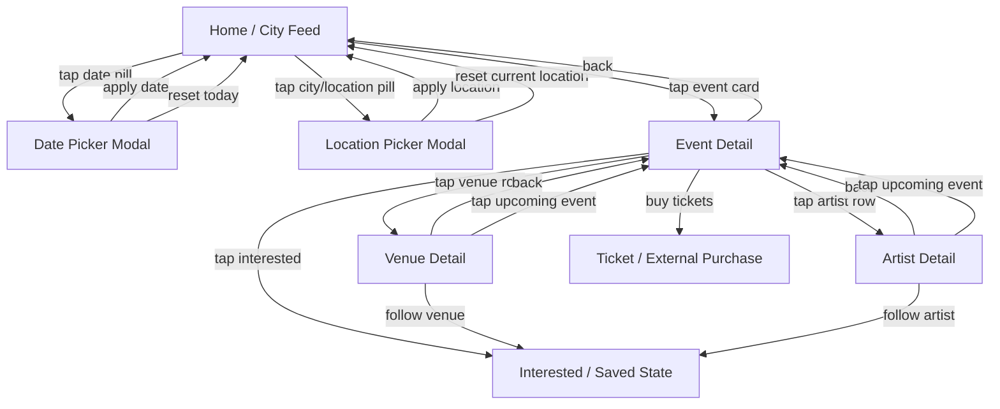
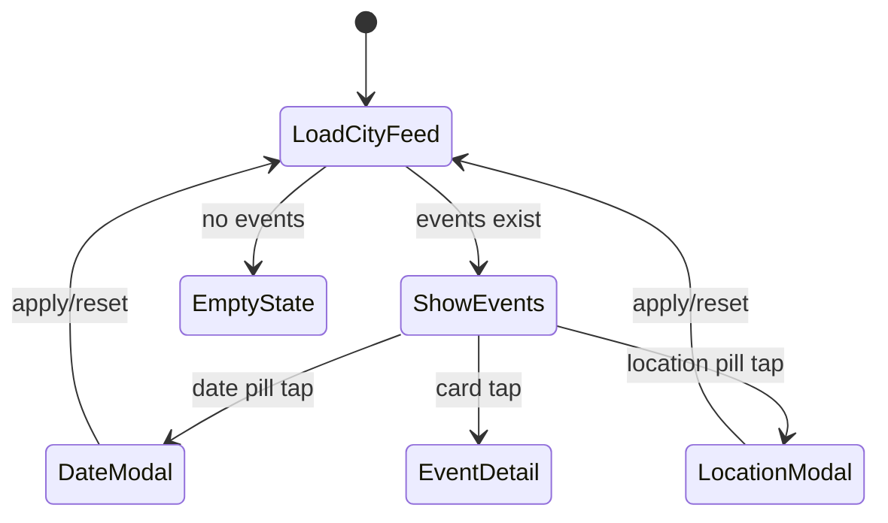
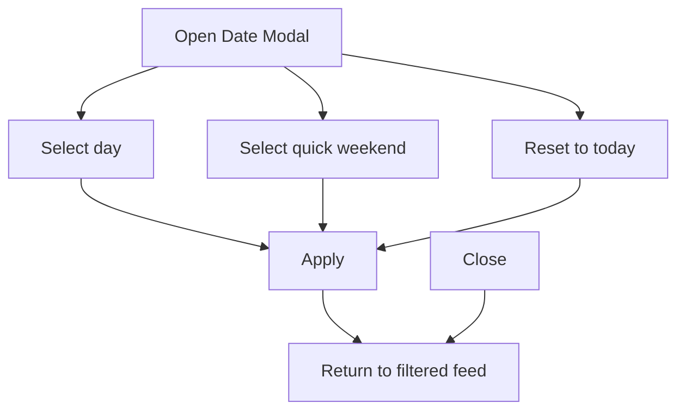
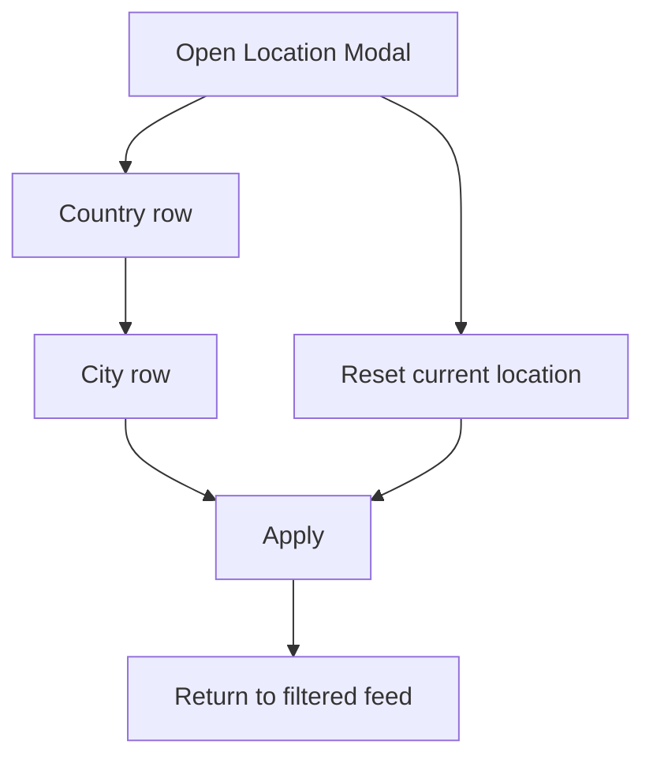
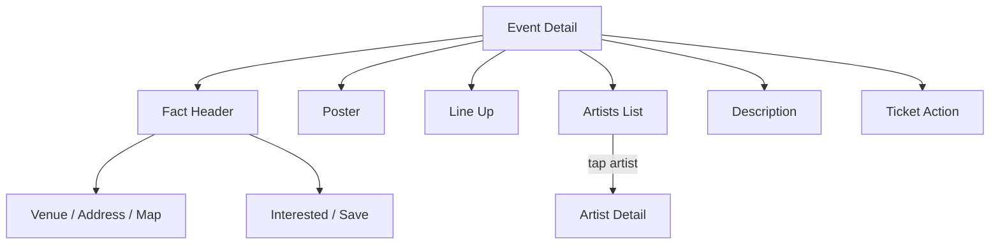
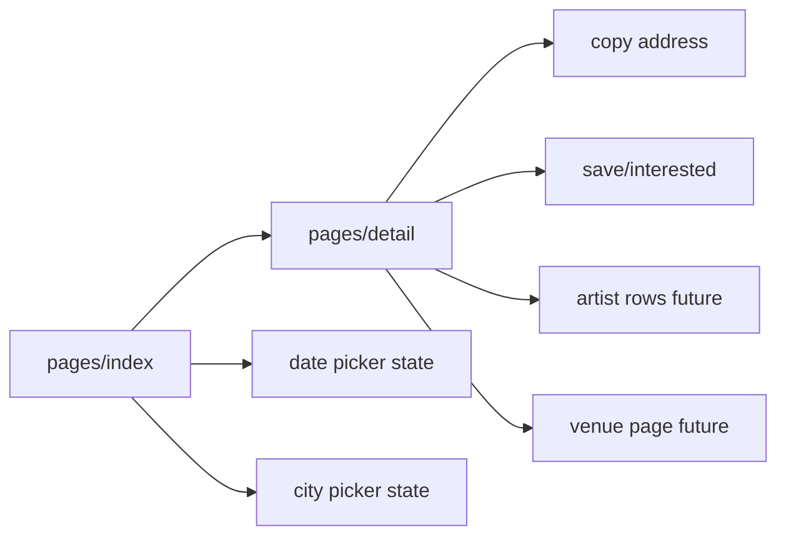

# RA Guide UI Logic Analysis

Updated: 2026-05-07

Scope: logic only. Do not copy visual style, brand, typography, color, corner mark, or graphic language.

Source video:

`C:\Users\pc\Documents\xwechat_files\YTT2010AA_8e27\msg\video\2026-05\21f8cfa877f0b0b2196c3a63acc23561_h264_720p_30fps.mp4`

Frame contact sheet:

`C:\Users\pc\Documents\xwechat_files\YTT2010AA_8e27\msg\video\2026-05\chatgpt_analysis_frames\contact_sheet.jpg`

## Core Product Model

RA Guide is not a generic list app. It is an event discovery graph:

- Home page is the city/date-scoped event feed.
- Event card opens event detail.
- Event detail exposes event facts first, then poster, then lineup, artist links, description, venue/location, tickets.
- Venue name opens venue detail.
- Artist name opens artist detail.
- Date/location controls open modal pickers, then apply filters back to the feed.
- Interested/follow/buy ticket are persistent action paths, separate from browsing.

## Page Graph

## Home Feed Logic

Home page hierarchy:

1. Current city as the page title.
2. Two filter pills: date and city/location.
3. Feed tabs: All, For You, New.
4. Featured/Popular horizontal event cards.
5. Event cards carry enough facts to decide whether to open detail.

Event card logic:

- Poster/image is the primary affordance.
- Date appears before title.
- Title is event name, not article title noise.
- Venue/location row appears with location icon.
- Interested/user count appears as secondary social proof.
- Tapping anywhere on the card opens event detail.

Feed state logic:

## Date Picker Logic

Observed date modal behavior:

- Modal overlays the feed.
- Title says Date.
- Calendar month grid is primary.
- Current selected day is highlighted.
- Month navigation exists.
- Quick actions: This Weekend, Next Weekend.
- Bottom actions: Reset to Today, Apply.
- Close button exits without applying.

Implementation logic:

## Location Picker Logic

Observed location modal behavior:

- Modal overlays the feed.
- Title says Location.
- Country row first.
- City row nested below country.
- Rows use drill-down chevrons.
- Bottom actions: Reset to Current Location, Apply.
- Close exits without applying.

Implementation logic:

For HUAIDJ, use China as the country-level group and cities as child rows. Do not show unknown city.

## Event Detail Logic

Event detail is a fact-first page, not a long article page.

Top section:

- Back action.
- Share action.
- Event title.
- Interested count and interested button.
- Date and time.
- Venue and city.
- Maps/taxi or address action.

Body sections:

1. Poster/media.
2. Lineup as plain list.
3. Artists as clickable rows.
4. Description as original event copy/bio.
5. Running hours.
6. Location.
7. Tickets.

Persistent action:

- Buy Tickets / Save action is anchored near the bottom.
- It should not replace factual event navigation.

Detail page logic:

## Venue Detail Logic

Venue page behavior observed from Cakshop:

- Header uses venue image/logo.
- Venue name is title.
- Address and country appear immediately.
- Follow button and follower count.
- Upcoming Events list.
- About section.
- Location section later.

For HUAIDJ:

- Venue page can be optional for MVP.
- If implemented, venue row in event detail should open it.
- Upcoming events should reuse the same event-card row shape.

## Artist Detail Logic

Artist detail behavior observed:

- Artist name as title.
- Interested/follow count.
- Follow action.
- Upcoming events list.
- Description/bio.
- Location/affiliation optional.

For HUAIDJ:

- Artist rows can initially be non-clickable if data lacks stable artist IDs.
- If clickable, use artist name as key and show events where lineup contains that artist.

## Button And Control Contract

| Control | Location | Behavior |
|---|---|---|
| Date pill | Home | Opens date modal |
| Location pill | Home | Opens location modal |
| All tab | Home | Shows all events for selected filters |
| For You tab | Home | Reserved recommendation feed |
| New tab | Home | Sorts or filters newest events |
| Event card | Home | Opens event detail |
| Back | Detail/subpages | Returns to previous page |
| Share | Detail | Opens platform share |
| Interested | Detail | Toggles saved/interested state |
| Buy tickets | Detail | Opens ticket path or external mini-program-safe link |
| Venue row | Detail | Opens venue detail or copies address/maps |
| Artist row | Detail | Opens artist detail |
| Apply | Modals | Commits filter and reloads feed |
| Reset | Modals | Resets relevant filter |
| Close | Modals | Dismisses without applying |

## HUAIDJ Implementation Rules

- Keep HUAIDJ visual style. Only borrow RA information architecture.
- Home must prioritize event discovery, not system status.
- Detail must prioritize facts before description.
- No raw source URL shown in UI.
- No `unknown`, `待确认`, or placeholder venue/city.
- Title click/card tap goes to detail.
- Lineup must not include club/promoter names.
- Address must be detailed and copyable when available.
- Date and location filters should behave as explicit filter states, not hidden backend logic.

## MVP Mapping

Current HUAIDJ pages can map like this:

Next useful build slice:

1. Add real date modal instead of native picker.
2. Add real city modal instead of native picker.
3. Split detail data into sections: facts, poster, lineup, artists, description.
4. Add venue detail only after venue IDs/address confidence are stable.
5. Add artist detail only after lineup extraction quality is stable.
