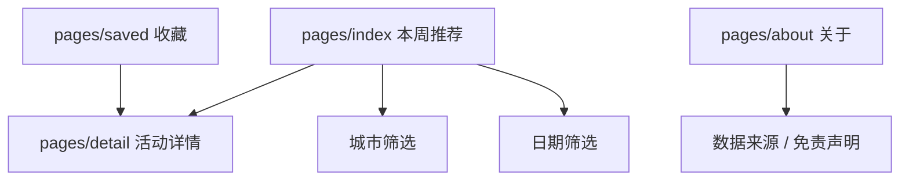
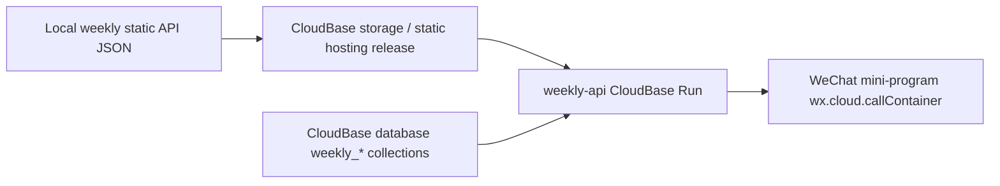

# Weekly Activity Mini-Program Design

Updated: 2026-05-08

## Product Positioning

目标是做一个国内版 RA Guide：每周五把国内各城市俱乐部、厂牌和活动推荐整理成可浏览、可筛选、可收藏的小程序。

RA Guide 的公开产品信号包括：按口味和位置发现活动、查找附近电子音乐活动、购票、覆盖多国家列表、登录、关注 DJ/artist/club 并获得定制列表。第一版不做购票闭环，先做可信活动发现和实体信息。

## MVP Scope

- 首页：本周推荐流、城市筛选、日期筛选。
- 详情页：标题、城市、日期、俱乐部/厂牌、阵容、地点、证据；不直接展示原始 URL。
- 收藏：本地收藏活动 ID。
- 关于：数据来源、未复核候选不公开、订阅消息限制说明。
- 云端：`weekly-api` 先提供只读 REST contract。

## IA



## API Contract

Public MVP:

```text
GET /healthz
GET /
GET /preview?cityKey=&date=
GET /preview/items/:id
GET /api/v1/weekly/manifest
GET /api/v1/weekly/current?cityKey=&date=&limit=&cursor=
GET /api/v1/weekly/cities
GET /api/v1/weekly/dates
GET /api/v1/weekly/items/:id
```

Error shape:

```json
{
  "error": {
    "code": "ITEM_NOT_FOUND",
    "message": "Weekly activity item was not found.",
    "details": {}
  }
}
```

## CloudBase Architecture



官方约束转化为实现决策：

- 小程序访问云托管使用 `wx.cloud.callContainer`，header 带 `X-WX-SERVICE: weekly-api`。
- 云托管服务必须监听 `PORT`，且保持无状态。
- CloudBase 文档型数据库适合 JSON 文档存储；查询字段需要索引。
- 公开内容集合可读不可写；敏感/管理集合走服务端，不暴露给小程序端。

## Data Model Draft

Published payload SSOT:

- `docs/WEEKLY_ACTIVITY_PUBLISHED_SCHEMA_V1_2026-05-08.md`

Collections:

- `weekly_runs`: `runId`, `generatedAt`, `status`, `itemCount`, `sourceManifestHash`.
- `weekly_activity_items`: `itemId`, `publishRunId`, `status`, `cityKey`, `eventDateIsoGuess`, `confidence`, `title`, `promoter`, `sourceUrlHash`.
- `weekly_city_index`: `runId`, `cityKey`, `city`, `itemCount`.
- `weekly_date_index`: `runId`, `date`, `itemCount`.
- `weekly_user_events`: `_openid`, `itemId`, `eventType`, `createdAt`.

Indexes:

- `weekly_activity_items(status, publishRunId, cityKey, eventDateIsoGuess, confidence)`.
- `weekly_activity_items(itemId)` unique.
- `weekly_runs(status, generatedAt)`.
- `weekly_user_events(_openid, eventType, createdAt)`.

## Design Direction

Dominant reference: HUAIDJ existing product skin from `C:\Users\pc\code\huaidj-submit`.

Support reference: Spectrum/Ant Design discipline for hierarchy, states, and information density only.

Rejected default: copying RA visual style, glassmorphism, generic hero page, purple AI gradient, oversized marketing CTA.

Visual system:

- Palette: HUAIDJ dark surfaces, muted text, thin borders, `#7eb8da` accent.
- Radius: 4-6rpx component radius, no decorative card stacks.
- Layout: list-first, metadata-first, detail facts before poster and description.
- Typography: compact mobile hierarchy; no viewport-scaled font.

## Current Implementation

- Mini-program: `apps/weekly_activity_miniprogram`.
- CloudRun API: `services/weekly_activity_cloudrun`.
- Published schema: `docs/WEEKLY_ACTIVITY_PUBLISHED_SCHEMA_V1_2026-05-08.md`.
- Seed venue registry: `tools/stage7_rewrite/registries/weekly_venues_seed.json`.
- Local data source defaults to `D:\downstream_results\stage7_rewrite\longrun\WEEKLY_ACTIVITY_MINIPROGRAM_API_20260507`.
- Local browser preview: `http://127.0.0.1:8787/preview`.

## Not Implemented Yet

- CloudBase environment creation.
- CloudBase DB import.
- Cloud storage/static hosting upload.
- Admin review backend.
- Subscription messages. User opt-in, template approval, and compliance limits must be confirmed before implementation.
