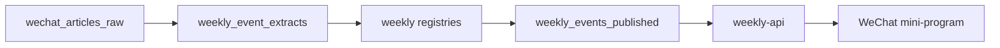

# Weekly Activity Published Schema v1

Updated: 2026-05-08

Scope: HUAIDJ weekly mini-program only. This line may reuse WeChat extraction outputs, but it is not the 93k Stage7 production project and must not mutate Stage7, OCR, vector, Qdrant, Neo4j, PC DB, Dajiala, or paid jobs.

## Data Layers

## Raw Article Fields

`wechat_articles_raw` stores source evidence and assets:

- `source_url`, `source_url_hash`, `account_name`, `account_id`, `article_title`, `digest`, `published_at`, `content_hash`.
- `main_text`, `paragraphs`, `image_urls`, `cover_url`, `poster_candidates`, `ocr_text_by_image`.
- `date_phrases`, `time_phrases`, `venue_phrases`, `address_phrases`, `lineup_blocks`, `style_phrases`, `price_phrases`.
- `cancelled_or_closed_signals`, `external_links`, `raw_html_snapshot_hash`.

Raw source URLs are internal evidence. Mini-program UI must not render naked URLs.

## LLM Staging Fields

`weekly_event_extracts` is allowed to be incomplete and reviewable:

- `is_event`
- `title_display`
- `event_date_start`, `event_date_end`, `event_time_text`
- `city_name`, `venue_name`, `address_candidate`
- `lineup_artists`
- `music_styles`
- `dj_bio_lines`
- `description_original_lines`
- `ticketing_text`
- `dedupe_signals`
- `review_flags`
- `notes`

LLM may infer style tags from source wording and underground-music terms. LLM must not be the permanent source of truth for venue status or full addresses.

## Human Registries

The weekly lane should maintain separate registries:

- `weekly_accounts`: 64 followed accounts, city, type, active/closed status, sync priority, last confirmed date.
- `weekly_venues`: canonical venue name, aliases, city, full address, geo, status, last verified date.
- `weekly_artists`: canonical artist name, aliases, optional manual bio, blocked-as-lineup names, style tags.
- `weekly_manual_overrides`: event-level corrections, poster override, title override, publish/remove decision.

The seed registries live at:

- `tools/stage7_rewrite/registries/weekly_venues_seed.json`
- `tools/stage7_rewrite/registries/weekly_accounts_seed.json`
- `tools/stage7_rewrite/registries/weekly_artists_seed.json`

Executable registry schemas and validator:

- `tools/stage7_rewrite/schemas/weekly_venue_registry.v1.schema.json`
- `tools/stage7_rewrite/schemas/weekly_account_registry.v1.schema.json`
- `tools/stage7_rewrite/schemas/weekly_artist_registry.v1.schema.json`
- `tools/stage7_rewrite/scripts/validate_weekly_registries.py`

## Published Event Fields

`weekly_events_published` is the only shape the mini-program should consume:

- `schema_version`: `weekly_event_published.v1`
- `event_id`, `article_id`, `queue_id`
- `title_original`, `title_display`
- `source_article`: `url_hash`, `account_name`, `published_at`
- `source_action`: mini-program-safe action metadata, no visible raw URL
- `cover_image_url`, `poster_file_id`, `poster_source`
- `event_date_start`, `event_date_end`, `time_start`, `time_end`, `running_hours_text`
- `city_key`, `city`, `city_keys`
- `venue_id`, `venue_name`, `address_full`, `address_source`, `geo_lng`, `geo_lat`
- `lineup_artists`
- `music_styles`, `genres`
- `price`, `price_text`, `ticketing_text`
- `description_original_lines`, `dj_bio_lines`
- `artist_profiles`
- `source_account_name`, `source_published_at`
- `quality_status`, `publish_status`
- `dedupe_key`
- `detail_path`, `detail_url`

## Publish Gates

Publish only when:

- `event_date_start` is inside tonight/current day through the next 7 calendar days.
- `city_key` is known and not `unknown`.
- `title_display` is non-empty.
- duplicate candidates have been collapsed by source hash, title/date, and publish-stage date + venue + title-core keys.
- inactive accounts or venues have been removed by explicit registry, not guessed by LLM.
- lineup excludes club, venue, city, account, and promoter names.
- `venue_name` and `address_full` are present.
- address is either source-supported or from `weekly_venues`; rows without a full address stay in review.

The UI must not show `UNKNOWN`, `待确认`, `conf`, raw source URL, or Stage7 internal field names.

Executable schema and validator:

- `tools/stage7_rewrite/schemas/weekly_event_published.v1.schema.json`
- `tools/stage7_rewrite/scripts/validate_weekly_event_published.py`

## API Contract

`weekly-api` continues to expose:

- `GET /api/v1/weekly/manifest`
- `GET /api/v1/weekly/current?cityKey=&date=&limit=&cursor=`
- `GET /api/v1/weekly/cities`
- `GET /api/v1/weekly/dates`
- `GET /api/v1/weekly/items/:id`

The response payload must not carry internal audit fields such as LLM confidence, review reasons, raw URLs, or Stage7 field names. Local preview should read the same published display fields as the mini-program.
