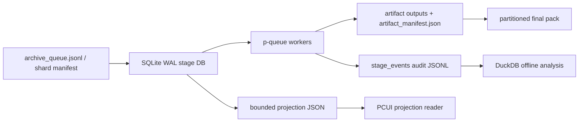

<!-- CODE_ALIGNMENT_2026_04_30_START -->
> Code alignment note (2026-04-30): this document was reviewed during the repository-wide docs/code sync. Treat `README.md`, `AGENTS.md`, `docs/CURRENT_CODE_MAP.md`, `docs/CLI_REFERENCE.md`, `docs/CONFIGURATION.md`, `docs/CODE_AUDIT.md`, and `docs/DOCUMENTATION_INDEX.md` as current code-aligned SSOT. Older dated handoffs/logs remain historical evidence and must be checked against current code before execution.
<!-- CODE_ALIGNMENT_2026_04_30_END -->

# WeChat 10W+ Open Source Adoption Plan

更新时间：2026-04-24 06:52 +08

本文是 10W+ 管线性能升级的开源选型口径。目标是避免自造高风险基础设施，只在现有 Node/TypeScript + Electron 架构上引入最少、最成熟、可验证的组件。

## 当前本地约束

- 当前目录不是 git repo；不能编造 branch/PR/commit 状态。
- 生产 `export-llm-batch` 仍在写 `D:\DDownload\_llm_artifacts`；不能停止、重复启动、清理或让下游读取半成品。
- 当前依赖很少：运行依赖只有 `cheerio`，UI 是 Electron + 原生 HTML/CSS/JS，不是 React/Vue/Svelte。
- PCUI 已有 10W fake DOM 性能门禁，最近 SSOT 记录 `maxVirtualDomRows=44`；UI 性能优先继续走 projection + virtual DOM，不做框架迁移。

## 采用决策

| Area | Decision | Project | Reason | Phase |
| --- | --- | --- | --- | --- |
| 本地持久队列/状态 | 采用 | `better-sqlite3` + SQLite WAL | 100k 级本地事务、索引、lease、resume、projection cursor 不该自己用 JSON 全量快照实现；WAL 可支撑单机读写并发。 | Phase 1 |
| 分析查询/性能报表 | 采用 | DuckDB | 直接查询 JSONL/CSV/Parquet，适合性能 harness、质量分布、失败聚合、产物审计，不做运行时队列。 | Phase 1.5 |
| 并发/背压 | 采用 | `p-queue` | 替代自写通用 `mapLimit`；需要 concurrency、timeout、AbortSignal、queue size、runningTasks、backpressure。 | Phase 1 |
| CPU worker pool | 条件采用 | Piscina | 只给 CPU-bound TS 工作或可证明收益的 worker 使用；避免多个 pool 抢主线程和磁盘。 | Phase 2 |
| 分布式任务队列 | 暂缓 | BullMQ + Redis/Dragonfly | 适合多进程/多机 worker，但当前是本地桌面长跑；引入 Redis 运维成本过早。 | Phase 3 |
| 全文搜索 | 暂缓 | Meilisearch | 适合 final pack 后的用户搜索，不参与核心 ingest/export 状态机。 | Phase 3 |
| 向量/多模态检索 | 暂缓 | LanceDB | 适合 embedding 产物稳定后的语义检索；当前先完成 runner pack 和 embedding schema。 | Phase 3 |
| 大规模 OLAP 服务 | 拒绝当前引入 | ClickHouse | 强但偏服务化/集群化；10W 本地桌面任务优先 DuckDB/SQLite，ClickHouse 留给百万级或多用户服务。 | Future |
| UI 表格库 | 暂缓 | TanStack Virtual / AG Grid Community | 当前 vanilla PCUI 已有 10W 虚拟表证据；只有现有 virtual table 失败时才开新 UI track 评估。 | Conditional |
| HTTP/限速 | 条件采用 | Node fetch/Undici + Bottleneck | Node 20 内置 fetch 已可用；如遇 API/图片源限速，再用 Bottleneck 做 per-origin rate limit。 | Conditional |
| Rust 加速层 | 条件采用 | Rust sidecar CLI / optional native addon | 不全量重构；只在 perf harness 证明 CPU/扫描/转换瓶颈后，把纯函数热点移到 Rust。 | Phase 2/2.5 |

## 不再自造的部分

- 不再把 10W 状态源建成“全量 JSON snapshot 每次重写”。
- 不再把通用并发控制写成自有 `mapLimit` 主机制；若保留 helper，只作为 `p-queue` 的薄包装。
- 不再用目录扫描当 resume 真相；必须有 DB row / artifact manifest / checksum。
- 不再让 UI 直接消费巨型 status items；UI 只消费小 projection、分页/窗口化查询或 last-valid cache。
- 不把 Rust 当作默认重构路线；Rust 只做可替换、可回滚、可基准测试的局部加速器。

## 运行时架构

## SQLite Phase 1 schema

最小表：

- `runs(run_id, stage, root_path, status, started_at, ended_at, owner, command)`
- `items(item_id, article_id, account_key, token, source_url, partition_id, input_ref, expected_output_ref)`
- `stage_tasks(task_id, run_id, item_id, stage, status, lease_owner, lease_expires_at, attempt, input_sha256, idempotency_key, output_ref, error_message, updated_at)`
- `artifact_manifests(task_id, manifest_path, output_sha256, required_outputs_json, created_at)`
- `stage_events(seq, run_id, task_id, event_type, payload_json, created_at)`

索引：

- `stage_tasks(status, lease_expires_at)`
- `stage_tasks(run_id, stage, status)`
- `stage_tasks(idempotency_key)`
- `items(account_key, token)`
- `stage_events(run_id, seq)`

## 改造顺序

1. 保留现有 live export，不碰生产目录。
2. 完成 live stage lock 文档/测试闭环，防止未来重复启动生产 stage。
3. 将原计划 `pipelineJsonlStore` 改为 `sqlitePipelineStore`：SQLite 是运行真相，JSONL 是审计导出。
4. 将原计划 `mapLimit` 改为 `queueExecutor`：内部用 `p-queue`，暴露项目内稳定接口。
5. stage/shard/artifact manifest 不变，继续作为 DB 的输入/输出合同。
6. 增加 DuckDB perf harness：读取 SQLite 导出的 JSONL/Parquet 或直接 JSONL，生成 10W 聚合报告。
7. UI 只接 projection 和分页窗口，不引入 React，不引入 AG Grid，除非现有 PCUI gate 失败。
8. Phase 1 perf harness 证明热点后，才实现 Rust sidecar；Rust 产物必须有 TypeScript fallback 和同输入同输出测试。

## Rust Phase 2 Candidate Plan

### 采用边界

Rust 不替代 Node/TypeScript 的 CLI 编排、Electron UI、SQLite 状态机、LLM/MarkItDown 调用链。Rust 只做纯计算、纯文件扫描、纯转换的可插拔 worker。

### 进入条件

任一候选模块必须同时满足：

- `pipeline:perf` 或专项 benchmark 证明该模块占总耗时 >= 30%，或在 10W fixture 下超过明确预算。
- Rust prototype 在同一 fixture 上至少快 3x，或内存峰值降低 >= 50%。
- 输出与 TypeScript 现有实现 byte-for-byte 一致；若非 byte-for-byte，必须有结构化等价校验和人工抽样。
- Windows 本机可构建或可下载固定版本 binary；不能让 Electron 打包/portable 分发不可控。
- 有 TypeScript fallback；Rust binary 缺失时 CLI 不崩溃，只降级并报告。

### 优先候选模块

| Priority | Module | Rust shape | Why | Acceptance |
| --- | --- | --- | --- | --- |
| R1 | 大量 checksum / hash / manifest 校验 | `tools/rust/wechat-hashscan` CLI | SHA256、manifest checksum、required output 校验是纯 IO/CPU，容易保持语义等价。 | 100k artifact manifest 校验 >= 3x faster 或内存峰值降低 >= 50%，输出 JSON 与 TS fallback 等价。 |
| R2 | final pack 文件扫描、分区合并、checksums 生成 | `tools/rust/wechat-packscan` CLI | final pack 会扫大量小文件和生成 checksums；Rust 可优化目录遍历、buffer、并行 hash。 | partition merge/checksum 在 100k fixture 内通过预算；敏感文件排除规则与 TS 完全一致。 |
| R3 | 超大 JSONL/CSV/Parquet 转换工具 | `tools/rust/wechat-rowconvert` CLI | JSONL streaming、CSV/Parquet export/import 是标准数据转换热点；适合做 DuckDB/SQLite 交换层。 | 100k/1M synthetic rows streaming 转换不全量入内存；字段、排序、错误行报告稳定。 |
| R4 | HTML 解析/清洗纯 CPU 热点 | Rust library or CLI, only after quality proof | 只有当 profiling 证明 HTML 清洗是 CPU 热点，且质量不降时才迁移。 | golden corpus diff 通过；质量报告不降；失败时自动回退 TS/Cheerio 路径。 |

### 明确暂不迁移

- Electron/PCUI。
- CLI 顶层参数、stage orchestration、live stage lock。
- SQLite WAL store；先用 `better-sqlite3` 验证。
- MarkItDown 本体；除非找到等价质量的 Rust 替代并通过 golden corpus。
- 任何需要访问 live `D:\DDownload` 半成品的实验。

## 验证门禁

- `sqlitePipelineStore`：100k enqueue/project fixture，projection 更新不得全表扫描；lease recovery 必须有测试。
- `queueExecutor`：并发上限、timeout、AbortSignal、失败停止、backpressure 全覆盖。
- `DuckDB`：100k stage_events 质量/失败聚合报告可在预算内生成；不参与 live writer。
- `Rust sidecar`：必须有 TS fallback、同输入同输出 golden tests、Windows binary/build 检查、缺失 binary 降级测试、专项 benchmark。
- `PCUI`：继续跑 `npm run pcui:perf`、`npm run pcui:electron-perf`；如 IPC payload 超预算，先做分页 IPC，不换框架。

## GitHub research links

- DuckDB: https://github.com/duckdb/duckdb
- better-sqlite3: https://github.com/WiseLibs/better-sqlite3
- p-queue: https://github.com/sindresorhus/p-queue
- Piscina: https://github.com/piscinajs/piscina
- BullMQ: https://github.com/taskforcesh/bullmq
- Meilisearch: https://github.com/meilisearch/meilisearch
- LanceDB: https://github.com/lancedb/lancedb
- ClickHouse: https://github.com/ClickHouse/ClickHouse
- TanStack Virtual: https://github.com/TanStack/virtual
- AG Grid: https://github.com/ag-grid/ag-grid

## Board decision

当前唯一计划更新为：本地 10W 管线主线采用 SQLite WAL + `better-sqlite3` 作为状态/队列真相，`p-queue` 作为并发执行器，DuckDB 作为离线分析和性能报表引擎。JSONL 保留为审计和交换格式，不再作为高频运行状态主存储。Rust 作为 Phase 2/2.5 条件加速层，只承接 checksum/hash、final pack scan/merge/checksum、超大行格式转换、以及经质量证明的 HTML 解析/清洗热点。UI 性能不通过重写框架解决，而通过 bounded projection、分页窗口、虚拟表和真实 Electron 性能门禁解决。
