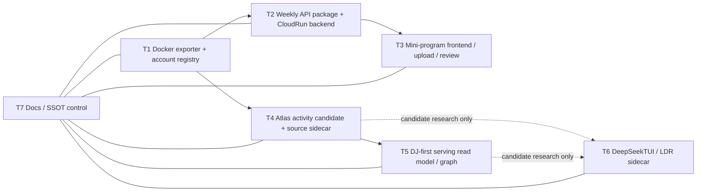

# WeChat / Atlas / Weekly Thread Decomposition Design

Date: 2026-05-22
Status: Accepted by user in thread
Scope: `C:\code\githubstar\wechathtmldownload`, plus related DeepSeekTUI and local-deep-research sidecar docs.

## Problem

The project has outgrown a single-thread operating model. The same workspace now contains:

- Docker-backed WeChat public-account download and account registry refresh.
- Weekly activity mini-program backend/resource publishing.
- Weekly mini-program frontend, upload, and review state.
- Atlas candidate database, source-preserving sidecars, and DJ-first serving models.
- DeepSeekTUI and local-deep-research sidecar research lanes.
- Current-runtime, SSOT, handoff, and MkDocs surfaces.

These lanes share source artifacts, but they must not share authority. The biggest current risk is collapsing separate states into one claim: local package, CloudRun remote state, mini-program upload, WeChat review, Atlas candidate DB, raw Atlas DB, public serving DB, Neo4j, and Qdrant are different states.

## Decision

Split the project into seven durable operating threads. Each thread owns one responsibility set, one current-state document, one prompt, one output contract, and one verification gate.

1. `T1-source-intake-docker-exporter`
2. `T2-weekly-backend-release`
3. `T3-mini-program-frontend`
4. `T4-atlas-activity-candidate`
5. `T5-atlas-dj-serving-graph`
6. `T6-deepseektui-ldr-sidecar`
7. `T7-docs-ssot-control`

The canonical thread index is `docs/threads/THREADS_INDEX_20260522.md`.

## Architecture

Daily source intake starts once, then branches:

Thread outputs are files and evidence, not chat memory. Production-affecting operations remain separately gated.

## Current Baseline

- Weekly backend: CloudRun `weekly-api-061`, remote-effective.
- Weekly package: manifest/package `196`, default current `195`, materialized LLM `196/196`, package GCJ-02 `194/196`, default current GCJ-02 `193/195`.
- Mini-program: developer version `2026.05.22.1` uploaded; WeChat review was not submitted by Codex.
- Atlas participant sidecar: high-signal LLM lane complete, final public supplement `114,851` participant rows, graph delta `29,734` event candidates and `113,286` directed relation rows.
- Atlas next gate: build a new public-safe serving candidate from the delta; do not mutate raw Atlas SQLite or current serving DB in place.
- DeepSeekTUI: draft/research sidecar only, controlled by pcHermes/Codex, not production authority.

## Alternatives Considered

### Single Mega Report

Rejected. It can explain the whole system once, but it does not reduce future context load or assign responsibility.

### Thread Per Script Directory

Rejected. The operational boundaries do not match folders. For example, weekly backend spans Docker exporter, Python release scripts, CloudRun Node service, and reports.

### Thread Per Runtime State

Rejected. Too fragmented; upload state, review state, and backend state need separate tracking, but they belong under one mini-program/frontend or backend owner.

## Consequences

- New agents can start from one thread prompt instead of reading all 25k Markdown files.
- SSOT updates must mention which thread owns each state.
- Cross-thread changes must update `docs/threads/THREADS_INDEX_20260522.md` and the affected thread document.
- Production actions are not authorized by thread membership alone.

## User Approval

The user approved unifying the project under this decomposition and asked to directly establish the threads.
