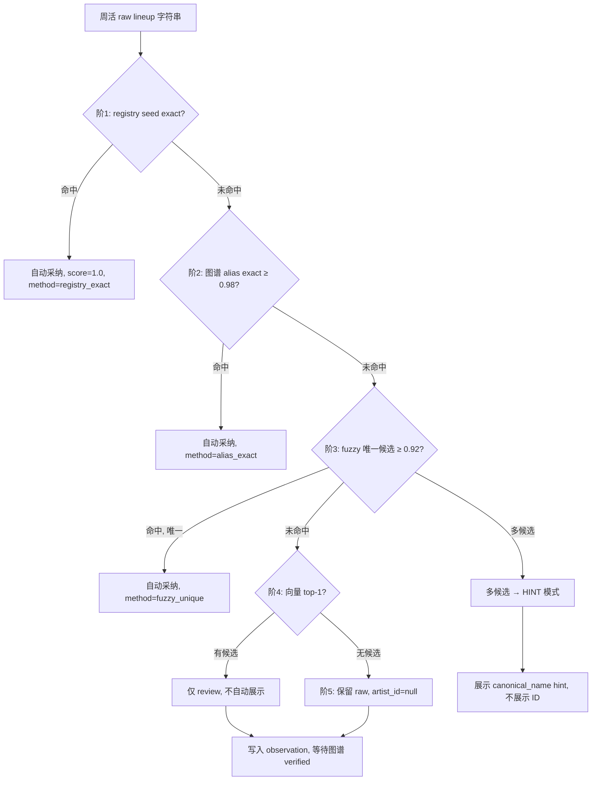

# 计划二强化版 v2：周活 × 电子音乐图谱实体联动

Updated: 2026-05-19  
Status: **候选研究稿**（HOLD_FOR_HERMES_DECISION，未实施）  
Supersedes: `PLAN_B_WEEKLY_ATLAS_ENTITY_LINKAGE.md`（保留 v1 作概要）

## LDR 在线推理证据

| 项 | 值 |
|----|-----|
| 引擎 | local-deep-research-wechat `run-artifact-research.py` |
| 模型 | `deepseek-v4-pro` |
| 端点 | `https://api.deepseek.com` |
| 生成时间 | 2026-05-19（Plan B 跑完略晚于 Plan A） |
| 源包 | `source_pack/weekly_plan_deepresearch_20260519` |
| 原始报告 | `C:\code\local-deep-research-wechat\data\research_outputs\weekly_plan_b_deepseek_v4_pro_20260519.md` |

---
**状态**: CANDIDATE RESEARCH — HOLD_FOR_HERMES_DECISION  
**角色**: 知识图谱工程师 + 实体解析架构师 + 周活小程序数据契约设计师  
**日期**: 2026-05-19

---

## 1. 执行摘要

本计划在现有 `PLAN_B_WEEKLY_ATLAS_ENTITY_LINKAGE.md` [1][2] 基础上，产出强化版 v2 设计。核心交付包括：

- **WeeklyAtlasEntityContract** 草案：定义周活与图谱之间的数据契约、字段 schema、版本化策略与兼容性规则
- **Entity Resolver 规格**：五级匹配阶梯的精确阈值、冲突处理算法、多候选 UI 策略
- **Snapshot 物化格式**：`artist_profiles[]`、`lineup_resolved[]`、`venue_resolved` 的完整 JSON 示例
- **上行 observation jsonl**：每周 publish 后的字段定义、隐私/合规边界、图谱 ingest 约束
- **分阶段 OKR (L0–L4)**：与计划一 P0–P3 [5][6] 的时间对齐表
- **模块边界**：建议 `weekly_atlas_bridge` 目录结构与 API 调用方式
- **评测方案**：利用计划一 golden 集的 `artist_id` 字段评估 resolver
- **风险决策表**：≤5 项待拍板决策，给出推荐与备选

**关键原则**：图谱管「是谁」，周活管「这一场」；向量匹配不得自动进入小程序展示 [1][2][3][4]。

---

## 2. 分工与哲学

### 2.1 边界定义

| 维度 | 周活小程序 | 电子音乐图谱 |
|------|-----------|--------------|
| 时间跨度 | 未来 15 天 | 4.7 万+ 历史记录 [1][2] |
| 产品定位 | 大众查活动 | 图谱 / RAG / 研究 |
| 实体粒度 | 活动级快照 | canonical 艺人 / 场地 / 关系 |
| 准确率要求 | 展示极严（宁可空不可错）[5][6] | candidate + review 分层 |
| 数据方向 | **消费**图谱标准化输出 | **提供**实体解析能力 |

### 2.2 联动原则

1. **图谱负责「是谁」**：提供 canonical ID、别名、verified bio、资产（头像/海报带 source `image_id`）
2. **周活负责「这一场」**：日期、本场 lineup 证据（OCR + LLM），不做 full 图谱抽取
3. **向量匹配不自动展示**：向量匹配结果仅进入 review 队列，不直接进入小程序的 `show` 或 `show_with_hint` tier [1][2]
4. **bio/头像仅 verified**：只有图谱 verified 或 registry `bio_manual` 的 bio 和头像才可进入小程序展示 [5][6]
5. **不增加无证据 lineup**：Resolver 只能标准化已有 lineup，不得通过图谱关系推断和添加新的人名 [1]

### 2.3 信息来源限制

根据 hard constraint #1 [3][4]，本计划**仅基于 source_pack 内的文件**进行设计。以下内容不在本计划范围内：

- 93k/47k 图鉴管线的具体实现 (G0–G4 各阶段工作属于图谱线程) [1]
- Neo4j/Qdrant 的实际写入操作或 production 图写入状态 [3][4]
- 图谱 production 环境的具体配置

---

## 3. 架构图

### 3.1 整体数据流

```
┌──────────────────────────────────────────────────────────────┐
│                        周活管线 (Weekly Pipeline)               │
│                                                              │
│  Queue → OCR → DeepSeek → Build API → Repair → Audit         │
│     ↑                                  ↓                     │
│     │                    WEEKLY_ACTIVITY_MINIPROGRAM_API      │
│     │                                  ↓                     │
│     │                    ┌──────────────────────┐            │
│     │                    │  weekly_atlas_bridge │            │
│     │                    │     (本计划范围)      │            │
│     │                    └──────────┬───────────┘            │
│     │                               │                        │
│     │                    ┌──────────▼───────────┐            │
│     │                    │   Entity Resolver     │            │
│     │                    │   五级匹配阶梯         │            │
│     │                    └──────────┬───────────┘            │
│     │                               │                        │
│     │                    ┌──────────▼───────────┐            │
│     │                    │  Weekly Atlas Snapshot│            │
│     │                    │  (只读物化下行)        │            │
│     │                    └──────────┬───────────┘            │
│     │                               │                        │
│     │                    ┌──────────▼───────────┐            │
│     │                    │  小程序 enriched 展示  │            │
│     │                    │  artist_id + verified │            │
│     └────────────────────┤  bio/图 (仅verified)  │            │
│                          └──────────────────────┘            │
│                                                              │
│  每周 publish 后:                                             │
│  weekly_entity_observations.jsonl ─────────────────────────► │
│                                                              │
└──────────────────────────────────────────────────────────────┘
                                    │
                                    │ observation (上行, 低频)
                                    ▼
┌──────────────────────────────────────────────────────────────┐
│                      电子音乐图谱 (图谱线程)                     │
│                                                              │
│  G0: 统一 schema + 别名导出                                   │
│  G1: 47k batch → candidate 表                                │
│  G2: 500 高频 DJ verified                                    │
│  G3: verified 关系边                                         │
│  G4: 实体 API                                                │
│                                                              │
│  Observation ingest → 图谱生长 (不直写 production)              │
└──────────────────────────────────────────────────────────────┘
```

### 3.2 Resolver 决策流



---

## 4. 契约全文草案

### 4.1 WeeklyAtlasEntityContract v1.0

```yaml
contract: WeeklyAtlasEntityContract
version: "1.0.0"
status: DRAFT
effective_date: null  # HOLD_FOR_HERMES_DECISION

# ============ 版本化策略 ============
versioning:
  strategy: semver
  major_breaking:
    - 字段移除或重命名
    - 必填字段新增
    - artist_id 格式变更 (如 atlas:entity: → atlas:artist:)
  minor_additive:
    - 新增可选字段
    - 新增 match_method 枚举值
  patch:
    - 阈值调整
    - 文档修正

# ============ 下行: 图谱 → 周活 ============
downstream_snapshot:
  description: "周活侧物化的只读 snapshot，由 Resolver 写入"

  artist_profiles:
    type: array
    description: "仅含 verified 或 registry bio_manual 的艺人画像"
    items:
      artist_id:
        type: string
        pattern: "^atlas:entity:[a-zA-Z0-9_-]+$"
        description: "图谱 canonical ID"
      canonical_name:
        type: string
        description: "图谱标准名"
      aliases:
        type: array
        items: string
      verified:
        type: boolean
        description: "图谱 G2+ verified"
      bio:
        type: string | null
        description: "仅 verified 或 registry bio_manual 时有值 [5]"
        nullable: true
      avatar:
        type: object | null
        properties:
          url: string
          source_image_id: string
        nullable: true
      genres:
        type: array
        items: string
        description: "图谱 style/标签"
      source:
        type: string
        enum: [atlas_verified, registry_bio_manual]

  lineup_resolved:
    type: array
    description: "本场 lineup 的实体链接结果"
    items:
      raw:
        type: string
        description: "周活 OCR/LLM 原始 lineup 字符串"
      artist_id:
        type: string | null
        pattern: "^atlas:entity:[a-zA-Z0-9_-]+$"
        nullable: true
      match_score:
        type: number
        minimum: 0
        maximum: 1
      match_method:
        type: string
        enum:
          - registry_exact
          - alias_exact
          - fuzzy_unique
          - vector_candidate
          - no_match
      verified:
        type: boolean
      candidates:
        type: array | null
        description: "多候选时提供 (最多 5), 仅含 canonical_name, 不含 ID"
        items:
          canonical_name: string
          score: number
        nullable: true

  venue_resolved:
    type: object | null
    nullable: true
    properties:
      raw_name: string
      venue_id:
        type: string | null
        pattern: "^atlas:venue:[a-zA-Z0-9_-]+$"
        nullable: true
      canonical_name: string | null
      address: string | null
      match_score: number
      match_method: string

# ============ 上行: 周活 → 图谱 ============
upstream_observation:
  description: "每周 publish 后导出，图谱 ingest 为 observation"

  file_format: jsonl
  frequency: weekly_after_publish

  record_schema:
    observation_id:
      type: string
      description: "uuid, 幂等键"
    observation_type:
      type: string
      enum:
        - lineup_match
        - lineup_no_match
        - venue_match
        - venue_no_match
        - artist_new_raw
    event_ref:
      type: string
      description: "周活 event_id, 用于溯源"
    raw_text:
      type: string
    evidence_refs:
      type: array
      items:
        type: string
        enum: [ocr, body, title]
    matched_atlas_id:
      type: string | null
    match_method_used:
      type: string | null
    match_score:
      type: number | null
    url_hash:
      type: string | null
      description: "source URL hash, 去重用"
    generated_at:
      type: string
      format: date-time

  privacy_compliance:
    - "不含用户个人信息"
    - "不含微信 OpenID / UnionID"
    - "仅含公众号公开内容 + OCR 提取文本"
    - "url_hash 为单向 SHA256, 不存原始 URL"

  ingest_boundary:
    - "图谱 ingest 为 observation 层, 不直接写入 production graph"
    - "observation 经图谱审核流程后, 方可提升为 canonical entity 或 alias"
    - "同一 url_hash 的 observation 幂等去重"
```

### 4.2 Breaking Change 策略

| 变更类型 | 版本号影响 | 迁移策略 |
|----------|-----------|----------|
| 新增可选字段 | MINOR ++ | 旧 reader 忽略未知字段 |
| 新增 match_method 枚举值 | MINOR ++ | 旧 reader 将未知值视为 `unknown` |
| 阈值调整 (0.92 → 0.90) | PATCH | 重新生成 snapshot 即可 |
| 字段重命名 | MAJOR ++ | 双写过渡期 ≥ 2 周, 旧字段标记 deprecated |
| artist_id 格式变更 | MAJOR ++ | 图谱侧 alias, 周活侧批量更新 |
| 移除字段 | MAJOR ++ | 提前 2 版本声明 deprecated |

---

## 5. Entity Resolver 算法规格

### 5.1 五级匹配阶梯（含阈值来源）

根据 source [1][2] 定义的匹配阶梯，正式规格化如下：

| 阶 | 方法 | 阈值 | 自动采纳 | 多候选处理 |
|----|------|------|----------|------------|
| 1 | registry seed exact | 字符完全匹配 | 是 | 不适用 (seed 唯一) |
| 2 | 图谱 alias exact | ≥ 0.98 | 是 | 取最高分 (预期 alias 归一) |
| 3 | fuzzy 唯一候选 | ≥ 0.92 | 是 | 仅当候选数 = 1 |
| 4 | fuzzy 多候选 | ≥ 0.92 | **否** | UI hint, 不展示 ID |
| 5 | 向量 top-1 | 任意 | **否** | 仅 review |
| 6 | 无匹配 | — | — | 保留 raw, `artist_id=null` |

**说明**：
- 阶 3 与阶 4 使用同一 fuzzy 阈值 0.92，区别在于候选数量：唯一候选自动采纳，多候选进入 HINT 模式 [1][2]
- 向量匹配 (阶 5) **在任何情况下都不自动进入小程序展示**，仅写入 observation 上行供图谱 review [3][4]

### 5.2 伪代码

```python
def resolve_lineup(raw_names: list[str], 
                   registry_seeds: dict, 
                   atlas_alias_index: dict,
                   fuzzy_index,
                   vector_index) -> list[dict]:
    """
    raw_names: 周活 OCR/LLM 产出的 lineup 字符串列表
    registry_seeds: {name: artist_id} mapping
    atlas_alias_index: {alias: [(artist_id, canonical_name, verified)]}
    """
    results = []
    
    for raw in raw_names:
        # ---- 阶 1: registry seed exact ----
        if raw in registry_seeds:
            results.append({
                "raw": raw,
                "artist_id": registry_seeds[raw],
                "match_score": 1.0,
                "match_method": "registry_exact",
                "verified": check_verified(registry_seeds[raw]),
                "candidates": None
            })
            continue
        
        # ---- 阶 2: 图谱 alias exact ----
        if raw in atlas_alias_index:
            candidates = atlas_alias_index[raw]
            # 预期 alias 已归一，取第一个或最高 verified 优先
            best = max(candidates, key=lambda x: (x.verified, x.score))
            if best.score >= 0.98:
                results.append({
                    "raw": raw,
                    "artist_id": best.artist_id,
                    "match_score": best.score,
                    "match_method": "alias_exact",
                    "verified": best.verified,
                    "candidates": None
                })
                continue
        
        # ---- 阶 3/4: fuzzy ----
        fuzzy_candidates = fuzzy_index.search(raw, threshold=0.92)
        if len(fuzzy_candidates) == 1:
            c = fuzzy_candidates[0]
            results.append({
                "raw": raw,
                "artist_id": c.artist_id,
                "match_score": c.score,
                "match_method": "fuzzy_unique",
                "verified": c.verified,
                "candidates": None
            })
        elif len(fuzzy_candidates) > 1:
            # 多候选 → HINT 模式, artist_id = null
            results.append({
                "raw": raw,
                "artist_id": None,
                "match_score": max(c.score for c in fuzzy_candidates),
                "match_method": "fuzzy_multiple",
                "verified": False,
                "candidates": [
                    {"canonical_name": c.canonical_name, "score": c.score}
                    for c in fuzzy_candidates[:5]
                ]
            })
            continue
        else:
            # ---- 阶 5: 向量 ----
            vec_candidate = vector_index.search(raw, top_k=1)
            if vec_candidate:
                results.append({
                    "raw": raw,
                    "artist_id": None,          # 不自动采纳
                    "match_score": vec_candidate.score,
                    "match_method": "vector_candidate",
                    "verified": False,
                    "candidates": [
                        {"canonical_name": vec_candidate.canonical_name, 
                         "score": vec_candidate.score}
                    ]
                })
                continue
        
        # ---- 阶 6: 无匹配 ----
        results.append({
            "raw": raw,
            "artist_id": None,
            "match_score": 0.0,
            "match_method": "no_match",
            "verified": False,
            "candidates": None
        })
    
    return results
```

### 5.3 冲突处理策略

| 冲突场景 | 处理 |
|----------|------|
| 同一 raw 在 alias 和 registry 都命中但 ID 不同 | registry 优先 (阶 1 > 阶 2) |
| fuzzy 单候选但 verified=False | 仍自动采纳 (可信度来自匹配分数, 非 verified 状态) |
| 同一艺人本场多次出现 (raw 变体) | 保留每次的 raw 原文, 可指向同一 artist_id |
| Resolver 产出 artist_id 与计划一 golden 不一致 | 写入评测日志, 不回退 resolver |

### 5.4 多候选 UI 策略

根据 source [1][2] 要求, 多候选场景下：

- **不**展示 `artist_id` 到前端
- **可**展示 `canonical_name` 作为 hint (例如 "可能是: A, B, C")
- 前端 tier 控制: 阶 4/5 产出使用 `show_with_hint` 或 `hide`, 绝不能 `show`
- 用户不可见的内部字段（如 `artist_id`）必须在前端 `compactItem` 中过滤 [7][8]

---

## 6. 上下行数据格式示例

### 6.1 Snapshot 物化示例 (下行)

```json
{
  "snapshot_version": "1.0.0",
  "snapshot_id": "snap_20260519_001",
  "generated_at": "2026-05-19T12:00:00Z",
  "event_id": "tangtangtang:5e86d5854dc6bcf9",
  
  "artist_profiles": [
    {
      "artist_id": "atlas:entity:doon_kanda",
      "canonical_name": "Doon Kanda",
      "aliases": ["Doon Kanda", "Jesse Kanda"],
      "verified": true,
      "bio": "Visual artist and musician, known for collaborations with Arca and experimental electronic works.",
      "avatar": {
        "url": "https://cdn.example.com/artists/doon_kanda.jpg",
        "source_image_id": "img_dk_001"
      },
      "genres": ["experimental", "electronic", "deconstructed club"],
      "source": "atlas_verified"
    }
  ],
  
  "lineup_resolved": [
    {
      "raw": "Doon Kanda",
      "artist_id": "atlas:entity:doon_kanda",
      "match_score": 0.98,
      "match_method": "alias_exact",
      "verified": true,
      "candidates": null
    },
    {
      "raw": "Doon Kanda (Live)",
      "artist_id": "atlas:entity:doon_kanda",
      "match_score": 0.94,
      "match_method": "fuzzy_unique",
      "verified": true,
      "candidates": null
    },
    {
      "raw": "Unknown DJ X",
      "artist_id": null,
      "match_score": 0.0,
      "match_method": "no_match",
      "verified": false,
      "candidates": null
    },
    {
      "raw": "Slikbak",
      "artist_id": null,
      "match_score": 0.89,
      "match_method": "fuzzy_multiple",
      "verified": false,
      "candidates": [
        {"canonical_name": "Slikback", "score": 0.89},
        {"canonical_name": "Slikback (KE)", "score": 0.87}
      ]
    }
  ],
  
  "venue_resolved": {
    "raw_name": "Tango Club",
    "venue_id": "atlas:venue:tango_beijing",
    "canonical_name": "Tango 俱乐部 (北京)",
    "address": "北京市朝阳区工体北路",
    "match_score": 0.97,
    "match_method": "alias_exact"
  }
}
```

### 6.2 Observation JSONL 示例 (上行)

```jsonl
{"observation_id":"obs_20260519_001","observation_type":"lineup_match","event_ref":"tangtangtang:5e86d5854dc6bcf9","raw_text":"Doon Kanda","evidence_refs":["ocr"],"matched_atlas_id":"atlas:entity:doon_kanda","match_method_used":"alias_exact","match_score":0.98,"url_hash":"sha256:a1b2c3...","generated_at":"2026-05-19T12:00:00Z"}
{"observation_id":"obs_20260519_002","observation_type":"lineup_no_match","event_ref":"dirty_house:ce92df09b77cbf74","raw_text":"Unknown DJ X","evidence_refs":["body"],"matched_atlas_id":null,"match_method_used":"no_match","match_score":0.0,"url_hash":"sha256:d4e5f6...","generated_at":"2026-05-19T12:00:00Z"}
{"observation_id":"obs_20260519_003","observation_type":"lineup_match","event_ref":"potent:32fabb508702db79","raw_text":"Slikbak","evidence_refs":["ocr"],"matched_atlas_id":null,"match_method_used":"fuzzy_multiple","match_score":0.89,"url_hash":"sha256:g7h8i9...","generated_at":"2026-05-19T12:00:00Z"}
{"observation_id":"obs_20260519_004","observation_type":"venue_match","event_ref":"tangtangtang:5e86d5854dc6bcf9","raw_text":"Tango Club","evidence_refs":["body"],"matched_atlas_id":"atlas:venue:tango_beijing","match_method_used":"alias_exact","match_score":0.97,"url_hash":"sha256:j0k1l2...","generated_at":"2026-05-19T12:00:00Z"}
```

### 6.3 展示层控制

根据 source [6] 置信分层和 [9][10] 中 `format.js` 展示契约：

```javascript
// 在 compactItem 中：
function applyTier(resolved) {
  if (!resolved.artist_id) return 'hide';
  if (resolved.match_method === 'vector_candidate') return 'hide';        // 向量不进展示
  if (resolved.match_method === 'fuzzy_multiple') return 'show_with_hint'; // hint 仅展示候选名
  if (resolved.match_score >= 0.92) return 'show';
  return 'show_with_hint';
}
```

---

## 7. 分阶段 OKR + 与计划一协同矩阵

### 7.1 路线图

根据 source [1][2] 路线图阶段定义：

| 阶段 | 周期 | 交付 | 关键依赖 |
|------|------|------|----------|
| **L0 契约** | 2 周 | `WeeklyAtlasEntityContract.md` (本文档) | 计划一 P0 可并行 |
| **L1 Resolver v0** | 4 周 | exact + fuzzy snapshot 产出 | 图谱 G0 (alias 导出) |
| **L2 小程序读 snapshot** | 3 周 | 艺人页 artist_id 展示 | L1 完成; 计划一 P3 |
| **L3 Observation 上行** | 4 周 | 每周 observation 导出管线 | L2 稳定运行 ≥ 2 周 |
| **L4 向量候选 review** | 6 周 | 人工 review 工具, 不进自动展示 | 图谱 G1-G2 |

### 7.2 与计划一协同矩阵

| 计划二阶段 | 计划一阶段 | 协同关系 |
|-----------|-----------|----------|
| L0 契约 | P0 度量 | 并行: L0 定义 schema, P0 标注 golden 集 [5] |
| L1 Resolver | P1 证据 + P2 候选 | **L1 依赖**: P0 golden 提供评测数据; **P1 受益**: L1 snapshot 为 evidence 增加实体锚点 |
| L2 小程序集成 | P3 展示 | **强耦合**: L2 产出 snapshot 供 P3 tier UI 消费; P3 verified bio 依赖 L1 的 `artist_profiles[]` [6] |
| L3 Observation | P4 闭环 | **互相增强**: L3 输出未经匹配的 raw 名称 → 图谱审核 → 反向提升 L1 recall |
| L4 向量 review | P4 闭环 | L4 工具化人工复核, 与 P4 registry 更新形成闭环 |

**时间对齐表**:

```
Week:  1  2  3  4  5  6  7  8  9  10 11 12 13 14 15 16
计划一: [P0===][P1======][P2========][P3======][P4============]
计划二: [L0===][L1============][L2======][L3========][L4============]
                           ↑ L2 需 L1 snapshot 就绪
                                    ↑ P3 verified bio 依赖 artist_profiles
```

---

## 8. 模块/文件落地建议

### 8.1 目录结构

根据 source [1] "代码边界: 独立 `weekly_atlas_bridge` 模块" 和 source [7] repo 结构:

```
tools/stage7_rewrite/
├── weekly_atlas_bridge/          # 新建: 不侵入现有周活管道
│   ├── __init__.py
│   ├── contract.py               # WeeklyAtlasEntityContract schema 定义
│   ├── resolver.py               # Entity Resolver 实现 (5 级阶梯)
│   ├── snapshot_builder.py       # 物化 artist_profiles + lineup_resolved
│   ├── observation_exporter.py   # 上行 jsonl 导出
│   ├── enrich_weekly_from_atlas.py  # 主入口: 读 pack → resolve → 写 snapshot
│   ├── thresholds.py             # 阈值常量与配置
│   └── tests/
│       ├── test_resolver.py
│       ├── test_snapshot.py
│       └── test_observation.py
└── runbooks/
    └── atlas_resolver_weekly.md  # 周度运行手册
```

### 8.2 API 调用方式

根据 source [1] 图谱能力提供方式，resolver 采用**离线批量物化**模式，而非实时 API 调用：

```python
# enrich_weekly_from_atlas.py 概念脚本

def main(api_dir: str, atlas_alias_dump: str, registry_seeds: str):
    """
    1. 读取 WEEKLY_ACTIVITY_MINIPROGRAM_API_YYYYMMDD/current.json
    2. 加载图谱 alias 导出 (G0 产物)
    3. 加载周活 registry seeds
    4. 对每条活动的 lineup/venue 执行 resolve
    5. 写入 snapshot 到同一 API 目录
    """
    events = load_json(f"{api_dir}/current.json")
    alias_index = load_alias_index(atlas_alias_dump)
    seeds = load_registry_seeds(registry_seeds)
    
    snapshot = {
        "snapshot_version": "1.0.0",
        "events": []
    }
    
    for event in events:
        resolved = resolve_event(event, seeds, alias_index)
        snapshot["events"].append(resolved)
    
    write_json(f"{api_dir}/atlas_snapshot.json", snapshot)
    # 作为 CloudRun 静态文件暴露: /api/v1/weekly/atlas/snapshot
```

**只读原则**: snapshot 为纯物化 JSON，CloudRun 以静态文件形式分发，不引入图谱数据库直连。

### 8.3 与现有管线的集成点

根据 source [1][7] 管线架构：

```
现有管线: ... → repair → audit → build_API → deploy
                                         ↑
                            enrich_weekly_from_atlas.py
                            (在 build_API 之后、deploy 之前)
```

- **时机**: `build_weekly_activity_miniprogram_api.py` 执行后
- **输入**: API 目录中的 `current.json`
- **输出**: 同一目录下的 `atlas_snapshot.json`
- **隔离**: Resolver 失败不阻塞 deploy; snapshot 缺失时小程序降级为无实体模式

---

## 9. 评测与观测指标

### 9.1 评测方案

根据 source [5][6] 计划一 P0 golden 集定义，利用其 `artist_id` 字段评测 resolver：

**评测数据**:

- 计划一 P0 产出的 golden 集包含人工标注的 `artist_id` (80 条) [5]
- 计划二 L1 产出 lineup_resolved 的 `artist_id` 预测

**指标定义**:

```
Precision = |{ resolved.artist_id == golden.artist_id } ∩ resolved.artist_id != null |
            / |{ resolved.artist_id != null }|

Recall    = |{ resolved.artist_id == golden.artist_id }|
            / |{ golden.artist_id != null }|

F1        = 2 * P * R / (P + R)
```

**评测分层**:

| 评测子集 | 范围 | 目标 |
|----------|------|------|
| registry exact 子集 | 阶1 命中 | P=1.0 (确定性) |
| alias exact 子集 | 阶2 命中 | P ≥ 0.98 |
| fuzzy 子集 | 阶3-4 命中 | P ≥ 0.90, 多候选归入 FP |
| 全量 | 所有 golden 有 ID 的样本 | P ≥ 0.92, R ≥ 0.75 (对齐计划一目标 [5]) |

**评测脚本位置**: `tools/stage7_rewrite/weekly_atlas_bridge/tests/test_resolver_eval.py`

### 9.2 观测指标

| 指标 | 描述 | 监控方式 |
|------|------|----------|
| `resolver_coverage` | 有 artist_id 的 lineup 比例 | 每周 snapshot 统计 |
| `match_method_distribution` | 各阶梯命中占比 | histogram, 周度趋势 |
| `vector_candidate_count` | 进入 review 的向量候选数 | 上限告警 |
| `no_match_rate` | 完全无匹配比例 | 目标逐月下降 |
| `snapshot_generation_latency` | Resolver 全量耗时 | ≤ 60s |
| `observation_export_count` | 每周 observation 条数 | 幂等检查 |

---

## 10. 待拍板决策

仅含 ≤5 项，根据 source [1][2] 风险决策表扩展：

| # | 决策 | 推荐 | 备选 | 理由 |
|---|------|------|------|------|
| **D1** | **bio 展示范围** | 仅 verified + registry `bio_manual` [5][6] | 开放 LLM 生成 bio | LLM 自由 bio 有幻觉风险 [6]；计划一明确 "LLM 自由 bio 不做" [5] |
| **D2** | **向量自动匹配** | **不用**，向量仅进 review [1] | 向量 top-1 自动进 show_with_hint | 向量无 evidence grounding，违反 "可证明才展示" 原则 [5]；分子结构与艺人名的语义距离不可靠 |
| **D3** | **OCR 成本策略** | 风险行优先, 渐进全量 [1] | 全量 OCR 铺开 | 当前 OCR 覆盖仅 94 fetched / 1631 skipped [17]；全量成本不可控 |
| **D4** | **代码边界** | 独立 `weekly_atlas_bridge` 模块 [1] | 嵌入现有 `enrich_` 脚本 | 隔离 resolver 故障域；contract 版本可独立演进 |
| **D5** | **artist_id 在 snapshot 的多候选字段** | `candidates` 仅含 `canonical_name`, 不含 `artist_id` [1] | `candidates` 含完整 `artist_id` | 前端 hint 不应暴露内部 ID, 避免用户困惑；且符合 "不展示 ID" 的产品约束 |

---

**状态**: 以上全部内容为 CANDIDATE RESEARCH, 等待 Hermes 决策后进入实施。根据 hard constraint #5 [3][4]，本计划不包含图谱生产写入的具体实现指令。
