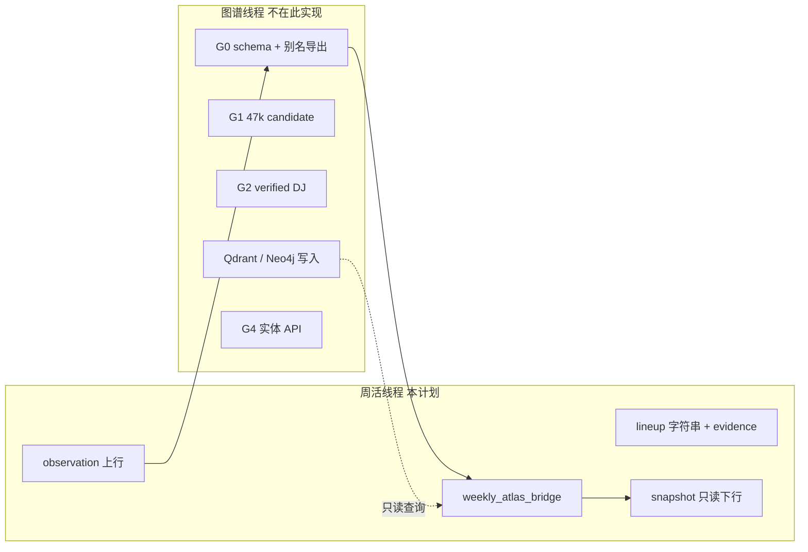

# 向量 × 图谱联动执行计划（周活侧）

> **已合并至 [PLAN_WEEKLY_MINIPROGRAM_UNIFIED.md](./PLAN_WEEKLY_MINIPROGRAM_UNIFIED.md)**（§8）。请以 UNIFIED 为准。

Updated: 2026-05-19  
Status: **ARCHIVED**（L1 代码已落地；执行见 UNIFIED Sprint 4）  
关联：`PLAN_B_DEEPRESEARCH_v2.md`、`WeeklyAtlasEntityContract.md`

## 1. 双轨分工（必须牢记）



| 轨道 | 负责方 | 向量角色 |
|------|--------|----------|
| **图谱 G0–G4** | 图鉴主线 | 建库、embedding、alias 导出、verified 晋升 |
| **周活 L0–L4** | 本仓库 `weekly_atlas_bridge` | **只读**消费 alias/registry；向量仅 **review 候选**，不进小程序展示 |

## 2. 硬约束（产品 + 工程）

1. **向量不得自动展示**：`match_method=vector_candidate` → `display_tier=hide`，仅写入 observation / review 队列。
2. **不增加 lineup 人名**：Resolver 只解析已有 raw 名，禁止用图谱关系/向量邻域猜新艺人。
3. **bio/头像仅 verified**：`artist_profiles` 与 `dj_bio_lines` 仅 `verified=true` 或 registry `bio_manual`。
4. **不写 production 图**：本模块禁止 Neo4j/Qdrant/mem0 写入；Qdrant 仅 `search`/`scroll` 探测。
5. **小程序≠图谱**：本计划不替代 Stage7 93k/47k 管线。

## 3. 匹配阶梯（周活 Resolver v0）

| 阶 | 数据源 | 阈值 | 小程序 `artist_id` | `display_tier` |
|----|--------|------|-------------------|----------------|
| L1 | `weekly_artists_seed.json` exact | 1.0 | 是 | show |
| L2 | 图谱 alias 导出 exact | ≥0.98 | 是 | show |
| L3 | fuzzy 唯一候选 | ≥0.92 | 是 | show |
| L4 | fuzzy 多候选 | ≥0.92 | **否** | show_with_hint（仅 canonical 名 hint） |
| L5 | Qdrant `person_current` 向量 | top-1 | **否** | hide + `vector_review` |
| L6 | 无匹配 | — | null | hide |

默认 Qdrant 集合（只读）：`person_current` alias（见 `run_qdrant_role_alias_router_smoke.py`）。

## 4. 周活路线图 L0–L4

| 阶段 | 周期 | 交付 | 状态 |
|------|------|------|------|
| **L0** | 2 周 | `WeeklyAtlasEntityContract.md` | ✅ 草案 |
| **L1** | 4 周 | `weekly_atlas_bridge`：registry+alias+fuzzy；可选向量 review | ✅ v0 代码 |
| **L2** | 3 周 | build 前挂载 snapshot → `artist_profiles` / `lineup_resolved` | ⏳ |
| **L3** | 4 周 | 每周 `weekly_entity_observations.jsonl` | ✅ 导出脚本 |
| **L4** | 6 周 | 向量候选人工 review UI / 图谱 ingest | ⏳ |

## 5. 图谱线程 G0–G4（供协同，非本 PR 实现）

| 阶段 | 图谱工作 | 周活依赖物 |
|------|----------|------------|
| G0 | 统一 schema；导出 `atlas_alias_export.jsonl` | L2 alias exact |
| G1 | 47k → candidate 表 | 提高 L2/L3 召回 |
| G2 | 500 高频 DJ → verified | `artist_profiles` bio/图 |
| G3 | verified 关系边 | 深度页（非周活 MVP） |
| G4 | 实体 HTTP API | 替代本地 jsonl 快照 |

## 6. 代码落点（已实现 v0）

```
tools/stage7_rewrite/weekly_atlas_bridge/
  __init__.py
  normalize.py
  resolver.py          # 五级阶梯 + 向量 review
  indexes.py           # registry / alias / 可选 qdrant
  snapshot.py
  observations.py
  tests/test_resolver.py

tools/stage7_rewrite/scripts/
  build_weekly_atlas_snapshot.py
  export_weekly_entity_observations.py
```

## 7. 命令（只读）

```powershell
cd C:\code\githubstar\wechathtmldownload

# 从当前发布包生成 snapshot（registry + seed alias，无向量）
python tools\stage7_rewrite\scripts\build_weekly_atlas_snapshot.py `
  --current D:\downstream_results\stage7_rewrite\longrun\WEEKLY_ACTIVITY_MINIPROGRAM_API_20260519\current.json `
  --out D:\downstream_results\stage7_rewrite\longrun\WEEKLY_ACTIVITY_MINIPROGRAM_API_20260519\weekly_entity_snapshot.json

# 可选：启用 Qdrant 向量 review（需本机 6333 + person_current）
python tools\stage7_rewrite\scripts\build_weekly_atlas_snapshot.py `
  --current ...\current.json `
  --enable-vector-review `
  --qdrant-url http://127.0.0.1:6333

# 导出上行 observation
python tools\stage7_rewrite\scripts\export_weekly_entity_observations.py `
  --current ...\current.json `
  --out ...\weekly_entity_observations.jsonl

# 单测
python -m unittest tools.stage7_rewrite.weekly_atlas_bridge.tests.test_resolver -v
```

## 8. 与计划一 Golden 协同

| 计划一 | 计划二 |
|--------|--------|
| `gold.artist_id` 人工标注 | Resolver P/R 评测 |
| P3 解锁 `dj_bio_lines` | 仅 `verified` snapshot 行可灌入 |
| lineup 召回提升 | **只标准化**，不猜新人 |

## 9. 待拍板（向量相关）

| # | 决策 | 推荐 |
|---|------|------|
| V1 | 向量集合 | `person_current` 只读；不用多集合混搜进周活 |
| V2 | 向量命中是否上行 observation | **是**（含 score/payload），不进展示 |
| V3 | embedding 查询文本 | 仅 `raw` 艺人名；不做全文 embedding 直到 G4 API |
| V4 | snapshot 刷新 | 每日 build 前 regenerate（与 OpenClaw 同频） |

## 10. 首轮 dry-run（2026-05-19）

| 指标 | 值 |
|------|-----|
| 活动条数 | 103 |
| lineup 解析行 | 89 |
| 匹配分布（仅 seed registry） | `no_match` 89（待 G0 alias 导出后回升） |
| observation 行 | 103 |
| 产物 | `...\WEEKLY_ACTIVITY_MINIPROGRAM_API_20260519\weekly_entity_snapshot.json` |
| | `...\weekly_entity_observations.jsonl` |

## 11. 验收（L1 退出门禁）

- [x] `test_resolver` 全通过（4/4）
- [x] 103 条发布包生成 snapshot，无异常
- [ ] `vector_candidate` 条目不出现 `display_tier=show`
- [ ] observation 幂等（同 `event_id` + `publish_package` 不重复膨胀）
- [ ] Golden verified ≥20 条后 resolver P≥0.90（子集）
