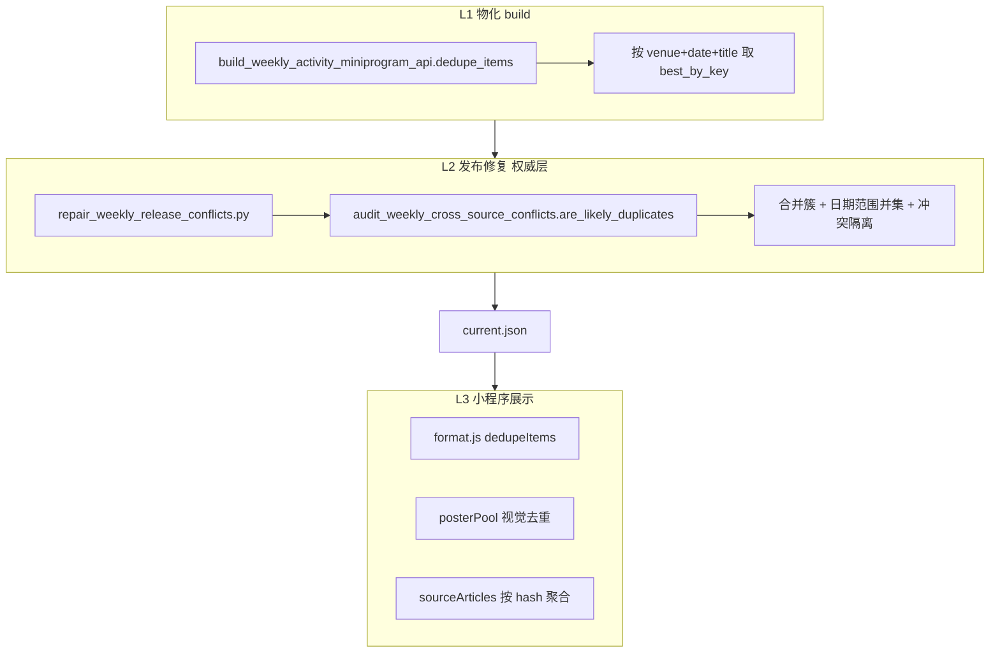
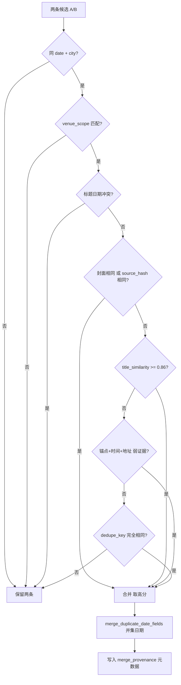

# 周活小程序去重与展示逻辑深度设计（RA Guide 参照版）

> **已合并至 [PLAN_WEEKLY_MINIPROGRAM_UNIFIED.md](./PLAN_WEEKLY_MINIPROGRAM_UNIFIED.md)**（§7）。请以 UNIFIED 为准。

Updated: 2026-05-20  
Status: **ARCHIVED**  
关联：`PLAN_MASTER_INTEGRATED_20260520.md`、`OPENCLAW_AUTOMATION.md`  
参照：Resident Advisor（RA）活动发现体验 — **一活动一卡片、多来源可溯源、推广帖合并而非重复展示**

---

## 1. 设计目标（RA 式产品哲学）

| RA 用户预期 | 周活对应策略 |
|-------------|--------------|
| 同一晚同场地只看到一个「活动」 | **事件级去重**（非文章级列表） |
| 早鸟/开票/阵容公布是同一活动的更新 | **推广帖归类为 EventVersion**，合并进保留项 |
| 不同场地或明确不同日期 = 不同活动 | **硬边界**：`date + city + venue_scope` |
| 详情可看原始来源 | `sourceHash` + SOURCE ARTICLES 聚合 |
| 宁可少展示也不展示错活动 | 冲突项 **隔离**（quarantine），不弱合并 |

**硬约束（继承全计划）**

- 不放松 `duplicate=0` / `conflict=0` 发布门
- 标题内 **冲突日期**（如 `5/3` vs `5/16`）→ **禁止合并**
- 前端 `dedupeItems` **不得比发布包更宽松**（只能同等或更严）
- 向量/图谱 **不参与** 去重猜新人

---

## 2. 现状：三层去重架构（已核实）



### 2.1 各层规则对比（关键差异）

| 维度 | L2 `are_likely_duplicates`（Python，权威） | L3 `areLikelyDuplicateItems`（JS，展示） |
|------|------------------------------------------|----------------------------------------|
| 作用域 | 同 `date + city + venue_scope` | 同 `dateKey + cityKey + venueKey` |
| 标题冲突日期 | **有** `conflicting_title_dates` 否决 | **无** |
| 标题锚点 token | **有** `shared_title_anchor` | **无** |
| 可信时间+地址弱合并 | similarity≥0.3 可合并 | **无** |
| 封面相同 | cover 相同 + sim≥0.5 | cover 相同 + sim≥0.5 |
| 默认相似度阈值 | **0.86** + 多条件 OR | **0.86** 或 dedupeKey 相等 |

**结论（Hypothesis → 待验证）**：用户若在仅刷新 API、未跑 Step 4.5 修复时打开小程序，前端可能 **再次合并** 或 **合并规则不一致**，造成「列表条数与 manifest 不符」的困惑。

**推荐（P0）**：以 L2 为 **Single Source of Truth**，将规则下沉为共享规范 `weekly_dedup_spec.v1.json`，Python/JS 同测。

---

## 3. RA 式「事件身份」模型（Event Identity）

### 3.1 身份分量

```yaml
event_identity:
  required:
    - event_date_start   # 单日或范围起点（合并后取并集）
    - city_key           # 规范城市
    - venue_scope        # 场地/主办方作用域（见下）
  soft:
    - title_fingerprint  # 去噪标题指纹
    - title_anchor_tokens # 艺人/活动名片段
    - source_hash        # 同源推文
    - cover_fingerprint  # 封面 URL 去 query
  veto:
    - conflicting_title_dates  # 标题内互斥日期
    - cross_source_conflict    # 同标题不同场地/地址/可信时间
```

### 3.2 venue_scope（场地作用域）

对齐 `audit_weekly_cross_source_conflicts.venue_scope_matches`：

1. `venue_name` 精确归一化相等  
2. 或 `address_full` 相等  
3. 或 短 venue 包含于长 venue **且** `same_event_owner`（同 promoter/account）

**RA 类比**：RA 把「Fabric London」与「fabric」视为同场地序列；周活用 **主办方一致性** 防止跨品牌误并。

### 3.3 推广帖 taxonomy（EventVersion）

| 类型 | 标题特征（PROMO_TITLE_NOISE） | 处理 |
|------|------------------------------|------|
| `announcement` | 开票/预售/早鸟/提醒/倒计时 | 与同 identity **合并** |
| `lineup_drop` | 全阵容/阵容公布/官宣 | 合并；保留 lineup 更全的一条 |
| `reminder` | 今晚/本周/周末 | 合并 |
| `distinct_event` | 无推广噪声 + 锚点不同 | **不合并** |

**合并时保留策略**（已有 `rank_item` / `itemQualityScore`）：

```
score = source_detail_score + quality_score + 字段完整度
优先：非 agg-child > 有 source_hash > 标题更长 > lineup 更多 > 日期范围更宽
```

---

## 4. 去重决策树（与 RA「一活动一 listing」对齐）



### 4.1 与「跨源冲突」分界

| 情形 | 分类 | 动作 |
|------|------|------|
| 同 date/city/venue，标题相似 | **duplicate** | 合并，删其余 |
| 同 date/city，标题相似，**不同 venue 或地址或可信时间** | **conflict** | `quarantine`，整组不进 current |
| 同 venue，标题含 **互斥日期** | **not duplicate** | 保留两条（防 WIGWAM 5/3 vs 5/16 类事故） |

---

## 5. 聚合文（一文多场）与 RA 排期页

### 5.1 管线侧（已有）

- 父级合集：`publish_blocked`，不直接进 feed  
- 子活动：`agg-child-*`，`child_dedupe_key = dates|city|venue|title|source_url`  
- 重复子活动：`child_duplicate_suppressed`

### 5.2 展示侧（RA 式「Venue Schedule」）

| 页面 | 逻辑 | 参照 RA |
|------|------|---------|
| 首页列表 | 仅 **独立事件卡片**（已修复 release） | RA Events list |
| 场馆详情 SOURCE ARTICLES | 按 `sourceHash` 分组；多场共享 hash 或 agg 才展示 | RA venue + related articles |
| 活动详情 | 单条 + 跳转原文 | RA event detail |

**设计增补（L2.5）**

- 场馆页增加 **「同馆本周 N 场」** 计数（不去重重复计算）  
- 聚合子活动卡片标注 `来自排期合集`（`isAggregate` 已有）

---

## 6. 小程序三层展示逻辑（深化）

### 6.1 列表 `dedupeItems`（应对齐 L2）

**现状**：`format.js` 独立实现，缺 anchor / 标题日期否决 / 弱证据 OR 条件。

**目标行为**：

1. 若 API 已跑 `repair_weekly_release_conflicts`：前端 dedupe **可降级为幂等校验**（expect 0 合并）  
2. 若未修复包：前端 dedupe **不得宽于** Python 规则（移植 `conflicting_title_dates`、`shared_title_anchor`）

**建议新增字段**（下行，build 写入）：

```json
{
  "event_id": "venue:abc",
  "dedupe_key": "shanghai|loopy|2026-05-20|titlefp",
  "merge_provenance": {
    "merged_from": ["queue:xyz", "queue:uvw"],
    "merged_at": "2026-05-20T12:00:00Z",
    "reason": "duplicate_cluster"
  },
  "display_tier": "show"
}
```

`show_with_hint` 用于 **近重复未合并**（多候选艺人 hint），**不用于** 活动卡片重复。

### 6.2 海报池 `posterPool`（与列表去重正交）

| 键 | 用途 |
|----|------|
| `posterVisualKey` | cover URL / sourceHash+cover / id |
| 去重粒度 | **视觉**（同海报不重复横滑） |

**RA 类比**：RA 首页 hero 可同活动多图，但周活选择 **视觉去重 + 按评分排序**，避免横滑 48 张全是同一张海报。

**规则保持**：列表 dedupe ≠ 海报 dedupe；同一活动只应占列表 1 行，但海报池可只展示其 cover 一次。

### 6.3 SOURCE ARTICLES（场馆）

`buildVenueSourceArticles`：

- 按 `sourceHash` 分组  
- 仅 `group.length > 1` 或含 `agg-child` 才展示入口  

**增补设计**：

- 组内按 `source_published_at` 排序（最新在前）  
- 标题区分：`排期原文` vs `活动原文`（已有）  
- **禁止**按活动 dedupe 误伤：hash 不同绝不合并

---

## 7. 统一规范与代码落点（实施路线图）

### Phase D0 — 规范与黄金用例（2 周）

| 交付 | 路径 |
|------|------|
| 去重规范 JSON Schema | `tools/stage7_rewrite/specs/weekly_dedup_spec.v1.json` |
| 黄金用例 30 对 | `tools/stage7_rewrite/golden/dedup_pairs_v1.jsonl` |
| parity 测试 | `test_dedup_parity_py_js.py` |

用例层必须覆盖：

- 早鸟 + 正片（应合并）  
- 同封面不同标题（应合并）  
- 5/3 vs 5/16 标题（**禁止**合并）  
- 同标题不同地址（**冲突**隔离）  
- agg-child 同源重复（抑制）  

### Phase D1 — 发布层增强（3 周）

| 任务 | 文件 |
|------|------|
| 写入 `merge_provenance` | `repair_weekly_release_conflicts.py` |
| build 不再二次弱 dedupe（或对齐 L2） | `build_weekly_activity_miniprogram_api.py` |
| strict 报告增加 effective_near_dup | `audit_weekly_cross_source_conflicts.py` |

### Phase D2 — 前端对齐（2 周）

| 任务 | 文件 |
|------|------|
| 移植 Python 否决规则 | `apps/weekly_activity_miniprogram/utils/dedupe.js`（新模块，从 format.js 拆出） |
| `format.js` 改为调用共享 dedupe | `format.js` |
| 详情页展示合并来源（可选） | `pages/detail/detail.wxml` |
| 单测 parity | `tests/dedupe-parity.test.cjs` |

### Phase D3 — RA 式体验抛光（持续）

- 场馆页「本周 N 场」统计  
- 列表副标题显示「含 N 篇来源推文」仅当 `merge_provenance.merged_from.length > 1`  
- OpenClaw 日更后自动跑 `dedup_parity` 门禁  

---

## 8. 评测指标（去重专属）

| 指标 | 定义 | 目标 |
|------|------|------|
| `raw_duplicate_clusters` | 修复前簇数 | 仅监控 |
| `effective_duplicate_clusters` | 修复后 | **0** |
| `conflict_clusters` | 跨源冲突簇 | **0** |
| `false_merge_rate` | 金标应分立却被合并 | **0**（一票否决） |
| `false_split_rate` | 金标应合并却仍分立 | ≤5% |
| `frontend_extra_merge` | API 103 条 → 前端 dedupe 后 <103 | **0**（修复包） |
| `poster_visual_dup_rate` | 海报池相邻重复视觉 | ≤2% |

评测命令（已有 + 待增）：

```powershell
# 发布层
python tools\stage7_rewrite\scripts\audit_weekly_cross_source_conflicts.py `
  --input D:\downstream_results\stage7_rewrite\longrun\WEEKLY_ACTIVITY_MINIPROGRAM_API_20260519\current.json `
  --strict --fail-on-raw-duplicates

# 小程序层（待增）
cd apps\weekly_activity_miniprogram
node --test tests/dedupe-parity.test.cjs
```

---

## 9. 与计划一/二接口

| 计划 | 去重关系 |
|------|----------|
| 计划一 P1 URL 清洗 | 不改变 dedupe 键；减少 bio 行噪声 |
| 计划一 P2 repair 评分 | **互补**：评分保留 lineup ≠ 事件合并 |
| 计划二 resolver | **独立**：艺人解析不去重事件 |
| Golden Set | 新增 `gold.should_merge_with` 可选字段 |

---

## 10. 待拍板（≤3 项）

| # | 决策 | 推荐 |
|---|------|------|
| D1 | 前端 dedupe 策略 | **信任发布包** + parity 校验；无修复包时用严规则 |
| D2 | build 层 dedupe | **弱化或删除**，避免与 L2 双重标准 |
| D3 | 合并来源是否展示 | 详情页小字「合并自 N 篇推文」增强 RA 溯源感 |

---

## 11. 关键代码索引（实施入口）

| 层级 | 路径 |
|------|------|
| 权威去重审计 | `tools/stage7_rewrite/scripts/audit_weekly_cross_source_conflicts.py` |
| 发布修复 | `tools/stage7_rewrite/scripts/repair_weekly_release_conflicts.py` |
| build 物化 dedupe | `tools/stage7_rewrite/scripts/archive_old/build_weekly_activity_miniprogram_api.py` |
| 前端 dedupe | `apps/weekly_activity_miniprogram/utils/format.js` |
| 海报视觉 dedupe | `apps/weekly_activity_miniprogram/utils/posterPool.js` |
| 场馆来源聚合 | `apps/weekly_activity_miniprogram/utils/sourceArticles.js` |
| 聚合子活动 dedupe | `tools/stage7_rewrite/scripts/expand_weekly_aggregate_articles.py` |

---

*本文档为 RA 参照下的去重与展示逻辑深化设计；实施前建议先完成 D0 黄金用例，再动 D1/D2 代码。*
