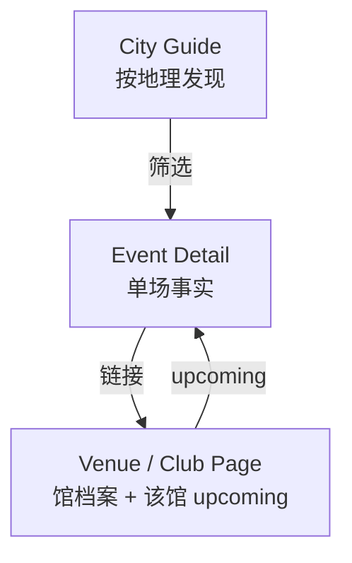
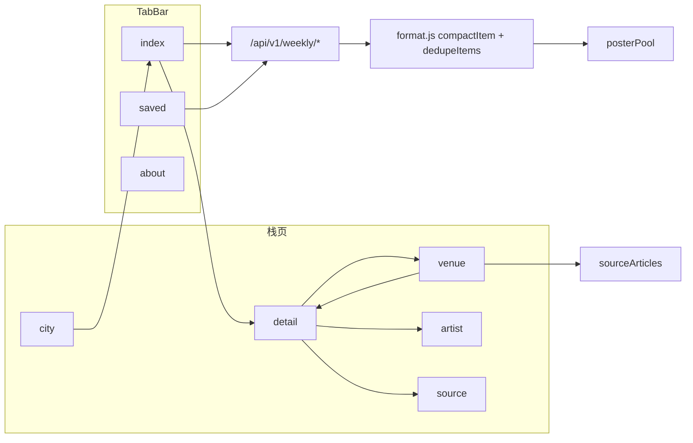
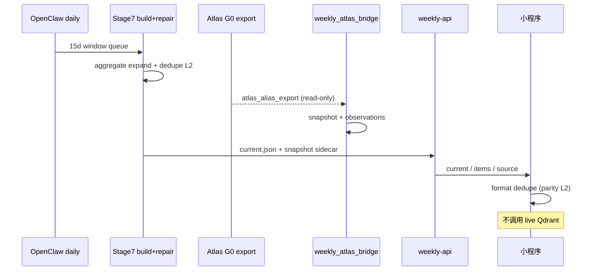

# 横纵深度研究：小程序 UI × RA Guide × Atlas 超级库交叉设计

> **已合并至 [PLAN_WEEKLY_MINIPROGRAM_UNIFIED.md](./PLAN_WEEKLY_MINIPROGRAM_UNIFIED.md)**（§2–5、§8）。请以 UNIFIED 为准。

Generated: 2026-05-20  
Status: **ARCHIVED**  
关联文档：

| 文档 | 关系 |
|------|------|
| `PLAN_DEDUP_LOGIC_RA_20260520.md` | 去重与事件身份 |
| `PLAN_IA_SCHEDULE_PLACEMENT_20260520.md` | 周/月排期放俱乐部主页 |
| `PLAN_B_VECTOR_ATLAS_EXECUTION_20260519.md` | 周活 L0–L4 / 图谱 G0–G4 |
| `WeeklyAtlasEntityContract.md` | 上下行契约 |
| `reports/ATLAS_WEEKLY_INTEGRATED_UNDERSTANDING_20260520.md` | Atlas 现场合成 |
| `reports/ATLAS_WEEKLY_DEEP_RESEARCH_DESIGN_PLAN_20260520.md` | Atlas 身份层路线 |

---

## 0. 执行摘要（先读这段）

你们其实在运营 **三个不同层级的「真」**：

| 层级 | 系统 | 回答的问题 | 用户触点 |
|------|------|------------|----------|
| **发现层** | 周活小程序 | 最近 15 天去哪蹦？ | index / detail / 筛选 |
| **场馆层** | 俱乐部主页（待升级） | 这家店这周怎么排？ | venue + SOURCE/SCHEDULE |
| **知识层** | Atlas 图鉴超级库 | 这个人/馆在全历史里是谁？ | **不进 feed**；只读 enrich + 反哺 observation |

**集成铁律**（与 RA 心智、去重门一致）：

```text
Atlas → 周活：只读 alias / verified profile / venue_id（snapshot）
周活 → Atlas：observation 证据流（不直写 production）
向量：只 review 队列，永不自动 show 进列表
去重：L2 发布包为 SSOT，前端不宽于 Python
排期文：俱乐部主页，不在城市页堆全文
```

**当前最大阻塞（交叉比对结论）**：

1. **G0 未落地**：`atlas_alias_export.jsonl` 无产物 → resolver 89/89 `no_match`  
2. **俱乐部主页未成形态**：`venue` 是模糊匹配壳，不是 RA Venue Profile  
3. **三层 dedupe 未契约化**：L2 Python ≠ L3 `format.js`  
4. **Atlas 与周活计数勿混**：138k 文章 ≠ 103 条周活发布包  

---

## 1. 纵轴（历时）：产品如何走到今天

### 1.1 阶段划分

| 阶段 | 时间感 | 特征 | 遗留债 |
|------|--------|------|--------|
| **S0 归档** | 93k 微信文章 | 下载 + OCR + Markdown | 与周活窗口无关 |
| **S1 结构化** | Stage7 LLM 抽取 | entities/events 进 release pack | 多 schema 线并行 |
| **S2 周活 MVP** | 15 天窗口 feed | `current.json` + 小程序 index | URL/lineup 质量门 |
| **S3 发布治理** | IDFIX / guardian | duplicate=0、source gate | backendRawHits 曾 51 |
| **S4 聚合车道** | aggregate 父禁发、子场发布 | SOURCE ARTICLES on venue | 缺 schedule 分层 |
| **S5 图谱并行** | 138k stable + Neo4j prod | Atlas `/atlas`、SQLite | ceid / alias export 未产品化 |
| **S6 桥接 L1** | `weekly_atlas_bridge` v0 | snapshot + observation | **等 G0 导出** |

### 1.2 演化逻辑（为何现在会纠结「放城市还是俱乐部」）

- 早期：**城市筛选** 就能满足「去哪玩」→ `index` + `city` 目录足够。  
- 中期：公众号出现大量 **一文多场 / 周排期 / 月历** → 管线拆 `agg-child`，父文 `publish_blocked`。  
- 近期：产品要 **RA 式溯源** → `venue` 加 SOURCE ARTICLES，但 **没有 stable venue_id**，排期文与单场混在同一模糊名下列表。  
- 并行：Atlas 有 **全历史身份**，周活只要 **本场证据** → 必须用契约隔离，否则向量会把历史同台误灌进 15 天 feed。

**交叉洞察**：UI 纠结不是「缺一个页面」，而是 **发现层（城市时间）与场馆层（主办方域）与知识层（Atlas）三套坐标系未在 IA 上拆清**。

---

## 2. 横轴 A：RA Guide 逻辑解构（对标产品）

> RA 不是竞品代码，是 **用户心智与信息架构的参照系**。

### 2.1 RA 的三层导航（共时模型）



| RA 概念 | 含义 | 周活应对 |
|---------|------|----------|
| **Event** | 某晚某馆一场可参加的活动 | `current` 一条（含 agg-child） |
| **Venue** | 稳定场馆实体 + 地址 + 该馆事件列表 | 目标：`club_profile`（升级 `venue`） |
| **City Guide** | 地理透镜，聚合多馆事件 | `index?city=` + `city` 目录 |
| **Editorial / Picks** | 策展推荐，非用户发帖 | `forYou` tab + 海报池（非 RA 同款，可保留） |
| **Promo posts** | 开票/提醒/阵容公布 | **合并进 Event**，不进 feed 重复行 |
| **Schedule roundup** | 馆方周排期推文 | **俱乐部主页 SCHEDULE**，非城市页正文 |

### 2.2 RA 不会做的事（周活也必须不做）

| RA 不做 | 周活禁止 |
|---------|----------|
| 用「相似海报」自动合并不同日期活动 | 标题互斥日期否决合并 |
| 把未验证艺人关系展示为事实 | 向量命中 `display_tier=hide` |
| 在城市页嵌入各馆内部排期全文 | 城市页仅统计+跳转 |
| 用历史图谱猜本场 lineup 新人 | Resolver 不增 raw 名 |

### 2.3 RA ↔ 周活 UI 对照表（完全映射）

| UI 区块 | 周活现状 | RA 等价 | 差距 |
|---------|----------|---------|------|
| Hero + 城市/日期 pill | `index` filter modal | City + date filter | ✅ 对齐 |
| Featured 横滑海报 | `posterPool` 24–48 张 | Editorial carousel | ✅ 有意增强；与列表 dedupe 正交 |
| 按日分组列表 | `groups` + `event-row` | Events by date | ✅ 对齐 |
| 列表行：馆名 | `listLocationLabel` | Venue link | ⚠️ 多数可点，依赖详情跳 venue |
| 活动详情 | `detail` | Event page | ✅；缺「合并来源 N 篇」小字 |
| 艺人页 | `artist` limit=100 | Artist / DJ page | ⚠️ 无 Atlas verified bio 挂载 |
| 场地页 | `venue` fuzzy match | **Venue profile** | ❌ 无 registry_id；排期/原文混列 |
| 城市目录 | `city` → index | City guide entry | ⚠️ 无首页入口；navigateTo tab 风险 |
| 原文 | `source` + 打开公众号 | External editorial | ✅ |
| 收藏 | `saved` tab | RA bookmarks | ✅ |

---

## 3. 横轴 B：小程序 UI 逻辑全图（共时 · 己方）

### 3.1 页面与数据流



### 3.2 首页 `index` 决策链（用户一次打开发生了什么）

1. **拉数**：分页 `current`（最多 20×100）+ `cities` + `dates`；窄筛选时额外拉 **无筛选** 池作海报源。  
2. **筛选**：`cityKey` / `date` 传 API；静态回退时 `api.js` 再过滤 + dedupe。  
3. **Tab**：`all` | `forYou`（完整度≥5）| `new`（post_date）。  
4. **展示层 dedupe**：`format.dedupeItems`（scope: date+city+venue；相似度 0.86 / cover / sourceHash）。  
5. **海报池**：`buildPosterPool` 视觉 key 去重，可循环填充至 24–48。  
6. **分组**：按 `event_date_start` 日分组渲染。  

**与 RA 对齐点**：用户心智是 **「按城市/日期发现 Event」**。  
**与 Atlas 交界点**：列表 **不展示** `artist_id` 解析过程；lineup 展示 raw 清洗结果，hint 来自 `show_with_hint`（若 L2 挂载 snapshot）。

### 3.3 详情 `detail` 决策链

- 单条 `items/{id}` → `compactItem`  
- 可信时间才显示（`TRUSTED_TIME_SOURCES`）— 符合「不猜事实」  
- 跳 **artist** / **venue** / **source** / 公众号原文  
- 收藏本地 storage  

**Atlas 挂载点（设计态 L2）**：若 snapshot 有 `verified` profile，详情 lineup 可显示 `canonical_name` + 角标；**无 verified 则保持 raw**。

### 3.4 场地 `venue` 决策链（当前最弱一环）

- `current?limit=100` + 客户端 `venueMatches`（子串包含，**非 registry**）  
- `buildVenueSourceArticles`：同 `sourceHash` 多场或 agg-child → SOURCE ARTICLES  
- UPCOMING：过滤后的 events  

**与 `PLAN_IA_SCHEDULE_PLACEMENT` 一致**：周/月排期应在此升级为 **SCHEDULE & SOURCES**，不应搬到 `city`。

### 3.5 去重在 UI 的三条独立管道

| 管道 | 文件 | 粒度 | 与 RA 关系 |
|------|------|------|------------|
| 事件列表 dedupe | `format.js` / `api.js` | 同晚同馆同活动 | 应对齐 L2 Python |
| 海报视觉 dedupe | `posterPool.js` | 同 cover 不重复横滑 | RA 无等价；保留 |
| 来源聚合 | `sourceArticles.js` | 同 hash 排期入口 | RA venue related articles |

---

## 4. 横轴 C：Atlas 超级数据库（共时 · 知识层）

### 4.1 Atlas 是什么（相对周活）

| 维度 | Atlas | 周活 |
|------|-------|------|
| 时间窗 | 十余年 138k 文章 | 15 天发布窗口 |
| 实体 | 151 万 release entities；Neo4j 91 万图实体 | 103–158 条/包 |
| 目标 | 图鉴 / 检索 / Graph RAG / Explorer | 发现 + 溯源 + 证据回灌 |
| ID | `ceid`（规划）/ `eid` / `ent_*` 多轨 | `event_id` / `venue:hash` |

### 4.2 存储与消费面（只读边界）

```text
Bronze(微信/OCR) → stable 138k → canonical registry [待建] → Neo4j + Qdrant
                                      ↓ G0 export
                            atlas_alias_export.v1.jsonl
                                      ↓
                            weekly_atlas_bridge → snapshot → [L2] build 挂载
                                      ↑
                            weekly_entity_observations.jsonl (上行)
```

**周活禁止**：写 Neo4j、写 Qdrant、live 向量搜人进列表、用图边猜本场 lineup。

### 4.3 Resolver 阶梯与 UI 的映射

| 阶 | match_method | 小程序表现 | Atlas 依赖 |
|----|--------------|------------|------------|
| L1 | registry_exact | 可链 artist 页 | seed |
| L2 | alias_exact | 可链 artist + verified bio | **G0 export** |
| L3 | fuzzy_unique | 同上 | alias + 阈值 |
| L4 | fuzzy_multiple | **仅 hint 文案**，无 artist_id | — |
| L5 | vector_candidate | **hide**，进 review | Qdrant 只读 |
| L6 | no_match | raw lineup | — |

### 4.4 交叉比对：Atlas 能做什么、不能做什么

| 用例 | Atlas 能力 | 周活是否采用 | 理由 |
|------|------------|--------------|------|
| 艺人别名统一 | alias export | ✅ L2+ | 降 no_match，不增新人 |
| 艺人 bio/头像 | verified profile | ✅ 详情/artist 页 | RA 级艺人页 |
| 场馆 canonical | venue_resolved | ✅ 俱乐部主页 P1 | 替代 fuzzy match |
| 同台关系 | graph edges | ❌ feed | 非本场证据 |
| 向量近邻 | Qdrant top-k | ❌ show；✅ observation | 防误链 |
| 历史活动推荐 | Graph RAG | ❌ MVP | 非 15 天发现 |
| 跨源去重 | 无（非发布包） | ❌ | 周活 L2 专有逻辑 |
| 周排期文识别 | aggregate 规则 | ✅ 已有管线 | UI 归俱乐部主页 |

---

## 5. 交叉轴：三系统一体设计

### 5.1 统一对象模型（三套 ID 共存）

```yaml
# 发现层 — 周活 Event（RA Event）
weekly_event:
  id: "loopy:abc"              # 发布包主键
  identity: date + city + venue_scope
  display: compactItem 字段集

# 场馆层 — Club Profile（RA Venue）
club_profile:
  organizer_key: "registry:oil_club"   # 来自 weekly_venues_seed / Atlas venue
  display_name: "OIL CLUB"
  upcoming_event_ids: [...]
  schedule_sources: [{hash, horizon: week|month}]

# 知识层 — Atlas Entity（图鉴）
atlas_entity:
  ceid: "ceid_..."
  artist_id: "atlas:entity:ceid_..."    # 周活兼容字段
  verified: bool
  aliases: [...]
```

**交叉规则**：

- `weekly_event` 去重 **不读取** `ceid`（防图谱历史污染）  
- `club_profile.organizer_key` 由 **Atlas venue_resolved 或 registry** 解析，禁止子串匹配长期化  
- `artist_id` 仅当 resolver ≥ L3 且非 vector 才进入 UI 链接  

### 5.2 三页分工定稿（回答「城市 vs 俱乐部」）

| 页面 | 发现层 | 场馆层 | 知识层 |
|------|--------|--------|--------|
| **index（城市筛选）** | ✅ 事件列表 | 行内馆名 → 跳 club | 不展示 |
| **city 目录** | ✅ 入口 | — | — |
| **club 主页** | ✅ upcoming | ✅ 排期+原文 | 可选 verified 角标 |
| **detail** | ✅ 单场 | 链 club | lineup resolved |
| **artist** | ✅ 相关场 | — | bio/avatar from Atlas |

### 5.3 数据流时序（OpenClaw 日更）



---

## 6. Atlas × 周活 交叉比对门禁（评测矩阵）

### 6.1 发布包级

| 检查项 | Atlas 侧 | 周活侧 | 通过标准 |
|--------|----------|--------|----------|
| 条数语义 | 138k articles | 103 events | 文档不写混 |
| URL 泄漏 | — | guardian backendRawHits | 0 |
| duplicate | — | audit strict | 0 |
| snapshot 覆盖率 | alias 行数 | lineup resolved 非 no_match | >60% 待 G0 后定标 |
| vector show | — | 无 show+vector_candidate | 0 |

### 6.2 UI 级

| 检查项 | 方法 |
|--------|------|
| 列表条数 = manifest | API count = index groups 求和（修复包） |
| 前端额外合并 | dedupe 前后 diff = 0 |
| 俱乐部排期入口 | 有 agg 的馆 SOURCE≥1 |
| artist 链接准确率 | Golden verified ≥20 后测 P/R |

### 6.3 双向反哺

| 方向 | 产物 | Atlas ingest 规则 |
|------|------|-------------------|
| 周活→Atlas | `weekly_entity_observations.jsonl` | observation 队列，不直写 production |
| Atlas→周活 | `atlas_alias_export` + snapshot | 只读；每周/每日 regenerate |

---

## 7. 集成实施路线图（仅计划，按门控排序）

### Wave 0 — 口径与契约（1 周）

| ID | 任务 | 产出 |
|----|------|------|
| W0-1 | 确认三系统 SSOT 索引 | 本文 + INDEX 更新 |
| W0-2 | `weekly_dedup_spec.v1.json` | Python/JS parity 规格 |
| W0-3 | `club_profile.v1` 字段草案 | IA-P1 输入 |
| W0-4 | Golden 同步至单文件 ≥88 行 | 可 cross-check |

### Wave 1 — 发布与 IA（2–3 周，无 Atlas 依赖）

| ID | 任务 | 依赖 |
|----|------|------|
| W1-1 | L2 dedupe 为唯一权威；前端 parity | W0-2 |
| W1-2 | 俱乐部主页 SCHEDULE 区（设计→实现） | `PLAN_IA_SCHEDULE` |
| W1-3 | venue → club_profile `organizer_key` | registry seed |
| W1-4 | guardian + URL 清零复验 | Task1 已做需复验 |

### Wave 2 — Atlas G0 与桥接（3–4 周）

| ID | 任务 | 依赖 |
|----|------|------|
| W2-1 | Atlas `canonical_entity_registry` + `atlas_alias_export` | Atlas Epic 0–1 |
| W2-2 | 重跑 snapshot，测 no_match 下降 | W2-1 |
| W2-3 | build 挂载 snapshot（L2） | W2-2 |
| W2-4 | observation 周更 ingest 规范 | Atlas 侧队列 |

### Wave 3 — UI × RA 抛光（2 周）

| ID | 任务 |
|----|------|
| W3-1 | detail 合并来源文案 |
| W3-2 | artist 页 verified bio/avatar |
| W3-3 | club 页「本周 N 场」+ schedule 徽章 week/month |
| W3-4 | city→index 改 switchTab + storage |

### Wave 4 — 可选深度（Atlas G3+）

| ID | 任务 | 说明 |
|----|------|------|
| W4-1 | Graph RAG 馆史摘要 | 仅 club ABOUT，不进 feed |
| W4-2 | 向量 review UI | L4 |
| W4-3 | G4 实体 API 替代 jsonl | 契约不变 |

---

## 8. 决策表（已由设计拍板，实施时勿漂移）

| # | 问题 | 决策 |
|---|------|------|
| 1 | 周/月排期放哪？ | **俱乐部主页**，不在城市页 |
| 2 | Atlas 参与去重吗？ | **否** |
| 3 | 向量参与展示吗？ | **否** |
| 4 | 列表 dedupe 以谁为准？ | **L2 Python 发布修复** |
| 5 | 城市页角色？ | **地理发现透镜** |
| 6 | RA 对齐优先级？ | Event > Venue > City > Artist |
| 7 | 138k vs 103？ | 文档与 API 分轨表述 |
| 8 | 俱乐部主页键？ | `organizer_key` / `venue_registry_id`，废弃长期 fuzzy |

---

## 9. 横纵交叉洞察（独到结论）

1. **RA 与 Atlas 在周活里职责正交**：RA 教你 **怎么排信息**（一活动一卡、馆页排期）；Atlas 教你 **谁是谁**（身份）。混用会导致「用图谱合并活动」或「用城市页放馆排期」两种典型错误。  

2. **你们已有 80% RA 发现流**，缺口在 **Venue Profile 形态** 与 **推广帖/排期文分层**，不在首页列表。  

3. **Atlas 超级库对周活的唯一关键路径是 G0 alias export**；Neo4j 91 万节点、Qdrant 138k 向量 **不阻塞** MVP 发现，但阻塞 **艺人页可信度**。  

4. **`venue` 页 + `sourceArticles` 已是最小 RA Venue 原型**；升级比新建页面便宜，应与 `organizer_key` 同步做。  

5. **交叉比对日常化**：每次 OpenClaw 发布后跑 **6.1 六行门禁** + Golden 抽样；Atlas 侧 alias export 版本号写入 `weekly_entity_snapshot.meta.atlas_export_rev`。  

---

## 10. 附录：关键路径速查

```
小程序 UI
  apps/weekly_activity_miniprogram/pages/index|detail|venue|city|artist|source
  utils/format.js | posterPool.js | sourceArticles.js | api.js

周活发布 / 去重
  tools/stage7_rewrite/scripts/repair_weekly_release_conflicts.py
  tools/stage7_rewrite/scripts/audit_weekly_cross_source_conflicts.py

Atlas 桥接
  tools/stage7_rewrite/weekly_atlas_bridge/
  docs/weekly-miniprogram-handoff-20260519/WeeklyAtlasEntityContract.md

Atlas 主线（只读参考）
  reports/ATLAS_WEEKLY_INTEGRATED_UNDERSTANDING_20260520.md
  docs/ELECTRONIC_MUSIC_GRAPH_CURRENT_AUTHORITY_20260518.md
```

---

*本文档为横纵深度研究后的集成设计计划；实施任一 Wave 前请先核对 handoff 现场 API 版本与条数，勿用 stale 107/104 口径。*
