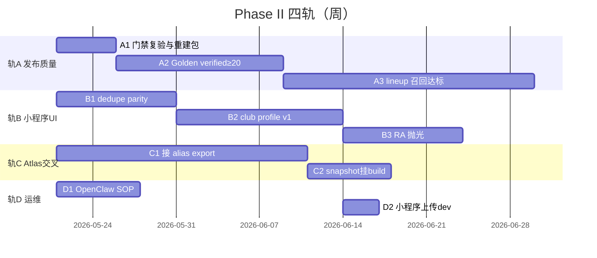

# 周活小程序 — 下一阶段执行计划（Phase II）

> **已合并至 [PLAN_WEEKLY_MINIPROGRAM_UNIFIED.md](./PLAN_WEEKLY_MINIPROGRAM_UNIFIED.md)**（§9–11）。本文档仅作历史保留，请以 UNIFIED 为准。

Updated: 2026-05-21  
Status: **ARCHIVED** — 执行入口见 `PLAN_WEEKLY_MINIPROGRAM_UNIFIED.md`

---

## 0. 阶段定义

| 项 | 说明 |
|----|------|
| **Phase I（已完成/在途）** | P0 Golden 种子、L1 bridge、蜂群 Task1–4（URL/repair/resolver/observation 脱敏） |
| **Phase II（本计划）** | **可发布质量** + **RA 式 IA** + **Atlas 只读挂载** + **小程序体验闭环** |
| **Phase III（展望）** | 提审上线、向量 review UI、Graph RAG 馆史、G4 实体 API |

**执行前 5 分钟核对（禁止用 stale 数字）：**

1. `docs/weekly-miniprogram-handoff-20260519/INDEX.md`  
2. `apps/weekly_activity_miniprogram/OPENCLAW_AUTOMATION.md` 顶部口径  
3. `check_weekly_release_guard.ps1` 对 **当前** `current.json` 跑一遍  

---

## 1. Phase II 总目标（6 周内）

| 维度 | 现状（handoff 底准，执行前需复验） | Phase II 出口 |
|------|-----------------------------------|---------------|
| **发布门禁** | backendRawHits 曾 51；蜂群已改 build+guardian | **0** + duplicate/conflict **0** |
| **lineup 覆盖** | ~40/103（~39%） | **≥55/窗口条数（~55%）** |
| **Golden** | 88 pending | **≥20 verified**，baseline 可测 |
| **实体解析** | 89/89 no_match（无 G0） | alias 接入后 **有 ID 率 ≥40%**（先验目标） |
| **小程序 UI** | venue 模糊匹配；dedupe 双层不一致 | **俱乐部主页 v1** + dedupe parity |
| **Atlas 交叉** | snapshot 未挂 build | L2 挂载 + observation 周更 SOP |
| **版本** | dev `2026.05.19.8` 未提审 | 新 dev 包 + **用户批准前不提审** |

---

## 2. 架构原则（Phase II 不漂移）

```text
发现层（index/city）     → 只展示「单场活动」Event 卡
场馆层（club profile）   → 排期文 + SOURCE + UPCOMING（RA Venue）
知识层（Atlas bridge）   → 只读 enrich；向量永不 show
发布层（L2 repair/audit）→ dedupe SSOT；前端不宽于 Python
```

**明确不做：** 放松 source/duplicate 门、向量自动链艺人、城市页堆排期全文、周活写 Neo4j/Qdrant。

---

## 3. 四轨并行（推荐编排）



---

## 4. Sprint 拆解（可勾选执行）

### Sprint 1（第 1–2 周）— 「能信的数据」

**目标：** 当前发布包 guardian 全绿 + 度量可信。

| ID | 任务 | 负责层 | 验收 |
|----|------|--------|------|
| S1-1 | 复验蜂群分支 `feature/weekly-integrated-bridge`：16 项单测 + guardian | 管线 | 全绿日志归档 |
| S1-2 | 用最新 OpenClaw 包重建 `current.json`（非 20260519 旧包若已 supersede） | 管线 | manifest 条数与 CloudRun 一致 |
| S1-3 | 确认 `backendRawHits=0`、`visibleHits=0`、strict audit duplicate/conflict=0 | 门禁 | guardian JSON ok:true |
| S1-4 | 同步 Golden 单文件：`golden/golden_set_v1.jsonl` = archive 88 行 | P0 | 行数一致 |
| S1-5 | 人工标注 **≥20** 条 `annotation_status: verified` | P0 | evaluate 脚本出 P/R 报告 |
| S1-6 | 跑 `evaluate_weekly_golden_baseline.py` 留 baseline | P0 | `P0_BASELINE_REPORT` 更新 |

**Sprint 1 退出：** guardian 全绿 + ≥20 verified + baseline 报告 dated。

---

### Sprint 2（第 2–4 周）— 「发布层 + 去重契约」

**目标：** lineup 回升；dedupe 单一权威。

| ID | 任务 | 负责层 | 验收 |
|----|------|--------|------|
| S2-1 | 合并/复验 repair 软评分（Task2）：全量 repair 回归 | 管线 | missing_lineup 降 ≥10 条 |
| S2-2 | 落地 `weekly_dedup_spec.v1.json` + Python/JS parity 测试（D0） | 管线+小程序 | parity 测试 PASS |
| S2-3 | `format.js` 对齐 L2 否决规则或改为「仅校验」模式 | 小程序 | 修复包上 frontend_extra_merge=0 |
| S2-4 | build 写入 `merge_provenance`（可选字段） | 管线 | 抽样 5 条合并簇有元数据 |
| S2-5 | 重跑 cross-source audit + repair on 新包 | 管线 | effective_duplicate=0 |

**Sprint 2 退出：** lineup ≥50 条（或达 55%）+ dedupe parity PASS。

---

### Sprint 3（第 3–5 周）— 「俱乐部主页 + RA IA」

**目标：** 用户可见的产品结构对齐 RA。

| ID | 任务 | 负责层 | 验收 |
|----|------|--------|------|
| S3-1 | 定义 `club_profile.v1`：`organizer_key` 来自 registry | 设计+API | 文档+schema 草案 |
| S3-2 | API 下行 `GET /weekly/clubs/{key}` 或 items 内嵌 `organizer_key` | 后端 | 本地 smoke |
| S3-3 | 升级 `pages/venue` → Club Profile：UPCOMING + SCHEDULE & SOURCES | 小程序 | 周/月徽章 week/month |
| S3-4 | `venueMatches` 改为 key 匹配，保留名称 fallback 一层 | 小程序 | 回归：OIL/Wigwam 等金标馆 |
| S3-5 | `city` → `index` 改 `switchTab` + storage 传 city | 小程序 | 真机无 tab 跳转错误 |
| S3-6 | venue/artist 分页拉全 current（cursor 循环） | 小程序 | >100 场时不丢条 |
| S3-7 | detail：合并来源「N 篇推文」小字；saved 传 lang | 小程序 | UI review |

**Sprint 3 退出：** 任一点进详情→俱乐部主页可见排期区；城市页仍无排期全文。

---

### Sprint 4（第 4–6 周）— 「Atlas 交叉 + 上线准备」

**目标：** 只读图谱增强可测；dev 包可提审（需用户批）。

| ID | 任务 | 负责层 | 依赖 | 验收 |
|----|------|--------|------|------|
| S4-1 | 图谱侧产出 `atlas_alias_export.v1.jsonl`（G0） | Atlas | Epic0–1 | 文件存在+行数>seed |
| S4-2 | `build_weekly_atlas_snapshot.py --alias-export` 重跑 | 桥接 | S4-1 | no_match 率下降 |
| S4-3 | build 前挂载 snapshot → `lineup_resolved` / `artist_profiles` | 管线 | S4-2 | 仅 verified 进 bio |
| S4-4 | 断言无 `vector_candidate` + `display_tier=show` | 门禁 | S4-3 | 脚本 0 违规 |
| S4-5 | 每周 export `weekly_entity_observations.jsonl` 进 OpenClaw SOP | 运维 | — | checklist 勾选 |
| S4-6 | DevTools 极端 UI 10/10 + 目标单测全绿 | QA | S3 | artifact 路径 |
| S4-7 | `upload_native_windows.ps1` 新 VersionDesc | 发布 | 用户批准 | 开发版号递增 |

**Sprint 4 退出：** snapshot 挂载 + observation SOP + 新 dev 上传；**提审单独决策**。

---

## 5. 小程序页面 — Phase II 交付清单

| 页面 | Phase II 变更 | 优先级 |
|------|---------------|--------|
| **index** | dedupe 信任发布包；列表副标题馆名稳定 | P0 |
| **detail** | merge 溯源；Atlas hint/verified 展示规则 | P1 |
| **venue→club** | organizer_key、SCHEDULE 区、分页 | P0 |
| **city** | switchTab；可选「有排期馆」统计 | P2 |
| **artist** | verified bio/avatar；分页 | P1 |
| **source** | 无结构性变更 | — |
| **saved** | 带 lang 进详情 | P2 |
| **about** | 版本号与 Phase II 一致 | P3 |

---

## 6. 管线 — Phase II 交付清单

| 模块 | 变更 | 状态参考 |
|------|------|----------|
| `build_weekly_activity_miniprogram_api.py` | CDN 清洗（Task1） | 蜂群已做，需合并+复验 |
| `repair_weekly_*` | 软评分（Task2） | 蜂群已做 |
| `audit/repair_weekly_release_conflicts` | merge_provenance | 待做 |
| `weekly_atlas_bridge` | alias+fuzzy（Task3–4） | 蜂群已做 |
| `weekly_dedup_spec.v1.json` | 新建 | 待做 |
| guardian 脚本 | backendRawHits 强阻断 | 蜂群已做 |

---

## 7. 每周节奏（OpenClaw 对齐）

| 日 | 动作 |
|----|------|
| **每日 12:30** | `run_openclaw_weekly_daily_publish.ps1`（或 stable 脚本） |
| **发布后 +30min** | guardian + strict audit + lineup audit |
| **发布后 +1h** | snapshot + observations export（若 alias 可用） |
| **每周五** | Golden 再标 10 条；更新 `P0_BASELINE_REPORT` |
| **每 Sprint 末** | DevTools 极端 UI + 16+parity 单测 |

---

## 8. 门禁总表（Phase II 每周必跑）

```powershell
# 1) Guardian
powershell -NoProfile -File C:\Users\pc\.codex\skills\huaidj-weekly-release-guardian\scripts\check_weekly_release_guard.ps1 `
  -CurrentReleaseDir <当前发布目录>

# 2) Strict 去重/冲突
python C:\code\githubstar\wechathtmldownload\tools\stage7_rewrite\scripts\audit_weekly_cross_source_conflicts.py `
  --input <current.json> --strict --fail-on-raw-duplicates

# 3) 目标单测
cd C:\code\githubstar\wechathtmldownload
python -m unittest tools.stage7_rewrite.tests.test_weekly_golden_baseline tools.stage7_rewrite.weekly_atlas_bridge.tests -v
cd apps\weekly_activity_miniprogram
node --test tests/*.test.mjs

# 4) Snapshot（有 alias 时）
python tools\stage7_rewrite\scripts\build_weekly_atlas_snapshot.py --current <current.json> --alias-export <alias.jsonl> --out <snapshot.json>
```

| 门禁 | 标准 |
|------|------|
| backendRawHits | 0 |
| duplicate/conflict clusters | 0 |
| vector_candidate + show | 0 |
| frontend 列表条数 vs API | 相等（修复包） |
| Golden verified | Sprint1≥20；Phase末≥40 |

---

## 9. 风险与依赖

| 风险 | 缓解 |
|------|------|
| Atlas G0 延期 | Sprint 3 不阻塞；S4 降级为仅 seed+registry |
| 合并蜂群分支与脏 worktree | `git-workspace-guardian`：独立 worktree 合并 |
| handoff 103 条 vs 线上 158 条口径分裂 | 执行前只信 INDEX + OPENCLAW 顶部 |
| 提审过早 | Phase II 末 **单独** 用户批准 |
| venue 模糊匹配误并 | Sprint 3 强制 organizer_key |

---

## 10. Phase II 完成定义（DoD）

- [ ] 当前发布包 guardian **连续 2 次** weekly 发布全绿  
- [ ] lineup 覆盖率 **≥55%**（或 Golden 证实等效质量）  
- [ ] Golden **≥40 verified** + baseline 报告  
- [ ] 小程序 **Club Profile v1** 上线开发版（版本号递增）  
- [ ] dedupe Python/JS **parity** 测试纳入 CI 或 OpenClaw checklist  
- [ ] Atlas：alias 接入后 snapshot **有 ID 率 ≥40%**（或文档记录未达原因）  
- [ ] observation 周更 **SOP 文档化** 且执行 1 次有日志  
- [ ] `PLAN_ROADMAP` 更新为 **Phase II 完成 / Phase III 待启**

---

## 11. 文档阅读顺序（实施 agent）

1. **本文件** `PLAN_MINIPROGRAM_NEXT_PHASE_20260521.md`  
2. `HANDOFF_CHECKPOINT` → 核对现场数字  
3. 按 Sprint 选读：`PLAN_DEDUP`（S2）、`PLAN_IA_SCHEDULE`（S3）、`PLAN_B_VECTOR`（S4）、`PLAN_HV`（总览）  
4. `PLAN_MASTER_INTEGRATED`（Task 步骤级细节）  

---

## 12. Phase III 预告（不在 Phase II 承诺内）

- 微信**提审**与生产放量策略  
- 向量候选 **人工 review** 小程序页  
- Atlas **G4 实体 HTTP API** 替代 jsonl  
- 场馆页 **Graph RAG 馆史** 摘要（verified 段落）  
- 城市页「本周有排期的馆」索引  

---

*Phase II 负责人：实施 agent 按 Sprint 勾选推进；每 Sprint 结束更新 `HANDOFF_CHECKPOINT` 一节即可，无需散写多份状态文档。*
