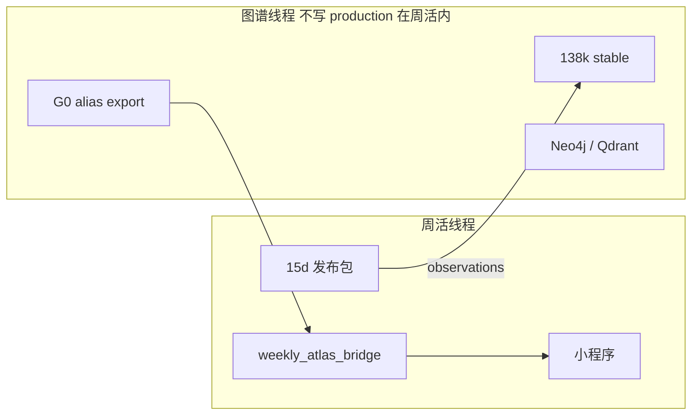
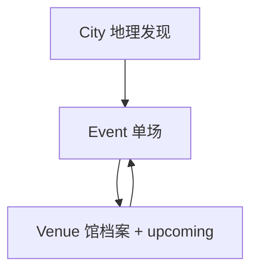

# HUAIDJ 周活小程序 — 统一主计划（全文）

Updated: 2026-05-21
Status: **ACTIVE — 唯一执行 SSOT**
Scope: 小程序产品 + Stage7 发布管线 + Atlas 只读交叉（不含图谱 production 写入）

> **本文档已合并以下分散计划的全文要点：**
> `PLAN_MINIPROGRAM_NEXT_PHASE_20260521` · `PLAN_HV_ATLAS_RA_UI_INTEGRATED_20260520` · `PLAN_DEDUP_LOGIC_RA_20260520` · `PLAN_IA_SCHEDULE_PLACEMENT_20260520` · `PLAN_MASTER_INTEGRATED_20260520` · `PLAN_B_VECTOR_ATLAS_EXECUTION_20260519` · `WeeklyAtlasEntityContract` · `PLAN_ROADMAP_20260519`
> 实施 agent **只读本文 + HANDOFF_CHECKPOINT + OPENCLAW 顶部口径**；旧文件保留作历史 diff，不再作为执行入口。

---

## 目录

1. [执行摘要](#1-执行摘要)
2. [权威现场与阶段](#2-权威现场与阶段)
3. [架构总览](#3-架构总览)
4. [产品设计：RA 与三层「真」](#4-产品设计ra-与三层真)
5. [小程序 UI 全图](#5-小程序-ui-全图)
6. [信息架构：城市 / 俱乐部 / 排期](#6-信息架构城市--俱乐部--排期)
7. [去重与事件身份](#7-去重与事件身份)
8. [Atlas 超级库交叉比对](#8-atlas-超级库交叉比对)
9. [Phase II 执行（Sprint 1–4）](#9-phase-ii-执行sprint-14)
10. [管线工程与蜂群 Task](#10-管线工程与蜂群-task)
11. [门禁、节奏与 DoD](#11-门禁节奏与-dod)
12. [风险、决策表、Phase III](#12-风险决策表phase-iii)
13. [路径与文档索引](#13-路径与文档索引)

---

## 1. 执行摘要

### 1.1 你们在运营什么

| 层级 | 系统 | 回答的问题 | 用户触点 |
|------|------|------------|----------|
| **发现层** | 周活小程序 | 最近 15 天去哪蹦？ | `index` / `city` 筛选 / `detail` |
| **场馆层** | 俱乐部主页（升级 `venue`） | 这家店这周怎么排？ | UPCOMING + SCHEDULE & SOURCES |
| **知识层** | Atlas 图鉴（138k 文章级） | 这人/馆在全历史里是谁？ | **不进 feed**；snapshot enrich + observation 上行 |

### 1.2 集成铁律（不可漂移）

```text
Atlas → 周活：只读 alias / verified profile / venue_id（weekly_entity_snapshot.json）
周活 → Atlas：weekly_entity_observations.jsonl（observation，不直写 production）
向量：match_method=vector_candidate → display_tier=hide，永不自动 show
去重：L2 发布修复 + audit 为 SSOT；前端 format.js 不得宽于 Python
排期文（周/月计划）：俱乐部主页；城市页不堆全文
列表：只展示单场 Event（含 agg-child）；父 aggregate publish_blocked
```

### 1.3 Phase II 一句话

**6 周内：** 发布门禁全绿 → lineup ~55% → Golden ≥40 verified → Club Profile v1 + dedupe parity → Atlas alias 挂载 snapshot → 新 dev 包（提审单独批准）。

**2026-05-21 线程更新：** Sprint 1 gate 已闭环；Sprint 2 已完成 dedupe parity、`merge_provenance`、duplicate source-map redirect。当前线程专管周活小程序与 Atlas 只读交叉引用，以及活动推文整理时“不重复发卡、不丢来源”。Atlas 主线接手不属于本文线程。

---

## 2. 权威现场与阶段

### 2.1 执行前必核对（禁止 stale 数字）

| 来源 | 用途 |
|------|------|
| `INDEX.md` 表 | 接手包登记口径 |
| `OPENCLAW_AUTOMATION.md` 顶部 | 线上 CloudRun / 条数 |
| `check_weekly_release_guard.ps1` | 当前包硬门禁 |

**当前执行底准（2026-05-21，以 CHECKPOINT + OPENCLAW 顶部为准）：**

| 项 | 值 |
|----|-----|
| CloudRun | `weekly-api-039` |
| 发布条数 / 窗口 | 158 / `2026-05-20..2026-06-03` |
| 小程序 dev | `2026.05.21.1`（既有开发版；本线程未新上传；未提审） |
| guardian | ok=true；visibleHits=0；backendRawHits=0 |
| strict 去重 | duplicate=0；effective_duplicate=0；conflict=0 |
| lineup | 100/158；missing_lineup 58；hard_fail_count=0 |
| Golden | 88 条；20 conservative snapshot verified；68 pending |
| atlas snapshot | 209 lineup rows；alias_exact=63；fuzzy_multiple=90；no_match=56 |

**勿混：** Atlas **138,102** 文章 ≠ 周活 **~100–160** 条/包；历史 28/51/74/107 等不得当线上事实。

### 2.2 阶段划分

| 阶段 | 内容 | 状态 |
|------|------|------|
| **Phase I** | P0 Golden 种子；L1 `weekly_atlas_bridge`；蜂群 Task1–4（URL/repair/resolver/observation） | 已完成/待合并分支 |
| **Phase II** | 本计划 Sprint 1–4 | **当前；Sprint 1 完成，Sprint 2 去重/推文来源整合已完成首段** |
| **Phase III** | 提审、向量 review UI、G4 API、Graph RAG 馆史 | 展望 |

### 2.3 产品演进（纵轴摘要）

```text
S0 93k 归档 → S1 Stage7 结构化 → S2 周活 15d feed → S3 IDFIX/guardian
→ S4 aggregate 子场 + SOURCE ARTICLES → S5 Atlas 138k Neo4j
→ S6 weekly_atlas_bridge L1（等 G0 alias）
```

**交叉洞察：** 「排期放城市还是俱乐部」本质是 **三套坐标系（城市时间 / 主办方域 / 全历史身份）未在 IA 拆清**，不是缺页面。

---

## 3. 架构总览

### 3.1 管线分层（L0–L4 + Bridge）

```text
L0 原文/OCR 证据
  ↓
L1 规则：日期、seed exact、白名单
  ↓
L2 LLM：Flash 全量 → Pro 风险行
  ↓
L3 发布：merge → repair(软评分) → audit(strict) → build_api(CDN 清洗)
  ↓
L4 Bridge：atlas_alias → resolver 六级 → snapshot 下行 / observations 上行
  ↓
API current.json → 小程序
```

### 3.2 双轨分工（周活 vs Atlas）



| 轨道 | 负责 | 向量角色 |
|------|------|----------|
| 图谱 G0–G4 | 图鉴主线：ceid、alias、verified、Neo4j、Qdrant | 建库；周活 **不 live 搜人进列表** |
| 周活 L0–L4 | `weekly_atlas_bridge` | 只读消费 alias；向量仅 **review** |

### 3.3 Phase II 四轨甘特（推荐）

- **轨 A 发布质量：** 门禁复验 → Golden → lineup 回升
- **轨 B 小程序 UI：** dedupe parity → Club Profile → RA 抛光
- **轨 C Atlas 交叉：** alias export → snapshot 挂 build
- **轨 D 运维：** OpenClaw SOP → dev 上传

---

## 4. 产品设计：RA 与三层「真」

### 4.1 RA Guide 参照（心智，非代码）



| RA 概念 | 周活对应 | 对齐度 |
|---------|----------|--------|
| Event | `current` 一条（含 agg-child） | ✅ |
| City Guide | `index?city=` + `city` 目录 | ✅ |
| Venue | 升级 `pages/venue` → Club Profile | ⚠️ 缺 organizer_key |
| Promo 帖 | 合并进 Event，不重复占卡 | ✅ 管线 |
| Schedule 推文 | 俱乐部 SCHEDULE 区 | ⚠️ 待 Sprint 3 |

**RA 不做 → 周活禁止：** 弱合并互斥日期；向量猜艺人；城市页排期全文；图谱猜本场 lineup 新人。

### 4.2 周活 vs RA 页面映射

| UI | 现状 | Phase II |
|----|------|----------|
| index | 筛选 + 海报池 + 按日列表 | dedupe 信任发布包 |
| detail | 单场 + 原文 | merge 溯源小字 |
| venue | 模糊匹配 + UPCOMING + SOURCE | **Club Profile + SCHEDULE** |
| city | 目录 → index | switchTab 修 tab 风险 |
| artist | limit=100 | verified bio + 分页 |

---

## 5. 小程序 UI 全图

### 5.1 导航

**TabBar：** `index` | `saved` | `about`
**栈页：** `detail` · `venue` · `artist` · `source` · `city`

```text
index ──→ detail ──→ venue / artist / source
city ──→ index?city=   （应改为 switchTab + storage）
saved ──→ detail
```

### 5.2 首页 `index` 数据链

1. 分页 `GET /api/v1/weekly/current`（cursor，最多 20×100）
2. 并行 `cities` / `dates`；窄筛选时额外拉无筛选池作海报源
3. Tab：`all` | `forYou`（完整度≥5）| `new`（post_date）
4. `format.dedupeItems`（date+city+venue）
5. `posterPool`：视觉 key 去重，24–48 张，与列表 dedupe **正交**
6. 按 `event_date_start` 分组列表

**API 回退链：** 云托管 → 公网 CloudRun → 静态 JSON → mock（开发者工具）

### 5.3 关键工具模块

| 文件 | 职责 |
|------|------|
| `utils/format.js` | `compactItem`、`dedupeItems`、风格/阵容清洗 |
| `utils/posterPool.js` | 横滑推荐池 |
| `utils/sourceArticles.js` | 场馆同源 hash 聚合（排期原文入口） |
| `utils/api.js` | 请求 + 静态过滤 dedupe |
| `utils/listDisplay.js` | 列表行地点文案 |

### 5.4 已知技术债（Phase II 要修）

| 问题 | 处理 Sprint |
|------|-------------|
| venue/artist 只拉 100 条 | S3-6 分页 |
| city→index 用 navigateTo 打开 tab | S3-5 switchTab |
| dedupe 在 api.js 与 format.js 重复且与 Python 不一致 | S2 |
| saved→detail 未带 lang | S3-7 |
| venue 子串模糊匹配 | S3-4 organizer_key |

---

## 6. 信息架构：城市 / 俱乐部 / 排期

### 6.1 两类内容（不可混）

| 类型 | 数据 | 展示 |
|------|------|------|
| **A 单场活动** | 独立条 + `agg-child-*` | 首页/城市筛选列表 |
| **B 排期/计划原文** | aggregate 父 `publish_blocked` + 同源推文 | **仅俱乐部主页** |

### 6.2 拍板决策

| 问题 | 决策 |
|------|------|
| 周/月排期放哪？ | **俱乐部主页** `SCHEDULE & SOURCES` |
| 城市页？ | **发现透镜**（选城→筛活动）；可选统计「M 馆有排期」**不嵌全文** |
| 首页？ | 只展示 A；B 不占活动卡 |
| 周 vs 月 UI？ | 同一列表 + `week`/`month` 徽章（推荐，不拆双 Tab） |

### 6.3 Club Profile 目标结构

```text
俱乐部名 · 城市 · 地址 · 运营状态
├── UPCOMING EVENTS        （A，按 event_date 排序）
├── SCHEDULE & SOURCES     （B，week/month 徽章）
└── ABOUT                  （registry / Atlas verified 段落）
```

用户路径：**首页场卡 → 详情 → 俱乐部主页 → 排期原文**。

### 6.4 边界：多馆合集（WTR 等）

- 子场：按馆进各自 UPCOMING
- 父文：挂在 **发文账号** organizer 页，不塞进城市页全文

---

## 7. 去重与事件身份

### 7.1 三层架构

| 层 | 位置 | 角色 |
|----|------|------|
| L1 | `build_weekly_activity_miniprogram_api.dedupe_items` | 物化弱去重 |
| **L2** | `repair_weekly_release_conflicts` + `audit_weekly_cross_source_conflicts` | **权威 SSOT** |
| L3 | `format.js` / `posterPool` / `sourceArticles` | 展示；列表应对齐 L2 |

**风险：** L3 缺 `conflicting_title_dates`、`title_anchor_tokens`、弱证据 OR → 可能多并/漏并。
**对策：** `weekly_dedup_spec.v1.json` + Python/JS parity；修复包上前端 **仅校验**（expect 0 合并）。

### 7.2 事件身份

```yaml
required: [event_date_start, city_key, venue_scope]
veto: [conflicting_title_dates, cross_source_conflict]
soft: [title_fingerprint, title_anchor_tokens, source_hash, cover_fingerprint]
```

**venue_scope：** 馆名相等 | 地址相等 | 短馆名包含且同 promoter/account。

### 7.3 推广帖 taxonomy → 合并

| 类型 | 处理 |
|------|------|
| 早鸟/开票/提醒/阵容公布 | EventVersion，合并保留高分条 |
| 标题互斥日期（5/3 vs 5/16） | **禁止合并** |
| 同标题不同场地/地址 | **conflict → quarantine** |

### 7.4 去重决策树（摘要）

同 date+city → venue_scope? → 标题日期冲突? → cover/hash/相似度≥0.86/锚点弱证据 → 合并 + 日期并集 + `merge_provenance`。

### 7.5 实施阶段（去重专属）

| 阶段 | 交付 |
|------|------|
| D0 | `weekly_dedup_spec.v1.json` + 30 对黄金用例 + parity 测 |
| D1 | 发布层 `merge_provenance`；build 弱化二次 dedupe |
| D2 | `dedupe.js` 对齐；detail 合并来源文案 |
| D3 | 馆「本周 N 场」；OpenClaw dedup 门禁 |

---

## 8. Atlas 超级库交叉比对

### 8.1 Atlas 是什么（相对周活）

| | Atlas | 周活 |
|---|-------|------|
| 规模 | 138k 文章；Neo4j ~91 万图实体 | 15d 窗口 ~100–160 条 |
| 目标 | 图鉴 / 检索 / Graph RAG | 发现 + 溯源 |
| ID | `ceid`（规划）/ 多轨 eid | `event_id` / `venue:hash` |

**仓库位置：** `C:\code\githubstar\wechathtmldownload`（非独立 atlas 仓）。

### 8.2 数据流

```text
Atlas G0: atlas_alias_export.v1.jsonl
    ↓ 只读
weekly_atlas_bridge → weekly_entity_snapshot.json → [L2] build 挂载
    ↑
weekly_entity_observations.jsonl（每周 publish 后）
```

### 8.3 Resolver 阶梯与 UI

| 阶 | match_method | 小程序 artist_id |
|----|--------------|------------------|
| 1 | registry_exact | ✅ show |
| 2 | alias_exact | ✅ show |
| 3 | fuzzy_unique | ✅ show |
| 4 | fuzzy_multiple | ❌ 仅 hint |
| 5 | vector_candidate | ❌ hide + review |
| 6 | no_match | raw |

**bio/头像：** 仅 `verified=true` → `artist_profiles`。

### 8.4 契约摘要（`WeeklyAtlasEntityContract` v1.0）

- **下行：** `artist_profiles`、`lineup_resolved`、`venue_resolved`
- **禁止下行：** 未验证边、向量猜同台、历史 lineup 猜本场
- **上行：** `lineup_raw` + `lineup_evidence` + `source_url_hash`（无明文 URL）

### 8.5 交叉比对用例

| 用例 | 做法 |
|------|------|
| Golden ↔ Resolver | ≥20 verified → P/R |
| G0 后 no_match 率 | 重跑 snapshot，目标显著下降 |
| vector + show | 断言 0 |
| 条数语义 | 文档分轨 138k vs weekly 包 |
| observation 幂等 | 同 event_id + 包名不膨胀 |

### 8.6 图谱 G0–G4 vs 周活 L0–L4

| 图谱 | 周活依赖 |
|------|----------|
| G0 alias export | L2 挂载 **（当前阻塞）** |
| G2 verified DJ | bio/头像 |
| G4 实体 API | 替代 jsonl（Phase III） |

| 周活 | 状态 |
|------|------|
| L0 契约 | ✅ 草案 |
| L1 bridge | ✅ 代码 |
| L2 build 挂载 | ⏳ 待 G0 |
| L3 observations | ✅ 脚本 |

### 8.7 Atlas 命令

```powershell
python tools\stage7_rewrite\scripts\build_weekly_atlas_snapshot.py `
  --current <current.json> `
  --alias-export <atlas_alias_export.v1.jsonl> `
  --out <weekly_entity_snapshot.json>

python tools\stage7_rewrite\scripts\export_weekly_entity_observations.py `
  --current <current.json> `
  --out <weekly_entity_observations.jsonl>
```

---

## 9. Phase II 执行（Sprint 1–4）

### 9.1 总目标表

| 维度 | Phase II 出口 |
|------|---------------|
| 发布门禁 | backendRawHits=0；duplicate/conflict=0 |
| lineup | ≥55% |
| Golden | Sprint1 ≥20 verified；Phase末 ≥40 |
| 实体有 ID 率 | ≥40%（有 alias 后） |
| UI | Club Profile v1 + dedupe parity |
| 版本 | 新 dev；**提审须用户批** |

### 9.2 Sprint 1（1–2 周）— 能信的数据

| ID | 任务 | 验收 |
|----|------|------|
| S1-1 | 复验分支 `feature/weekly-integrated-bridge`：16+ 单测 + guardian | ✅ 全绿 |
| S1-2 | 最新 OpenClaw 包重建 current | ✅ 158 与 CloudRun 一致 |
| S1-3 | backendRawHits=0；strict audit 0/0 | ✅ ok=true；0/0/0 |
| S1-4 | Golden 单文件 88 行对齐 | ✅ 行数一致 |
| S1-5 | ≥20 verified | ✅ 20 conservative snapshot verified |
| S1-6 | 更新 P0_BASELINE_REPORT | ✅ dated |

### 9.3 Sprint 2（2–4 周）— 发布层 + 去重

| ID | 任务 | 验收 |
|----|------|------|
| S2-1 | repair 软评分合并复验 | missing_lineup ↓≥10 |
| S2-2 | `weekly_dedup_spec.v1.json` + parity | ✅ PASS |
| S2-3 | format.js 对齐 L2 或仅校验 | ✅ frontend_extra_merge=0 |
| S2-4 | merge_provenance 写入 | ✅ retained event 有元数据；source map redirect |
| S2-5 | audit + repair 新包 | 当前 158 包 strict 0/0/0；新包待下一次 OpenClaw 包 |

### 9.4 Sprint 3（3–5 周）— 俱乐部 + RA IA

| ID | 任务 | 验收 |
|----|------|------|
| S3-1 | `club_profile.v1` + organizer_key | ✅ schema v1 shell |
| S3-2 | API clubs 或 items 嵌 key | ✅ current/detail/batch 输出 `organizer_key` + `club_profile` |
| S3-3 | venue→Club Profile + SCHEDULE 徽章 | ✅ Club source/profile base；周/月徽章待 DevTools polish |
| S3-4 | key 匹配替代模糊 | ✅ detail→venue 带 key；venue 优先 organizerKey |
| S3-5 | city switchTab | ✅ pending city storage + switchTab |
| S3-6 | venue/artist cursor 分页 | ✅ limit=100 cursor loop，避免 >100 首屏截断 |
| S3-7 | detail 合并来源；saved lang | ✅ detail/venue source articles；saved detail lang |

**2026-05-21 本地闭环：** Sprint 3 可本地执行部分已完成，closeout 见 `SPRINT3_CLUB_SOURCE_CLOSEOUT_20260521.md`。本次未执行 DevTools 真机 10/10、CloudRun 新部署、小程序新上传或微信提审。

### 9.5 Sprint 4（4–6 周）— Atlas + 上线准备

| ID | 任务 | 验收 |
|----|------|------|
| S4-1 | `atlas_alias_export.v1.jsonl` | 图谱 G0 |
| S4-2 | 重跑 snapshot | no_match 下降 |
| S4-3 | build 挂 snapshot | 仅 verified bio |
| S4-4 | 无 vector+show | 0 违规 |
| S4-5 | observation 进 OpenClaw SOP | checklist |
| S4-6 | DevTools 10/10 + 单测 | artifact |
| S4-7 | upload dev 新号 | 用户批准上传 |

**2026-05-21 状态：** `stage7_safe_handoff_verify.ps1` 离线安全验证 PASS；S4 的 G0 alias/new snapshot/dev upload 仍受外部输入和用户批准约束。

---

## 10. 管线工程与蜂群 Task

### 10.1 蜂群 Task1–4（`feature/weekly-integrated-bridge`）

| Task | 内容 | 关键文件 |
|------|------|----------|
| **T1** | build CDN URL 清洗；guardian backendRawHits 强阻断 | `build_weekly_activity_miniprogram_api.py`；`check_weekly_release_guard.ps1` |
| **T2** | repair 软评分 ≥0.6 保留 lineup | `repair_weekly_lineup_address_time_fields.py` |
| **T3** | fuzzy 多候选 → `show_with_hint`，无 artist_id | `weekly_atlas_bridge/resolver.py` |
| **T4** | observation OpenID 脱敏 + source_url_hash | `observations.py` |

**Phase II 动作：** 合并分支 → 全量回归 → 重建发布包。

**2026-05-21 本地执行状态：** T1-T4 已在 `feature/weekly-integrated-bridge` 本地验证闭环完成，并补齐 `atlas_alias_export.v1.jsonl` 只读导出、20260520 snapshot 与 observations 双份物化。基础验证报告见 `../../reports/ATLAS_WEEKLY_FULL_PLAN_EXECUTION_CLOSEOUT_20260521.md`。

**2026-05-21 全做收口：** 已完成剩余安全本地计划：Atlas fuzzy/no-match review 包、observations ingest dry-run、Golden 标注候选包、release candidate dry-run、backend `/api/v1/weekly/atlas-events/:id` 只读接口、小程序 detail 只读 Atlas 展示与静态 fallback。全做报告见 `../../reports/ATLAS_WEEKLY_ALL_DO_CLOSEOUT_20260521.md`。未执行 CloudRun 部署、小程序上传、微信提审或 Atlas 生产写入。

| Gate | 2026-05-21 status |
|------|-------------------|
| backendRawHits | 0，Release Guardian 硬门禁 `backend_raw_hits_zero=true` |
| 小程序单测 | 29/29 pass |
| Python 关联单测 | 19/19 + 26/26 pass |
| lineup 覆盖 | 100/158，missing_lineup=58，hard_fail_count=0 |
| Atlas snapshot | 209 lineup rows，alias_exact=63，fuzzy_multiple=90，no_match=56 |
| Observations | 158/158 `source_url_hash`，0 OpenID/CDN/plaintext URL hit |
| Backend Atlas event API | 本地实现并通过 37/37 backend tests；fuzzy 多候选不暴露内部 candidate id |
| Golden annotation pack | 120 pending candidates |
| Release candidate dry-run | 硬化后 `release_candidate_local_gates_blocked`；阻断点 `daily_queue_refresh_effective=false` |
| Release Guardian | 硬化后 `ok=false`；`remoteTotal=158`、`backendRawHits=0`、`visibleHits=0`、小程序 29/29 仍通过；阻断点 `exporter_accounts_ok=0 / failed=122 / article_rows=0` |

### 10.2 关键代码路径

```text
# 发布 / 去重
tools/stage7_rewrite/scripts/repair_weekly_release_conflicts.py
tools/stage7_rewrite/scripts/audit_weekly_cross_source_conflicts.py
tools/stage7_rewrite/scripts/archive_old/build_weekly_activity_miniprogram_api.py
tools/stage7_rewrite/scripts/expand_weekly_aggregate_articles.py

# Golden / 评测
tools/stage7_rewrite/golden/golden_set_v1.jsonl
tools/stage7_rewrite/scripts/evaluate_weekly_golden_baseline.py

# Atlas 桥接
tools/stage7_rewrite/weekly_atlas_bridge/
tools/stage7_rewrite/scripts/build_weekly_atlas_snapshot.py
tools/stage7_rewrite/scripts/export_weekly_entity_observations.py

# 小程序
apps/weekly_activity_miniprogram/pages/
apps/weekly_activity_miniprogram/utils/
apps/weekly_activity_miniprogram/scripts/upload_native_windows.ps1

# 运维
tools/stage7_rewrite/run_openclaw_weekly_daily_publish.ps1
C:\Users\pc\.codex\skills\huaidj-weekly-release-guardian\scripts\check_weekly_release_guard.ps1
```

### 10.3 P1–P4 路线图（计划一/二对照）

| 阶段 | 计划一（识别） | 计划二（图谱） |
|------|----------------|----------------|
| P0 | Golden ≥80 | L0 契约 |
| P1 | URL 清洗、guardian | — |
| P2 | repair 评分、regex | — |
| P3 | tier UI、verified bio | L2 snapshot |
| P4 | 金标增量 | L3 observation 周更 |

---

## 11. 门禁、节奏与 DoD

### 11.1 每周必跑

```powershell
# Guardian
powershell -NoProfile -File C:\Users\pc\.codex\skills\huaidj-weekly-release-guardian\scripts\check_weekly_release_guard.ps1 `
  -CurrentReleaseDir <当前发布目录>

# Strict 去重
python C:\code\githubstar\wechathtmldownload\tools\stage7_rewrite\scripts\audit_weekly_cross_source_conflicts.py `
  --input <current.json> --strict --fail-on-raw-duplicates

# 单测
cd C:\code\githubstar\wechathtmldownload
python -m unittest tools.stage7_rewrite.tests.test_weekly_golden_baseline tools.stage7_rewrite.weekly_atlas_bridge.tests -v
cd apps\weekly_activity_miniprogram
node --test tests/*.test.mjs
```

| 门禁 | 标准 |
|------|------|
| backendRawHits | 0 |
| duplicate / conflict | 0 |
| vector_candidate + show | 0 |
| 前端列表条数 | = API（修复包） |
| false_merge（金标） | 0 |

### 11.2 OpenClaw 节奏

| 时机 | 动作 |
|------|------|
| 每日 12:30 | daily publish 脚本 |
| 发布后 +30min | guardian + audit + lineup audit |
| 发布后 +1h | snapshot + observations（有 alias） |
| 每周五 | Golden +10 verified；更新 baseline 报告 |
| Sprint 末 | DevTools 极端 UI |

### 11.3 Phase II DoD（勾选完成）

- [ ] guardian 连续 2 次 weekly 全绿
- [ ] lineup ≥55%
- [ ] Golden ≥40 verified + baseline
- [x] Club Profile v1 本地 API/UI 契约完成
- [x] dedupe parity 进 checklist/CI
- [ ] snapshot 有 ID 率 ≥40% 或记录原因
- [ ] observation SOP 执行 1 次有日志

---

## 12. 风险、决策表、Phase III

### 12.1 风险

| 风险 | 缓解 |
|------|------|
| G0 延期 | S3 不阻塞；S4 降级 seed only |
| 脏 worktree / 合并冲突 | 独立 worktree |
| 103 vs 158 口径分裂 | 只信 INDEX + OPENCLAW |
| 提审过早 | 单独用户批准 |
| venue 误并 | organizer_key |

### 12.2 已拍板决策表

| # | 决策 |
|---|------|
| 1 | 排期 → 俱乐部主页 |
| 2 | Atlas 不参与去重 |
| 3 | 向量不进展示 |
| 4 | dedupe SSOT = L2 Python |
| 5 | 城市页 = 发现透镜 |
| 6 | 周/月排期同区 + 徽章（非双 Tab） |
| 7 | 138k ≠ weekly 条数分轨表述 |

### 12.3 Phase III（不承诺在 Phase II）

- 微信提审与放量
- 向量人工 review 页
- G4 实体 HTTP API
- Graph RAG 馆史（verified 段落）
- 城市页「有排期的馆」索引

---

## 13. 路径与文档索引

### 13.1 实施 agent 阅读顺序

1. **本文** `PLAN_WEEKLY_MINIPROGRAM_UNIFIED.md`
2. `HANDOFF_CHECKPOINT_20260519.md`（核对现场）
3. `NEXT_AGENT_HANDOFF_WEEKLY_MINIPROGRAM_FULL.md`（边界细节）
4. `OPENCLAW_AUTOMATION.md`（运维口径）

### 13.2 已合并入本文的分散文档（归档参考）

| 原文件 | 合并章节 |
|--------|----------|
| `PLAN_MINIPROGRAM_NEXT_PHASE_20260521.md` | §9–11 |
| `PLAN_HV_ATLAS_RA_UI_INTEGRATED_20260520.md` | §2–5、§8 |
| `PLAN_DEDUP_LOGIC_RA_20260520.md` | §7 |
| `PLAN_IA_SCHEDULE_PLACEMENT_20260520.md` | §6 |
| `PLAN_MASTER_INTEGRATED_20260520.md` | §10 |
| `PLAN_B_VECTOR_ATLAS_EXECUTION_20260519.md` | §8 |
| `WeeklyAtlasEntityContract.md` | §8.4 |
| `PLAN_ROADMAP_20260519.md` | §10.3 |

### 13.3 仍独立维护（未并入）

| 文件 | 原因 |
|------|------|
| `NEXT_AGENT_HANDOFF_WEEKLY_MINIPROGRAM_FULL.md` | 运维 handoff 细节会变 |
| `DELIVERABLE_*` | 审计交付物 |
| `archive/` | LDR 原始研究 |
| `reports/ATLAS_WEEKLY_*` | Atlas 主线现场 |

---

*统一主计划 v1.0 — 每完成一个 Sprint 仅更新 `HANDOFF_CHECKPOINT` 数字与勾选 §11.3，无需再改分散 PLAN_* 文件。*
