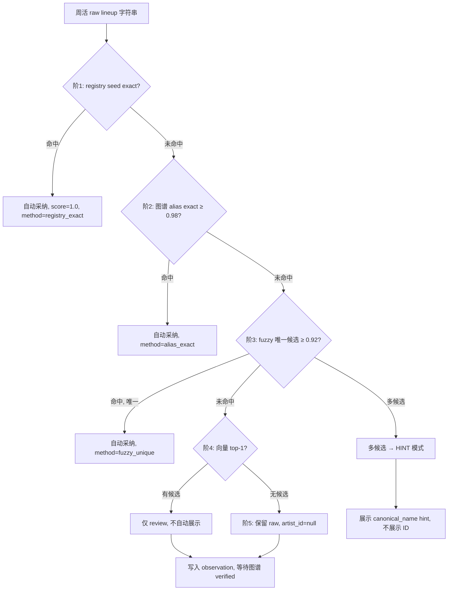

# WeChat Artifact Research

```json
{
  "generated_at": "2026-05-19T20:56:20",
  "role": "research_candidate_generator",
  "confirmed_truth": false,
  "next_gate": "HOLD_FOR_HERMES_DECISION",
  "forbidden_actions": [
    "write_mem0",
    "write_qdrant",
    "write_neo4j",
    "write_openhuman",
    "trigger_openclaw",
    "start_stage7"
  ],
  "model": "deepseek-v4-pro",
  "endpoint": "https://api.deepseek.com",
  "strategy": "direct",
  "source_dir": "/source_pack/weekly_plan_deepresearch_20260519",
  "source_doc_count": 10,
  "sources_used": [
    {
      "title": "02_PLAN_B_WEEKLY_ATLAS_ENTITY_LINKAGE.md",
      "link": "/source_pack/weekly_plan_deepresearch_20260519/02_PLAN_B_WEEKLY_ATLAS_ENTITY_LINKAGE.md",
      "snippet": "# 计划二：周活小程序 × 电子音乐图谱实体联动\n\nUpdated: 2026-05-19  \nStatus: **设计稿**（未实施）  \nNote: 图谱 **生产写入** 不在周活线程；本计划定义 **契约与解析层**。\n\n## 1. 分工哲学\n\n| | 周活小程序 | 电子音乐图谱 |\n|--|-----------|--------------|\n| 时间 | 未来 15 天 | 4.7 万+ 历史 |\n| 产品 | 大众查活动 | 图谱/RAG/研究 |\n| 实体 | 活动级快照 | canonical 艺人/场地/关系 |\n| 准确率 | 展示极严 | candidate + review 分层 |\n\n**联动原则**\n\n1. 图谱负责「是谁」（ID、别名、verified bio、资产）\n2. 周活负责「这一场」（日期、本场 lineup 证据）\n3. 周活 **不** 重复跑 full 图谱抽取；做 **Entity Linking**\n\n## 2. 架构\n\n```\n周活: OCR+LLM → lineup 字符串 + evidence\n图谱: Artist/Venue/Event 节点 + 别名\n联动: Entity Resolver → Confidence Merge → Weekly Entity Snapshot → 小程序 enriched\n```\n\n## 3. 图谱可提供（下行）\n\n| 能力 | 小程序用法 |\n|------|------------|\n| 艺人消歧 | canonical_name |\n| Verified bio | 艺人页简介（仅 verified） |\n| DJ 图片 | 头像/海报（带 source image_id） |\n| 场地 | 地址、同馆历史（可选深度） |\n\n**禁止灌入**\n\n- 未验证图谱边、向量猜同台、历史 lineup 猜本场\n\n## 4. Entity Resolver\n\n### 输出示例\n\n```yaml\nlineup_resolved:\n  - raw: \"Doon Kanda\"\n  ",
      "full_content": "# 计划二：周活小程序 × 电子音乐图谱实体联动\n\nUpdated: 2026-05-19  \nStatus: **设计稿**（未实施）  \nNote: 图谱 **生产写入** 不在周活线程；本计划定义 **契约与解析层**。\n\n## 1. 分工哲学\n\n| | 周活小程序 | 电子音乐图谱 |\n|--|-----------|--------------|\n| 时间 | 未来 15 天 | 4.7 万+ 历史 |\n| 产品 | 大众查活动 | 图谱/RAG/研究 |\n| 实体 | 活动级快照 | canonical 艺人/场地/关系 |\n| 准确率 | 展示极严 | candidate + review 分层 |\n\n**联动原则**\n\n1. 图谱负责「是谁」（ID、别名、verified bio、资产）\n2. 周活负责「这一场」（日期、本场 lineup 证据）\n3. 周活 **不** 重复跑 full 图谱抽取；做 **Entity Linking**\n\n## 2. 架构\n\n```\n周活: OCR+LLM → lineup 字符串 + evidence\n图谱: Artist/Venue/Event 节点 + 别名\n联动: Entity Resolver → Confidence Merge → Weekly Entity Snapshot → 小程序 enriched\n```\n\n## 3. 图谱可提供（下行）\n\n| 能力 | 小程序用法 |\n|------|------------|\n| 艺人消歧 | canonical_name |\n| Verified bio | 艺人页简介（仅 verified） |\n| DJ 图片 | 头像/海报（带 source image_id） |\n| 场地 | 地址、同馆历史（可选深度） |\n\n**禁止灌入**\n\n- 未验证图谱边、向量猜同台、历史 lineup 猜本场\n\n## 4. Entity Resolver\n\n### 输出示例\n\n```yaml\nlineup_resolved:\n  - raw: \"Doon Kanda\"\n    artist_id: \"atlas:entity:xxxx\" | null\n    match_score: 0.91\n    match_method: alias_exact | fuzzy | vector_candidate\n    verified: true\n```\n\n### 匹配阶梯\n\n| 阶 | 方法 | 自动采纳 |\n|----|------|----------|\n| 1 | registry seed exact | 是 |\n| 2 | 图谱 alias exact | ≥0.98 |\n| 3 | fuzzy 唯一候选 | ≥0.92 |\n| 4 | 向量 top-1 | **否**，仅 review |\n| 5 | 无匹配 | 保留 raw，不伪造 ID |\n\n## 5. 数据契约\n\n### 周活 → 图谱（上行，低频）\n\n- 每周 publish 后：`weekly_entity_observations.jsonl`（lineup/venue/evidence/url_hash）\n- 图谱 ingest 为 observation，**不**直接改 production\n\n### 图谱 → 周活（下行）\n\n- API 物化前：`enrich_weekly_from_atlas_resolver`（概念脚本）\n- 写入 `artist_profiles[]`：**仅 verified**\n- **不增加** 无 evidence 的 lineup 人名\n\n## 6. 图谱侧全量实体（图谱线程）\n\n| 阶段 | 图谱工作 | 周活获益 |\n|------|----------|----------|\n| G0 | 统一 schema + 别名导出 | resolver 有料 |\n| G1 | 47k batch → candidate 表 | 别名召回 |\n| G2 | 500 高频 DJ verified | bio/图 |\n| G3 | verified 关系边 | 深度页 |\n| G4 | 实体 API（非向量搜人进周活） | 消歧助手 |\n\n## 7. 路线图\n\n| 阶段 | 周期 | 交付 |\n|------|------|------|\n| L0 契约 | 2 周 | WeeklyAtlasEntityContract.md |\n| L1 Resolver v0 | 4 周 | exact + fuzzy snapshot |\n| L2 小程序读 snapshot | 3 周 | 艺人页 artist_id |\n| L3 Observation 上行 | 4 周 | 每周 observation 导出 |\n| L4 向量候选 review | 6 周 | 仅人工，不进自动展示 |\n\n## 8. 与计划一协同\n\n- 计划一 P0 golden 标注 `artist_id` → 计划二 L1 评测\n- 计划一 P3 verified bio ← 计划二 L1\n- 计划一提升 lineup 召回；计划二只做 **标准化**，不猜阵容\n\n## 9. 风险决策（待用户拍板）\n\n| 决策 | 推荐 |\n|------|------|\n| bio 展示 | 仅 verified |\n| 向量自动匹配 | 不用 |\n| OCR 成本 | 风险行优先，渐进全量 |\n| 代码边界 | 独立 `weekly_atlas_bridge` 模块 |\n",
      "rank": 2,
      "index": "1"
    },
    {
      "title": "02_PLAN_B_WEEKLY_ATLAS_ENTITY_LINKAGE.md",
      "link": "/source_pack/weekly_plan_deepresearch_20260519/02_PLAN_B_WEEKLY_ATLAS_ENTITY_LINKAGE.md",
      "snippet": "# 计划二：周活小程序 × 电子音乐图谱实体联动\n\nUpdated: 2026-05-19  \nStatus: **设计稿**（未实施）  \nNote: 图谱 **生产写入** 不在周活线程；本计划定义 **契约与解析层**。\n\n## 1. 分工哲学\n\n| | 周活小程序 | 电子音乐图谱 |\n|--|-----------|--------------|\n| 时间 | 未来 15 天 | 4.7 万+ 历史 |\n| 产品 | 大众查活动 | 图谱/RAG/研究 |\n| 实体 | 活动级快照 | canonical 艺人/场地/关系 |\n| 准确率 | 展示极严 | candidate + review 分层 |\n\n**联动原则**\n\n1. 图谱负责「是谁」（ID、别名、verified bio、资产）\n2. 周活负责「这一场」（日期、本场 lineup 证据）\n3. 周活 **不** 重复跑 full 图谱抽取；做 **Entity Linking**\n\n## 2. 架构\n\n```\n周活: OCR+LLM → lineup 字符串 + evidence\n图谱: Artist/Venue/Event 节点 + 别名\n联动: Entity Resolver → Confidence Merge → Weekly Entity Snapshot → 小程序 enriched\n```\n\n## 3. 图谱可提供（下行）\n\n| 能力 | 小程序用法 |\n|------|------------|\n| 艺人消歧 | canonical_name |\n| Verified bio | 艺人页简介（仅 verified） |\n| DJ 图片 | 头像/海报（带 source image_id） |\n| 场地 | 地址、同馆历史（可选深度） |\n\n**禁止灌入**\n\n- 未验证图谱边、向量猜同台、历史 lineup 猜本场\n\n## 4. Entity Resolver\n\n### 输出示例\n\n```yaml\nlineup_resolved:\n  - raw: \"Doon Kanda\"\n  ",
      "full_content": "# 计划二：周活小程序 × 电子音乐图谱实体联动\n\nUpdated: 2026-05-19  \nStatus: **设计稿**（未实施）  \nNote: 图谱 **生产写入** 不在周活线程；本计划定义 **契约与解析层**。\n\n## 1. 分工哲学\n\n| | 周活小程序 | 电子音乐图谱 |\n|--|-----------|--------------|\n| 时间 | 未来 15 天 | 4.7 万+ 历史 |\n| 产品 | 大众查活动 | 图谱/RAG/研究 |\n| 实体 | 活动级快照 | canonical 艺人/场地/关系 |\n| 准确率 | 展示极严 | candidate + review 分层 |\n\n**联动原则**\n\n1. 图谱负责「是谁」（ID、别名、verified bio、资产）\n2. 周活负责「这一场」（日期、本场 lineup 证据）\n3. 周活 **不** 重复跑 full 图谱抽取；做 **Entity Linking**\n\n## 2. 架构\n\n```\n周活: OCR+LLM → lineup 字符串 + evidence\n图谱: Artist/Venue/Event 节点 + 别名\n联动: Entity Resolver → Confidence Merge → Weekly Entity Snapshot → 小程序 enriched\n```\n\n## 3. 图谱可提供（下行）\n\n| 能力 | 小程序用法 |\n|------|------------|\n| 艺人消歧 | canonical_name |\n| Verified bio | 艺人页简介（仅 verified） |\n| DJ 图片 | 头像/海报（带 source image_id） |\n| 场地 | 地址、同馆历史（可选深度） |\n\n**禁止灌入**\n\n- 未验证图谱边、向量猜同台、历史 lineup 猜本场\n\n## 4. Entity Resolver\n\n### 输出示例\n\n```yaml\nlineup_resolved:\n  - raw: \"Doon Kanda\"\n    artist_id: \"atlas:entity:xxxx\" | null\n    match_score: 0.91\n    match_method: alias_exact | fuzzy | vector_candidate\n    verified: true\n```\n\n### 匹配阶梯\n\n| 阶 | 方法 | 自动采纳 |\n|----|------|----------|\n| 1 | registry seed exact | 是 |\n| 2 | 图谱 alias exact | ≥0.98 |\n| 3 | fuzzy 唯一候选 | ≥0.92 |\n| 4 | 向量 top-1 | **否**，仅 review |\n| 5 | 无匹配 | 保留 raw，不伪造 ID |\n\n## 5. 数据契约\n\n### 周活 → 图谱（上行，低频）\n\n- 每周 publish 后：`weekly_entity_observations.jsonl`（lineup/venue/evidence/url_hash）\n- 图谱 ingest 为 observation，**不**直接改 production\n\n### 图谱 → 周活（下行）\n\n- API 物化前：`enrich_weekly_from_atlas_resolver`（概念脚本）\n- 写入 `artist_profiles[]`：**仅 verified**\n- **不增加** 无 evidence 的 lineup 人名\n\n## 6. 图谱侧全量实体（图谱线程）\n\n| 阶段 | 图谱工作 | 周活获益 |\n|------|----------|----------|\n| G0 | 统一 schema + 别名导出 | resolver 有料 |\n| G1 | 47k batch → candidate 表 | 别名召回 |\n| G2 | 500 高频 DJ verified | bio/图 |\n| G3 | verified 关系边 | 深度页 |\n| G4 | 实体 API（非向量搜人进周活） | 消歧助手 |\n\n## 7. 路线图\n\n| 阶段 | 周期 | 交付 |\n|------|------|------|\n| L0 契约 | 2 周 | WeeklyAtlasEntityContract.md |\n| L1 Resolver v0 | 4 周 | exact + fuzzy snapshot |\n| L2 小程序读 snapshot | 3 周 | 艺人页 artist_id |\n| L3 Observation 上行 | 4 周 | 每周 observation 导出 |\n| L4 向量候选 review | 6 周 | 仅人工，不进自动展示 |\n\n## 8. 与计划一协同\n\n- 计划一 P0 golden 标注 `artist_id` → 计划二 L1 评测\n- 计划一 P3 verified bio ← 计划二 L1\n- 计划一提升 lineup 召回；计划二只做 **标准化**，不猜阵容\n\n## 9. 风险决策（待用户拍板）\n\n| 决策 | 推荐 |\n|------|------|\n| bio 展示 | 仅 verified |\n| 向量自动匹配 | 不用 |\n| OCR 成本 | 风险行优先，渐进全量 |\n| 代码边界 | 独立 `weekly_atlas_bridge` 模块 |\n",
      "rank": 2,
      "index": "2"
    },
    {
      "title": "research_query_plan_b.md",
      "link": "/source_pack/weekly_plan_deepresearch_20260519/research_query_plan_b.md",
      "snippet": "# LDR 深度研究任务 — 计划二：周活 × 电子音乐图谱实体联动\n\n角色：知识图谱工程师 + 实体解析架构师 + 周活小程序数据契约设计师。\n\n## 硬约束（必须遵守）\n\n1. **只根据 source_pack 内文件**回答；不得臆造 Neo4j/Qdrant 写入或图谱生产状态。\n2. **线程边界**：小程序是小程序，图谱是图谱。本计划只定义**契约、Resolver、snapshot 下行、observation 上行**；**不在此线程**展开 93k/47k 图鉴管线实现或 production 图写入。\n3. 联动原则：图谱管「是谁」，周活管「这一场」；**向量匹配不得自动进小程序展示**。\n4. bio/头像仅 **verified** 或 registry `bio_manual`；无 evidence 不得增加 lineup 人名。\n5. 输出为 **candidate research**，HOLD_FOR_HERMES_DECISION。\n\n## 研究目标\n\n在现有 `PLAN_B_WEEKLY_ATLAS_ENTITY_LINKAGE.md` 基础上，产出强化版 v2：\n\n1. **WeeklyAtlasEntityContract** 草案：字段、版本号、兼容性、breaking change 策略\n2. **Entity Resolver 规格**：五级匹配阶梯的阈值、冲突处理、多候选 UI 策略（hint 不展示 ID）\n3. **Snapshot 物化格式**：`artist_profiles[]`, `lineup_resolved[]`, `venue_resolved` 示例 JSON\n4. **上行 observation jsonl**：每周 publish 后字段、隐私/合规、图谱 ingest 边界（observation 不直写 production）\n5. **分阶段 OKR（L0–L4）**：与计划一 P0–P3 的时间对齐表\n6. **模块边界**：建议 `weekly_atlas_bridge` 目录结构、",
      "full_content": "# LDR 深度研究任务 — 计划二：周活 × 电子音乐图谱实体联动\n\n角色：知识图谱工程师 + 实体解析架构师 + 周活小程序数据契约设计师。\n\n## 硬约束（必须遵守）\n\n1. **只根据 source_pack 内文件**回答；不得臆造 Neo4j/Qdrant 写入或图谱生产状态。\n2. **线程边界**：小程序是小程序，图谱是图谱。本计划只定义**契约、Resolver、snapshot 下行、observation 上行**；**不在此线程**展开 93k/47k 图鉴管线实现或 production 图写入。\n3. 联动原则：图谱管「是谁」，周活管「这一场」；**向量匹配不得自动进小程序展示**。\n4. bio/头像仅 **verified** 或 registry `bio_manual`；无 evidence 不得增加 lineup 人名。\n5. 输出为 **candidate research**，HOLD_FOR_HERMES_DECISION。\n\n## 研究目标\n\n在现有 `PLAN_B_WEEKLY_ATLAS_ENTITY_LINKAGE.md` 基础上，产出强化版 v2：\n\n1. **WeeklyAtlasEntityContract** 草案：字段、版本号、兼容性、breaking change 策略\n2. **Entity Resolver 规格**：五级匹配阶梯的阈值、冲突处理、多候选 UI 策略（hint 不展示 ID）\n3. **Snapshot 物化格式**：`artist_profiles[]`, `lineup_resolved[]`, `venue_resolved` 示例 JSON\n4. **上行 observation jsonl**：每周 publish 后字段、隐私/合规、图谱 ingest 边界（observation 不直写 production）\n5. **分阶段 OKR（L0–L4）**：与计划一 P0–P3 的时间对齐表\n6. **模块边界**：建议 `weekly_atlas_bridge` 目录结构、API 调用方式（只读 snapshot）\n7. **评测**：resolver precision/recall 如何用计划一 golden 的 `artist_id` 字段评测\n8. **风险决策表**：bio 展示、向量、OCR 成本、代码边界 — 给出推荐与备选\n\n## 输出结构（Markdown）\n\n1. 执行摘要\n2. 分工与哲学（周活 vs 图谱）\n3. 架构图（ASCII 或 mermaid）\n4. 契约全文草案（核心 schema）\n5. Resolver 算法规格（含伪代码）\n6. 上下行数据格式示例\n7. 分阶段 OKR + 与计划一协同矩阵\n8. 模块/文件落地建议\n9. 评测与观测指标\n10. 待拍板决策（≤5 项）\n\n请用**简体中文**撰写。\n",
      "rank": 10,
      "index": "3"
    },
    {
      "title": "research_query_plan_b.md",
      "link": "/source_pack/weekly_plan_deepresearch_20260519/research_query_plan_b.md",
      "snippet": "# LDR 深度研究任务 — 计划二：周活 × 电子音乐图谱实体联动\n\n角色：知识图谱工程师 + 实体解析架构师 + 周活小程序数据契约设计师。\n\n## 硬约束（必须遵守）\n\n1. **只根据 source_pack 内文件**回答；不得臆造 Neo4j/Qdrant 写入或图谱生产状态。\n2. **线程边界**：小程序是小程序，图谱是图谱。本计划只定义**契约、Resolver、snapshot 下行、observation 上行**；**不在此线程**展开 93k/47k 图鉴管线实现或 production 图写入。\n3. 联动原则：图谱管「是谁」，周活管「这一场」；**向量匹配不得自动进小程序展示**。\n4. bio/头像仅 **verified** 或 registry `bio_manual`；无 evidence 不得增加 lineup 人名。\n5. 输出为 **candidate research**，HOLD_FOR_HERMES_DECISION。\n\n## 研究目标\n\n在现有 `PLAN_B_WEEKLY_ATLAS_ENTITY_LINKAGE.md` 基础上，产出强化版 v2：\n\n1. **WeeklyAtlasEntityContract** 草案：字段、版本号、兼容性、breaking change 策略\n2. **Entity Resolver 规格**：五级匹配阶梯的阈值、冲突处理、多候选 UI 策略（hint 不展示 ID）\n3. **Snapshot 物化格式**：`artist_profiles[]`, `lineup_resolved[]`, `venue_resolved` 示例 JSON\n4. **上行 observation jsonl**：每周 publish 后字段、隐私/合规、图谱 ingest 边界（observation 不直写 production）\n5. **分阶段 OKR（L0–L4）**：与计划一 P0–P3 的时间对齐表\n6. **模块边界**：建议 `weekly_atlas_bridge` 目录结构、",
      "full_content": "# LDR 深度研究任务 — 计划二：周活 × 电子音乐图谱实体联动\n\n角色：知识图谱工程师 + 实体解析架构师 + 周活小程序数据契约设计师。\n\n## 硬约束（必须遵守）\n\n1. **只根据 source_pack 内文件**回答；不得臆造 Neo4j/Qdrant 写入或图谱生产状态。\n2. **线程边界**：小程序是小程序，图谱是图谱。本计划只定义**契约、Resolver、snapshot 下行、observation 上行**；**不在此线程**展开 93k/47k 图鉴管线实现或 production 图写入。\n3. 联动原则：图谱管「是谁」，周活管「这一场」；**向量匹配不得自动进小程序展示**。\n4. bio/头像仅 **verified** 或 registry `bio_manual`；无 evidence 不得增加 lineup 人名。\n5. 输出为 **candidate research**，HOLD_FOR_HERMES_DECISION。\n\n## 研究目标\n\n在现有 `PLAN_B_WEEKLY_ATLAS_ENTITY_LINKAGE.md` 基础上，产出强化版 v2：\n\n1. **WeeklyAtlasEntityContract** 草案：字段、版本号、兼容性、breaking change 策略\n2. **Entity Resolver 规格**：五级匹配阶梯的阈值、冲突处理、多候选 UI 策略（hint 不展示 ID）\n3. **Snapshot 物化格式**：`artist_profiles[]`, `lineup_resolved[]`, `venue_resolved` 示例 JSON\n4. **上行 observation jsonl**：每周 publish 后字段、隐私/合规、图谱 ingest 边界（observation 不直写 production）\n5. **分阶段 OKR（L0–L4）**：与计划一 P0–P3 的时间对齐表\n6. **模块边界**：建议 `weekly_atlas_bridge` 目录结构、API 调用方式（只读 snapshot）\n7. **评测**：resolver precision/recall 如何用计划一 golden 的 `artist_id` 字段评测\n8. **风险决策表**：bio 展示、向量、OCR 成本、代码边界 — 给出推荐与备选\n\n## 输出结构（Markdown）\n\n1. 执行摘要\n2. 分工与哲学（周活 vs 图谱）\n3. 架构图（ASCII 或 mermaid）\n4. 契约全文草案（核心 schema）\n5. Resolver 算法规格（含伪代码）\n6. 上下行数据格式示例\n7. 分阶段 OKR + 与计划一协同矩阵\n8. 模块/文件落地建议\n9. 评测与观测指标\n10. 待拍板决策（≤5 项）\n\n请用**简体中文**撰写。\n",
      "rank": 8,
      "index": "4"
    },
    {
      "title": "01_PLAN_A_WEEKLY_RECOGNITION_ACCURACY.md",
      "link": "/source_pack/weekly_plan_deepresearch_20260519/01_PLAN_A_WEEKLY_RECOGNITION_ACCURACY.md",
      "snippet": "# 计划一：周活小程序识别准确率优化\n\nUpdated: 2026-05-19  \nScope: HUAIDJ weekly mini-program only  \nStatus: **设计稿**（未实施）\n\n## 1. 目标与原则\n\n| 原则 | 含义 |\n|------|------|\n| 宁可空，不可错 | 保持大众产品信任 |\n| 可证明才展示 | 每条字段可指回 evidence（正文或 `ocr:img_*`） |\n| 分层置信 | show / show_with_hint / hide |\n| 评测驱动 | 无 golden set 不宣称「更准」 |\n\n### 北极星指标（建议）\n\n| 指标 | 当前粗估 | 12 周目标（示例） |\n|------|----------|-------------------|\n| 已发布活动有 lineup 且 strict 通过 | ~39%（40/103） | 55–65% |\n| lineup 精确率（golden） | 未测 | ≥92% |\n| lineup 召回率（golden） | 未测 | ≥75% |\n| 时间/地址精确率 | Flash date 0.73–0.90 | ≥90%（有 OCR 子集） |\n| backend raw URL hits | 51 | 0 |\n\n## 2. 现状诊断\n\n### 漏斗（示意）\n\nPrefetch ~8800 → Pack ~1500 → OCR 实跑少（大量 skip）→ DeepSeek → API 过滤 → 发布 ~103 → 有 lineup ~40\n\n### 损失点\n\n| 阶段 | 问题 |\n|------|------|\n| 召回 | outside_date_window、blocked 账号 |\n| OCR | 覆盖低；仅前 N 图；preflight 阻断 |\n| DeepSeek | unsupported lineup 被 merge 砍；lineup_weak_evidence |\n| repair | bio gate、event",
      "full_content": "# 计划一：周活小程序识别准确率优化\n\nUpdated: 2026-05-19  \nScope: HUAIDJ weekly mini-program only  \nStatus: **设计稿**（未实施）\n\n## 1. 目标与原则\n\n| 原则 | 含义 |\n|------|------|\n| 宁可空，不可错 | 保持大众产品信任 |\n| 可证明才展示 | 每条字段可指回 evidence（正文或 `ocr:img_*`） |\n| 分层置信 | show / show_with_hint / hide |\n| 评测驱动 | 无 golden set 不宣称「更准」 |\n\n### 北极星指标（建议）\n\n| 指标 | 当前粗估 | 12 周目标（示例） |\n|------|----------|-------------------|\n| 已发布活动有 lineup 且 strict 通过 | ~39%（40/103） | 55–65% |\n| lineup 精确率（golden） | 未测 | ≥92% |\n| lineup 召回率（golden） | 未测 | ≥75% |\n| 时间/地址精确率 | Flash date 0.73–0.90 | ≥90%（有 OCR 子集） |\n| backend raw URL hits | 51 | 0 |\n\n## 2. 现状诊断\n\n### 漏斗（示意）\n\nPrefetch ~8800 → Pack ~1500 → OCR 实跑少（大量 skip）→ DeepSeek → API 过滤 → 发布 ~103 → 有 lineup ~40\n\n### 损失点\n\n| 阶段 | 问题 |\n|------|------|\n| 召回 | outside_date_window、blocked 账号 |\n| OCR | 覆盖低；仅前 N 图；preflight 阻断 |\n| DeepSeek | unsupported lineup 被 merge 砍；lineup_weak_evidence |\n| repair | bio gate、event_context 过严 → **假阴性** |\n| API | `dj_bio_lines: []` 写死 |\n| 展示 | format.js 再过滤 |\n\n**结论**：需要 **证据链 + 分字段置信 + golden 闭环**，不是单纯加强 prompt。\n\n## 3. 目标架构\n\n```\nL0 源: HTML + 海报 → OCR → source_evidence.md\nL1 确定性: 日期 regex、registry、lineup 候选（w/DJ 邻域）\nL2 模型: Flash 全量 + Pro 风险行 → JSON + field_evidence_refs\nL3 裁决: merge → repair → audit → published + display_tier\n```\n\n### 置信对象（概念）\n\n```yaml\nfield: lineup_artists\nconfidence: 0.86\ntier: show | show_with_hint | hide\nevidence:\n  - { type: ocr, image_id: img_abc, quote: \"...\" }\n  - { type: body, quote: \"w/ Artist A\" }\n```\n\n## 4. 分字段策略\n\n### 4.1 日期\n\n- Regex + 标题范围 + 窗口校验；冲突日期禁止 dedupe 合并\n- Golden：start/end 误差 0 天为对\n\n### 4.2 Lineup（核心）\n\n| 子策略 | 说明 |\n|--------|------|\n| B1 海报结构化 OCR | lineup 区 / 日期区 / 地址区分块 |\n| B2 Regex 候选器 | LLM 只做裁决，不发明 |\n| B3 event_context 评分制 | 替代硬清空阈值 |\n| B4 Bio gate 按行打分 | 保留巡演/专场 cue |\n| B5 Pro 触发扩面 | 有候选但 Flash 空 → Pro |\n| B6 聚合子活动 | 子文 lineup 禁止继承父 marketing |\n\n### 4.3 Bio / DJ 图\n\n- 自动 bio：**仅** registry `bio_manual` 或图谱 verified\n- DJ 图：poster 裁剪 + `image_id` 溯源\n- API 层 `dj_bio_lines` 解锁需产品批准 + verified 管道\n\n### 4.4 场地 / 风格 / 票价\n\n- registry 优先；OCR 地址 garbage 过滤\n- 风格仅显式字段 + 词典；票价 regex\n\n## 5. OCR + LLM 准确性判定\n\n### 三层验证\n\n| 层 | 方法 |\n|----|------|\n| L-A 硬门 | audit strict、duplicate 0、source URL |\n| L-B 软分 | confidence → tier |\n| L-C 金标 | 每周 50–100 条人工标注 |\n\n### 度量\n\n```\nprecision = |shown ∩ gold| / |shown|\nrecall    = |shown ∩ gold| / |gold|\nhard_error = gold 明确否决仍展示 → 一票否决\n```\n\n### OCR 门\n\n| 信号 | 动作 |\n|------|------|\n| 低置信 + 图多文少 | needs_ocr_review，不发布 |\n| OCR vs 正文时间冲突 | Pro → 仍冲突则 hide time |\n\n## 6. 路线图\n\n| 阶段 | 周期 | 交付 |\n|------|------|------|\n| P0 度量 | 2 周 | Golden 80 条 + baseline 报告 |\n| P1 证据 | 3 周 | field_evidence_refs 强制；OCR A/B |\n| P2 候选+裁决 | 4 周 | Regex 候选器；event_context 评分 |\n| P3 展示 | 3 周 | tier UI；verified bio |\n| P4 闭环 | 持续 | 每周人工复核 → registry |\n\n## 7. 明确不做\n\n- LLM 自由 bio\n- 无 evidence lineup 展示\n- 放松 duplicate / source URL 硬门\n\n## 8. 依赖文件\n\n- `enrich_weekly_activity_pack_with_deepseek.py`\n- `archive_old/enrich_weekly_activity_pack_with_poster_ocr.py`\n- `archive_old/build_weekly_activity_miniprogram_api.py`\n- `repair_weekly_lineup_address_time_fields.py`\n- `audit_weekly_lineup_address_time.py`\n- `evaluate_weekly_deepseek_prompt_matrix.py`\n",
      "rank": 1,
      "index": "5"
    },
    {
      "title": "01_PLAN_A_WEEKLY_RECOGNITION_ACCURACY.md",
      "link": "/source_pack/weekly_plan_deepresearch_20260519/01_PLAN_A_WEEKLY_RECOGNITION_ACCURACY.md",
      "snippet": "# 计划一：周活小程序识别准确率优化\n\nUpdated: 2026-05-19  \nScope: HUAIDJ weekly mini-program only  \nStatus: **设计稿**（未实施）\n\n## 1. 目标与原则\n\n| 原则 | 含义 |\n|------|------|\n| 宁可空，不可错 | 保持大众产品信任 |\n| 可证明才展示 | 每条字段可指回 evidence（正文或 `ocr:img_*`） |\n| 分层置信 | show / show_with_hint / hide |\n| 评测驱动 | 无 golden set 不宣称「更准」 |\n\n### 北极星指标（建议）\n\n| 指标 | 当前粗估 | 12 周目标（示例） |\n|------|----------|-------------------|\n| 已发布活动有 lineup 且 strict 通过 | ~39%（40/103） | 55–65% |\n| lineup 精确率（golden） | 未测 | ≥92% |\n| lineup 召回率（golden） | 未测 | ≥75% |\n| 时间/地址精确率 | Flash date 0.73–0.90 | ≥90%（有 OCR 子集） |\n| backend raw URL hits | 51 | 0 |\n\n## 2. 现状诊断\n\n### 漏斗（示意）\n\nPrefetch ~8800 → Pack ~1500 → OCR 实跑少（大量 skip）→ DeepSeek → API 过滤 → 发布 ~103 → 有 lineup ~40\n\n### 损失点\n\n| 阶段 | 问题 |\n|------|------|\n| 召回 | outside_date_window、blocked 账号 |\n| OCR | 覆盖低；仅前 N 图；preflight 阻断 |\n| DeepSeek | unsupported lineup 被 merge 砍；lineup_weak_evidence |\n| repair | bio gate、event",
      "full_content": "# 计划一：周活小程序识别准确率优化\n\nUpdated: 2026-05-19  \nScope: HUAIDJ weekly mini-program only  \nStatus: **设计稿**（未实施）\n\n## 1. 目标与原则\n\n| 原则 | 含义 |\n|------|------|\n| 宁可空，不可错 | 保持大众产品信任 |\n| 可证明才展示 | 每条字段可指回 evidence（正文或 `ocr:img_*`） |\n| 分层置信 | show / show_with_hint / hide |\n| 评测驱动 | 无 golden set 不宣称「更准」 |\n\n### 北极星指标（建议）\n\n| 指标 | 当前粗估 | 12 周目标（示例） |\n|------|----------|-------------------|\n| 已发布活动有 lineup 且 strict 通过 | ~39%（40/103） | 55–65% |\n| lineup 精确率（golden） | 未测 | ≥92% |\n| lineup 召回率（golden） | 未测 | ≥75% |\n| 时间/地址精确率 | Flash date 0.73–0.90 | ≥90%（有 OCR 子集） |\n| backend raw URL hits | 51 | 0 |\n\n## 2. 现状诊断\n\n### 漏斗（示意）\n\nPrefetch ~8800 → Pack ~1500 → OCR 实跑少（大量 skip）→ DeepSeek → API 过滤 → 发布 ~103 → 有 lineup ~40\n\n### 损失点\n\n| 阶段 | 问题 |\n|------|------|\n| 召回 | outside_date_window、blocked 账号 |\n| OCR | 覆盖低；仅前 N 图；preflight 阻断 |\n| DeepSeek | unsupported lineup 被 merge 砍；lineup_weak_evidence |\n| repair | bio gate、event_context 过严 → **假阴性** |\n| API | `dj_bio_lines: []` 写死 |\n| 展示 | format.js 再过滤 |\n\n**结论**：需要 **证据链 + 分字段置信 + golden 闭环**，不是单纯加强 prompt。\n\n## 3. 目标架构\n\n```\nL0 源: HTML + 海报 → OCR → source_evidence.md\nL1 确定性: 日期 regex、registry、lineup 候选（w/DJ 邻域）\nL2 模型: Flash 全量 + Pro 风险行 → JSON + field_evidence_refs\nL3 裁决: merge → repair → audit → published + display_tier\n```\n\n### 置信对象（概念）\n\n```yaml\nfield: lineup_artists\nconfidence: 0.86\ntier: show | show_with_hint | hide\nevidence:\n  - { type: ocr, image_id: img_abc, quote: \"...\" }\n  - { type: body, quote: \"w/ Artist A\" }\n```\n\n## 4. 分字段策略\n\n### 4.1 日期\n\n- Regex + 标题范围 + 窗口校验；冲突日期禁止 dedupe 合并\n- Golden：start/end 误差 0 天为对\n\n### 4.2 Lineup（核心）\n\n| 子策略 | 说明 |\n|--------|------|\n| B1 海报结构化 OCR | lineup 区 / 日期区 / 地址区分块 |\n| B2 Regex 候选器 | LLM 只做裁决，不发明 |\n| B3 event_context 评分制 | 替代硬清空阈值 |\n| B4 Bio gate 按行打分 | 保留巡演/专场 cue |\n| B5 Pro 触发扩面 | 有候选但 Flash 空 → Pro |\n| B6 聚合子活动 | 子文 lineup 禁止继承父 marketing |\n\n### 4.3 Bio / DJ 图\n\n- 自动 bio：**仅** registry `bio_manual` 或图谱 verified\n- DJ 图：poster 裁剪 + `image_id` 溯源\n- API 层 `dj_bio_lines` 解锁需产品批准 + verified 管道\n\n### 4.4 场地 / 风格 / 票价\n\n- registry 优先；OCR 地址 garbage 过滤\n- 风格仅显式字段 + 词典；票价 regex\n\n## 5. OCR + LLM 准确性判定\n\n### 三层验证\n\n| 层 | 方法 |\n|----|------|\n| L-A 硬门 | audit strict、duplicate 0、source URL |\n| L-B 软分 | confidence → tier |\n| L-C 金标 | 每周 50–100 条人工标注 |\n\n### 度量\n\n```\nprecision = |shown ∩ gold| / |shown|\nrecall    = |shown ∩ gold| / |gold|\nhard_error = gold 明确否决仍展示 → 一票否决\n```\n\n### OCR 门\n\n| 信号 | 动作 |\n|------|------|\n| 低置信 + 图多文少 | needs_ocr_review，不发布 |\n| OCR vs 正文时间冲突 | Pro → 仍冲突则 hide time |\n\n## 6. 路线图\n\n| 阶段 | 周期 | 交付 |\n|------|------|------|\n| P0 度量 | 2 周 | Golden 80 条 + baseline 报告 |\n| P1 证据 | 3 周 | field_evidence_refs 强制；OCR A/B |\n| P2 候选+裁决 | 4 周 | Regex 候选器；event_context 评分 |\n| P3 展示 | 3 周 | tier UI；verified bio |\n| P4 闭环 | 持续 | 每周人工复核 → registry |\n\n## 7. 明确不做\n\n- LLM 自由 bio\n- 无 evidence lineup 展示\n- 放松 duplicate / source URL 硬门\n\n## 8. 依赖文件\n\n- `enrich_weekly_activity_pack_with_deepseek.py`\n- `archive_old/enrich_weekly_activity_pack_with_poster_ocr.py`\n- `archive_old/build_weekly_activity_miniprogram_api.py`\n- `repair_weekly_lineup_address_time_fields.py`\n- `audit_weekly_lineup_address_time.py`\n- `evaluate_weekly_deepseek_prompt_matrix.py`\n",
      "rank": 1,
      "index": "6"
    },
    {
      "title": "03_NEXT_AGENT_HANDOFF_WEEKLY_MINIPROGRAM_FULL.md",
      "link": "/source_pack/weekly_plan_deepresearch_20260519/03_NEXT_AGENT_HANDOFF_WEEKLY_MINIPROGRAM_FULL.md",
      "snippet": "# NEXT AGENT HANDOFF — HUAIDJ 周活小程序（完整接手）\n\nGenerated: 2026-05-19  \nAgent session: 周活小程序专项接手（不含图鉴主线实现）  \nRepo path: `C:\\code\\githubstar\\wechathtmldownload`（**非 Git 根**）\n\n## 1. Main Problem\n\n周活小程序已具备 OpenClaw 日更 runbook 与 `weekly-api-033` / 103 条发布，但 **lineup/活动字段识别准确率**仍不足（大量空 lineup + 历史误报被保守门禁打掉），且 **后端 payload 仍有 51 处 CDN URL 行**（前端已隐藏）。下一 agent 应在**不破坏 0 hard_fail 发布门**前提下，按计划提升识别与实体展示，并观测首次无人值守 OpenClaw cron。\n\n## 2. Scope\n\n### In scope\n\n- `apps\\weekly_activity_miniprogram\\`（8 页 + utils + tests）\n- `services\\weekly_activity_cloudrun\\` 的 **`/api/v1/weekly/*`** 只读 API\n- `tools\\stage7_rewrite\\` 周活管线：queue → OCR → DeepSeek → build API → repair → audit → deploy → upload\n- `run_openclaw_weekly_daily_publish.ps1` 与 release guardian\n- 本目录下 PLAN_A / PLAN_B 与三份 DELIVERABLE\n\n### Out of scope（除非用户明确要求）\n\n- 电子音乐图鉴 93k/47k 主线、Neo4j/Qdrant 写入、Next1000\n- 微信提审（人工决策）\n- 无界 `D:\\` 扫描、读取 secret\n\n## 3. Thread",
      "full_content": "# NEXT AGENT HANDOFF — HUAIDJ 周活小程序（完整接手）\n\nGenerated: 2026-05-19  \nAgent session: 周活小程序专项接手（不含图鉴主线实现）  \nRepo path: `C:\\code\\githubstar\\wechathtmldownload`（**非 Git 根**）\n\n## 1. Main Problem\n\n周活小程序已具备 OpenClaw 日更 runbook 与 `weekly-api-033` / 103 条发布，但 **lineup/活动字段识别准确率**仍不足（大量空 lineup + 历史误报被保守门禁打掉），且 **后端 payload 仍有 51 处 CDN URL 行**（前端已隐藏）。下一 agent 应在**不破坏 0 hard_fail 发布门**前提下，按计划提升识别与实体展示，并观测首次无人值守 OpenClaw cron。\n\n## 2. Scope\n\n### In scope\n\n- `apps\\weekly_activity_miniprogram\\`（8 页 + utils + tests）\n- `services\\weekly_activity_cloudrun\\` 的 **`/api/v1/weekly/*`** 只读 API\n- `tools\\stage7_rewrite\\` 周活管线：queue → OCR → DeepSeek → build API → repair → audit → deploy → upload\n- `run_openclaw_weekly_daily_publish.ps1` 与 release guardian\n- 本目录下 PLAN_A / PLAN_B 与三份 DELIVERABLE\n\n### Out of scope（除非用户明确要求）\n\n- 电子音乐图鉴 93k/47k 主线、Neo4j/Qdrant 写入、Next1000\n- 微信提审（人工决策）\n- 无界 `D:\\` 扫描、读取 secret\n\n## 3. Thread Boundary（用户明确要求）\n\n**小程序是小程序，图谱是图谱。** 本线程默认只改/只论周活侧；图谱仅作为计划二中的 **实体解析与 verified 知识下行** 被引用，不在此线程展开图鉴管线实现。\n\n## 4. Current Reality（已验证 2026-05-19）\n\n### Confirmed\n\n| 层 | 状态 |\n|----|------|\n| 远端后端 | `weekly-api-033`，103 条，分页 reconcile 103/103，missing/extra 0/0 |\n| 本地 API 包 | `WEEKLY_ACTIVITY_MINIPROGRAM_API_20260519` |\n| 小程序开发版 | `2026.05.19.8`，desc `每日自动源更新103条-runbook守卫通过` |\n| release guardian | ok=true；visibleHits=0；**backendRawHits=51** |\n| 小程序单测 | 24/24 pass |\n| daily queue | 存在，~7.8h 内刷新，8820 rows |\n| OpenClaw wrapper | 存在；dry-run + 手动全跑已通过；**定时首跑未观测** |\n\n### Hypotheses\n\n- lineup 空的多半是 **保守 repair + 弱 OCR 覆盖 + outside_date_window 漏斗**，不单是 LLM 质量\n- Linux cron 可能仍跑 `huaidj-weekly-openclaw-stable.sh`，**未必**已切到 Windows `run_openclaw_weekly_daily_publish.ps1`\n\n### Unverified\n\n- 真机全面 smoke（自动化远端检查已过）\n- 微信审核状态\n- cron 与 wrapper 一致性\n\n## 5. Architecture（周活-only）\n\n```\nDocker exporter → LATEST_HUAIDJ_DAILY_DOWNLOAD_QUEUE\n  → weekly_activity_next_week_pipeline.ps1\n  → WEEKLY_ACTIVITY_MINIPROGRAM_API_YYYYMMDD\n  → repair/audit/materialize\n  → bake/deploy → weekly-api-033\n  → 小程序 requestApi → format.compactItem → UI\n```\n\n四层状态必须分开：`本地包修复` / `CloudRun remote-effective` / `小程序已上传` / `微信已提审`。\n\n## 6. Key Code Map\n\n| 路径 | 职责 |\n|------|------|\n| `apps\\weekly_activity_miniprogram\\utils\\api.js` | 云托管→公网→静态→mock |\n| `apps\\weekly_activity_miniprogram\\utils\\format.js` | 展示契约、URL 过滤、compactItem |\n| `apps\\stage7_rewrite\\scripts\\enrich_weekly_activity_pack_with_deepseek.py` | Flash + Pro 风险二审 |\n| `scripts\\archive_old\\enrich_weekly_activity_pack_with_poster_ocr.py` | OCR → source_evidence |\n| `scripts\\archive_old\\build_weekly_activity_miniprogram_api.py` | 物化 current.json（**dj_bio_lines 恒 []**） |\n| `repair_weekly_lineup_address_time_fields.py` | lineup/地址/时间保守修复 |\n| `audit_weekly_lineup_address_time.py` | strict hard_fail |\n\n## 7. Known Issues（优先级）\n\n| ID | 严重度 | 问题 |\n|----|--------|------|\n| MP-1 | P0 | backend 51 URL 行（`description_original_lines`） |\n| MP-2 | P1 | ~61% 发布条无 lineup（audit missing_lineup 63/103） |\n| MP-3 | P1 | venue/artist 仅 limit=100 |\n| MP-4 | P2 | city→index 深链未接 |\n| MP-5 | P2 | cron 与 wrapper 一致性未确认 |\n| MP-6 | P3 | 文档漂移（INDEX 仍写 107/api-031） |\n\n## 8. Work Performed（本会话）\n\n- 全量理解周活小程序代码（~4.5k 行应用代码）、CloudRun weekly API、管线文档\n- 只读：release guardian、URL 51 扫描、远端 reconcile、24 单测\n- 产出：计划一/计划二、三份交付物、本接手包（Markdown + HTML）\n\n**未修改** 业务代码。\n\n## 9. Verification Status\n\n| 检查 | 结果 |\n|------|------|\n| guardian @ 20260519 包 | ok |\n| 远端 current+enrichment | 103/103 |\n| node --test tests/*.test.cjs | 24 pass |\n| DevTools E2E | 本机未 launch（非阻塞） |\n\n## 10. Next Best Entry\n\n### 立即（只读）\n\n```powershell\npowershell -NoProfile -ExecutionPolicy Bypass -File C:\\Users\\pc\\.codex\\skills\\huaidj-weekly-release-guardian\\scripts\\check_weekly_release_guard.ps1 -CurrentReleaseDir D:\\downstream_results\\stage7_rewrite\\longrun\\WEEKLY_ACTIVITY_MINIPROGRAM_API_20260519\n```\n\n### 按计划实施（用户批准后）\n\n1. **P0** Golden 集 + baseline（见 PLAN_A §1.6）\n2. **P0** OpenClaw 首跑观测（见 DELIVERABLE_OPENCLAW）\n3. **P0** URL 清洗设计评审 → 改 build（见 DELIVERABLE_URL_TRACE）\n4. **L0** 图谱契约（见 PLAN_B）— 与计划一并行\n\n### Dry-run wrapper（不写远端）\n\n```powershell\npowershell -ExecutionPolicy Bypass -File C:\\code\\githubstar\\wechathtmldownload\\tools\\stage7_rewrite\\run_openclaw_weekly_daily_publish.ps1 -DryRun -SkipBuild -ApiDir D:\\downstream_results\\stage7_rewrite\\longrun\\WEEKLY_ACTIVITY_MINIPROGRAM_API_20260519 -PackDir D:\\downstream_results\\stage7_rewrite\\longrun\\WEEKLY_ACTIVITY_RECOMMENDATION_PACK_DEEPSEEK_20260519\n```\n\n## 11. Warnings / Pitfalls\n\n- 勿把图鉴 47k/Neo4j 进度当作周活条数\n- 勿因新包条数更多就 deploy（104→103 重复修复教训）\n- smoke 默认 limit=100 不足以证明全量条数\n- `missing_lineup` **不是** hard_fail；提召回需 golden 评测，不能单放宽 audit\n- `dj_bio_lines` 空是 **产品+代码双锁**；开 bio 必须走 verified 路径（计划二）\n\n## 12. Related Artifacts\n\n| 路径 | 说明 |\n|------|------|\n| `docs\\weekly-miniprogram-handoff-20260519\\` | 本接手包 |\n| `C:\\Users\\pc\\.cursor\\projects\\empty-window\\url-hits-20260519.json` | 51 行 URL 明细 |\n| `NEXT_AGENT_HANDOFF_20260519_OPENCLAW_DAILY_RELEASE.md` | 上游 OpenClaw 发布 handoff |\n\n## 13. HTML Companion\n\n- `docs\\weekly-miniprogram-handoff-20260519\\html\\NEXT_AGENT_HANDOFF_WEEKLY_MINIPROGRAM_FULL.html`\n- 同目录下各 PLAN/DELIVERABLE 的 `.html`\n\n## 14. OpenHuman Import\n\n- imported: no（本会话未执行）\n",
      "rank": 3,
      "index": "7"
    },
    {
      "title": "03_NEXT_AGENT_HANDOFF_WEEKLY_MINIPROGRAM_FULL.md",
      "link": "/source_pack/weekly_plan_deepresearch_20260519/03_NEXT_AGENT_HANDOFF_WEEKLY_MINIPROGRAM_FULL.md",
      "snippet": "# NEXT AGENT HANDOFF — HUAIDJ 周活小程序（完整接手）\n\nGenerated: 2026-05-19  \nAgent session: 周活小程序专项接手（不含图鉴主线实现）  \nRepo path: `C:\\code\\githubstar\\wechathtmldownload`（**非 Git 根**）\n\n## 1. Main Problem\n\n周活小程序已具备 OpenClaw 日更 runbook 与 `weekly-api-033` / 103 条发布，但 **lineup/活动字段识别准确率**仍不足（大量空 lineup + 历史误报被保守门禁打掉），且 **后端 payload 仍有 51 处 CDN URL 行**（前端已隐藏）。下一 agent 应在**不破坏 0 hard_fail 发布门**前提下，按计划提升识别与实体展示，并观测首次无人值守 OpenClaw cron。\n\n## 2. Scope\n\n### In scope\n\n- `apps\\weekly_activity_miniprogram\\`（8 页 + utils + tests）\n- `services\\weekly_activity_cloudrun\\` 的 **`/api/v1/weekly/*`** 只读 API\n- `tools\\stage7_rewrite\\` 周活管线：queue → OCR → DeepSeek → build API → repair → audit → deploy → upload\n- `run_openclaw_weekly_daily_publish.ps1` 与 release guardian\n- 本目录下 PLAN_A / PLAN_B 与三份 DELIVERABLE\n\n### Out of scope（除非用户明确要求）\n\n- 电子音乐图鉴 93k/47k 主线、Neo4j/Qdrant 写入、Next1000\n- 微信提审（人工决策）\n- 无界 `D:\\` 扫描、读取 secret\n\n## 3. Thread",
      "full_content": "# NEXT AGENT HANDOFF — HUAIDJ 周活小程序（完整接手）\n\nGenerated: 2026-05-19  \nAgent session: 周活小程序专项接手（不含图鉴主线实现）  \nRepo path: `C:\\code\\githubstar\\wechathtmldownload`（**非 Git 根**）\n\n## 1. Main Problem\n\n周活小程序已具备 OpenClaw 日更 runbook 与 `weekly-api-033` / 103 条发布，但 **lineup/活动字段识别准确率**仍不足（大量空 lineup + 历史误报被保守门禁打掉），且 **后端 payload 仍有 51 处 CDN URL 行**（前端已隐藏）。下一 agent 应在**不破坏 0 hard_fail 发布门**前提下，按计划提升识别与实体展示，并观测首次无人值守 OpenClaw cron。\n\n## 2. Scope\n\n### In scope\n\n- `apps\\weekly_activity_miniprogram\\`（8 页 + utils + tests）\n- `services\\weekly_activity_cloudrun\\` 的 **`/api/v1/weekly/*`** 只读 API\n- `tools\\stage7_rewrite\\` 周活管线：queue → OCR → DeepSeek → build API → repair → audit → deploy → upload\n- `run_openclaw_weekly_daily_publish.ps1` 与 release guardian\n- 本目录下 PLAN_A / PLAN_B 与三份 DELIVERABLE\n\n### Out of scope（除非用户明确要求）\n\n- 电子音乐图鉴 93k/47k 主线、Neo4j/Qdrant 写入、Next1000\n- 微信提审（人工决策）\n- 无界 `D:\\` 扫描、读取 secret\n\n## 3. Thread Boundary（用户明确要求）\n\n**小程序是小程序，图谱是图谱。** 本线程默认只改/只论周活侧；图谱仅作为计划二中的 **实体解析与 verified 知识下行** 被引用，不在此线程展开图鉴管线实现。\n\n## 4. Current Reality（已验证 2026-05-19）\n\n### Confirmed\n\n| 层 | 状态 |\n|----|------|\n| 远端后端 | `weekly-api-033`，103 条，分页 reconcile 103/103，missing/extra 0/0 |\n| 本地 API 包 | `WEEKLY_ACTIVITY_MINIPROGRAM_API_20260519` |\n| 小程序开发版 | `2026.05.19.8`，desc `每日自动源更新103条-runbook守卫通过` |\n| release guardian | ok=true；visibleHits=0；**backendRawHits=51** |\n| 小程序单测 | 24/24 pass |\n| daily queue | 存在，~7.8h 内刷新，8820 rows |\n| OpenClaw wrapper | 存在；dry-run + 手动全跑已通过；**定时首跑未观测** |\n\n### Hypotheses\n\n- lineup 空的多半是 **保守 repair + 弱 OCR 覆盖 + outside_date_window 漏斗**，不单是 LLM 质量\n- Linux cron 可能仍跑 `huaidj-weekly-openclaw-stable.sh`，**未必**已切到 Windows `run_openclaw_weekly_daily_publish.ps1`\n\n### Unverified\n\n- 真机全面 smoke（自动化远端检查已过）\n- 微信审核状态\n- cron 与 wrapper 一致性\n\n## 5. Architecture（周活-only）\n\n```\nDocker exporter → LATEST_HUAIDJ_DAILY_DOWNLOAD_QUEUE\n  → weekly_activity_next_week_pipeline.ps1\n  → WEEKLY_ACTIVITY_MINIPROGRAM_API_YYYYMMDD\n  → repair/audit/materialize\n  → bake/deploy → weekly-api-033\n  → 小程序 requestApi → format.compactItem → UI\n```\n\n四层状态必须分开：`本地包修复` / `CloudRun remote-effective` / `小程序已上传` / `微信已提审`。\n\n## 6. Key Code Map\n\n| 路径 | 职责 |\n|------|------|\n| `apps\\weekly_activity_miniprogram\\utils\\api.js` | 云托管→公网→静态→mock |\n| `apps\\weekly_activity_miniprogram\\utils\\format.js` | 展示契约、URL 过滤、compactItem |\n| `apps\\stage7_rewrite\\scripts\\enrich_weekly_activity_pack_with_deepseek.py` | Flash + Pro 风险二审 |\n| `scripts\\archive_old\\enrich_weekly_activity_pack_with_poster_ocr.py` | OCR → source_evidence |\n| `scripts\\archive_old\\build_weekly_activity_miniprogram_api.py` | 物化 current.json（**dj_bio_lines 恒 []**） |\n| `repair_weekly_lineup_address_time_fields.py` | lineup/地址/时间保守修复 |\n| `audit_weekly_lineup_address_time.py` | strict hard_fail |\n\n## 7. Known Issues（优先级）\n\n| ID | 严重度 | 问题 |\n|----|--------|------|\n| MP-1 | P0 | backend 51 URL 行（`description_original_lines`） |\n| MP-2 | P1 | ~61% 发布条无 lineup（audit missing_lineup 63/103） |\n| MP-3 | P1 | venue/artist 仅 limit=100 |\n| MP-4 | P2 | city→index 深链未接 |\n| MP-5 | P2 | cron 与 wrapper 一致性未确认 |\n| MP-6 | P3 | 文档漂移（INDEX 仍写 107/api-031） |\n\n## 8. Work Performed（本会话）\n\n- 全量理解周活小程序代码（~4.5k 行应用代码）、CloudRun weekly API、管线文档\n- 只读：release guardian、URL 51 扫描、远端 reconcile、24 单测\n- 产出：计划一/计划二、三份交付物、本接手包（Markdown + HTML）\n\n**未修改** 业务代码。\n\n## 9. Verification Status\n\n| 检查 | 结果 |\n|------|------|\n| guardian @ 20260519 包 | ok |\n| 远端 current+enrichment | 103/103 |\n| node --test tests/*.test.cjs | 24 pass |\n| DevTools E2E | 本机未 launch（非阻塞） |\n\n## 10. Next Best Entry\n\n### 立即（只读）\n\n```powershell\npowershell -NoProfile -ExecutionPolicy Bypass -File C:\\Users\\pc\\.codex\\skills\\huaidj-weekly-release-guardian\\scripts\\check_weekly_release_guard.ps1 -CurrentReleaseDir D:\\downstream_results\\stage7_rewrite\\longrun\\WEEKLY_ACTIVITY_MINIPROGRAM_API_20260519\n```\n\n### 按计划实施（用户批准后）\n\n1. **P0** Golden 集 + baseline（见 PLAN_A §1.6）\n2. **P0** OpenClaw 首跑观测（见 DELIVERABLE_OPENCLAW）\n3. **P0** URL 清洗设计评审 → 改 build（见 DELIVERABLE_URL_TRACE）\n4. **L0** 图谱契约（见 PLAN_B）— 与计划一并行\n\n### Dry-run wrapper（不写远端）\n\n```powershell\npowershell -ExecutionPolicy Bypass -File C:\\code\\githubstar\\wechathtmldownload\\tools\\stage7_rewrite\\run_openclaw_weekly_daily_publish.ps1 -DryRun -SkipBuild -ApiDir D:\\downstream_results\\stage7_rewrite\\longrun\\WEEKLY_ACTIVITY_MINIPROGRAM_API_20260519 -PackDir D:\\downstream_results\\stage7_rewrite\\longrun\\WEEKLY_ACTIVITY_RECOMMENDATION_PACK_DEEPSEEK_20260519\n```\n\n## 11. Warnings / Pitfalls\n\n- 勿把图鉴 47k/Neo4j 进度当作周活条数\n- 勿因新包条数更多就 deploy（104→103 重复修复教训）\n- smoke 默认 limit=100 不足以证明全量条数\n- `missing_lineup` **不是** hard_fail；提召回需 golden 评测，不能单放宽 audit\n- `dj_bio_lines` 空是 **产品+代码双锁**；开 bio 必须走 verified 路径（计划二）\n\n## 12. Related Artifacts\n\n| 路径 | 说明 |\n|------|------|\n| `docs\\weekly-miniprogram-handoff-20260519\\` | 本接手包 |\n| `C:\\Users\\pc\\.cursor\\projects\\empty-window\\url-hits-20260519.json` | 51 行 URL 明细 |\n| `NEXT_AGENT_HANDOFF_20260519_OPENCLAW_DAILY_RELEASE.md` | 上游 OpenClaw 发布 handoff |\n\n## 13. HTML Companion\n\n- `docs\\weekly-miniprogram-handoff-20260519\\html\\NEXT_AGENT_HANDOFF_WEEKLY_MINIPROGRAM_FULL.html`\n- 同目录下各 PLAN/DELIVERABLE 的 `.html`\n\n## 14. OpenHuman Import\n\n- imported: no（本会话未执行）\n",
      "rank": 3,
      "index": "8"
    },
    {
      "title": "05_DELIVERABLE_CODE_DOC_AUDIT.md",
      "link": "/source_pack/weekly_plan_deepresearch_20260519/05_DELIVERABLE_CODE_DOC_AUDIT.md",
      "snippet": "# 交付物：周活小程序代码与文档只读审计\n\nAudited: 2026-05-19  \nScope: mini-program + weekly CloudRun API + weekly docs（不含图鉴实现）\n\n## 1. 现场验证\n\n| 项 | 结果 |\n|----|------|\n| release guardian @ 20260519 包 | ok=true |\n| backendRawHits / visibleHits | 51 / 0 |\n| 远端 current + enrichment | 103 / 103 |\n| 小程序单测 | 24/24 pass |\n| DevTools E2E | 本机 cliPath 失败（非阻塞） |\n\n## 2. 代码地图（~4500 行应用代码）\n\n| 文件 | 行数 | 结论 |\n|------|------|------|\n| utils/api.js | 453 | 四级 fallback，强 |\n| utils/format.js | 542 | 展示契约，掩盖 51 URL |\n| pages/index/index.js | 462 | 全量分页；onLoad 无 query |\n| pages/venue/venue.js | 64 | limit=100，注释未实现分页 |\n| utils/posterPool.js | 109 | 48/24 海报池，有测 |\n| tests/*.cjs | ~1500 | 24 pass |\n\n无自定义组件；8 页面。\n\n## 3. CloudRun weekly API\n\n- 只读文件 API；`dataStore.dedupeItems` 服务端去重\n- 小程序用：current, items/:id, batch, source/:hash, poster/:id, cities, dates\n- Stage7 路由同服但小程序未调用\n\n## 4. 缺陷清单\n\n| ID | 严重度 | 问题 |\n|----|--------|------|\n| MP-",
      "full_content": "# 交付物：周活小程序代码与文档只读审计\n\nAudited: 2026-05-19  \nScope: mini-program + weekly CloudRun API + weekly docs（不含图鉴实现）\n\n## 1. 现场验证\n\n| 项 | 结果 |\n|----|------|\n| release guardian @ 20260519 包 | ok=true |\n| backendRawHits / visibleHits | 51 / 0 |\n| 远端 current + enrichment | 103 / 103 |\n| 小程序单测 | 24/24 pass |\n| DevTools E2E | 本机 cliPath 失败（非阻塞） |\n\n## 2. 代码地图（~4500 行应用代码）\n\n| 文件 | 行数 | 结论 |\n|------|------|------|\n| utils/api.js | 453 | 四级 fallback，强 |\n| utils/format.js | 542 | 展示契约，掩盖 51 URL |\n| pages/index/index.js | 462 | 全量分页；onLoad 无 query |\n| pages/venue/venue.js | 64 | limit=100，注释未实现分页 |\n| utils/posterPool.js | 109 | 48/24 海报池，有测 |\n| tests/*.cjs | ~1500 | 24 pass |\n\n无自定义组件；8 页面。\n\n## 3. CloudRun weekly API\n\n- 只读文件 API；`dataStore.dedupeItems` 服务端去重\n- 小程序用：current, items/:id, batch, source/:hash, poster/:id, cities, dates\n- Stage7 路由同服但小程序未调用\n\n## 4. 缺陷清单\n\n| ID | 严重度 | 问题 |\n|----|--------|------|\n| MP-1 | P0 | 51 URL 在 description_original_lines |\n| MP-2 | P1 | 63/103 missing_lineup |\n| MP-3 | P1 | venue/artist 仅 100 条 |\n| MP-4 | P2 | city→index 深链断裂 |\n| MP-5 | P2 | 三处去重可能漂移 |\n| MP-6 | P3 | miniprogram-ci 未入 package.json |\n| MP-7 | P3 | DevTools E2E 环境未就绪 |\n\n## 5. 文档审计\n\n### 权威\n\n- NEXT_AGENT_HANDOFF_20260519_OPENCLAW_DAILY_RELEASE.md\n- OPENCLAW_WEEKLY_DAILY_UPDATE_RUNBOOK.md\n- OPENCLAW_AUTOMATION.md（顶部口径）\n- SSOT.md weekly 专节\n- WEEKLY_ACTIVITY_PUBLISHED_SCHEMA_V1\n\n### 漂移\n\n| 文档 | 应为 |\n|------|------|\n| DOCUMENTATION_INDEX.md | api-033 / 103 |\n| current-runtime.md weekly 段 | 同上 |\n| weekly_miniprogram_final_project_summary | 103 非 107 |\n\n## 6. 管线契约\n\n| 门 | 构建 | 小程序 | 一致 |\n|----|------|--------|------|\n| 无 source URL | filter | READY only | ok |\n| needs_ocr_review | filter | 不展示 | ok |\n| URL in UI | 未清 build | format 滤 | **分裂** |\n| dj_bio | 恒 [] | 不展示 | 设计 |\n\n## 7. lineup 审计数据点\n\n- repair 20260519：`lineup_cleared` 34\n- audit materialized：`missing_lineup` 63\n- biofix2 历史：100 条中 16 有 lineup，hard_fail 0\n\n## 8. 建议下一动作（只读优先）\n\n1. guardian + 远端 reconcile（每日）\n2. 确认 cron 脚本与 wrapper 一致性\n3. 用户批准后：P0 golden（计划一）+ URL 清洗（本交付物）\n",
      "rank": 5,
      "index": "9"
    },
    {
      "title": "05_DELIVERABLE_CODE_DOC_AUDIT.md",
      "link": "/source_pack/weekly_plan_deepresearch_20260519/05_DELIVERABLE_CODE_DOC_AUDIT.md",
      "snippet": "# 交付物：周活小程序代码与文档只读审计\n\nAudited: 2026-05-19  \nScope: mini-program + weekly CloudRun API + weekly docs（不含图鉴实现）\n\n## 1. 现场验证\n\n| 项 | 结果 |\n|----|------|\n| release guardian @ 20260519 包 | ok=true |\n| backendRawHits / visibleHits | 51 / 0 |\n| 远端 current + enrichment | 103 / 103 |\n| 小程序单测 | 24/24 pass |\n| DevTools E2E | 本机 cliPath 失败（非阻塞） |\n\n## 2. 代码地图（~4500 行应用代码）\n\n| 文件 | 行数 | 结论 |\n|------|------|------|\n| utils/api.js | 453 | 四级 fallback，强 |\n| utils/format.js | 542 | 展示契约，掩盖 51 URL |\n| pages/index/index.js | 462 | 全量分页；onLoad 无 query |\n| pages/venue/venue.js | 64 | limit=100，注释未实现分页 |\n| utils/posterPool.js | 109 | 48/24 海报池，有测 |\n| tests/*.cjs | ~1500 | 24 pass |\n\n无自定义组件；8 页面。\n\n## 3. CloudRun weekly API\n\n- 只读文件 API；`dataStore.dedupeItems` 服务端去重\n- 小程序用：current, items/:id, batch, source/:hash, poster/:id, cities, dates\n- Stage7 路由同服但小程序未调用\n\n## 4. 缺陷清单\n\n| ID | 严重度 | 问题 |\n|----|--------|------|\n| MP-",
      "full_content": "# 交付物：周活小程序代码与文档只读审计\n\nAudited: 2026-05-19  \nScope: mini-program + weekly CloudRun API + weekly docs（不含图鉴实现）\n\n## 1. 现场验证\n\n| 项 | 结果 |\n|----|------|\n| release guardian @ 20260519 包 | ok=true |\n| backendRawHits / visibleHits | 51 / 0 |\n| 远端 current + enrichment | 103 / 103 |\n| 小程序单测 | 24/24 pass |\n| DevTools E2E | 本机 cliPath 失败（非阻塞） |\n\n## 2. 代码地图（~4500 行应用代码）\n\n| 文件 | 行数 | 结论 |\n|------|------|------|\n| utils/api.js | 453 | 四级 fallback，强 |\n| utils/format.js | 542 | 展示契约，掩盖 51 URL |\n| pages/index/index.js | 462 | 全量分页；onLoad 无 query |\n| pages/venue/venue.js | 64 | limit=100，注释未实现分页 |\n| utils/posterPool.js | 109 | 48/24 海报池，有测 |\n| tests/*.cjs | ~1500 | 24 pass |\n\n无自定义组件；8 页面。\n\n## 3. CloudRun weekly API\n\n- 只读文件 API；`dataStore.dedupeItems` 服务端去重\n- 小程序用：current, items/:id, batch, source/:hash, poster/:id, cities, dates\n- Stage7 路由同服但小程序未调用\n\n## 4. 缺陷清单\n\n| ID | 严重度 | 问题 |\n|----|--------|------|\n| MP-1 | P0 | 51 URL 在 description_original_lines |\n| MP-2 | P1 | 63/103 missing_lineup |\n| MP-3 | P1 | venue/artist 仅 100 条 |\n| MP-4 | P2 | city→index 深链断裂 |\n| MP-5 | P2 | 三处去重可能漂移 |\n| MP-6 | P3 | miniprogram-ci 未入 package.json |\n| MP-7 | P3 | DevTools E2E 环境未就绪 |\n\n## 5. 文档审计\n\n### 权威\n\n- NEXT_AGENT_HANDOFF_20260519_OPENCLAW_DAILY_RELEASE.md\n- OPENCLAW_WEEKLY_DAILY_UPDATE_RUNBOOK.md\n- OPENCLAW_AUTOMATION.md（顶部口径）\n- SSOT.md weekly 专节\n- WEEKLY_ACTIVITY_PUBLISHED_SCHEMA_V1\n\n### 漂移\n\n| 文档 | 应为 |\n|------|------|\n| DOCUMENTATION_INDEX.md | api-033 / 103 |\n| current-runtime.md weekly 段 | 同上 |\n| weekly_miniprogram_final_project_summary | 103 非 107 |\n\n## 6. 管线契约\n\n| 门 | 构建 | 小程序 | 一致 |\n|----|------|--------|------|\n| 无 source URL | filter | READY only | ok |\n| needs_ocr_review | filter | 不展示 | ok |\n| URL in UI | 未清 build | format 滤 | **分裂** |\n| dj_bio | 恒 [] | 不展示 | 设计 |\n\n## 7. lineup 审计数据点\n\n- repair 20260519：`lineup_cleared` 34\n- audit materialized：`missing_lineup` 63\n- biofix2 历史：100 条中 16 有 lineup，hard_fail 0\n\n## 8. 建议下一动作（只读优先）\n\n1. guardian + 远端 reconcile（每日）\n2. 确认 cron 脚本与 wrapper 一致性\n3. 用户批准后：P0 golden（计划一）+ URL 清洗（本交付物）\n",
      "rank": 5,
      "index": "10"
    },
    {
      "title": "04_DELIVERABLE_URL_TRACE_51.md",
      "link": "/source_pack/weekly_plan_deepresearch_20260519/04_DELIVERABLE_URL_TRACE_51.md",
      "snippet": "# 交付物：后端 51 条 URL 溯源设计与实测\n\nUpdated: 2026-05-19  \nPackage: `D:\\downstream_results\\stage7_rewrite\\longrun\\WEEKLY_ACTIVITY_MINIPROGRAM_API_20260519`\n\n## 1. 扫描方法\n\n与 `huaidj-weekly-release-guardian\\scripts\\check_weekly_release_guard.ps1` 探针一致：\n\n- 原始字段：`description_original_lines`, `dj_bio_lines`, `summary`, `description`\n- 正则：`https?://`, `mmbiz.qpic`, `qpic.cn`, `wx_fmt=`, `from=appmsg`, `#imgIndex=`\n- 可见层：`compactItem` 后 `descriptionLines` / `bioLines`\n\n## 2. 实测结果\n\n| 指标 | 值 |\n|------|-----|\n| 发布条数 | 103 |\n| rawHits | **51** |\n| visibleHits | **0** |\n| 涉及字段 | **仅** `description_original_lines` |\n| 涉及活动数 | **23** / 103 (22.3%) |\n| URL 形态 | 全部为 `mmbiz.qpic.cn` 整行 CDN |\n\n## 3. 高发活动（每 id 最多 3 行）\n\n| event id | 行数 |\n|----------|------|\n| tangtangtang:5e86d5854dc6bcf9 | 3 |\n| tomtwo:2142667973a0bac1 | 3 |\n| dirty_house:ce92df09b77cbf74 | 3 |\n| nu_lab:3f015c131135ead2 | 3 |\n| dong:09c85265248aaa22 |",
      "full_content": "# 交付物：后端 51 条 URL 溯源设计与实测\n\nUpdated: 2026-05-19  \nPackage: `D:\\downstream_results\\stage7_rewrite\\longrun\\WEEKLY_ACTIVITY_MINIPROGRAM_API_20260519`\n\n## 1. 扫描方法\n\n与 `huaidj-weekly-release-guardian\\scripts\\check_weekly_release_guard.ps1` 探针一致：\n\n- 原始字段：`description_original_lines`, `dj_bio_lines`, `summary`, `description`\n- 正则：`https?://`, `mmbiz.qpic`, `qpic.cn`, `wx_fmt=`, `from=appmsg`, `#imgIndex=`\n- 可见层：`compactItem` 后 `descriptionLines` / `bioLines`\n\n## 2. 实测结果\n\n| 指标 | 值 |\n|------|-----|\n| 发布条数 | 103 |\n| rawHits | **51** |\n| visibleHits | **0** |\n| 涉及字段 | **仅** `description_original_lines` |\n| 涉及活动数 | **23** / 103 (22.3%) |\n| URL 形态 | 全部为 `mmbiz.qpic.cn` 整行 CDN |\n\n## 3. 高发活动（每 id 最多 3 行）\n\n| event id | 行数 |\n|----------|------|\n| tangtangtang:5e86d5854dc6bcf9 | 3 |\n| tomtwo:2142667973a0bac1 | 3 |\n| dirty_house:ce92df09b77cbf74 | 3 |\n| nu_lab:3f015c131135ead2 | 3 |\n| dong:09c85265248aaa22 | 3 |\n| potent:32fabb508702db79 | 3 |\n| account_f07ee3e4a5:e9de7868aa948e97 | 3 |\n| dirty_house:4adbc111e3a859ef | 3 |\n| nuts:363cacac977044b8 | 3 |\n| 另有 14 个 id 各 1–2 行 | |\n\n完整行级列表：`C:\\Users\\pc\\.cursor\\projects\\empty-window\\url-hits-20260519.json`\n\n## 4. 根因链\n\n```\nOCR/正文拆行 → DeepSeek pack → build API 写入 description_original_lines\n  → 未剥离 URL → format.js 展示层过滤 → 用户不可见\n```\n\n- 非 source_map 问题（missing 0/0）\n- 非前端漏过滤（单测通过）\n\n## 5. 清洗设计（待实施）\n\n| 决策 | 建议 |\n|------|------|\n| 位置 | `archive_old/build_weekly_activity_miniprogram_api.py` 写入前 |\n| 规则 | 与 `format.js` DISPLAY_URL_RE 同构，删行 |\n| 保留 | cover_image_url、poster API、source hash |\n| 验收 | guardian `backendRawHits=0` 升为硬门 |\n\n## 6. 复现命令\n\n```powershell\npowershell -NoProfile -ExecutionPolicy Bypass -File C:\\Users\\pc\\.codex\\skills\\huaidj-weekly-release-guardian\\scripts\\check_weekly_release_guard.ps1 -CurrentReleaseDir D:\\downstream_results\\stage7_rewrite\\longrun\\WEEKLY_ACTIVITY_MINIPROGRAM_API_20260519\n```\n",
      "rank": 4,
      "index": "11"
    },
    {
      "title": "04_DELIVERABLE_URL_TRACE_51.md",
      "link": "/source_pack/weekly_plan_deepresearch_20260519/04_DELIVERABLE_URL_TRACE_51.md",
      "snippet": "# 交付物：后端 51 条 URL 溯源设计与实测\n\nUpdated: 2026-05-19  \nPackage: `D:\\downstream_results\\stage7_rewrite\\longrun\\WEEKLY_ACTIVITY_MINIPROGRAM_API_20260519`\n\n## 1. 扫描方法\n\n与 `huaidj-weekly-release-guardian\\scripts\\check_weekly_release_guard.ps1` 探针一致：\n\n- 原始字段：`description_original_lines`, `dj_bio_lines`, `summary`, `description`\n- 正则：`https?://`, `mmbiz.qpic`, `qpic.cn`, `wx_fmt=`, `from=appmsg`, `#imgIndex=`\n- 可见层：`compactItem` 后 `descriptionLines` / `bioLines`\n\n## 2. 实测结果\n\n| 指标 | 值 |\n|------|-----|\n| 发布条数 | 103 |\n| rawHits | **51** |\n| visibleHits | **0** |\n| 涉及字段 | **仅** `description_original_lines` |\n| 涉及活动数 | **23** / 103 (22.3%) |\n| URL 形态 | 全部为 `mmbiz.qpic.cn` 整行 CDN |\n\n## 3. 高发活动（每 id 最多 3 行）\n\n| event id | 行数 |\n|----------|------|\n| tangtangtang:5e86d5854dc6bcf9 | 3 |\n| tomtwo:2142667973a0bac1 | 3 |\n| dirty_house:ce92df09b77cbf74 | 3 |\n| nu_lab:3f015c131135ead2 | 3 |\n| dong:09c85265248aaa22 |",
      "full_content": "# 交付物：后端 51 条 URL 溯源设计与实测\n\nUpdated: 2026-05-19  \nPackage: `D:\\downstream_results\\stage7_rewrite\\longrun\\WEEKLY_ACTIVITY_MINIPROGRAM_API_20260519`\n\n## 1. 扫描方法\n\n与 `huaidj-weekly-release-guardian\\scripts\\check_weekly_release_guard.ps1` 探针一致：\n\n- 原始字段：`description_original_lines`, `dj_bio_lines`, `summary`, `description`\n- 正则：`https?://`, `mmbiz.qpic`, `qpic.cn`, `wx_fmt=`, `from=appmsg`, `#imgIndex=`\n- 可见层：`compactItem` 后 `descriptionLines` / `bioLines`\n\n## 2. 实测结果\n\n| 指标 | 值 |\n|------|-----|\n| 发布条数 | 103 |\n| rawHits | **51** |\n| visibleHits | **0** |\n| 涉及字段 | **仅** `description_original_lines` |\n| 涉及活动数 | **23** / 103 (22.3%) |\n| URL 形态 | 全部为 `mmbiz.qpic.cn` 整行 CDN |\n\n## 3. 高发活动（每 id 最多 3 行）\n\n| event id | 行数 |\n|----------|------|\n| tangtangtang:5e86d5854dc6bcf9 | 3 |\n| tomtwo:2142667973a0bac1 | 3 |\n| dirty_house:ce92df09b77cbf74 | 3 |\n| nu_lab:3f015c131135ead2 | 3 |\n| dong:09c85265248aaa22 | 3 |\n| potent:32fabb508702db79 | 3 |\n| account_f07ee3e4a5:e9de7868aa948e97 | 3 |\n| dirty_house:4adbc111e3a859ef | 3 |\n| nuts:363cacac977044b8 | 3 |\n| 另有 14 个 id 各 1–2 行 | |\n\n完整行级列表：`C:\\Users\\pc\\.cursor\\projects\\empty-window\\url-hits-20260519.json`\n\n## 4. 根因链\n\n```\nOCR/正文拆行 → DeepSeek pack → build API 写入 description_original_lines\n  → 未剥离 URL → format.js 展示层过滤 → 用户不可见\n```\n\n- 非 source_map 问题（missing 0/0）\n- 非前端漏过滤（单测通过）\n\n## 5. 清洗设计（待实施）\n\n| 决策 | 建议 |\n|------|------|\n| 位置 | `archive_old/build_weekly_activity_miniprogram_api.py` 写入前 |\n| 规则 | 与 `format.js` DISPLAY_URL_RE 同构，删行 |\n| 保留 | cover_image_url、poster API、source hash |\n| 验收 | guardian `backendRawHits=0` 升为硬门 |\n\n## 6. 复现命令\n\n```powershell\npowershell -NoProfile -ExecutionPolicy Bypass -File C:\\Users\\pc\\.codex\\skills\\huaidj-weekly-release-guardian\\scripts\\check_weekly_release_guard.ps1 -CurrentReleaseDir D:\\downstream_results\\stage7_rewrite\\longrun\\WEEKLY_ACTIVITY_MINIPROGRAM_API_20260519\n```\n",
      "rank": 4,
      "index": "12"
    },
    {
      "title": "06_DELIVERABLE_OPENCLAW_OBSERVATION_CHECKLIST.md",
      "link": "/source_pack/weekly_plan_deepresearch_20260519/06_DELIVERABLE_OPENCLAW_OBSERVATION_CHECKLIST.md",
      "snippet": "# 交付物：OpenClaw 日更 24h 观测清单\n\nUpdated: 2026-05-19\n\n## 1. 自动化真相\n\n| 层 | 事实 |\n|----|------|\n| Windows 权威入口 | `tools\\stage7_rewrite\\run_openclaw_weekly_daily_publish.ps1` |\n| Linux cron（文档） | 09:30 `huaidj-daily-download.sh`；12:30 `huaidj-weekly-openclaw-stable.sh` |\n| 缺口 | cron **未必**已切新 ps1；**首跑未观测** |\n| 12:30 默认 | deploy + reconcile；**默认不上传小程序** |\n\n## 2. 观测时间窗\n\n- T0：cron 前 5 分钟\n- T+30min：构建/validator\n- T+90min：deploy + reconcile\n- T+24h：queue 再刷新\n\n## 3. 检查表\n\n### 阶段 1 — 队列\n\n| # | 项 | 通过标准 |\n|---|-----|----------|\n| 1 | latest_queue.jsonl | 存在、非空 |\n| 2 | 新鲜度 | age ≤ 72h（实测 7.8h） |\n| 3 | summary.json | rows_written>0 |\n\n### 阶段 2 — 构建\n\n| # | 项 | 通过标准 |\n|---|-----|----------|\n| 5 | API 目录 | WEEKLY_ACTIVITY_MINIPROGRAM_API_YYYYMMDD |\n| 6 | 条数 | ≥ 80 |\n| 7–9 | 严格门 | duplicate/conflict/lineup audit = 0 |\n| 10 | backendRawHits | **建议 0**（当前 51） |\n| 11 | materialized | enrichment 条数 = current |\n\n### ",
      "full_content": "# 交付物：OpenClaw 日更 24h 观测清单\n\nUpdated: 2026-05-19\n\n## 1. 自动化真相\n\n| 层 | 事实 |\n|----|------|\n| Windows 权威入口 | `tools\\stage7_rewrite\\run_openclaw_weekly_daily_publish.ps1` |\n| Linux cron（文档） | 09:30 `huaidj-daily-download.sh`；12:30 `huaidj-weekly-openclaw-stable.sh` |\n| 缺口 | cron **未必**已切新 ps1；**首跑未观测** |\n| 12:30 默认 | deploy + reconcile；**默认不上传小程序** |\n\n## 2. 观测时间窗\n\n- T0：cron 前 5 分钟\n- T+30min：构建/validator\n- T+90min：deploy + reconcile\n- T+24h：queue 再刷新\n\n## 3. 检查表\n\n### 阶段 1 — 队列\n\n| # | 项 | 通过标准 |\n|---|-----|----------|\n| 1 | latest_queue.jsonl | 存在、非空 |\n| 2 | 新鲜度 | age ≤ 72h（实测 7.8h） |\n| 3 | summary.json | rows_written>0 |\n\n### 阶段 2 — 构建\n\n| # | 项 | 通过标准 |\n|---|-----|----------|\n| 5 | API 目录 | WEEKLY_ACTIVITY_MINIPROGRAM_API_YYYYMMDD |\n| 6 | 条数 | ≥ 80 |\n| 7–9 | 严格门 | duplicate/conflict/lineup audit = 0 |\n| 10 | backendRawHits | **建议 0**（当前 51） |\n| 11 | materialized | enrichment 条数 = current |\n\n### 阶段 3 — 部署\n\n| # | 项 | 通过标准 |\n|---|-----|----------|\n| 12 | deploy 报告 | reports/cloudrun_direct_deploy_* |\n| 13 | WinError 10054 | 重试 1 次 |\n| 14 | 劣化包 | 未过门不覆盖 |\n| 15–17 | 远端 | total≥80；103/103 reconcile |\n\n### 阶段 4 — 小程序（仅 -UploadFrontend）\n\n| # | 项 | 通过标准 |\n|---|-----|----------|\n| 18 | 单测 | 24 pass |\n| 19 | guardian | ok, visibleHits=0 |\n| 20–21 | 上传/提审 | 记录版本；提审人工 |\n\n### 阶段 5 — 产物\n\n| # | 项 | 通过标准 |\n|---|-----|----------|\n| 22 | openclaw summary JSON | ok=true |\n| 23 | cron 日志 | 无未处理 exception |\n| 24 | cron↔wrapper | **待确认** stable.sh 调用链 |\n\n## 4. 失败分级\n\n| 级别 | 示例 | 动作 |\n|------|------|------|\n| P0 | reconcile 不齐、条数骤降>20% | 停止 deploy；不上传 |\n| P1 | backendRawHits>0 | 可 deploy，记债 |\n| P2 | 单测失败 | 阻塞 upload |\n\n## 5. 观测记录模板\n\n```yaml\nobserved_at:\ncron_script:\nqueue_age_hours:\napi_dir:\nitem_count:\nbackend_raw_url_hits:\nremote_service:\nremote_total:\nreconcile_missing_extra:\nminiprogram_uploaded:\ndev_version:\nblockers: []\n```\n\n## 6. 分页 reconcile 命令\n\n```powershell\n$base=\"https://weekly-api-255880-4-1371956557.sh.run.tcloudbase.com\"\n$all=@(); $cursor=\"0\"\ndo {\n  $r=Invoke-RestMethod -Uri \"$base/api/v1/weekly/current?limit=100&cursor=$cursor\" -TimeoutSec 30\n  $all+=$r.items\n  $cursor=if($r.page){$r.page.nextCursor}else{$null}\n} while($cursor)\n$idx=Invoke-RestMethod -Uri \"$base/api/v1/weekly/llm/materialized-enrichments\" -TimeoutSec 30\n# 对比 $all.id 与 $idx.enrichments.id\n```\n",
      "rank": 6,
      "index": "13"
    },
    {
      "title": "06_DELIVERABLE_OPENCLAW_OBSERVATION_CHECKLIST.md",
      "link": "/source_pack/weekly_plan_deepresearch_20260519/06_DELIVERABLE_OPENCLAW_OBSERVATION_CHECKLIST.md",
      "snippet": "# 交付物：OpenClaw 日更 24h 观测清单\n\nUpdated: 2026-05-19\n\n## 1. 自动化真相\n\n| 层 | 事实 |\n|----|------|\n| Windows 权威入口 | `tools\\stage7_rewrite\\run_openclaw_weekly_daily_publish.ps1` |\n| Linux cron（文档） | 09:30 `huaidj-daily-download.sh`；12:30 `huaidj-weekly-openclaw-stable.sh` |\n| 缺口 | cron **未必**已切新 ps1；**首跑未观测** |\n| 12:30 默认 | deploy + reconcile；**默认不上传小程序** |\n\n## 2. 观测时间窗\n\n- T0：cron 前 5 分钟\n- T+30min：构建/validator\n- T+90min：deploy + reconcile\n- T+24h：queue 再刷新\n\n## 3. 检查表\n\n### 阶段 1 — 队列\n\n| # | 项 | 通过标准 |\n|---|-----|----------|\n| 1 | latest_queue.jsonl | 存在、非空 |\n| 2 | 新鲜度 | age ≤ 72h（实测 7.8h） |\n| 3 | summary.json | rows_written>0 |\n\n### 阶段 2 — 构建\n\n| # | 项 | 通过标准 |\n|---|-----|----------|\n| 5 | API 目录 | WEEKLY_ACTIVITY_MINIPROGRAM_API_YYYYMMDD |\n| 6 | 条数 | ≥ 80 |\n| 7–9 | 严格门 | duplicate/conflict/lineup audit = 0 |\n| 10 | backendRawHits | **建议 0**（当前 51） |\n| 11 | materialized | enrichment 条数 = current |\n\n### ",
      "full_content": "# 交付物：OpenClaw 日更 24h 观测清单\n\nUpdated: 2026-05-19\n\n## 1. 自动化真相\n\n| 层 | 事实 |\n|----|------|\n| Windows 权威入口 | `tools\\stage7_rewrite\\run_openclaw_weekly_daily_publish.ps1` |\n| Linux cron（文档） | 09:30 `huaidj-daily-download.sh`；12:30 `huaidj-weekly-openclaw-stable.sh` |\n| 缺口 | cron **未必**已切新 ps1；**首跑未观测** |\n| 12:30 默认 | deploy + reconcile；**默认不上传小程序** |\n\n## 2. 观测时间窗\n\n- T0：cron 前 5 分钟\n- T+30min：构建/validator\n- T+90min：deploy + reconcile\n- T+24h：queue 再刷新\n\n## 3. 检查表\n\n### 阶段 1 — 队列\n\n| # | 项 | 通过标准 |\n|---|-----|----------|\n| 1 | latest_queue.jsonl | 存在、非空 |\n| 2 | 新鲜度 | age ≤ 72h（实测 7.8h） |\n| 3 | summary.json | rows_written>0 |\n\n### 阶段 2 — 构建\n\n| # | 项 | 通过标准 |\n|---|-----|----------|\n| 5 | API 目录 | WEEKLY_ACTIVITY_MINIPROGRAM_API_YYYYMMDD |\n| 6 | 条数 | ≥ 80 |\n| 7–9 | 严格门 | duplicate/conflict/lineup audit = 0 |\n| 10 | backendRawHits | **建议 0**（当前 51） |\n| 11 | materialized | enrichment 条数 = current |\n\n### 阶段 3 — 部署\n\n| # | 项 | 通过标准 |\n|---|-----|----------|\n| 12 | deploy 报告 | reports/cloudrun_direct_deploy_* |\n| 13 | WinError 10054 | 重试 1 次 |\n| 14 | 劣化包 | 未过门不覆盖 |\n| 15–17 | 远端 | total≥80；103/103 reconcile |\n\n### 阶段 4 — 小程序（仅 -UploadFrontend）\n\n| # | 项 | 通过标准 |\n|---|-----|----------|\n| 18 | 单测 | 24 pass |\n| 19 | guardian | ok, visibleHits=0 |\n| 20–21 | 上传/提审 | 记录版本；提审人工 |\n\n### 阶段 5 — 产物\n\n| # | 项 | 通过标准 |\n|---|-----|----------|\n| 22 | openclaw summary JSON | ok=true |\n| 23 | cron 日志 | 无未处理 exception |\n| 24 | cron↔wrapper | **待确认** stable.sh 调用链 |\n\n## 4. 失败分级\n\n| 级别 | 示例 | 动作 |\n|------|------|------|\n| P0 | reconcile 不齐、条数骤降>20% | 停止 deploy；不上传 |\n| P1 | backendRawHits>0 | 可 deploy，记债 |\n| P2 | 单测失败 | 阻塞 upload |\n\n## 5. 观测记录模板\n\n```yaml\nobserved_at:\ncron_script:\nqueue_age_hours:\napi_dir:\nitem_count:\nbackend_raw_url_hits:\nremote_service:\nremote_total:\nreconcile_missing_extra:\nminiprogram_uploaded:\ndev_version:\nblockers: []\n```\n\n## 6. 分页 reconcile 命令\n\n```powershell\n$base=\"https://weekly-api-255880-4-1371956557.sh.run.tcloudbase.com\"\n$all=@(); $cursor=\"0\"\ndo {\n  $r=Invoke-RestMethod -Uri \"$base/api/v1/weekly/current?limit=100&cursor=$cursor\" -TimeoutSec 30\n  $all+=$r.items\n  $cursor=if($r.page){$r.page.nextCursor}else{$null}\n} while($cursor)\n$idx=Invoke-RestMethod -Uri \"$base/api/v1/weekly/llm/materialized-enrichments\" -TimeoutSec 30\n# 对比 $all.id 与 $idx.enrichments.id\n```\n",
      "rank": 9,
      "index": "14"
    },
    {
      "title": "07_weekly_deepseek_prompt_matrix_20260518_FINDINGS.md",
      "link": "/source_pack/weekly_plan_deepresearch_20260519/07_weekly_deepseek_prompt_matrix_20260518_FINDINGS.md",
      "snippet": "# Weekly DeepSeek Prompt Matrix Findings 2026-05-18\n\n## Scope\n\n本轮只验证公众号活动抽取质量，不上传、不覆盖线上 current release。目标是找到“精准黄页式抽取”的最优模型/思考/提示词组合，并补掉当前数据样本中暴露的日期与 lineup 风险。\n\n当前样本来自：\n\n- current release: `services/weekly_activity_cloudrun/data/current_release/current.json`\n- recommendation pack: `D:\\downstream_results\\stage7_rewrite\\longrun\\WEEKLY_ACTIVITY_RECOMMENDATION_PACK_AGGREGATE_20260517`\n- 15 天窗口 probe: `tools\\stage7_rewrite\\reports\\weekly_api_rebuild_probe_20260518`\n- bounded local article exports: `D:\\DDownload\\OIL油`, `D:\\DDownload\\loopy Club`, `D:\\DDownload\\EXIT Shanghai`\n\n## Auth And Provider State\n\n- DeepSeek API key: present in Windows environment, not printed.\n- DeepSeek models verified by API: `deepseek-v4-flash`, `deepseek-v4-pro`.\n- OpenAI OAuth: `codex login status` reports `Logged in using ChatGPT`.\n- Programmatic OpenAI API token/base URL: not present in environment, so this harne",
      "full_content": "# Weekly DeepSeek Prompt Matrix Findings 2026-05-18\n\n## Scope\n\n本轮只验证公众号活动抽取质量，不上传、不覆盖线上 current release。目标是找到“精准黄页式抽取”的最优模型/思考/提示词组合，并补掉当前数据样本中暴露的日期与 lineup 风险。\n\n当前样本来自：\n\n- current release: `services/weekly_activity_cloudrun/data/current_release/current.json`\n- recommendation pack: `D:\\downstream_results\\stage7_rewrite\\longrun\\WEEKLY_ACTIVITY_RECOMMENDATION_PACK_AGGREGATE_20260517`\n- 15 天窗口 probe: `tools\\stage7_rewrite\\reports\\weekly_api_rebuild_probe_20260518`\n- bounded local article exports: `D:\\DDownload\\OIL油`, `D:\\DDownload\\loopy Club`, `D:\\DDownload\\EXIT Shanghai`\n\n## Auth And Provider State\n\n- DeepSeek API key: present in Windows environment, not printed.\n- DeepSeek models verified by API: `deepseek-v4-flash`, `deepseek-v4-pro`.\n- OpenAI OAuth: `codex login status` reports `Logged in using ChatGPT`.\n- Programmatic OpenAI API token/base URL: not present in environment, so this harness did not compare raw OpenAI API output. Codex OAuth is available for Codex-side work, not as a reusable Python API credential in this evaluator.\n\n## Experiment Design\n\nSample categories:\n\n- `title_date_mismatch`: title/date evidence conflict or historical date-shift bug class.\n- `lineup_noise`: lineup contains prose/bio/platform text risk.\n- `image_heavy`: text is weak and poster/OCR quality decides publishability.\n- `aggregate_child`: monthly/weekly aggregation articles and child event extraction.\n- `complete_control`: normal complete event control group.\n\nModel matrix:\n\n- `deepseek-v4-flash`, thinking disabled.\n- `deepseek-v4-flash`, thinking enabled.\n- `deepseek-v4-pro`, thinking disabled.\n- `deepseek-v4-pro`, thinking enabled.\n\nPrompt variants:\n\n- `baseline_v1`\n- `yellowpage_strict_v2`\n- `yellowpage_gate_v3`\n\nProduction scoring emphasizes: exact source-grounded date, no out-of-window publish, no guessed lineup, evidence quote is source text, JSON compliance, and latency.\n\n## Results\n\nRound 1, 5 samples x 2 prompts x 4 model combinations:\n\n- Best raw score before hard gate: `baseline_v1 + flash_no_thinking`, avg `0.8920`, JSON `5/5`, avg latency `3.21s`.\n- Best strict prompt in round 1: `yellowpage_strict_v2 + pro_no_thinking`, avg `0.8920`, JSON `5/5`, avg latency `12.25s`.\n- Thinking-enabled variants had unstable JSON: empty response / unterminated JSON appeared in both Flash and Pro.\n\nRound 2, 10 samples x `yellowpage_gate_v3` x 4 model combinations:\n\n| Rank | Combination | JSON | Avg Score | Date | Lineup | Evidence | Avg Latency |\n| ---: | --- | ---: | ---: | ---: | ---: | ---: | ---: |\n| 1 | `flash_no_thinking` | 10/10 | 0.9106 | 0.90 | 1.00 | 0.94 | 3.10s |\n| 2 | `pro_no_thinking` | 10/10 | 0.8582 | 0.80 | 1.00 | 0.88 | 15.75s |\n| 3 | `flash_thinking` | 8/10 | 0.7580 | 0.80 | 0.80 | 0.50 | 15.26s |\n| 4 | `pro_thinking` | 7/10 | 0.6860 | 0.70 | 0.70 | 0.60 | 61.04s |\n\nRound 3, 15 samples x `yellowpage_gate_v3` x 4 model combinations:\n\n| Rank | Combination | JSON | Avg Score | Date | Lineup | Evidence | Avg Latency |\n| ---: | --- | ---: | ---: | ---: | ---: | ---: | ---: |\n| 1 | `pro_no_thinking` | 15/15 | 0.8337 | 0.93 | 0.95 | 0.89 | 17.06s |\n| 2 | `flash_thinking` | 12/15 | 0.7627 | 0.80 | 0.80 | 0.53 | 15.96s |\n| 3 | `flash_no_thinking` | 15/15 | 0.7623 | 0.73 | 1.00 | 0.77 | 3.35s |\n| 4 | `pro_thinking` | 10/15 | 0.5971 | 0.60 | 0.67 | 0.36 | 53.97s |\n\nDDownload local article round, 10 bounded local exports x `yellowpage_gate_v3` x 4 model combinations:\n\n| Rank | Combination | JSON | Avg Score | Date | Lineup | Evidence | Avg Latency |\n| ---: | --- | ---: | ---: | ---: | ---: | ---: | ---: |\n| 1 | `flash_no_thinking` | 10/10 | 0.8642 | 0.97 | 1.00 | 0.44 | 4.26s |\n| 2 | `flash_thinking` | 9/10 | 0.8372 | 0.80 | 0.90 | 0.78 | 13.46s |\n| 3 | `pro_no_thinking` | 10/10 | 0.8246 | 0.91 | 1.00 | 0.80 | 17.32s |\n| 4 | `pro_thinking` | 5/10 | 0.4312 | 0.47 | 0.40 | 0.34 | 69.66s |\n\nUpdated conclusion:\n\n- For broad, high-throughput article screening and default materialization, use `deepseek-v4-flash` with thinking disabled and `yellowpage_gate_v3`.\n- For quality-critical rows, use `deepseek-v4-pro` with thinking disabled as an adjudicator or primary extraction pass when latency/cost is acceptable.\n- Thinking-enabled output is still not production-safe for JSON materialization: it is slower and JSON compliance repeatedly drops, especially on aggregation/image-heavy samples.\n- The reliable production answer is two-stage extraction: Flash no-thinking for every article, then Pro no-thinking for rows that are publishable or risky.\n\nPipeline integration added:\n\n- New script: `tools/stage7_rewrite/scripts/enrich_weekly_activity_pack_with_deepseek.py`.\n- Default lane: `deepseek-v4-flash`, `thinking={\"type\":\"disabled\"}`, `response_format={\"type\":\"json_object\"}`.\n- Risk/adjudication lane: `deepseek-v4-pro`, also thinking disabled.\n- Risk flags currently include aggregation child/body rows, review/publish-blocked rows, cross-source conflicts, source-evidence rows missing time/address, and image-heavy weak-text rows.\n- Merge policy reuses the strict weekly source-grounding rules: model output cannot add unsupported time, address, lineup, DJ bio, venue bio, distance, or marketing prose.\n\n## Recommended Prompt Policy\n\nUse `yellowpage_gate_v3` as the production prompt family:\n\n- Only source-grounded fields may be emitted.\n- Date must be recognized before window filtering; never shift old dates to today, weekend, or window start.\n- Aggregation articles must be split into child events; parent rows should not publish as a single event.\n- Lineup only accepts names adjacent to lineup cues such as DJ, 阵容, 嘉宾, w/, with, present, live, set.\n- Bio, intro, organizer, ticketing, platform copy, title fragments, and unsupported artist names are not lineup.\n- Unknown time/address/lineup must stay null or empty and be marked uncertain.\n- Evidence quote must be a continuous source quote, not a rewrite.\n\n## Pipeline Fixes Made In This Pass\n\n- Fixed publication date gate in `build_weekly_activity_miniprogram_api.py`: primary/title date controls publishability, so an old event cannot be shifted into the current 15-day window by later unrelated evidence dates.\n- Added missing wrapper `tools/stage7_rewrite/scripts/build_weekly_activity_miniprogram_api.py` so the active pipeline path resolves without depending on archive fallback.\n- Added DeepSeek prompt matrix evaluator `tools/stage7_rewrite/scripts/evaluate_weekly_deepseek_prompt_matrix.py`.\n- Added bounded DDownload article evaluator `tools/stage7_rewrite/scripts/evaluate_ddownload_deepseek_article_samples.py`.\n  - It only reads explicit article/account dirs and skips secret-looking filenames.\n  - It prevents body history dates from polluting expected event dates.\n  - It prefers article `create_time` over folder name for relative titles such as `今晚`.\n  - It penalizes local article responses that over-extract unsupported extra dates.\n- Added online DeepSeek weekly enrichment/adjudication entry `tools/stage7_rewrite/scripts/enrich_weekly_activity_pack_with_deepseek.py`.\n  - It replaces the old local GPT-OSS enrichment lane for production use.\n  - It defaults to Flash no-thinking and routes risky rows to Pro no-thinking.\n  - It writes a summary with model counts and risk-flag counts without storing or printing the API key.\n  - It filters pure artist/venue biography lines out of `description_original_lines`; source-backed event-detail lines may remain, but unsupported bio fields are not merged.\n- Added conservative lineup repair for:\n  - bio/education/prose tokens such as `介绍 Rayne ·乐手` and `面向爱好者开展合成器教学与科普`;\n  - malformed/truncated tokens such as `Jesse Kanda (A`;\n  - unsupported lineup is cleared and front-end should show source-view hint.\n\n## Rebuild Probe After Fixes\n\nCommand target: `2026-05-18` through `2026-06-01`, max items `10000`.\n\nObserved:\n\n- Source rows loaded: `1063`\n- Published probe items: `25`\n- Outside target window: `992`\n- Publish blocked: `44`\n- Missing time warning: `7`\n- Missing address: `0`\n- Duplicate clusters: `0`\n- Cross-source conflict clusters: `0`\n- Published schema validation: OK\n- Suspicious lineup after repair: `0`\n- Extra heuristic lineup noise after repair: `0`\n\nThe low item count is mainly because the current source pack is date-stale for a 2026-05-18 15-day window. To increase count, the upstream crawler/extractor must rerun against fresh followed accounts, including weekday events and aggregation child links.\n\n## Verification\n\nUnit and regression checks:\n\n```powershell\npython -m unittest tools.stage7_rewrite.tests.test_weekly_activity_miniprogram_api tools.stage7_rewrite.tests.test_evaluate_weekly_deepseek_prompt_matrix tools.stage7_rewrite.tests.test_repair_weekly_lineup_address_time_fields tools.stage7_rewrite.tests.test_weekly_activity_deepseek_enrichment -v\n```\n\nResult: relevant weekly tests passed.\n\nAdditional local article evaluator checks:\n\n```powershell\npython -m unittest tools.stage7_rewrite.tests.test_evaluate_ddownload_deepseek_article_samples -v\npython -m py_compile tools\\stage7_rewrite\\scripts\\evaluate_ddownload_deepseek_article_samples.py\n```\n\nResult: DDownload evaluator tests passed; syntax check passed.\n\nRelease probe checks:\n\n```powershell\npython tools\\stage7_rewrite\\scripts\\audit_weekly_cross_source_conflicts.py --input tools\\stage7_rewrite\\reports\\weekly_api_rebuild_probe_20260518\\current.json --strict\npython tools\\stage7_rewrite\\scripts\\audit_weekly_lineup_address_time.py --api-dir tools\\stage7_rewrite\\reports\\weekly_api_rebuild_probe_20260518\npython tools\\stage7_rewrite\\scripts\\archive_old\\validate_weekly_event_published.py tools\\stage7_rewrite\\reports\\weekly_api_rebuild_probe_20260518\\current.json\n```\n\nResult: no duplicates, no cross-source conflicts, published schema OK, address/time diff OK, suspicious lineup `0`.\n\nDeepSeek integration regression:\n\n```powershell\npython -m py_compile tools\\stage7_rewrite\\scripts\\enrich_weekly_activity_pack_with_deepseek.py tools\\stage7_rewrite\\scripts\\expand_weekly_aggregate_articles.py tools\\stage7_rewrite\\script",
      "rank": 7,
      "index": "15"
    },
    {
      "title": "07_weekly_deepseek_prompt_matrix_20260518_FINDINGS.md",
      "link": "/source_pack/weekly_plan_deepresearch_20260519/07_weekly_deepseek_prompt_matrix_20260518_FINDINGS.md",
      "snippet": "# Weekly DeepSeek Prompt Matrix Findings 2026-05-18\n\n## Scope\n\n本轮只验证公众号活动抽取质量，不上传、不覆盖线上 current release。目标是找到“精准黄页式抽取”的最优模型/思考/提示词组合，并补掉当前数据样本中暴露的日期与 lineup 风险。\n\n当前样本来自：\n\n- current release: `services/weekly_activity_cloudrun/data/current_release/current.json`\n- recommendation pack: `D:\\downstream_results\\stage7_rewrite\\longrun\\WEEKLY_ACTIVITY_RECOMMENDATION_PACK_AGGREGATE_20260517`\n- 15 天窗口 probe: `tools\\stage7_rewrite\\reports\\weekly_api_rebuild_probe_20260518`\n- bounded local article exports: `D:\\DDownload\\OIL油`, `D:\\DDownload\\loopy Club`, `D:\\DDownload\\EXIT Shanghai`\n\n## Auth And Provider State\n\n- DeepSeek API key: present in Windows environment, not printed.\n- DeepSeek models verified by API: `deepseek-v4-flash`, `deepseek-v4-pro`.\n- OpenAI OAuth: `codex login status` reports `Logged in using ChatGPT`.\n- Programmatic OpenAI API token/base URL: not present in environment, so this harne",
      "full_content": "# Weekly DeepSeek Prompt Matrix Findings 2026-05-18\n\n## Scope\n\n本轮只验证公众号活动抽取质量，不上传、不覆盖线上 current release。目标是找到“精准黄页式抽取”的最优模型/思考/提示词组合，并补掉当前数据样本中暴露的日期与 lineup 风险。\n\n当前样本来自：\n\n- current release: `services/weekly_activity_cloudrun/data/current_release/current.json`\n- recommendation pack: `D:\\downstream_results\\stage7_rewrite\\longrun\\WEEKLY_ACTIVITY_RECOMMENDATION_PACK_AGGREGATE_20260517`\n- 15 天窗口 probe: `tools\\stage7_rewrite\\reports\\weekly_api_rebuild_probe_20260518`\n- bounded local article exports: `D:\\DDownload\\OIL油`, `D:\\DDownload\\loopy Club`, `D:\\DDownload\\EXIT Shanghai`\n\n## Auth And Provider State\n\n- DeepSeek API key: present in Windows environment, not printed.\n- DeepSeek models verified by API: `deepseek-v4-flash`, `deepseek-v4-pro`.\n- OpenAI OAuth: `codex login status` reports `Logged in using ChatGPT`.\n- Programmatic OpenAI API token/base URL: not present in environment, so this harness did not compare raw OpenAI API output. Codex OAuth is available for Codex-side work, not as a reusable Python API credential in this evaluator.\n\n## Experiment Design\n\nSample categories:\n\n- `title_date_mismatch`: title/date evidence conflict or historical date-shift bug class.\n- `lineup_noise`: lineup contains prose/bio/platform text risk.\n- `image_heavy`: text is weak and poster/OCR quality decides publishability.\n- `aggregate_child`: monthly/weekly aggregation articles and child event extraction.\n- `complete_control`: normal complete event control group.\n\nModel matrix:\n\n- `deepseek-v4-flash`, thinking disabled.\n- `deepseek-v4-flash`, thinking enabled.\n- `deepseek-v4-pro`, thinking disabled.\n- `deepseek-v4-pro`, thinking enabled.\n\nPrompt variants:\n\n- `baseline_v1`\n- `yellowpage_strict_v2`\n- `yellowpage_gate_v3`\n\nProduction scoring emphasizes: exact source-grounded date, no out-of-window publish, no guessed lineup, evidence quote is source text, JSON compliance, and latency.\n\n## Results\n\nRound 1, 5 samples x 2 prompts x 4 model combinations:\n\n- Best raw score before hard gate: `baseline_v1 + flash_no_thinking`, avg `0.8920`, JSON `5/5`, avg latency `3.21s`.\n- Best strict prompt in round 1: `yellowpage_strict_v2 + pro_no_thinking`, avg `0.8920`, JSON `5/5`, avg latency `12.25s`.\n- Thinking-enabled variants had unstable JSON: empty response / unterminated JSON appeared in both Flash and Pro.\n\nRound 2, 10 samples x `yellowpage_gate_v3` x 4 model combinations:\n\n| Rank | Combination | JSON | Avg Score | Date | Lineup | Evidence | Avg Latency |\n| ---: | --- | ---: | ---: | ---: | ---: | ---: | ---: |\n| 1 | `flash_no_thinking` | 10/10 | 0.9106 | 0.90 | 1.00 | 0.94 | 3.10s |\n| 2 | `pro_no_thinking` | 10/10 | 0.8582 | 0.80 | 1.00 | 0.88 | 15.75s |\n| 3 | `flash_thinking` | 8/10 | 0.7580 | 0.80 | 0.80 | 0.50 | 15.26s |\n| 4 | `pro_thinking` | 7/10 | 0.6860 | 0.70 | 0.70 | 0.60 | 61.04s |\n\nRound 3, 15 samples x `yellowpage_gate_v3` x 4 model combinations:\n\n| Rank | Combination | JSON | Avg Score | Date | Lineup | Evidence | Avg Latency |\n| ---: | --- | ---: | ---: | ---: | ---: | ---: | ---: |\n| 1 | `pro_no_thinking` | 15/15 | 0.8337 | 0.93 | 0.95 | 0.89 | 17.06s |\n| 2 | `flash_thinking` | 12/15 | 0.7627 | 0.80 | 0.80 | 0.53 | 15.96s |\n| 3 | `flash_no_thinking` | 15/15 | 0.7623 | 0.73 | 1.00 | 0.77 | 3.35s |\n| 4 | `pro_thinking` | 10/15 | 0.5971 | 0.60 | 0.67 | 0.36 | 53.97s |\n\nDDownload local article round, 10 bounded local exports x `yellowpage_gate_v3` x 4 model combinations:\n\n| Rank | Combination | JSON | Avg Score | Date | Lineup | Evidence | Avg Latency |\n| ---: | --- | ---: | ---: | ---: | ---: | ---: | ---: |\n| 1 | `flash_no_thinking` | 10/10 | 0.8642 | 0.97 | 1.00 | 0.44 | 4.26s |\n| 2 | `flash_thinking` | 9/10 | 0.8372 | 0.80 | 0.90 | 0.78 | 13.46s |\n| 3 | `pro_no_thinking` | 10/10 | 0.8246 | 0.91 | 1.00 | 0.80 | 17.32s |\n| 4 | `pro_thinking` | 5/10 | 0.4312 | 0.47 | 0.40 | 0.34 | 69.66s |\n\nUpdated conclusion:\n\n- For broad, high-throughput article screening and default materialization, use `deepseek-v4-flash` with thinking disabled and `yellowpage_gate_v3`.\n- For quality-critical rows, use `deepseek-v4-pro` with thinking disabled as an adjudicator or primary extraction pass when latency/cost is acceptable.\n- Thinking-enabled output is still not production-safe for JSON materialization: it is slower and JSON compliance repeatedly drops, especially on aggregation/image-heavy samples.\n- The reliable production answer is two-stage extraction: Flash no-thinking for every article, then Pro no-thinking for rows that are publishable or risky.\n\nPipeline integration added:\n\n- New script: `tools/stage7_rewrite/scripts/enrich_weekly_activity_pack_with_deepseek.py`.\n- Default lane: `deepseek-v4-flash`, `thinking={\"type\":\"disabled\"}`, `response_format={\"type\":\"json_object\"}`.\n- Risk/adjudication lane: `deepseek-v4-pro`, also thinking disabled.\n- Risk flags currently include aggregation child/body rows, review/publish-blocked rows, cross-source conflicts, source-evidence rows missing time/address, and image-heavy weak-text rows.\n- Merge policy reuses the strict weekly source-grounding rules: model output cannot add unsupported time, address, lineup, DJ bio, venue bio, distance, or marketing prose.\n\n## Recommended Prompt Policy\n\nUse `yellowpage_gate_v3` as the production prompt family:\n\n- Only source-grounded fields may be emitted.\n- Date must be recognized before window filtering; never shift old dates to today, weekend, or window start.\n- Aggregation articles must be split into child events; parent rows should not publish as a single event.\n- Lineup only accepts names adjacent to lineup cues such as DJ, 阵容, 嘉宾, w/, with, present, live, set.\n- Bio, intro, organizer, ticketing, platform copy, title fragments, and unsupported artist names are not lineup.\n- Unknown time/address/lineup must stay null or empty and be marked uncertain.\n- Evidence quote must be a continuous source quote, not a rewrite.\n\n## Pipeline Fixes Made In This Pass\n\n- Fixed publication date gate in `build_weekly_activity_miniprogram_api.py`: primary/title date controls publishability, so an old event cannot be shifted into the current 15-day window by later unrelated evidence dates.\n- Added missing wrapper `tools/stage7_rewrite/scripts/build_weekly_activity_miniprogram_api.py` so the active pipeline path resolves without depending on archive fallback.\n- Added DeepSeek prompt matrix evaluator `tools/stage7_rewrite/scripts/evaluate_weekly_deepseek_prompt_matrix.py`.\n- Added bounded DDownload article evaluator `tools/stage7_rewrite/scripts/evaluate_ddownload_deepseek_article_samples.py`.\n  - It only reads explicit article/account dirs and skips secret-looking filenames.\n  - It prevents body history dates from polluting expected event dates.\n  - It prefers article `create_time` over folder name for relative titles such as `今晚`.\n  - It penalizes local article responses that over-extract unsupported extra dates.\n- Added online DeepSeek weekly enrichment/adjudication entry `tools/stage7_rewrite/scripts/enrich_weekly_activity_pack_with_deepseek.py`.\n  - It replaces the old local GPT-OSS enrichment lane for production use.\n  - It defaults to Flash no-thinking and routes risky rows to Pro no-thinking.\n  - It writes a summary with model counts and risk-flag counts without storing or printing the API key.\n  - It filters pure artist/venue biography lines out of `description_original_lines`; source-backed event-detail lines may remain, but unsupported bio fields are not merged.\n- Added conservative lineup repair for:\n  - bio/education/prose tokens such as `介绍 Rayne ·乐手` and `面向爱好者开展合成器教学与科普`;\n  - malformed/truncated tokens such as `Jesse Kanda (A`;\n  - unsupported lineup is cleared and front-end should show source-view hint.\n\n## Rebuild Probe After Fixes\n\nCommand target: `2026-05-18` through `2026-06-01`, max items `10000`.\n\nObserved:\n\n- Source rows loaded: `1063`\n- Published probe items: `25`\n- Outside target window: `992`\n- Publish blocked: `44`\n- Missing time warning: `7`\n- Missing address: `0`\n- Duplicate clusters: `0`\n- Cross-source conflict clusters: `0`\n- Published schema validation: OK\n- Suspicious lineup after repair: `0`\n- Extra heuristic lineup noise after repair: `0`\n\nThe low item count is mainly because the current source pack is date-stale for a 2026-05-18 15-day window. To increase count, the upstream crawler/extractor must rerun against fresh followed accounts, including weekday events and aggregation child links.\n\n## Verification\n\nUnit and regression checks:\n\n```powershell\npython -m unittest tools.stage7_rewrite.tests.test_weekly_activity_miniprogram_api tools.stage7_rewrite.tests.test_evaluate_weekly_deepseek_prompt_matrix tools.stage7_rewrite.tests.test_repair_weekly_lineup_address_time_fields tools.stage7_rewrite.tests.test_weekly_activity_deepseek_enrichment -v\n```\n\nResult: relevant weekly tests passed.\n\nAdditional local article evaluator checks:\n\n```powershell\npython -m unittest tools.stage7_rewrite.tests.test_evaluate_ddownload_deepseek_article_samples -v\npython -m py_compile tools\\stage7_rewrite\\scripts\\evaluate_ddownload_deepseek_article_samples.py\n```\n\nResult: DDownload evaluator tests passed; syntax check passed.\n\nRelease probe checks:\n\n```powershell\npython tools\\stage7_rewrite\\scripts\\audit_weekly_cross_source_conflicts.py --input tools\\stage7_rewrite\\reports\\weekly_api_rebuild_probe_20260518\\current.json --strict\npython tools\\stage7_rewrite\\scripts\\audit_weekly_lineup_address_time.py --api-dir tools\\stage7_rewrite\\reports\\weekly_api_rebuild_probe_20260518\npython tools\\stage7_rewrite\\scripts\\archive_old\\validate_weekly_event_published.py tools\\stage7_rewrite\\reports\\weekly_api_rebuild_probe_20260518\\current.json\n```\n\nResult: no duplicates, no cross-source conflicts, published schema OK, address/time diff OK, suspicious lineup `0`.\n\nDeepSeek integration regression:\n\n```powershell\npython -m py_compile tools\\stage7_rewrite\\scripts\\enrich_weekly_activity_pack_with_deepseek.py tools\\stage7_rewrite\\scripts\\expand_weekly_aggregate_articles.py tools\\stage7_rewrite\\script",
      "rank": 6,
      "index": "16"
    },
    {
      "title": "08_weekly_pipeline_loss_chain_idfix_20260518.md",
      "link": "/source_pack/weekly_plan_deepresearch_20260519/08_weekly_pipeline_loss_chain_idfix_20260518.md",
      "snippet": "# Weekly Pipeline Loss Chain Audit\n\n- generated_at: `2026-05-18T23:07:33`\n- window: `2026-05-18` .. `2026-06-01`\n- registry active: `122`\n- prefetch rows: `8819`\n- queue rows: `3898`\n- pack candidates/review: `1544` / `350`\n- OCR fetched/skipped/images: `94` / `1631` / `726`\n- aggregate child publish/review: `56` / `113`\n- published items: `104`\n\n## Findings\n- `info` `ACCOUNTS_BLOCKED_BEFORE_PUBLISH`: 49 active accounts reached pack but published 0 items\n\n## API Filtered Counts\n```json\n{\n  \"missing_address_warning\": 9,\n  \"missing_source_date\": 106,\n  \"missing_time_warning\": 72,\n  \"outside_date_window\": 1613,\n  \"publish_blocked\": 42\n}\n```\n\n## Account Coverage\n\n```json\n{\n  \"status_counts\": {\n    \"blocked_before_publish\": 49,\n    \"published\": 40,\n    \"no_post_in_article_cache_window\": 27,\n    \"dropped_before_pack\": 6\n  },\n  \"city_status_counts\": {\n    \"beijing\": {\n      \"published\": 8,\n    ",
      "full_content": "# Weekly Pipeline Loss Chain Audit\n\n- generated_at: `2026-05-18T23:07:33`\n- window: `2026-05-18` .. `2026-06-01`\n- registry active: `122`\n- prefetch rows: `8819`\n- queue rows: `3898`\n- pack candidates/review: `1544` / `350`\n- OCR fetched/skipped/images: `94` / `1631` / `726`\n- aggregate child publish/review: `56` / `113`\n- published items: `104`\n\n## Findings\n- `info` `ACCOUNTS_BLOCKED_BEFORE_PUBLISH`: 49 active accounts reached pack but published 0 items\n\n## API Filtered Counts\n```json\n{\n  \"missing_address_warning\": 9,\n  \"missing_source_date\": 106,\n  \"missing_time_warning\": 72,\n  \"outside_date_window\": 1613,\n  \"publish_blocked\": 42\n}\n```\n\n## Account Coverage\n\n```json\n{\n  \"status_counts\": {\n    \"blocked_before_publish\": 49,\n    \"published\": 40,\n    \"no_post_in_article_cache_window\": 27,\n    \"dropped_before_pack\": 6\n  },\n  \"city_status_counts\": {\n    \"beijing\": {\n      \"published\": 8,\n      \"blocked_before_publish\": 3,\n      \"no_post_in_article_cache_window\": 2,\n      \"dropped_before_pack\": 2\n    },\n    \"changchun\": {\n      \"published\": 1,\n      \"blocked_before_publish\": 1\n    },\n    \"changsha\": {\n      \"blocked_before_publish\": 2,\n      \"no_post_in_article_cache_window\": 1\n    },\n    \"chengdu\": {\n      \"blocked_before_publish\": 5,\n      \"published\": 4,\n      \"no_post_in_article_cache_window\": 3\n    },\n    \"chongqing\": {\n      \"published\": 4,\n      \"blocked_before_publish\": 2,\n      \"no_post_in_article_cache_window\": 1\n    },\n    \"dali\": {\n      \"blocked_before_publish\": 1\n    },\n    \"dalian\": {\n      \"blocked_before_publish\": 1\n    },\n    \"daqing\": {\n      \"blocked_before_publish\": 1\n    },\n    \"fuzhou\": {\n      \"published\": 1\n    },\n    \"guangzhou\": {\n      \"published\": 4,\n      \"dropped_before_pack\": 3,\n      \"no_post_in_article_cache_window\": 3,\n      \"blocked_before_publish\": 2\n    },\n    \"guiyang\": {\n      \"no_post_in_article_cache_window\": 1,\n      \"blocked_before_publish\": 1\n    },\n    \"hangzhou\": {\n      \"published\": 2,\n      \"dropped_before_pack\": 1,\n      \"blocked_before_publish\": 1\n    },\n    \"hongkong\": {\n      \"no_post_in_article_cache_window\": 1\n    },\n    \"jinan\": {\n      \"blocked_before_publish\": 1\n    },\n    \"kunming\": {\n      \"blocked_before_publish\": 2\n    },\n    \"lanzhou\": {\n      \"no_post_in_article_cache_window\": 2,\n      \"blocked_before_publish\": 1\n    },\n    \"lhasa\": {\n      \"no_post_in_article_cache_window\": 1\n    },\n    \"nanjing\": {\n      \"blocked_before_publish\": 1\n    },\n    \"nanning\": {\n      \"no_post_in_article_cache_window\": 1,\n      \"blocked_before_publish\": 1\n    },\n    \"qingdao\": {\n      \"blocked_before_publish\": 2\n    },\n    \"sanya\": {\n      \"blocked_before_publish\": 1\n    },\n    \"shanghai\": {\n      \"blocked_before_publish\": 10,\n      \"published\": 10,\n      \"no_post_in_article_cache_window\": 5\n    },\n    \"shenyang\": {\n      \"blocked_before_publish\": 2\n    },\n    \"shenzhen\": {\n      \"blocked_before_publish\": 3,\n      \"published\": 2\n    },\n    \"suzhou\": {\n      \"published\": 1,\n      \"blocked_before_publish\": 1\n    },\n    \"taipei\": {\n      \"no_post_in_article_cache_window\": 2\n    },\n    \"tianjin\": {\n      \"published\": 1\n    },\n    \"unknown\": {\n      \"published\": 1\n    },\n    \"urumqi\": {\n      \"blocked_before_publish\": 1\n    },\n    \"weifang\": {\n      \"no_post_in_article_cache_window\": 1\n    },\n    \"wuhan\": {\n      \"no_post_in_article_cache_window\": 2\n    },\n    \"xiamen\": {\n      \"published\": 1,\n      \"blocked_before_publish\": 1\n    },\n    \"xian\": {\n      \"blocked_before_publish\": 2\n    },\n    \"zhuhai\": {\n      \"no_post_in_article_cache_window\": 1\n    }\n  },\n  \"problem_accounts_sample\": [\n    {\n      \"account_id\": \"account_99e49497f6\",\n      \"account_name\": \"莫须有工厂\",\n      \"city_key\": \"beijing\",\n      \"sync_priority\": 10,\n      \"prefetch_count\": 2,\n      \"exporter_count\": 2,\n      \"queue_count\": 0,\n      \"pack_count\": 0,\n      \"published_count\": 0,\n      \"coverage_status\": \"no_post_in_article_cache_window\"\n    },\n    {\n      \"account_id\": \"minos_club\",\n      \"account_name\": \"MINOS CLUB\",\n      \"city_key\": \"guangzhou\",\n      \"sync_priority\": 10,\n      \"prefetch_count\": 80,\n      \"exporter_count\": 80,\n      \"queue_count\": 0,\n      \"pack_count\": 0,\n      \"published_count\": 0,\n      \"coverage_status\": \"no_post_in_article_cache_window\"\n    },\n    {\n      \"account_id\": \"alldayonair\",\n      \"account_name\": \"全日在线俱乐部ALLDAYONAIR\",\n      \"city_key\": \"guiyang\",\n      \"sync_priority\": 10,\n      \"prefetch_count\": 32,\n      \"exporter_count\": 32,\n      \"queue_count\": 0,\n      \"pack_count\": 0,\n      \"published_count\": 0,\n      \"coverage_status\": \"no_post_in_article_cache_window\"\n    },\n    {\n      \"account_id\": \"socialroom\",\n      \"account_name\": \"SOCIALROOM 康楽室\",\n      \"city_key\": \"hongkong\",\n      \"sync_priority\": 10,\n      \"prefetch_count\": 3,\n      \"exporter_count\": 3,\n      \"queue_count\": 0,\n      \"pack_count\": 0,\n      \"published_count\": 0,\n      \"coverage_status\": \"no_post_in_article_cache_window\"\n    },\n    {\n      \"account_id\": \"wuhanprison\",\n      \"account_name\": \"WuhanPrison\",\n      \"city_key\": \"wuhan\",\n      \"sync_priority\": 10,\n      \"prefetch_count\": 80,\n      \"exporter_count\": 80,\n      \"queue_count\": 0,\n      \"pack_count\": 0,\n      \"published_count\": 0,\n      \"coverage_status\": \"no_post_in_article_cache_window\"\n    },\n    {\n      \"account_id\": \"blip\",\n      \"account_name\": \"Blip昙花一现\",\n      \"city_key\": \"chengdu\",\n      \"sync_priority\": 8,\n      \"prefetch_count\": 80,\n      \"exporter_count\": 80,\n      \"queue_count\": 0,\n      \"pack_count\": 0,\n      \"published_count\": 0,\n      \"coverage_status\": \"no_post_in_article_cache_window\"\n    },\n    {\n      \"account_id\": \"nuts_club\",\n      \"account_name\": \"坚果俱乐部 Nuts club\",\n      \"city_key\": \"chongqing\",\n      \"sync_priority\": 8,\n      \"prefetch_count\": 10,\n      \"exporter_count\": 10,\n      \"queue_count\": 0,\n      \"pack_count\": 0,\n      \"published_count\": 0,\n      \"coverage_status\": \"no_post_in_article_cache_window\"\n    },\n    {\n      \"account_id\": \"244punkgroup\",\n      \"account_name\": \"244PunkGroup\",\n      \"city_key\": \"guangzhou\",\n      \"sync_priority\": 8,\n      \"prefetch_count\": 80,\n      \"exporter_count\": 80,\n      \"queue_count\": 0,\n      \"pack_count\": 0,\n      \"published_count\": 0,\n      \"coverage_status\": \"no_post_in_article_cache_window\"\n    },\n    {\n      \"account_id\": \"powderblack_pub\",\n      \"account_name\": \"POWDERBLACK末 PUB\",\n      \"city_key\": \"lanzhou\",\n      \"sync_priority\": 8,\n      \"prefetch_count\": 20,\n      \"exporter_count\": 20,\n      \"queue_count\": 0,\n      \"pack_count\": 0,\n      \"published_count\": 0,\n      \"coverage_status\": \"no_post_in_article_cache_window\"\n    },\n    {\n      \"account_id\": \"powderblackdancefloor\",\n      \"account_name\": \"PowderBlackDanceFloor\",\n      \"city_key\": \"lanzhou\",\n      \"sync_priority\": 8,\n      \"prefetch_count\": 80,\n      \"exporter_count\": 80,\n      \"queue_count\": 0,\n      \"pack_count\": 0,\n      \"published_count\": 0,\n      \"coverage_status\": \"no_post_in_article_cache_window\"\n    },\n    {\n      \"account_id\": \"18_area18\",\n      \"account_name\": \"18区 AREA18\",\n      \"city_key\": \"lhasa\",\n      \"sync_priority\": 8,\n      \"prefetch_count\": 5,\n      \"exporter_count\": 5,\n      \"queue_count\": 0,\n      \"pack_count\": 0,\n      \"published_count\": 0,\n      \"coverage_status\": \"no_post_in_article_cache_window\"\n    },\n    {\n      \"account_id\": \"radio\",\n      \"account_name\": \"双频Radio\",\n      \"city_key\": \"nanning\",\n      \"sync_priority\": 8,\n      \"prefetch_count\": 7,\n      \"exporter_count\": 7,\n      \"queue_count\": 0,\n      \"pack_count\": 0,\n      \"published_count\": 0,\n      \"coverage_status\": \"no_post_in_article_cache_window\"\n    },\n    {\n      \"account_id\": \"no8pawnshop\",\n      \"account_name\": \"No8Pawnshop\",\n      \"city_key\": \"taipei\",\n      \"sync_priority\": 8,\n      \"prefetch_count\": 73,\n      \"exporter_count\": 73,\n      \"queue_count\": 0,\n      \"pack_count\": 0,\n      \"published_count\": 0,\n      \"coverage_status\": \"no_post_in_article_cache_window\"\n    },\n    {\n      \"account_id\": \"account_eae77d1173\",\n      \"account_name\": \"开心舞厅\",\n      \"city_key\": \"weifang\",\n      \"sync_priority\": 8,\n      \"prefetch_count\": 25,\n      \"exporter_count\": 25,\n      \"queue_count\": 0,\n      \"pack_count\": 0,\n      \"published_count\": 0,\n      \"coverage_status\": \"no_post_in_article_cache_window\"\n    },\n    {\n      \"account_id\": \"loop_infinity\",\n      \"account_name\": \"Loop Infinity\",\n      \"city_key\": \"zhuhai\",\n      \"sync_priority\": 8,\n      \"prefetch_count\": 36,\n      \"exporter_count\": 36,\n      \"queue_count\": 0,\n      \"pack_count\": 0,\n      \"published_count\": 0,\n      \"coverage_status\": \"no_post_in_article_cache_window\"\n    },\n    {\n      \"account_id\": \"river_changsha\",\n      \"account_name\": \"River Changsha\",\n      \"city_key\": \"changsha\",\n      \"sync_priority\": 5,\n      \"prefetch_count\": 80,\n      \"exporter_count\": 80,\n      \"queue_count\": 0,\n      \"pack_count\": 0,\n      \"published_count\": 0,\n      \"coverage_status\": \"no_post_in_article_cache_window\"\n    },\n    {\n      \"account_id\": \"dada_shanghai\",\n      \"account_name\": \"Dada Shanghai\",\n      \"city_key\": \"shanghai\",\n      \"sync_priority\": 5,\n      \"prefetch_count\": 80,\n      \"exporter_count\": 80,\n      \"queue_count\": 0,\n      \"pack_count\": 0,\n      \"published_count\": 0,\n      \"coverage_status\": \"no_post_in_article_cache_window\"\n    },\n    {\n      \"account_id\": \"elevator\",\n      \"account_name\": \"Elevator上海\",\n      \"city_key\": \"shanghai\",\n      \"sync_priority\": 5,\n      \"prefetch_count\": 80,\n      \"exporter_count\": 80,\n      \"queue_count\": 0,\n      \"pack_count\": 0,\n      \"published_count\": 0,\n      \"coverage_status\": \"no_post_in_article_cache_window\"\n    },\n    {\n      \"account_id\": \"the_box\",\n      \"account_name\": \"THE BOX 盒子黑胶\",\n      \"city_key\": \"beijing\",\n      \"sync_priority\": 1,\n      \"prefetch_count\": 80,\n      \"exporter_count\": 80,\n      \"queue_count\": 0,\n      \"pack_count\": 0,\n      \"published_count\": 0,\n      \"coverage_status\": \"no_post_in_article_cache_window\"\n    },\n    {\n      \"account_id\": \"cueclub\",\n      \"account_name\": \"CueClub\",\n      \"city_key\": \"chengdu\",\n      \"sync_priority\":",
      "rank": 8,
      "index": "17"
    },
    {
      "title": "08_weekly_pipeline_loss_chain_idfix_20260518.md",
      "link": "/source_pack/weekly_plan_deepresearch_20260519/08_weekly_pipeline_loss_chain_idfix_20260518.md",
      "snippet": "# Weekly Pipeline Loss Chain Audit\n\n- generated_at: `2026-05-18T23:07:33`\n- window: `2026-05-18` .. `2026-06-01`\n- registry active: `122`\n- prefetch rows: `8819`\n- queue rows: `3898`\n- pack candidates/review: `1544` / `350`\n- OCR fetched/skipped/images: `94` / `1631` / `726`\n- aggregate child publish/review: `56` / `113`\n- published items: `104`\n\n## Findings\n- `info` `ACCOUNTS_BLOCKED_BEFORE_PUBLISH`: 49 active accounts reached pack but published 0 items\n\n## API Filtered Counts\n```json\n{\n  \"missing_address_warning\": 9,\n  \"missing_source_date\": 106,\n  \"missing_time_warning\": 72,\n  \"outside_date_window\": 1613,\n  \"publish_blocked\": 42\n}\n```\n\n## Account Coverage\n\n```json\n{\n  \"status_counts\": {\n    \"blocked_before_publish\": 49,\n    \"published\": 40,\n    \"no_post_in_article_cache_window\": 27,\n    \"dropped_before_pack\": 6\n  },\n  \"city_status_counts\": {\n    \"beijing\": {\n      \"published\": 8,\n    ",
      "full_content": "# Weekly Pipeline Loss Chain Audit\n\n- generated_at: `2026-05-18T23:07:33`\n- window: `2026-05-18` .. `2026-06-01`\n- registry active: `122`\n- prefetch rows: `8819`\n- queue rows: `3898`\n- pack candidates/review: `1544` / `350`\n- OCR fetched/skipped/images: `94` / `1631` / `726`\n- aggregate child publish/review: `56` / `113`\n- published items: `104`\n\n## Findings\n- `info` `ACCOUNTS_BLOCKED_BEFORE_PUBLISH`: 49 active accounts reached pack but published 0 items\n\n## API Filtered Counts\n```json\n{\n  \"missing_address_warning\": 9,\n  \"missing_source_date\": 106,\n  \"missing_time_warning\": 72,\n  \"outside_date_window\": 1613,\n  \"publish_blocked\": 42\n}\n```\n\n## Account Coverage\n\n```json\n{\n  \"status_counts\": {\n    \"blocked_before_publish\": 49,\n    \"published\": 40,\n    \"no_post_in_article_cache_window\": 27,\n    \"dropped_before_pack\": 6\n  },\n  \"city_status_counts\": {\n    \"beijing\": {\n      \"published\": 8,\n      \"blocked_before_publish\": 3,\n      \"no_post_in_article_cache_window\": 2,\n      \"dropped_before_pack\": 2\n    },\n    \"changchun\": {\n      \"published\": 1,\n      \"blocked_before_publish\": 1\n    },\n    \"changsha\": {\n      \"blocked_before_publish\": 2,\n      \"no_post_in_article_cache_window\": 1\n    },\n    \"chengdu\": {\n      \"blocked_before_publish\": 5,\n      \"published\": 4,\n      \"no_post_in_article_cache_window\": 3\n    },\n    \"chongqing\": {\n      \"published\": 4,\n      \"blocked_before_publish\": 2,\n      \"no_post_in_article_cache_window\": 1\n    },\n    \"dali\": {\n      \"blocked_before_publish\": 1\n    },\n    \"dalian\": {\n      \"blocked_before_publish\": 1\n    },\n    \"daqing\": {\n      \"blocked_before_publish\": 1\n    },\n    \"fuzhou\": {\n      \"published\": 1\n    },\n    \"guangzhou\": {\n      \"published\": 4,\n      \"dropped_before_pack\": 3,\n      \"no_post_in_article_cache_window\": 3,\n      \"blocked_before_publish\": 2\n    },\n    \"guiyang\": {\n      \"no_post_in_article_cache_window\": 1,\n      \"blocked_before_publish\": 1\n    },\n    \"hangzhou\": {\n      \"published\": 2,\n      \"dropped_before_pack\": 1,\n      \"blocked_before_publish\": 1\n    },\n    \"hongkong\": {\n      \"no_post_in_article_cache_window\": 1\n    },\n    \"jinan\": {\n      \"blocked_before_publish\": 1\n    },\n    \"kunming\": {\n      \"blocked_before_publish\": 2\n    },\n    \"lanzhou\": {\n      \"no_post_in_article_cache_window\": 2,\n      \"blocked_before_publish\": 1\n    },\n    \"lhasa\": {\n      \"no_post_in_article_cache_window\": 1\n    },\n    \"nanjing\": {\n      \"blocked_before_publish\": 1\n    },\n    \"nanning\": {\n      \"no_post_in_article_cache_window\": 1,\n      \"blocked_before_publish\": 1\n    },\n    \"qingdao\": {\n      \"blocked_before_publish\": 2\n    },\n    \"sanya\": {\n      \"blocked_before_publish\": 1\n    },\n    \"shanghai\": {\n      \"blocked_before_publish\": 10,\n      \"published\": 10,\n      \"no_post_in_article_cache_window\": 5\n    },\n    \"shenyang\": {\n      \"blocked_before_publish\": 2\n    },\n    \"shenzhen\": {\n      \"blocked_before_publish\": 3,\n      \"published\": 2\n    },\n    \"suzhou\": {\n      \"published\": 1,\n      \"blocked_before_publish\": 1\n    },\n    \"taipei\": {\n      \"no_post_in_article_cache_window\": 2\n    },\n    \"tianjin\": {\n      \"published\": 1\n    },\n    \"unknown\": {\n      \"published\": 1\n    },\n    \"urumqi\": {\n      \"blocked_before_publish\": 1\n    },\n    \"weifang\": {\n      \"no_post_in_article_cache_window\": 1\n    },\n    \"wuhan\": {\n      \"no_post_in_article_cache_window\": 2\n    },\n    \"xiamen\": {\n      \"published\": 1,\n      \"blocked_before_publish\": 1\n    },\n    \"xian\": {\n      \"blocked_before_publish\": 2\n    },\n    \"zhuhai\": {\n      \"no_post_in_article_cache_window\": 1\n    }\n  },\n  \"problem_accounts_sample\": [\n    {\n      \"account_id\": \"account_99e49497f6\",\n      \"account_name\": \"莫须有工厂\",\n      \"city_key\": \"beijing\",\n      \"sync_priority\": 10,\n      \"prefetch_count\": 2,\n      \"exporter_count\": 2,\n      \"queue_count\": 0,\n      \"pack_count\": 0,\n      \"published_count\": 0,\n      \"coverage_status\": \"no_post_in_article_cache_window\"\n    },\n    {\n      \"account_id\": \"minos_club\",\n      \"account_name\": \"MINOS CLUB\",\n      \"city_key\": \"guangzhou\",\n      \"sync_priority\": 10,\n      \"prefetch_count\": 80,\n      \"exporter_count\": 80,\n      \"queue_count\": 0,\n      \"pack_count\": 0,\n      \"published_count\": 0,\n      \"coverage_status\": \"no_post_in_article_cache_window\"\n    },\n    {\n      \"account_id\": \"alldayonair\",\n      \"account_name\": \"全日在线俱乐部ALLDAYONAIR\",\n      \"city_key\": \"guiyang\",\n      \"sync_priority\": 10,\n      \"prefetch_count\": 32,\n      \"exporter_count\": 32,\n      \"queue_count\": 0,\n      \"pack_count\": 0,\n      \"published_count\": 0,\n      \"coverage_status\": \"no_post_in_article_cache_window\"\n    },\n    {\n      \"account_id\": \"socialroom\",\n      \"account_name\": \"SOCIALROOM 康楽室\",\n      \"city_key\": \"hongkong\",\n      \"sync_priority\": 10,\n      \"prefetch_count\": 3,\n      \"exporter_count\": 3,\n      \"queue_count\": 0,\n      \"pack_count\": 0,\n      \"published_count\": 0,\n      \"coverage_status\": \"no_post_in_article_cache_window\"\n    },\n    {\n      \"account_id\": \"wuhanprison\",\n      \"account_name\": \"WuhanPrison\",\n      \"city_key\": \"wuhan\",\n      \"sync_priority\": 10,\n      \"prefetch_count\": 80,\n      \"exporter_count\": 80,\n      \"queue_count\": 0,\n      \"pack_count\": 0,\n      \"published_count\": 0,\n      \"coverage_status\": \"no_post_in_article_cache_window\"\n    },\n    {\n      \"account_id\": \"blip\",\n      \"account_name\": \"Blip昙花一现\",\n      \"city_key\": \"chengdu\",\n      \"sync_priority\": 8,\n      \"prefetch_count\": 80,\n      \"exporter_count\": 80,\n      \"queue_count\": 0,\n      \"pack_count\": 0,\n      \"published_count\": 0,\n      \"coverage_status\": \"no_post_in_article_cache_window\"\n    },\n    {\n      \"account_id\": \"nuts_club\",\n      \"account_name\": \"坚果俱乐部 Nuts club\",\n      \"city_key\": \"chongqing\",\n      \"sync_priority\": 8,\n      \"prefetch_count\": 10,\n      \"exporter_count\": 10,\n      \"queue_count\": 0,\n      \"pack_count\": 0,\n      \"published_count\": 0,\n      \"coverage_status\": \"no_post_in_article_cache_window\"\n    },\n    {\n      \"account_id\": \"244punkgroup\",\n      \"account_name\": \"244PunkGroup\",\n      \"city_key\": \"guangzhou\",\n      \"sync_priority\": 8,\n      \"prefetch_count\": 80,\n      \"exporter_count\": 80,\n      \"queue_count\": 0,\n      \"pack_count\": 0,\n      \"published_count\": 0,\n      \"coverage_status\": \"no_post_in_article_cache_window\"\n    },\n    {\n      \"account_id\": \"powderblack_pub\",\n      \"account_name\": \"POWDERBLACK末 PUB\",\n      \"city_key\": \"lanzhou\",\n      \"sync_priority\": 8,\n      \"prefetch_count\": 20,\n      \"exporter_count\": 20,\n      \"queue_count\": 0,\n      \"pack_count\": 0,\n      \"published_count\": 0,\n      \"coverage_status\": \"no_post_in_article_cache_window\"\n    },\n    {\n      \"account_id\": \"powderblackdancefloor\",\n      \"account_name\": \"PowderBlackDanceFloor\",\n      \"city_key\": \"lanzhou\",\n      \"sync_priority\": 8,\n      \"prefetch_count\": 80,\n      \"exporter_count\": 80,\n      \"queue_count\": 0,\n      \"pack_count\": 0,\n      \"published_count\": 0,\n      \"coverage_status\": \"no_post_in_article_cache_window\"\n    },\n    {\n      \"account_id\": \"18_area18\",\n      \"account_name\": \"18区 AREA18\",\n      \"city_key\": \"lhasa\",\n      \"sync_priority\": 8,\n      \"prefetch_count\": 5,\n      \"exporter_count\": 5,\n      \"queue_count\": 0,\n      \"pack_count\": 0,\n      \"published_count\": 0,\n      \"coverage_status\": \"no_post_in_article_cache_window\"\n    },\n    {\n      \"account_id\": \"radio\",\n      \"account_name\": \"双频Radio\",\n      \"city_key\": \"nanning\",\n      \"sync_priority\": 8,\n      \"prefetch_count\": 7,\n      \"exporter_count\": 7,\n      \"queue_count\": 0,\n      \"pack_count\": 0,\n      \"published_count\": 0,\n      \"coverage_status\": \"no_post_in_article_cache_window\"\n    },\n    {\n      \"account_id\": \"no8pawnshop\",\n      \"account_name\": \"No8Pawnshop\",\n      \"city_key\": \"taipei\",\n      \"sync_priority\": 8,\n      \"prefetch_count\": 73,\n      \"exporter_count\": 73,\n      \"queue_count\": 0,\n      \"pack_count\": 0,\n      \"published_count\": 0,\n      \"coverage_status\": \"no_post_in_article_cache_window\"\n    },\n    {\n      \"account_id\": \"account_eae77d1173\",\n      \"account_name\": \"开心舞厅\",\n      \"city_key\": \"weifang\",\n      \"sync_priority\": 8,\n      \"prefetch_count\": 25,\n      \"exporter_count\": 25,\n      \"queue_count\": 0,\n      \"pack_count\": 0,\n      \"published_count\": 0,\n      \"coverage_status\": \"no_post_in_article_cache_window\"\n    },\n    {\n      \"account_id\": \"loop_infinity\",\n      \"account_name\": \"Loop Infinity\",\n      \"city_key\": \"zhuhai\",\n      \"sync_priority\": 8,\n      \"prefetch_count\": 36,\n      \"exporter_count\": 36,\n      \"queue_count\": 0,\n      \"pack_count\": 0,\n      \"published_count\": 0,\n      \"coverage_status\": \"no_post_in_article_cache_window\"\n    },\n    {\n      \"account_id\": \"river_changsha\",\n      \"account_name\": \"River Changsha\",\n      \"city_key\": \"changsha\",\n      \"sync_priority\": 5,\n      \"prefetch_count\": 80,\n      \"exporter_count\": 80,\n      \"queue_count\": 0,\n      \"pack_count\": 0,\n      \"published_count\": 0,\n      \"coverage_status\": \"no_post_in_article_cache_window\"\n    },\n    {\n      \"account_id\": \"dada_shanghai\",\n      \"account_name\": \"Dada Shanghai\",\n      \"city_key\": \"shanghai\",\n      \"sync_priority\": 5,\n      \"prefetch_count\": 80,\n      \"exporter_count\": 80,\n      \"queue_count\": 0,\n      \"pack_count\": 0,\n      \"published_count\": 0,\n      \"coverage_status\": \"no_post_in_article_cache_window\"\n    },\n    {\n      \"account_id\": \"elevator\",\n      \"account_name\": \"Elevator上海\",\n      \"city_key\": \"shanghai\",\n      \"sync_priority\": 5,\n      \"prefetch_count\": 80,\n      \"exporter_count\": 80,\n      \"queue_count\": 0,\n      \"pack_count\": 0,\n      \"published_count\": 0,\n      \"coverage_status\": \"no_post_in_article_cache_window\"\n    },\n    {\n      \"account_id\": \"the_box\",\n      \"account_name\": \"THE BOX 盒子黑胶\",\n      \"city_key\": \"beijing\",\n      \"sync_priority\": 1,\n      \"prefetch_count\": 80,\n      \"exporter_count\": 80,\n      \"queue_count\": 0,\n      \"pack_count\": 0,\n      \"published_count\": 0,\n      \"coverage_status\": \"no_post_in_article_cache_window\"\n    },\n    {\n      \"account_id\": \"cueclub\",\n      \"account_name\": \"CueClub\",\n      \"city_key\": \"chengdu\",\n      \"sync_priority\":",
      "rank": 10,
      "index": "18"
    }
  ]
}
```

# 计划二强化版 v2：周活 × 电子音乐图谱实体联动

**状态**: CANDIDATE RESEARCH — HOLD_FOR_HERMES_DECISION  
**角色**: 知识图谱工程师 + 实体解析架构师 + 周活小程序数据契约设计师  
**日期**: 2026-05-19

---

## 1. 执行摘要

本计划在现有 `PLAN_B_WEEKLY_ATLAS_ENTITY_LINKAGE.md` [1][2] 基础上，产出强化版 v2 设计。核心交付包括：

- **WeeklyAtlasEntityContract** 草案：定义周活与图谱之间的数据契约、字段 schema、版本化策略与兼容性规则
- **Entity Resolver 规格**：五级匹配阶梯的精确阈值、冲突处理算法、多候选 UI 策略
- **Snapshot 物化格式**：`artist_profiles[]`、`lineup_resolved[]`、`venue_resolved` 的完整 JSON 示例
- **上行 observation jsonl**：每周 publish 后的字段定义、隐私/合规边界、图谱 ingest 约束
- **分阶段 OKR (L0–L4)**：与计划一 P0–P3 [5][6] 的时间对齐表
- **模块边界**：建议 `weekly_atlas_bridge` 目录结构与 API 调用方式
- **评测方案**：利用计划一 golden 集的 `artist_id` 字段评估 resolver
- **风险决策表**：≤5 项待拍板决策，给出推荐与备选

**关键原则**：图谱管「是谁」，周活管「这一场」；向量匹配不得自动进入小程序展示 [1][2][3][4]。

---

## 2. 分工与哲学

### 2.1 边界定义

| 维度 | 周活小程序 | 电子音乐图谱 |
|------|-----------|--------------|
| 时间跨度 | 未来 15 天 | 4.7 万+ 历史记录 [1][2] |
| 产品定位 | 大众查活动 | 图谱 / RAG / 研究 |
| 实体粒度 | 活动级快照 | canonical 艺人 / 场地 / 关系 |
| 准确率要求 | 展示极严（宁可空不可错）[5][6] | candidate + review 分层 |
| 数据方向 | **消费**图谱标准化输出 | **提供**实体解析能力 |

### 2.2 联动原则

1. **图谱负责「是谁」**：提供 canonical ID、别名、verified bio、资产（头像/海报带 source `image_id`）
2. **周活负责「这一场」**：日期、本场 lineup 证据（OCR + LLM），不做 full 图谱抽取
3. **向量匹配不自动展示**：向量匹配结果仅进入 review 队列，不直接进入小程序的 `show` 或 `show_with_hint` tier [1][2]
4. **bio/头像仅 verified**：只有图谱 verified 或 registry `bio_manual` 的 bio 和头像才可进入小程序展示 [5][6]
5. **不增加无证据 lineup**：Resolver 只能标准化已有 lineup，不得通过图谱关系推断和添加新的人名 [1]

### 2.3 信息来源限制

根据 hard constraint #1 [3][4]，本计划**仅基于 source_pack 内的文件**进行设计。以下内容不在本计划范围内：

- 93k/47k 图鉴管线的具体实现 (G0–G4 各阶段工作属于图谱线程) [1]
- Neo4j/Qdrant 的实际写入操作或 production 图写入状态 [3][4]
- 图谱 production 环境的具体配置

---

## 3. 架构图

### 3.1 整体数据流

```
┌──────────────────────────────────────────────────────────────┐
│                        周活管线 (Weekly Pipeline)               │
│                                                              │
│  Queue → OCR → DeepSeek → Build API → Repair → Audit         │
│     ↑                                  ↓                     │
│     │                    WEEKLY_ACTIVITY_MINIPROGRAM_API      │
│     │                                  ↓                     │
│     │                    ┌──────────────────────┐            │
│     │                    │  weekly_atlas_bridge │            │
│     │                    │     (本计划范围)      │            │
│     │                    └──────────┬───────────┘            │
│     │                               │                        │
│     │                    ┌──────────▼───────────┐            │
│     │                    │   Entity Resolver     │            │
│     │                    │   五级匹配阶梯         │            │
│     │                    └──────────┬───────────┘            │
│     │                               │                        │
│     │                    ┌──────────▼───────────┐            │
│     │                    │  Weekly Atlas Snapshot│            │
│     │                    │  (只读物化下行)        │            │
│     │                    └──────────┬───────────┘            │
│     │                               │                        │
│     │                    ┌──────────▼───────────┐            │
│     │                    │  小程序 enriched 展示  │            │
│     │                    │  artist_id + verified │            │
│     └────────────────────┤  bio/图 (仅verified)  │            │
│                          └──────────────────────┘            │
│                                                              │
│  每周 publish 后:                                             │
│  weekly_entity_observations.jsonl ─────────────────────────► │
│                                                              │
└──────────────────────────────────────────────────────────────┘
                                    │
                                    │ observation (上行, 低频)
                                    ▼
┌──────────────────────────────────────────────────────────────┐
│                      电子音乐图谱 (图谱线程)                     │
│                                                              │
│  G0: 统一 schema + 别名导出                                   │
│  G1: 47k batch → candidate 表                                │
│  G2: 500 高频 DJ verified                                    │
│  G3: verified 关系边                                         │
│  G4: 实体 API                                                │
│                                                              │
│  Observation ingest → 图谱生长 (不直写 production)              │
└──────────────────────────────────────────────────────────────┘
```

### 3.2 Resolver 决策流



---

## 4. 契约全文草案

### 4.1 WeeklyAtlasEntityContract v1.0

```yaml
contract: WeeklyAtlasEntityContract
version: "1.0.0"
status: DRAFT
effective_date: null  # HOLD_FOR_HERMES_DECISION

# ============ 版本化策略 ============
versioning:
  strategy: semver
  major_breaking:
    - 字段移除或重命名
    - 必填字段新增
    - artist_id 格式变更 (如 atlas:entity: → atlas:artist:)
  minor_additive:
    - 新增可选字段
    - 新增 match_method 枚举值
  patch:
    - 阈值调整
    - 文档修正

# ============ 下行: 图谱 → 周活 ============
downstream_snapshot:
  description: "周活侧物化的只读 snapshot，由 Resolver 写入"

  artist_profiles:
    type: array
    description: "仅含 verified 或 registry bio_manual 的艺人画像"
    items:
      artist_id:
        type: string
        pattern: "^atlas:entity:[a-zA-Z0-9_-]+$"
        description: "图谱 canonical ID"
      canonical_name:
        type: string
        description: "图谱标准名"
      aliases:
        type: array
        items: string
      verified:
        type: boolean
        description: "图谱 G2+ verified"
      bio:
        type: string | null
        description: "仅 verified 或 registry bio_manual 时有值 [5]"
        nullable: true
      avatar:
        type: object | null
        properties:
          url: string
          source_image_id: string
        nullable: true
      genres:
        type: array
        items: string
        description: "图谱 style/标签"
      source:
        type: string
        enum: [atlas_verified, registry_bio_manual]

  lineup_resolved:
    type: array
    description: "本场 lineup 的实体链接结果"
    items:
      raw:
        type: string
        description: "周活 OCR/LLM 原始 lineup 字符串"
      artist_id:
        type: string | null
        pattern: "^atlas:entity:[a-zA-Z0-9_-]+$"
        nullable: true
      match_score:
        type: number
        minimum: 0
        maximum: 1
      match_method:
        type: string
        enum:
          - registry_exact
          - alias_exact
          - fuzzy_unique
          - vector_candidate
          - no_match
      verified:
        type: boolean
      candidates:
        type: array | null
        description: "多候选时提供 (最多 5), 仅含 canonical_name, 不含 ID"
        items:
          canonical_name: string
          score: number
        nullable: true

  venue_resolved:
    type: object | null
    nullable: true
    properties:
      raw_name: string
      venue_id:
        type: string | null
        pattern: "^atlas:venue:[a-zA-Z0-9_-]+$"
        nullable: true
      canonical_name: string | null
      address: string | null
      match_score: number
      match_method: string

# ============ 上行: 周活 → 图谱 ============
upstream_observation:
  description: "每周 publish 后导出，图谱 ingest 为 observation"

  file_format: jsonl
  frequency: weekly_after_publish

  record_schema:
    observation_id:
      type: string
      description: "uuid, 幂等键"
    observation_type:
      type: string
      enum:
        - lineup_match
        - lineup_no_match
        - venue_match
        - venue_no_match
        - artist_new_raw
    event_ref:
      type: string
      description: "周活 event_id, 用于溯源"
    raw_text:
      type: string
    evidence_refs:
      type: array
      items:
        type: string
        enum: [ocr, body, title]
    matched_atlas_id:
      type: string | null
    match_method_used:
      type: string | null
    match_score:
      type: number | null
    url_hash:
      type: string | null
      description: "source URL hash, 去重用"
    generated_at:
      type: string
      format: date-time

  privacy_compliance:
    - "不含用户个人信息"
    - "不含微信 OpenID / UnionID"
    - "仅含公众号公开内容 + OCR 提取文本"
    - "url_hash 为单向 SHA256, 不存原始 URL"

  ingest_boundary:
    - "图谱 ingest 为 observation 层, 不直接写入 production graph"
    - "observation 经图谱审核流程后, 方可提升为 canonical entity 或 alias"
    - "同一 url_hash 的 observation 幂等去重"
```

### 4.2 Breaking Change 策略

| 变更类型 | 版本号影响 | 迁移策略 |
|----------|-----------|----------|
| 新增可选字段 | MINOR ++ | 旧 reader 忽略未知字段 |
| 新增 match_method 枚举值 | MINOR ++ | 旧 reader 将未知值视为 `unknown` |
| 阈值调整 (0.92 → 0.90) | PATCH | 重新生成 snapshot 即可 |
| 字段重命名 | MAJOR ++ | 双写过渡期 ≥ 2 周, 旧字段标记 deprecated |
| artist_id 格式变更 | MAJOR ++ | 图谱侧 alias, 周活侧批量更新 |
| 移除字段 | MAJOR ++ | 提前 2 版本声明 deprecated |

---

## 5. Entity Resolver 算法规格

### 5.1 五级匹配阶梯（含阈值来源）

根据 source [1][2] 定义的匹配阶梯，正式规格化如下：

| 阶 | 方法 | 阈值 | 自动采纳 | 多候选处理 |
|----|------|------|----------|------------|
| 1 | registry seed exact | 字符完全匹配 | 是 | 不适用 (seed 唯一) |
| 2 | 图谱 alias exact | ≥ 0.98 | 是 | 取最高分 (预期 alias 归一) |
| 3 | fuzzy 唯一候选 | ≥ 0.92 | 是 | 仅当候选数 = 1 |
| 4 | fuzzy 多候选 | ≥ 0.92 | **否** | UI hint, 不展示 ID |
| 5 | 向量 top-1 | 任意 | **否** | 仅 review |
| 6 | 无匹配 | — | — | 保留 raw, `artist_id=null` |

**说明**：
- 阶 3 与阶 4 使用同一 fuzzy 阈值 0.92，区别在于候选数量：唯一候选自动采纳，多候选进入 HINT 模式 [1][2]
- 向量匹配 (阶 5) **在任何情况下都不自动进入小程序展示**，仅写入 observation 上行供图谱 review [3][4]

### 5.2 伪代码

```python
def resolve_lineup(raw_names: list[str], 
                   registry_seeds: dict, 
                   atlas_alias_index: dict,
                   fuzzy_index,
                   vector_index) -> list[dict]:
    """
    raw_names: 周活 OCR/LLM 产出的 lineup 字符串列表
    registry_seeds: {name: artist_id} mapping
    atlas_alias_index: {alias: [(artist_id, canonical_name, verified)]}
    """
    results = []
    
    for raw in raw_names:
        # ---- 阶 1: registry seed exact ----
        if raw in registry_seeds:
            results.append({
                "raw": raw,
                "artist_id": registry_seeds[raw],
                "match_score": 1.0,
                "match_method": "registry_exact",
                "verified": check_verified(registry_seeds[raw]),
                "candidates": None
            })
            continue
        
        # ---- 阶 2: 图谱 alias exact ----
        if raw in atlas_alias_index:
            candidates = atlas_alias_index[raw]
            # 预期 alias 已归一，取第一个或最高 verified 优先
            best = max(candidates, key=lambda x: (x.verified, x.score))
            if best.score >= 0.98:
                results.append({
                    "raw": raw,
                    "artist_id": best.artist_id,
                    "match_score": best.score,
                    "match_method": "alias_exact",
                    "verified": best.verified,
                    "candidates": None
                })
                continue
        
        # ---- 阶 3/4: fuzzy ----
        fuzzy_candidates = fuzzy_index.search(raw, threshold=0.92)
        if len(fuzzy_candidates) == 1:
            c = fuzzy_candidates[0]
            results.append({
                "raw": raw,
                "artist_id": c.artist_id,
                "match_score": c.score,
                "match_method": "fuzzy_unique",
                "verified": c.verified,
                "candidates": None
            })
        elif len(fuzzy_candidates) > 1:
            # 多候选 → HINT 模式, artist_id = null
            results.append({
                "raw": raw,
                "artist_id": None,
                "match_score": max(c.score for c in fuzzy_candidates),
                "match_method": "fuzzy_multiple",
                "verified": False,
                "candidates": [
                    {"canonical_name": c.canonical_name, "score": c.score}
                    for c in fuzzy_candidates[:5]
                ]
            })
            continue
        else:
            # ---- 阶 5: 向量 ----
            vec_candidate = vector_index.search(raw, top_k=1)
            if vec_candidate:
                results.append({
                    "raw": raw,
                    "artist_id": None,          # 不自动采纳
                    "match_score": vec_candidate.score,
                    "match_method": "vector_candidate",
                    "verified": False,
                    "candidates": [
                        {"canonical_name": vec_candidate.canonical_name, 
                         "score": vec_candidate.score}
                    ]
                })
                continue
        
        # ---- 阶 6: 无匹配 ----
        results.append({
            "raw": raw,
            "artist_id": None,
            "match_score": 0.0,
            "match_method": "no_match",
            "verified": False,
            "candidates": None
        })
    
    return results
```

### 5.3 冲突处理策略

| 冲突场景 | 处理 |
|----------|------|
| 同一 raw 在 alias 和 registry 都命中但 ID 不同 | registry 优先 (阶 1 > 阶 2) |
| fuzzy 单候选但 verified=False | 仍自动采纳 (可信度来自匹配分数, 非 verified 状态) |
| 同一艺人本场多次出现 (raw 变体) | 保留每次的 raw 原文, 可指向同一 artist_id |
| Resolver 产出 artist_id 与计划一 golden 不一致 | 写入评测日志, 不回退 resolver |

### 5.4 多候选 UI 策略

根据 source [1][2] 要求, 多候选场景下：

- **不**展示 `artist_id` 到前端
- **可**展示 `canonical_name` 作为 hint (例如 "可能是: A, B, C")
- 前端 tier 控制: 阶 4/5 产出使用 `show_with_hint` 或 `hide`, 绝不能 `show`
- 用户不可见的内部字段（如 `artist_id`）必须在前端 `compactItem` 中过滤 [7][8]

---

## 6. 上下行数据格式示例

### 6.1 Snapshot 物化示例 (下行)

```json
{
  "snapshot_version": "1.0.0",
  "snapshot_id": "snap_20260519_001",
  "generated_at": "2026-05-19T12:00:00Z",
  "event_id": "tangtangtang:5e86d5854dc6bcf9",
  
  "artist_profiles": [
    {
      "artist_id": "atlas:entity:doon_kanda",
      "canonical_name": "Doon Kanda",
      "aliases": ["Doon Kanda", "Jesse Kanda"],
      "verified": true,
      "bio": "Visual artist and musician, known for collaborations with Arca and experimental electronic works.",
      "avatar": {
        "url": "https://cdn.example.com/artists/doon_kanda.jpg",
        "source_image_id": "img_dk_001"
      },
      "genres": ["experimental", "electronic", "deconstructed club"],
      "source": "atlas_verified"
    }
  ],
  
  "lineup_resolved": [
    {
      "raw": "Doon Kanda",
      "artist_id": "atlas:entity:doon_kanda",
      "match_score": 0.98,
      "match_method": "alias_exact",
      "verified": true,
      "candidates": null
    },
    {
      "raw": "Doon Kanda (Live)",
      "artist_id": "atlas:entity:doon_kanda",
      "match_score": 0.94,
      "match_method": "fuzzy_unique",
      "verified": true,
      "candidates": null
    },
    {
      "raw": "Unknown DJ X",
      "artist_id": null,
      "match_score": 0.0,
      "match_method": "no_match",
      "verified": false,
      "candidates": null
    },
    {
      "raw": "Slikbak",
      "artist_id": null,
      "match_score": 0.89,
      "match_method": "fuzzy_multiple",
      "verified": false,
      "candidates": [
        {"canonical_name": "Slikback", "score": 0.89},
        {"canonical_name": "Slikback (KE)", "score": 0.87}
      ]
    }
  ],
  
  "venue_resolved": {
    "raw_name": "Tango Club",
    "venue_id": "atlas:venue:tango_beijing",
    "canonical_name": "Tango 俱乐部 (北京)",
    "address": "北京市朝阳区工体北路",
    "match_score": 0.97,
    "match_method": "alias_exact"
  }
}
```

### 6.2 Observation JSONL 示例 (上行)

```jsonl
{"observation_id":"obs_20260519_001","observation_type":"lineup_match","event_ref":"tangtangtang:5e86d5854dc6bcf9","raw_text":"Doon Kanda","evidence_refs":["ocr"],"matched_atlas_id":"atlas:entity:doon_kanda","match_method_used":"alias_exact","match_score":0.98,"url_hash":"sha256:a1b2c3...","generated_at":"2026-05-19T12:00:00Z"}
{"observation_id":"obs_20260519_002","observation_type":"lineup_no_match","event_ref":"dirty_house:ce92df09b77cbf74","raw_text":"Unknown DJ X","evidence_refs":["body"],"matched_atlas_id":null,"match_method_used":"no_match","match_score":0.0,"url_hash":"sha256:d4e5f6...","generated_at":"2026-05-19T12:00:00Z"}
{"observation_id":"obs_20260519_003","observation_type":"lineup_match","event_ref":"potent:32fabb508702db79","raw_text":"Slikbak","evidence_refs":["ocr"],"matched_atlas_id":null,"match_method_used":"fuzzy_multiple","match_score":0.89,"url_hash":"sha256:g7h8i9...","generated_at":"2026-05-19T12:00:00Z"}
{"observation_id":"obs_20260519_004","observation_type":"venue_match","event_ref":"tangtangtang:5e86d5854dc6bcf9","raw_text":"Tango Club","evidence_refs":["body"],"matched_atlas_id":"atlas:venue:tango_beijing","match_method_used":"alias_exact","match_score":0.97,"url_hash":"sha256:j0k1l2...","generated_at":"2026-05-19T12:00:00Z"}
```

### 6.3 展示层控制

根据 source [6] 置信分层和 [9][10] 中 `format.js` 展示契约：

```javascript
// 在 compactItem 中：
function applyTier(resolved) {
  if (!resolved.artist_id) return 'hide';
  if (resolved.match_method === 'vector_candidate') return 'hide';        // 向量不进展示
  if (resolved.match_method === 'fuzzy_multiple') return 'show_with_hint'; // hint 仅展示候选名
  if (resolved.match_score >= 0.92) return 'show';
  return 'show_with_hint';
}
```

---

## 7. 分阶段 OKR + 与计划一协同矩阵

### 7.1 路线图

根据 source [1][2] 路线图阶段定义：

| 阶段 | 周期 | 交付 | 关键依赖 |
|------|------|------|----------|
| **L0 契约** | 2 周 | `WeeklyAtlasEntityContract.md` (本文档) | 计划一 P0 可并行 |
| **L1 Resolver v0** | 4 周 | exact + fuzzy snapshot 产出 | 图谱 G0 (alias 导出) |
| **L2 小程序读 snapshot** | 3 周 | 艺人页 artist_id 展示 | L1 完成; 计划一 P3 |
| **L3 Observation 上行** | 4 周 | 每周 observation 导出管线 | L2 稳定运行 ≥ 2 周 |
| **L4 向量候选 review** | 6 周 | 人工 review 工具, 不进自动展示 | 图谱 G1-G2 |

### 7.2 与计划一协同矩阵

| 计划二阶段 | 计划一阶段 | 协同关系 |
|-----------|-----------|----------|
| L0 契约 | P0 度量 | 并行: L0 定义 schema, P0 标注 golden 集 [5] |
| L1 Resolver | P1 证据 + P2 候选 | **L1 依赖**: P0 golden 提供评测数据; **P1 受益**: L1 snapshot 为 evidence 增加实体锚点 |
| L2 小程序集成 | P3 展示 | **强耦合**: L2 产出 snapshot 供 P3 tier UI 消费; P3 verified bio 依赖 L1 的 `artist_profiles[]` [6] |
| L3 Observation | P4 闭环 | **互相增强**: L3 输出未经匹配的 raw 名称 → 图谱审核 → 反向提升 L1 recall |
| L4 向量 review | P4 闭环 | L4 工具化人工复核, 与 P4 registry 更新形成闭环 |

**时间对齐表**:

```
Week:  1  2  3  4  5  6  7  8  9  10 11 12 13 14 15 16
计划一: [P0===][P1======][P2========][P3======][P4============]
计划二: [L0===][L1============][L2======][L3========][L4============]
                           ↑ L2 需 L1 snapshot 就绪
                                    ↑ P3 verified bio 依赖 artist_profiles
```

---

## 8. 模块/文件落地建议

### 8.1 目录结构

根据 source [1] "代码边界: 独立 `weekly_atlas_bridge` 模块" 和 source [7] repo 结构:

```
tools/stage7_rewrite/
├── weekly_atlas_bridge/          # 新建: 不侵入现有周活管道
│   ├── __init__.py
│   ├── contract.py               # WeeklyAtlasEntityContract schema 定义
│   ├── resolver.py               # Entity Resolver 实现 (5 级阶梯)
│   ├── snapshot_builder.py       # 物化 artist_profiles + lineup_resolved
│   ├── observation_exporter.py   # 上行 jsonl 导出
│   ├── enrich_weekly_from_atlas.py  # 主入口: 读 pack → resolve → 写 snapshot
│   ├── thresholds.py             # 阈值常量与配置
│   └── tests/
│       ├── test_resolver.py
│       ├── test_snapshot.py
│       └── test_observation.py
└── runbooks/
    └── atlas_resolver_weekly.md  # 周度运行手册
```

### 8.2 API 调用方式

根据 source [1] 图谱能力提供方式，resolver 采用**离线批量物化**模式，而非实时 API 调用：

```python
# enrich_weekly_from_atlas.py 概念脚本

def main(api_dir: str, atlas_alias_dump: str, registry_seeds: str):
    """
    1. 读取 WEEKLY_ACTIVITY_MINIPROGRAM_API_YYYYMMDD/current.json
    2. 加载图谱 alias 导出 (G0 产物)
    3. 加载周活 registry seeds
    4. 对每条活动的 lineup/venue 执行 resolve
    5. 写入 snapshot 到同一 API 目录
    """
    events = load_json(f"{api_dir}/current.json")
    alias_index = load_alias_index(atlas_alias_dump)
    seeds = load_registry_seeds(registry_seeds)
    
    snapshot = {
        "snapshot_version": "1.0.0",
        "events": []
    }
    
    for event in events:
        resolved = resolve_event(event, seeds, alias_index)
        snapshot["events"].append(resolved)
    
    write_json(f"{api_dir}/atlas_snapshot.json", snapshot)
    # 作为 CloudRun 静态文件暴露: /api/v1/weekly/atlas/snapshot
```

**只读原则**: snapshot 为纯物化 JSON，CloudRun 以静态文件形式分发，不引入图谱数据库直连。

### 8.3 与现有管线的集成点

根据 source [1][7] 管线架构：

```
现有管线: ... → repair → audit → build_API → deploy
                                         ↑
                            enrich_weekly_from_atlas.py
                            (在 build_API 之后、deploy 之前)
```

- **时机**: `build_weekly_activity_miniprogram_api.py` 执行后
- **输入**: API 目录中的 `current.json`
- **输出**: 同一目录下的 `atlas_snapshot.json`
- **隔离**: Resolver 失败不阻塞 deploy; snapshot 缺失时小程序降级为无实体模式

---

## 9. 评测与观测指标

### 9.1 评测方案

根据 source [5][6] 计划一 P0 golden 集定义，利用其 `artist_id` 字段评测 resolver：

**评测数据**:

- 计划一 P0 产出的 golden 集包含人工标注的 `artist_id` (80 条) [5]
- 计划二 L1 产出 lineup_resolved 的 `artist_id` 预测

**指标定义**:

```
Precision = |{ resolved.artist_id == golden.artist_id } ∩ resolved.artist_id != null |
            / |{ resolved.artist_id != null }|

Recall    = |{ resolved.artist_id == golden.artist_id }|
            / |{ golden.artist_id != null }|

F1        = 2 * P * R / (P + R)
```

**评测分层**:

| 评测子集 | 范围 | 目标 |
|----------|------|------|
| registry exact 子集 | 阶1 命中 | P=1.0 (确定性) |
| alias exact 子集 | 阶2 命中 | P ≥ 0.98 |
| fuzzy 子集 | 阶3-4 命中 | P ≥ 0.90, 多候选归入 FP |
| 全量 | 所有 golden 有 ID 的样本 | P ≥ 0.92, R ≥ 0.75 (对齐计划一目标 [5]) |

**评测脚本位置**: `tools/stage7_rewrite/weekly_atlas_bridge/tests/test_resolver_eval.py`

### 9.2 观测指标

| 指标 | 描述 | 监控方式 |
|------|------|----------|
| `resolver_coverage` | 有 artist_id 的 lineup 比例 | 每周 snapshot 统计 |
| `match_method_distribution` | 各阶梯命中占比 | histogram, 周度趋势 |
| `vector_candidate_count` | 进入 review 的向量候选数 | 上限告警 |
| `no_match_rate` | 完全无匹配比例 | 目标逐月下降 |
| `snapshot_generation_latency` | Resolver 全量耗时 | ≤ 60s |
| `observation_export_count` | 每周 observation 条数 | 幂等检查 |

---

## 10. 待拍板决策

仅含 ≤5 项，根据 source [1][2] 风险决策表扩展：

| # | 决策 | 推荐 | 备选 | 理由 |
|---|------|------|------|------|
| **D1** | **bio 展示范围** | 仅 verified + registry `bio_manual` [5][6] | 开放 LLM 生成 bio | LLM 自由 bio 有幻觉风险 [6]；计划一明确 "LLM 自由 bio 不做" [5] |
| **D2** | **向量自动匹配** | **不用**，向量仅进 review [1] | 向量 top-1 自动进 show_with_hint | 向量无 evidence grounding，违反 "可证明才展示" 原则 [5]；分子结构与艺人名的语义距离不可靠 |
| **D3** | **OCR 成本策略** | 风险行优先, 渐进全量 [1] | 全量 OCR 铺开 | 当前 OCR 覆盖仅 94 fetched / 1631 skipped [17]；全量成本不可控 |
| **D4** | **代码边界** | 独立 `weekly_atlas_bridge` 模块 [1] | 嵌入现有 `enrich_` 脚本 | 隔离 resolver 故障域；contract 版本可独立演进 |
| **D5** | **artist_id 在 snapshot 的多候选字段** | `candidates` 仅含 `canonical_name`, 不含 `artist_id` [1] | `candidates` 含完整 `artist_id` | 前端 hint 不应暴露内部 ID, 避免用户困惑；且符合 "不展示 ID" 的产品约束 |

---

**状态**: 以上全部内容为 CANDIDATE RESEARCH, 等待 Hermes 决策后进入实施。根据 hard constraint #5 [3][4]，本计划不包含图谱生产写入的具体实现指令。
